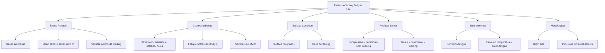

## Factors Affecting Fatigue Life

### Overview

Fatigue life — the number of load cycles a component can withstand before fatigue failure — is governed by a wide range of material, geometric, environmental, and loading-related variables. Because fatigue cracks typically initiate at localized regions of high stress or strain concentration rather than depending solely on bulk material properties, factors affecting the local stress state and crack initiation resistance often have a disproportionately large influence on fatigue performance compared to their effect on static strength.

### Stress-Related Factors

**Key Points**

- **Stress amplitude**: higher cyclic stress amplitude directly reduces fatigue life, forming the basis of the S-N curve relationship.
- **Mean stress**: a non-zero (particularly tensile) mean stress superimposed on the cyclic stress amplitude generally reduces fatigue life compared to fully reversed loading ($R = -1$) at the same stress amplitude, since tensile mean stress promotes crack opening and propagation.
- **Stress ratio** ($R = \sigma_{min}/\sigma_{max}$): characterizes the combination of mean stress and amplitude; different $R$ values require separate S-N data or an empirical mean-stress correction (e.g., Goodman, Gerber, or Soderberg relations) to relate fatigue behavior at one $R$ value to another.
- **Variable-amplitude loading**: real service loading (e.g., traffic, wind, wave action) typically involves variable rather than constant stress amplitude; cumulative damage under such loading is commonly estimated using **Miner's rule**, a linear damage summation approach, though it is a widely used approximation rather than an exact physical model of damage accumulation.

### Geometric and Design Factors

**Key Points**

- **Stress concentrations**: notches, holes, fillets, keyways, and abrupt cross-sectional changes concentrate local stress and are the most common sites for fatigue crack initiation, even when the nominal (average) stress across the section is well within the elastic range.
- **Fatigue notch sensitivity**: not all materials respond identically to a given geometric stress concentration; the **fatigue notch sensitivity factor**, $q$, relates the theoretical stress concentration factor $K_t$ to the effective fatigue strength reduction factor $K_f$:

$$q = \dfrac{K_f - 1}{K_t - 1}$$

Where $q$ ranges from 0 (no fatigue sensitivity to the notch) to 1 (full theoretical stress concentration effect realized in fatigue).

- [Inference] Because $q$ is generally lower for more ductile materials and for larger notch radii, and tends to increase (approaching 1) for higher-strength, less ductile materials and very sharp notches, fatigue-sensitive geometric detailing is particularly critical for high-strength materials, since they tend to more fully realize the theoretical stress concentration effect in fatigue.
- **Section size effect**: fatigue strength (particularly under bending or torsional loading) tends to decrease somewhat as component size increases, generally attributed to a greater probability of encountering a critical flaw within a larger stressed volume, and to stress gradient effects that differ between small laboratory specimens and full-scale components.

### Surface Condition Factors

**Key Points**

- **Surface finish**: since fatigue cracks typically initiate at the surface (where stress is often highest in bending/torsion and where environmental exposure is greatest), rougher surface finishes — machining marks, scratches, tool marks — act as local stress raisers and reduce fatigue life compared to smoother, polished surfaces.
- **Surface (case) hardening**: processes such as carburizing, nitriding, or induction hardening increase surface hardness and, importantly, typically introduce beneficial compressive residual stress at the surface, both of which generally improve fatigue resistance, particularly for bending-dominated fatigue loading where the surface experiences the highest stress.
- **Decarburization**: unintentional loss of carbon at a steel surface during heat treatment can locally reduce surface strength and hardness, generally reducing fatigue resistance — the reverse of the beneficial case-hardening effect.

### Residual Stress

**Key Points**

- **Compressive residual stress** at a component's surface generally improves fatigue life by partially or fully offsetting applied tensile stresses at that surface during cyclic loading, effectively reducing the local mean and/or peak tensile stress experienced by the material.
- **Shot peening** is a common industrial process specifically used to introduce a beneficial compressive residual stress layer at a component's surface, widely applied to fatigue-critical components such as springs, gears, and certain structural connections.
- **Tensile residual stress** — commonly introduced by welding, certain machining operations, or quenching — generally reduces fatigue life, since it adds to the applied tensile stress during the tension portion of the load cycle, effectively increasing the local mean stress experienced at that location.

### Environmental Factors

**Key Points**

- **Corrosion fatigue**: simultaneous exposure to a corrosive environment during cyclic loading generally reduces fatigue life compared to the same cyclic loading in a benign (non-corrosive) environment, since corrosion can both create new crack initiation sites (pitting) and accelerate crack propagation through localized chemical/electrochemical effects at the crack tip.
- Corrosion fatigue can also eliminate the distinct fatigue (endurance) limit otherwise seen in some ferrous metals under benign conditions, causing the S-N curve to continue sloping downward indefinitely rather than flattening at a finite stress level.
- **Temperature**: elevated temperature generally reduces fatigue life and can introduce interaction with time-dependent creep deformation mechanisms (**creep-fatigue interaction**) in high-temperature service; low temperature can shift failure mode toward more brittle characteristics, particularly relevant when combined with stress concentrations in susceptible materials.
- **Frequency effects**: [Unverified] loading frequency can influence fatigue life in certain environmentally sensitive conditions (e.g., corrosion fatigue, where more time per cycle allows more environmental interaction), though for many benign-environment, ambient-temperature applications frequency effects on fatigue life are considered secondary compared to stress amplitude and mean stress; frequency sensitivity should be evaluated for the specific material-environment combination of interest.

### Metallurgical and Microstructural Factors

**Key Points**

- **Grain size**: finer grain size generally improves fatigue resistance, consistent with its broader beneficial effect on strength without a corresponding ductility penalty (per the Hall-Petch relationship).
- **Inclusions and internal defects**: non-metallic inclusions, porosity, and other internal discontinuities can act as internal crack initiation sites, particularly significant for very high-cycle fatigue applications (approaching or exceeding $10^7$–$10^9$ cycles), where cracks may initiate from subsurface defects rather than the free surface.
- **Prior cold work / strain hardening**: [Inference] Because cold working generally increases yield strength while introducing additional dislocation density, its net effect on fatigue life is not uniformly positive; the benefit of increased strength can be offset in some cases by reduced ductility or by residual stress state, so fatigue performance of cold-worked material should be evaluated based on the specific process and material rather than assumed to scale directly with static strength increase.

### Diagram: Fatigue Life Influencing Factors

### Civil Engineering Application: Fatigue-Resistant Detailing in Steel Structures

**Example**

Structural engineering practice directly addresses fatigue-life-affecting factors through design and fabrication requirements:

- **Fatigue detail categories** in bridge design codes classify welded and bolted connection types according to their inherent stress concentration and expected fatigue performance, reflecting the dominant influence of geometric/weld-related stress concentration over base material properties in welded steel fatigue behavior.
- **Weld toe grinding and improvement techniques**: smoothing weld toe profiles (mechanically or thermally) to reduce local stress concentration, and in some cases inducing beneficial compressive residual stress (e.g., via peening of weld toes), are used to improve the fatigue category/performance of critical welded connections.
- **Corrosion protection systems** (coatings, cathodic protection) for steel bridges and marine structures serve, in part, to mitigate corrosion fatigue risk in addition to general corrosion prevention, particularly important for offshore and marine structures subject to combined cyclic wave loading and a corrosive environment.
- [Unverified] Specific fatigue detail categories, allowable stress ranges, and corrosion protection requirements are set by the governing structural/bridge design code and should be confirmed against the applicable specification for a given project.

### Comparative Summary Table

| Factor Category | Beneficial Condition | Detrimental Condition |
| --- | --- | --- |
| Stress amplitude/mean stress | Lower amplitude, compressive or zero mean stress | Higher amplitude, tensile mean stress |
| Geometric detailing | Smooth transitions, generous fillet radii | Sharp notches, holes, abrupt section changes |
| Surface finish | Polished, smooth surface | Rough, scratched, machined surface |
| Surface treatment | Case hardening, shot peening (compressive residual stress) | Decarburization, tensile residual stress from welding |
| Environment | Benign, ambient temperature | Corrosive environment, elevated temperature |
| Microstructure | Fine grain size, low inclusion content | Coarse grain size, high inclusion/defect content |

**Next Steps**

- Fatigue Mechanisms and S-N Curves
- Fatigue Crack Growth and the Paris Law
- Fracture Mechanics and Stress Concentration
- Strengthening Mechanisms in Metals (Grain Refinement)
- Fatigue Design of Welded Steel Connections
- Corrosion Fatigue and Environmental Cracking
- Miner's Rule and Cumulative Fatigue Damage Analysis