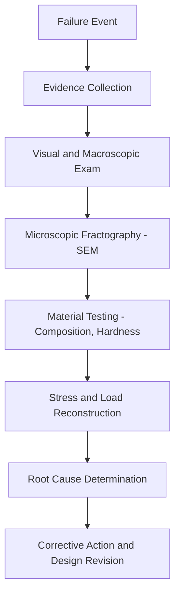

## Failure Analysis Case Studies

### Purpose and Scope of Failure Analysis

Failure analysis is the systematic investigation of engineering failures to determine root causes, contributing factors, and preventive measures. It draws on fracture mechanics, fatigue theory, metallurgy, and creep behavior to reconstruct the sequence of events leading to a structural or mechanical failure. In civil and materials engineering curricula, case studies serve to connect theoretical concepts (stress concentration, crack propagation, cyclic loading, material degradation) with real-world consequences.

**Key Points**

- Failures are rarely caused by a single factor; most involve a combination of design, material, manufacturing, and service errors.
- Forensic engineering methodology parallels the scientific method: evidence collection, hypothesis formation, testing, and conclusion.
- Case studies are used both for engineering education and for legal/regulatory proceedings.

### General Methodology of Failure Investigation

1. **Site investigation and evidence preservation** — photographing fracture surfaces, documenting deformation patterns, and preventing further degradation of evidence.
2. **Visual and macroscopic examination** — identifying beach marks, chevron marks, or shear lips indicative of fatigue, brittle, or ductile fracture.
3. **Microscopic examination** — Scanning Electron Microscopy (SEM) to identify striations (fatigue), dimples (ductile overload), or cleavage facets (brittle fracture).
4. **Material characterization** — chemical composition analysis, hardness testing, and metallographic sectioning to check for compliance with specifications.
5. **Stress analysis** — reconstructing the load history using finite element analysis (FEA) or classical mechanics to estimate applied stresses versus material capacity.
6. **Root cause synthesis** — combining evidence into a coherent failure narrative, distinguishing the *primary* cause from *contributing* factors.

### Case Study 1: De Havilland Comet (1954) — Fatigue Fracture from Stress Concentration

The world's first commercial jet airliner suffered two catastrophic in-flight breakups within months of each other.

**Key Points**

- Root cause: fatigue cracks initiating at the corners of square-cut window and ADF (Automatic Direction Finder) antenna cutouts in the fuselage skin.
- Repeated pressurization/depressurization cycles (cabin pressurization loading) induced cyclic stress far exceeding predictions at these stress-concentration points.
- Contributing factor: the design predates widespread understanding of fatigue crack growth in pressurized aircraft fuselages; static testing alone had been considered sufficient.
- Investigation used a full-scale fuselage water-tank fatigue test, which reproduced the failure and confirmed the crack origin.

**Example**

Stress concentration at a sharp-cornered cutout can be approximated using the stress concentration factor $K_t$:

$$\sigma_{max} = K_t \cdot \sigma_{nom}$$

For a square cutout with sharp corners, $K_t$ can exceed 3, compared to approximately 2.0–2.5 for a well-radiused circular cutout — explaining why later Comet variants (and all subsequent pressurized aircraft) mandated rounded window and cutout geometries.

**Conclusion**

This case established the discipline of damage-tolerant design and full-scale fatigue testing as mandatory practice in aerospace structural certification.

### Case Study 2: Silver Bridge Collapse (1967) — Stress Corrosion Cracking

The Silver Bridge over the Ohio River collapsed suddenly, killing 46 people.

**Key Points**

- Root cause: a single eyebar in a suspension chain failed due to stress corrosion cracking (SCC) combined with hydrogen embrittlement, initiating from a small manufacturing defect.
- The bridge used an eyebar-chain suspension design rather than the more common (and more redundant) wire-cable design — a single link failure caused progressive, non-redundant collapse.
- Corrosion pitting at the eyebar's pin hole acted as the crack initiation site; the crack propagated slowly for years before final rapid fracture.
- [Inference] The absence of visible external warning signs before failure is consistent with subcritical crack growth beneath the surface, undetectable by routine visual inspection methods used at the time.

**Conclusion**

This failure directly led to the U.S. National Bridge Inspection Standards (NBIS) and reinforced the engineering principle of structural redundancy — non-redundant ("fracture-critical") members must receive enhanced inspection protocols.

### Case Study 3: Liberty Ships (1940s) — Brittle Fracture in Welded Steel Hulls

Nearly 1,500 welded-hull Liberty ships were built during WWII; roughly 400 suffered brittle fractures, with about 20 breaking completely in two.

**Key Points**

- Root cause: ductile-to-brittle transition temperature (DBTT) of the hull steel was higher than the cold operating temperatures encountered (particularly in the North Atlantic), causing the steel to behave in a brittle manner.
- All-welded hull construction (replacing traditional riveted construction) eliminated the crack-arresting joints that riveted seams provided; a crack in a welded plate could propagate continuously across the entire hull.
- Contributing factors: high sulfur content in steel promoting embrittlement, weld defects acting as crack initiation sites, and stress concentrations at square hatch corners (similar in principle to the Comet case).
- Charpy V-notch impact testing was subsequently adopted to characterize DBTT and screen structural steels for adequate low-temperature toughness.

**Example**

The Charpy impact energy versus temperature curve identifies the transition region:

$$T_{DBTT} \approx T \text{ at which absorbed energy} = \frac{E_{upper shelf} + E_{lower shelf}}{2}$$

Steels intended for cold-climate or marine service are specified with a minimum required Charpy energy (e.g., 20 J) at the lowest anticipated service temperature.

**Conclusion**

This case is foundational to fracture mechanics as a discipline (motivating much of the postwar work by Irwin and others) and established crack-arrestor design features (riveted straps, controlled weld sequencing) in ship and pressure vessel design.

### Case Study 4: Hyatt Regency Walkway Collapse (1981) — Design/Load-Path Error, Not Fatigue

Although often grouped with fatigue/fracture case studies, this failure is instructive as a contrast case: a static overload failure due to a design change, not a fracture-mechanics phenomenon.

**Key Points**

- Root cause: a field-modified hanger rod connection doubled the load on the fourth-floor walkway's box beam connection compared to the original design, exceeding the connection's static capacity.
- The original design already had a low safety factor at this connection; the change (single continuous rod → two separate rods) redistributed load in a way not properly re-analyzed.
- Failure mode: static overload/shear-out of the box beam at the bolted connection, not progressive fatigue crack growth.
- This case underscores the importance of change-control and re-verification whenever a structural detail is modified from its original engineered design.

**Conclusion**

Distinguishing static overload failures from fatigue/fracture failures is a key skill in failure analysis; investigators must first classify the fracture surface morphology (no beach marks/striations here) before attributing a cause.

### Case Study 5: Aloha Airlines Flight 243 (1988) — Multi-Site Fatigue and Corrosion

A significant fuselage section separated in flight due to widespread fatigue damage.

**Key Points**

- Root cause: Multiple Site Damage (MSD) — many small fatigue cracks initiating independently at adjacent rivet holes along a lap joint, which linked together into a single long crack.
- Contributing factor: disbonding of the adhesive at the lap joint (used to transfer load between rivets) allowed moisture ingress, accelerating corrosion fatigue at rivet holes.
- The aircraft had accumulated an unusually high number of pressurization cycles for a short-haul, high-frequency-flight aircraft, accelerating fatigue relative to calendar age.
- This case introduced widespread industry adoption of MSD-aware inspection intervals and aircraft aging programs.

**Example (Fatigue Crack Growth — Paris' Law)**

Fatigue crack growth rate per cycle is commonly modeled as:

$$\frac{da}{dN} = C(\Delta K)^m$$

where $a$ is crack length, $N$ is load cycle count, $\Delta K$ is the stress intensity factor range, and $C$, $m$ are material constants. In MSD scenarios, adjacent small cracks effectively behave as a single larger crack once their stress fields interact, sharply increasing $\Delta K$ and accelerating $da/dN$.

### Case Study 6: Creep-Related Failure — Power Plant Boiler Tube Rupture (Generic Case Pattern)

High-temperature, long-duration service components (boiler tubes, turbine blades, pressure vessel piping) commonly fail via creep rupture rather than fatigue.

**Key Points**

- Root cause pattern: prolonged operation at elevated temperature under sustained stress causes creep strain accumulation, culminating in creep rupture, often preceded by intergranular void formation and cavitation.
- Fractography shows intergranular "creep cavities" and wall thinning, distinct from the transgranular striations of fatigue or the cleavage facets of brittle fracture.
- Common contributing factors: exceeding design temperature during upset conditions, undetected long-term overheating (creep is highly temperature-sensitive — an exponential relationship), or material substitution errors during repair.
- The Larson-Miller parameter is used to correlate stress, temperature, and time-to-rupture from accelerated lab tests to predict long-term service life.

**Example**

The Larson-Miller Parameter (LMP):

$$LMP = T(C + \log t_r)$$

where $T$ is absolute temperature, $t_r$ is time to rupture, and $C$ is a material constant (often ≈20 for steels). A small, sustained increase in operating temperature can drastically reduce $t_r$, since creep rate typically follows an Arrhenius-type temperature dependence:

$$\dot{\epsilon}_{creep} = A \sigma^n e^{-Q/RT}$$

### Fractographic Signatures Reference Table

| Failure Mode | Macroscopic Feature | Microscopic (SEM) Feature |
| --- | --- | --- |
| Fatigue | Beach marks, ratchet marks | Striations |
| Brittle (cleavage) | Flat, shiny, chevron marks pointing to origin | Cleavage facets |
| Ductile overload | Shear lips, necking, fibrous texture | Dimples (microvoid coalescence) |
| Stress corrosion cracking | Branching cracks, often intergranular | Intergranular facets, corrosion products |
| Creep rupture | Wall thinning, longitudinal cracking (tubes) | Intergranular voids/cavities |

### Common Themes Across Case Studies

**Key Points**

- **Stress concentration** (Comet, Liberty Ships) is a recurring root-cause contributor — geometric discontinuities amplify nominal stress well beyond hand-calculation estimates.
- **Redundancy** (or its absence, as in the Silver Bridge) determines whether a local failure remains local or becomes catastrophic.
- **Material-environment interaction** (SCC in Silver Bridge, corrosion fatigue in Aloha 243) shows that failure is often not a pure mechanical event but a coupled chemical-mechanical process.
- **Inspection and NDE (non-destructive evaluation) limitations** — many failures originated from subsurface or hard-to-inspect locations, motivating the development of improved NDE techniques (ultrasonic testing, eddy current, dye penetrant).
- [Unverified] Exact quantitative figures (crack growth rates, specific stress values) cited in historical investigation reports vary somewhat between primary sources (NTSB, ASCE, peer-reviewed metallurgical journals); figures presented here reflect commonly cited consensus values in engineering education material.

### Failure Analysis Decision Framework (svg_diagram)

<svg xmlns="http://www.w3.org/2000/svg" viewBox="0 0 800 420" font-family="Arial, sans-serif">
<text x="400" y="25" font-size="16" font-weight="bold" text-anchor="middle">Fracture Surface Classification Framework (svg_diagram)</text>
<rect x="330" y="45" width="140" height="40" rx="6" fill="#e8e8e8" stroke="#333" />
<text x="400" y="70" font-size="12" text-anchor="middle">Examine Fracture Surface</text>
<line x1="400" y1="85" x2="150" y2="130" stroke="#333" />
<line x1="400" y1="85" x2="400" y2="130" stroke="#333" />
<line x1="400" y1="85" x2="650" y2="130" stroke="#333" />
<rect x="60" y="130" width="180" height="45" rx="6" fill="#dbe9f7" stroke="#333" />
<text x="150" y="150" font-size="11" text-anchor="middle">Beach marks / striations</text>
<text x="150" y="165" font-size="11" text-anchor="middle">visible?</text>
<rect x="310" y="130" width="180" height="45" rx="6" fill="#dbe9f7" stroke="#333" />
<text x="400" y="150" font-size="11" text-anchor="middle">Dimpled, fibrous,</text>
<text x="400" y="165" font-size="11" text-anchor="middle">necking present?</text>
<rect x="560" y="130" width="180" height="45" rx="6" fill="#dbe9f7" stroke="#333" />
<text x="650" y="150" font-size="11" text-anchor="middle">Intergranular, branching,</text>
<text x="650" y="165" font-size="11" text-anchor="middle">corrosion products?</text>
<line x1="150" y1="175" x2="150" y2="210" stroke="#333" />
<rect x="60" y="210" width="180" height="45" rx="6" fill="#fde9d9" stroke="#333" />
<text x="150" y="230" font-size="11" text-anchor="middle" font-weight="bold">Fatigue Fracture</text>
<text x="150" y="245" font-size="10" text-anchor="middle">(cyclic loading)</text>
<line x1="400" y1="175" x2="400" y2="210" stroke="#333" />
<rect x="310" y="210" width="180" height="45" rx="6" fill="#fde9d9" stroke="#333" />
<text x="400" y="230" font-size="11" text-anchor="middle" font-weight="bold">Ductile Overload</text>
<text x="400" y="245" font-size="10" text-anchor="middle">(exceeded UTS)</text>
<line x1="650" y1="175" x2="650" y2="210" stroke="#333" />
<rect x="560" y="210" width="180" height="45" rx="6" fill="#fde9d9" stroke="#333" />
<text x="650" y="230" font-size="11" text-anchor="middle" font-weight="bold">SCC / Environmental</text>
<text x="650" y="245" font-size="10" text-anchor="middle">(chemical + stress)</text>
<line x1="150" y1="255" x2="150" y2="280" stroke="#333" />
<rect x="30" y="280" width="240" height="50" rx="6" fill="#e2f0d9" stroke="#333" />
<text x="150" y="300" font-size="10" text-anchor="middle">Check: stress concentration,</text>
<text x="150" y="315" font-size="10" text-anchor="middle">load cycle count, ΔK history</text>
<line x1="400" y1="255" x2="400" y2="280" stroke="#333" />
<rect x="280" y="280" width="240" height="50" rx="6" fill="#e2f0d9" stroke="#333" />
<text x="400" y="300" font-size="10" text-anchor="middle">Check: design load vs.</text>
<text x="400" y="315" font-size="10" text-anchor="middle">actual applied load, material spec</text>
<line x1="650" y1="255" x2="650" y2="280" stroke="#333" />
<rect x="530" y="280" width="240" height="50" rx="6" fill="#e2f0d9" stroke="#333" />
<text x="650" y="300" font-size="10" text-anchor="middle">Check: environment,</text>
<text x="650" y="315" font-size="10" text-anchor="middle">coating/protection failure</text>

<text x="400" y="365" font-size="11" text-anchor="middle" font-style="italic">All paths converge on: root cause report + corrective design/inspection action</text>

<line x1="150" y1="330" x2="400" y2="360" stroke="#999" stroke-dasharray="4" />

<line x1="400" y1="330" x2="400" y2="360" stroke="#999" stroke-dasharray="4" />

<line x1="650" y1="330" x2="400" y2="360" stroke="#999" stroke-dasharray="4" />

</svg>

### Educational and Regulatory Impact Summary

| Case | Primary Failure Mode | Major Resulting Standard/Practice |
| --- | --- | --- |
| De Havilland Comet | Fatigue at stress concentration | Full-scale fatigue testing, rounded cutouts, damage-tolerant design |
| Silver Bridge | Stress corrosion cracking, non-redundant design | U.S. National Bridge Inspection Standards (NBIS) |
| Liberty Ships | Brittle fracture (DBTT), weld crack propagation | Charpy V-notch testing, crack-arrestor design |
| Hyatt Regency Walkway | Static overload from design change | Formalized structural change-control/peer review requirements |
| Aloha Airlines 243 | Multi-site fatigue, corrosion | Aircraft aging/MSD inspection programs |

**Next Steps**

- Linear Elastic Fracture Mechanics (LEFM) and stress intensity factor $K$
- Fatigue life prediction: S-N curves and Miner's rule for cumulative damage
- Creep mechanisms: dislocation creep, diffusion creep, and Larson-Miller parameter applications
- Non-destructive evaluation (NDE) methods: ultrasonic testing, radiography, dye penetrant inspection
- Fracture toughness testing standards (ASTM E399, E1820)
- Structural redundancy and fracture-critical member design in bridge engineering
- Ductile-to-brittle transition temperature (DBTT) and Charpy impact testing methodology