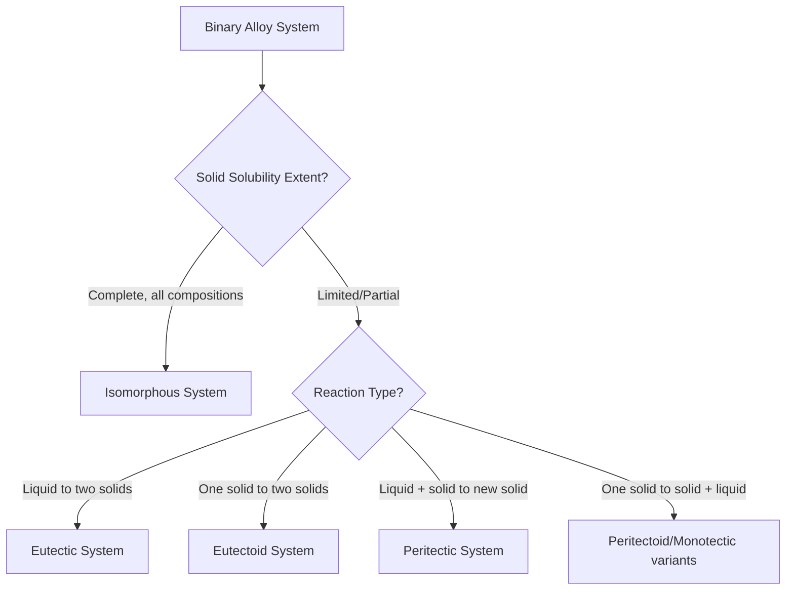

## Solid Solubility and Phase Equilibria

### Fundamental Concepts

Solid solubility refers to the extent to which one element (the solute) can dissolve into a solid crystal structure of another element (the solvent/matrix) without forming a new, separate phase. Phase equilibria describes the thermodynamic conditions — composition, temperature, and pressure — under which two or more phases coexist stably. Together these concepts explain why alloys form single-phase solid solutions in some composition ranges and multi-phase mixtures in others.

**Key Points**

- A **phase** is a physically distinct, chemically homogeneous, mechanically separable region of a material (e.g., a specific crystal structure or the liquid state).
- A **solid solution** is a single-phase crystalline structure containing two or more elemental species, where the solute atoms occupy positions in the solvent's lattice without disrupting its crystal structure.
- **Phase equilibrium** exists when the Gibbs free energy of the system is at a minimum for the given temperature, pressure, and composition — no further transformation occurs at infinite time.

### Types of Solid Solutions

**Substitutional Solid Solutions**

Solute atoms replace solvent atoms at regular lattice sites.

**Interstitial Solid Solutions**

Solute atoms (typically much smaller) occupy the interstitial spaces (voids) between solvent atoms in the lattice.

**Example**

Carbon dissolving in iron to form austenite (FCC iron) is an interstitial solid solution; carbon atoms fit into the octahedral interstitial sites of the FCC structure. In contrast, nickel dissolving in copper (forming the basis of many coinage alloys) is a substitutional solid solution, since Ni and Cu atoms are similar in size and both adopt FCC structures.

### Hume-Rothery Rules for Substitutional Solid Solubility

These empirical rules predict the extent of substitutional solubility between two metallic elements:

1. **Atomic size factor** — the atomic radii of solute and solvent should differ by less than approximately 15%. Larger differences introduce excessive lattice strain, limiting solubility.
2. **Crystal structure factor** — for extensive (ideally complete) solid solubility, both elements should have the same crystal structure (e.g., both FCC, both BCC).
3. **Electronegativity factor** — the elements should have similar electronegativities. A large difference promotes compound formation (intermetallic phases) rather than solid solution.
4. **Valence factor** — a metal with higher valence is more likely to dissolve to a greater extent in a metal of lower valence than vice versa, other factors being favorable.

When all four rules are favorably satisfied, complete solid solubility (a continuous series of solid solutions across all compositions) is possible, as seen in the Cu-Ni system.

**Key Points**

- These are guidelines, not absolute laws; satisfying all four rules is necessary but not always sufficient to guarantee complete solubility. [Inference] Deviations can occur due to electronic structure effects not captured by these simplified geometric/chemical criteria.
- Violating even one rule significantly can restrict solubility to a narrow composition range (partial/limited solid solubility).

### Gibbs Phase Rule

The Gibbs Phase Rule relates the number of phases, components, and degrees of freedom in a system at equilibrium:

$$F = C - P + 2$$

where $F$ is the number of degrees of freedom (independently variable intensive parameters, such as temperature, pressure, or composition), $C$ is the number of components (chemically independent constituents), and $P$ is the number of phases present.

For condensed systems at constant pressure (typical of most metallurgical phase diagrams, since solid/liquid phase behavior is relatively insensitive to modest pressure changes), the rule is simplified:

$$F = C - P + 1$$

**Example**

In a binary (two-component) alloy system at constant pressure with a single phase present ($P=1$), $F = 2 - 1 + 1 = 2$: both temperature and composition can be independently varied within that single-phase field. When two phases coexist ($P=2$) in the same binary system, $F = 2 - 2 + 1 = 1$: fixing temperature automatically fixes the composition of each phase (as read from the phase boundary curves).

### Binary Phase Diagram Types

**Isomorphous Systems (Complete Solid Solubility)**

Two components are completely soluble in each other in both liquid and solid states across the entire composition range, forming a single continuous solid-solution phase. The Cu-Ni system is the classic textbook example.

**Eutectic Systems (Limited Solid Solubility)**

Two components have limited solid solubility in each other, and a eutectic reaction occurs where a liquid transforms into two distinct solid phases simultaneously upon cooling:

$$L \rightarrow \alpha + \beta \quad \text{(upon cooling, at eutectic temperature } T_E\text{)}$$

**Eutectoid Systems**

An analogous solid-state reaction where one solid phase transforms into two different solid phases:

$$\gamma \rightarrow \alpha + \beta \quad \text{(upon cooling, at eutectoid temperature)}$$

The classic example is the eutectoid decomposition of austenite into pearlite (ferrite + cementite) in the Fe-Fe₃C system at 727°C.

### The Lever Rule

For any two-phase region on a binary phase diagram, the relative mass fractions of each phase are determined by the lever rule, using compositions read along the tie-line at the temperature of interest:

$$W_\alpha = \frac{C_L - C_0}{C_L - C_\alpha} \quad ; \quad W_L = \frac{C_0 - C_\alpha}{C_L - C_\alpha}$$

where $C_0$ is the overall (nominal) alloy composition, $C_\alpha$ is the composition of the $\alpha$ phase at the tie-line boundary, and $C_L$ is the composition of the liquid phase at the tie-line boundary (generalizable to any two-phase pair, not just $\alpha$/liquid).

**Example**

Consider a hypothetical binary alloy at composition $C_0 = 40\text{ wt\%}$ B, at a temperature where the tie-line intersects the solidus at $C_\alpha = 30\text{ wt\%}$ B and the liquidus at $C_L = 60\text{ wt\%}$ B. The mass fraction of solid $\alpha$ phase is:

$$W_\alpha = \frac{60 - 40}{60 - 30} = \frac{20}{30} \approx 0.667 \;(66.7\text{ wt\%})$$

and the liquid fraction is $W_L \approx 0.333$ (33.3 wt%). Note the "lever" analogy: the phase fraction is proportional to the *opposite* segment length of the tie-line (inverse lever arm).

### Solvus, Solidus, and Liquidus Lines

| Line | Definition |
| --- | --- |
| **Liquidus** | Boundary above which the material is entirely liquid; upon cooling, solidification begins when this line is crossed |
| **Solidus** | Boundary below which the material is entirely solid; solidification is complete when this line is crossed |
| **Solvus** | Boundary within the solid state marking the limit of solid solubility of one phase in another as a function of temperature |

**Key Points**

- The region between the liquidus and solidus is a two-phase (liquid + solid) region governed by the lever rule.
- The solvus line typically slopes such that solubility *decreases* with decreasing temperature — this is the thermodynamic basis for **precipitation hardening** (age hardening), since a supersaturated solid solution formed by rapid cooling will tend to precipitate a second phase upon subsequent aging/reheating.

### Solid Solubility and Precipitation Hardening Link

Because solvus lines commonly show retrograde (decreasing) solubility with falling temperature, alloys can be:

1. Heated into the single-phase field (solution heat treatment) to dissolve all solute into a homogeneous solid solution.
2. Rapidly quenched to room temperature, trapping the solute in a **supersaturated solid solution** (metastable, since equilibrium solubility at room temperature is lower).
3. Aged (reheated to an intermediate temperature) to allow controlled precipitation of a fine, dispersed second phase, which impedes dislocation motion and increases strength.

**Example**

The Al-Cu system (basis of 2xxx series aluminum alloys, e.g., 2024-T6) exploits this mechanism: the solvus line for the $\theta$ (Al₂Cu) phase shows sharply decreasing Cu solubility in $\alpha$-Al below approximately 500°C, enabling classic age-hardening heat treatments (solutionizing, quenching, artificial aging).

### Phase Diagram Reading — Practical Rules

**Key Points**

- **Tie-lines** are only valid within a two-phase region and are always drawn horizontally (constant temperature) between the two phase boundary curves.
- **Invariant reactions** (eutectic, eutectoid, peritectic) occur at a single, fixed temperature and composition for a given system — the phase rule gives $F=0$ at these points for a binary system ($C=2$, $P=3$: $F = 2 - 3 + 1 = 0$).
- Reading a phase diagram at a given overall composition and temperature requires: (1) identify the phase field, (2) if two-phase, draw the tie-line, (3) read the intersecting compositions, (4) apply the lever rule for phase fractions.

### Iron-Iron Carbide (Fe-Fe₃C) Phase Diagram — Applied Case

This diagram is the foundation of ferrous physical metallurgy and directly governs steel and cast iron microstructures.

**Key Points**

- **Ferrite (α-Fe)**: BCC structure, very low carbon solubility (max ≈0.022 wt% C at 727°C).
- **Austenite (γ-Fe)**: FCC structure, significantly higher carbon solubility (max ≈2.14 wt% C at 1147°C) — the FCC structure's larger octahedral interstitial sites accommodate more carbon than BCC ferrite, a direct application of the interstitial solid solubility concept above.
- **Cementite (Fe₃C)**: an intermetallic compound (not a solid solution), hard and brittle, fixed composition (6.7 wt% C).
- The eutectoid reaction at 727°C and 0.76 wt% C: $\gamma \rightarrow \alpha + Fe_3C$ (forming pearlite, a lamellar microstructure).
- The eutectic reaction at 1147°C and 4.3 wt% C: $L \rightarrow \gamma + Fe_3C$ (relevant to cast iron solidification, forming ledeburite).

**Example**

Applying the lever rule to a eutectoid steel (0.76 wt% C) cooled just below 727°C, essentially 100% of the austenite transforms to pearlite (since the overall composition equals the eutectoid composition, there is no proeutectoid phase). For a hypoeutectoid steel (e.g., 0.4 wt% C), proeutectoid ferrite forms first upon cooling through the two-phase ($\alpha+\gamma$) region before the remaining austenite (now enriched to eutectoid composition) transforms to pearlite at 727°C.

### Fe-Fe₃C Phase Diagram Schematic (svg_diagram)

<svg xmlns="http://www.w3.org/2000/svg" viewBox="0 0 800 500" font-family="Arial, sans-serif">
<text x="400" y="25" font-size="16" font-weight="bold" text-anchor="middle">Fe-Fe3C Phase Diagram (Simplified) (svg_diagram)</text>
<line x1="80" y1="440" x2="750" y2="440" stroke="#333" stroke-width="2" />
<line x1="80" y1="440" x2="80" y2="60" stroke="#333" stroke-width="2" />
<text x="400" y="475" font-size="12" text-anchor="middle">Composition (wt% Carbon)</text>
<text x="30" y="250" font-size="12" text-anchor="middle" transform="rotate(-90 30 250)">Temperature</text>

<text x="80" y="455" font-size="10" text-anchor="middle">0</text>

<text x="270" y="455" font-size="10" text-anchor="middle">0.76</text>

<text x="500" y="455" font-size="10" text-anchor="middle">2.14</text>

<text x="700" y="455" font-size="10" text-anchor="middle">4.3</text>

<path d="M 80 200 L 500 100 L 700 130 L 750 150" fill="none" stroke="#c0392b" stroke-width="2" />
<text x="600" y="115" font-size="10" fill="#c0392b">Liquidus</text>
<path d="M 80 200 Q 200 260 270 300 L 500 100" fill="none" stroke="#c0392b" stroke-width="1.5" stroke-dasharray="3,2" />
<line x1="80" y1="300" x2="700" y2="300" stroke="#2980b9" stroke-width="2" />
<text x="710" y="303" font-size="10" fill="#2980b9">1147°C Eutectic</text>
<path d="M 80 200 Q 150 250 220 300" fill="none" stroke="#27ae60" stroke-width="2" />
<path d="M 500 100 Q 400 250 270 300" fill="none" stroke="#27ae60" stroke-width="2" />
<text x="330" y="230" font-size="11" fill="#27ae60">γ (Austenite)</text>
<line x1="80" y1="380" x2="500" y2="380" stroke="#8e44ad" stroke-width="2" />
<text x="510" y="383" font-size="10" fill="#8e44ad">727°C Eutectoid</text>
<path d="M 220 300 Q 240 340 260 380" fill="none" stroke="#27ae60" stroke-width="1.5" />
<path d="M 270 300 Q 260 340 260 380" fill="none" stroke="#27ae60" stroke-width="1.5" />
<line x1="80" y1="380" x2="90" y2="440" stroke="#333" stroke-width="1.5" />
<text x="100" y="410" font-size="10">α (Ferrite)</text>
<line x1="700" y1="150" x2="700" y2="440" stroke="#333" stroke-width="2" />
<text x="705" y="200" font-size="10">Fe3C (Cementite)</text>

<text x="150" y="410" font-size="10">Pearlite +</text>

<text x="150" y="422" font-size="10">Proeutectoid α</text>

<text x="350" y="410" font-size="10">Pearlite + Fe3C</text>

<circle cx="270" cy="380" r="3" fill="#000" />
<text x="270" y="405" font-size="9" text-anchor="middle">Eutectoid Pt</text>
</svg>

### Ternary and Multi-Component Considerations

**Key Points**

- Real engineering alloys are rarely truly binary; ternary phase diagrams (三 components) add a third composition axis, typically represented as a triangular (Gibbs) composition diagram at a fixed temperature (isothermal section).
- [Inference] For most introductory civil/materials engineering coursework, binary diagrams are sufficient to teach the governing principles (lever rule, tie-lines, invariant reactions); ternary and higher-order systems are typically reserved for advanced metallurgy or computational thermodynamics (CALPHAD-based) coursework.
- Phase equilibria calculations for complex, multi-component commercial alloys are today largely performed using CALPHAD (CALculation of PHAse Diagrams) software (e.g., Thermo-Calc, PANDAT) rather than manual diagram reading, though the underlying binary-system principles remain the conceptual foundation.

### Common Errors and Misconceptions

**Key Points**

- Confusing a **mixture composition** with a **phase composition** — the overall alloy composition ($C_0$) is generally different from the composition of each individual phase present ($C_\alpha$, $C_L$, etc.) in a two-phase field.
- Assuming solid solubility limits are temperature-independent — most solvus boundaries are strongly temperature-dependent, which is the entire basis of heat-treatable (precipitation-hardening) alloy systems.
- Misapplying the lever rule outside a two-phase region — the lever rule is invalid in single-phase fields, where the composition is simply constant throughout that phase.
- Treating a phase diagram as depicting reaction *kinetics* — phase diagrams show equilibrium (infinite-time) states only; actual transformation rates and resulting non-equilibrium microstructures (e.g., martensite) require separate kinetic treatments (e.g., TTT/CCT diagrams).

**Next Steps**

- Isomorphous vs. eutectic vs. eutectoid vs. peritectic reaction classification
- The lever rule — extended practice problems with tie-line construction
- Iron-Iron Carbide phase diagram and steel microstructure development
- Precipitation (age) hardening mechanisms and heat treatment sequences
- Time-Temperature-Transformation (TTT) and Continuous-Cooling-Transformation (CCT) diagrams
- Gibbs free energy composition curves and common tangent construction
- CALPHAD methodology for multi-component phase equilibria prediction