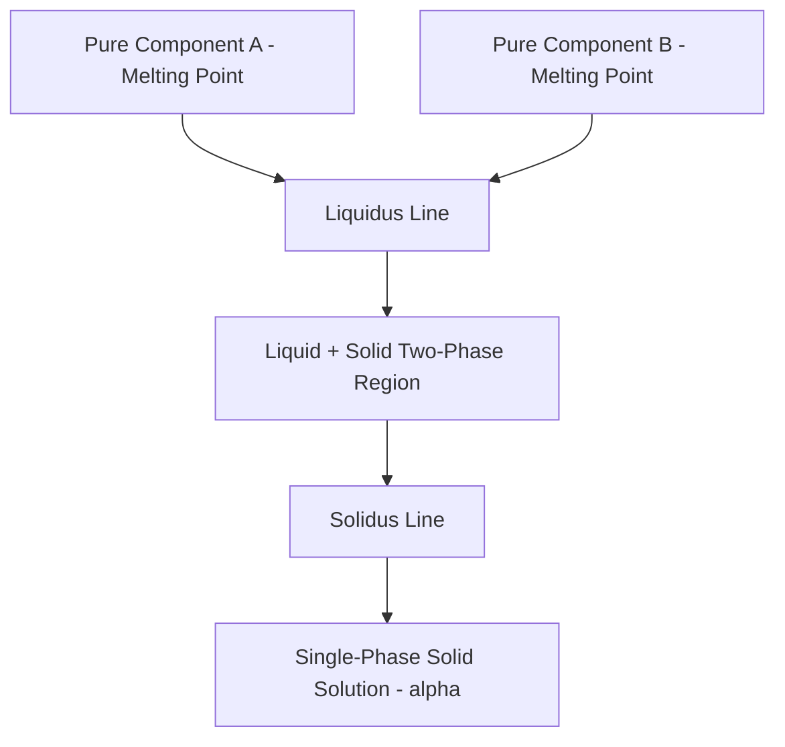

## Binary Isomorphous Phase Diagrams

### Definition and Physical Basis

A binary isomorphous phase diagram describes a two-component (binary) system in which the two components exhibit **complete solid solubility** in one another across the entire composition range, in both the liquid and solid states. "Isomorphous" refers to the fact that both pure components share the same crystal structure, allowing a single, continuous solid-solution phase to exist from 0% to 100% composition without any intervening two-solid-phase region.

**Key Points**

- Complete solid solubility requires the Hume-Rothery rules to be favorably satisfied: similar atomic radii (within ~15%), identical crystal structure, similar electronegativity, and similar valence.
- The classic textbook example is the **Copper-Nickel (Cu-Ni) system**, since both elements are FCC, have very similar atomic radii, similar electronegativities, and adjacent valences.
- Other examples include Ag-Au, and at high temperature, some ceramic systems such as NiO-MgO.
- Only two phases ever appear on an isomorphous diagram: **liquid (L)** and a single **solid solution (α)**.

### Diagram Structure

The diagram is plotted with temperature on the vertical axis and composition (typically weight percent of one component) on the horizontal axis, bounded by the melting points of the two pure components at each end.

**Key regions:**

1. **Liquid region (L)** — above the liquidus line; the alloy is entirely liquid.
2. **Liquid + Solid region (L + α)** — the two-phase "mushy" or "pasty" region between liquidus and solidus.
3. **Solid solution region (α)** — below the solidus line; the alloy is a single homogeneous solid phase across all compositions.

**Boundary lines:**

- **Liquidus line** — connects the melting points of the two pure components; above this line, only liquid exists. Upon cooling, the first solid begins to form when this line is crossed.
- **Solidus line** — also connects the two pure-component melting points but curves differently; below this line, only solid (single-phase α) exists. Upon cooling, solidification is complete when this line is crossed.

### Isomorphous Phase Diagram Schematic (svg_diagram)

<svg xmlns="http://www.w3.org/2000/svg" viewBox="0 0 800 450" font-family="Arial, sans-serif">
<text x="400" y="25" font-size="16" font-weight="bold" text-anchor="middle">Cu-Ni Binary Isomorphous Diagram (svg_diagram)</text>
<line x1="90" y1="400" x2="700" y2="400" stroke="#333" stroke-width="2" />
<line x1="90" y1="400" x2="90" y2="60" stroke="#333" stroke-width="2" />
<text x="400" y="430" font-size="12" text-anchor="middle">Composition (wt% Ni)</text>
<text x="35" y="230" font-size="12" text-anchor="middle" transform="rotate(-90 35 230)">Temperature (°C)</text>

<text x="90" y="415" font-size="10" text-anchor="middle">0 (Pure Cu)</text>

<text x="700" y="415" font-size="10" text-anchor="middle">100 (Pure Ni)</text>

<text x="80" y="345" font-size="10" text-anchor="end">1085</text>

<text x="80" y="95" font-size="10" text-anchor="end">1453</text>

<path d="M 90 345 L 700 95" fill="none" stroke="#c0392b" stroke-width="2.5" />
<text x="500" y="150" font-size="11" fill="#c0392b">Liquidus</text>
<path d="M 90 345 Q 300 280 700 95" fill="none" stroke="#2980b9" stroke-width="2.5" />
<text x="450" y="270" font-size="11" fill="#2980b9">Solidus</text>

<text x="150" y="200" font-size="13" font-weight="bold">Liquid (L)</text>

<text x="400" y="310" font-size="12" font-weight="bold">L + α</text>

<text x="250" y="390" font-size="13" font-weight="bold">α (Solid Solution)</text>

<line x1="180" y1="300" x2="480" y2="300" stroke="#27ae60" stroke-width="1.5" stroke-dasharray="5,3" />
<circle cx="180" cy="300" r="4" fill="#27ae60" />
<circle cx="480" cy="300" r="4" fill="#27ae60" />
<circle cx="330" cy="300" r="4" fill="#000" />
<text x="180" y="290" font-size="9" fill="#27ae60" text-anchor="middle">Cα</text>
<text x="480" y="290" font-size="9" fill="#27ae60" text-anchor="middle">CL</text>
<text x="330" y="290" font-size="9" text-anchor="middle">C0</text>
<text x="330" y="320" font-size="9" text-anchor="middle">Tie-line at T1</text>
</svg>

### Equilibrium Solidification Sequence

**Key Points**

- As a liquid alloy of a given overall composition $C_0$ is cooled from above the liquidus, the first solid to nucleate has a composition richer in the higher-melting-point component than $C_0$ (read from the solidus at that temperature).
- As cooling continues through the two-phase region, both the liquid and solid compositions continuously shift along the liquidus and solidus curves respectively, always maintaining equilibrium via atomic diffusion.
- At any given temperature within the two-phase field, a horizontal **tie-line** connects the liquidus composition ($C_L$) and the solidus composition ($C_\alpha$) — these are the actual compositions of the coexisting liquid and solid phases at that temperature (not the overall alloy composition).
- Solidification is complete when the solidus line is reached; below this, the entire alloy is a homogeneous single-phase solid solution of composition $C_0$.

### Applying the Lever Rule

For an alloy of overall composition $C_0$ at a temperature $T_1$ within the two-phase (L + α) region, with the tie-line intersecting the solidus at $C_\alpha$ and the liquidus at $C_L$:

$$W_\alpha = \frac{C_L - C_0}{C_L - C_\alpha}$$

$$W_L = \frac{C_0 - C_\alpha}{C_L - C_\alpha} = 1 - W_\alpha$$

**Example**

Consider a Cu-Ni alloy with overall composition $C_0 = 35\text{ wt\% Ni}$, held at a temperature where the tie-line gives $C_\alpha = 42\text{ wt\% Ni}$ (solid) and $C_L = 20\text{ wt\% Ni}$ (liquid).

$$W_\alpha = \frac{20 - 35}{20 - 42} = \frac{-15}{-22} \approx 0.682 \;(68.2\text{ wt\%})$$

$$W_L = 1 - 0.682 = 0.318 \;(31.8\text{ wt\%})$$

This indicates that at this temperature, roughly two-thirds of the alloy (by mass) has solidified into the α phase, with the remainder still liquid.

### Non-Equilibrium (Actual) Solidification: Coring

Under real (non-infinitely-slow) cooling rates, solid-state diffusion is too sluggish to maintain compositional homogeneity within the solidifying grains, leading to a phenomenon called **coring** (also called dendritic segregation).

**Key Points**

- Because diffusion in the solid state is orders of magnitude slower than in the liquid state, the first-formed solid (grain core) retains a composition closer to the equilibrium value at its formation temperature, while later-formed solid (near the grain boundary) reflects the composition at lower temperatures.
- The result is a radial (core-to-surface) composition gradient within each grain: cores are richer in the higher-melting-point component, while grain-boundary regions are richer in the lower-melting-point component.
- [Inference] This microstructural inhomogeneity is why cast (as-solidified) isomorphous alloys often exhibit lower corrosion resistance and mechanical properties compared to their homogenized (annealed) counterparts, since localized composition variations can create galvanic or strength inconsistencies.
- Coring can be substantially reduced or eliminated by a **homogenization heat treatment** — holding the solid alloy at an elevated temperature (below the solidus) for sufficient time to allow solid-state diffusion to equalize the composition throughout each grain.
- Non-equilibrium cooling also shifts the *effective* solidus to lower temperatures and can widen the effective freezing range (the "Scheil" model is commonly used to approximate non-equilibrium solidification behavior, assuming no solid diffusion and complete liquid diffusion).

**Example**

Under Scheil-model assumptions (no diffusion in the solid, complete mixing in the liquid), the fraction solid $f_s$ relates to the remaining liquid composition $C_L$ by:

$$C_L = C_0 (1 - f_s)^{(k-1)}$$

where $k = C_\alpha/C_L$ is the partition coefficient (assumed constant as a simplification). This predicts that the last liquid to solidify becomes progressively enriched in the lower-melting-point component, consistent with observed coring patterns.

### Mechanical Property Trends Across Composition

**Key Points**

- In a solid-solution-strengthened isomorphous system, mechanical properties (tensile strength, hardness) typically show a **maximum at some intermediate composition**, rather than varying linearly between the pure-component values.
- This behavior arises from **solid-solution strengthening**: solute atoms of a different size than the solvent introduce local lattice strain fields that impede dislocation motion, with the effect generally increasing with solute concentration (up to the point where the material composition approaches either pure end-member).
- Ductility, by contrast, typically shows a broad minimum at intermediate compositions for the same reason (dislocation motion is most impeded at intermediate compositions).
- Electrical conductivity typically *decreases* substantially with any degree of alloying (solute additions scatter conduction electrons), often dropping sharply even at low solute concentrations before leveling off.

### Distinguishing Isomorphous Systems from Other Binary Types

| Feature | Isomorphous System | Eutectic System |
| --- | --- | --- |
| Solid solubility | Complete (all compositions) | Limited/partial |
| Number of solid phases | One (single α phase) | Two or more (α, β, etc.) |
| Invariant reaction | None | Eutectic reaction present ($L \to \alpha + \beta$) |
| Crystal structure requirement | Both components identical structure | May differ |
| Example | Cu-Ni, Ag-Au | Pb-Sn, Al-Si |

**Key Points**

- A useful diagnostic: if a binary phase diagram shows only a lens-shaped (L + α) two-phase region with no horizontal invariant-reaction line and no separate solid-phase field, it is isomorphous.
- The presence of *any* horizontal line in a binary diagram (representing an invariant reaction at $F=0$) immediately indicates the system is **not** purely isomorphous.

### Common Errors and Misconceptions

**Key Points**

- Assuming the solidus and liquidus are mirror images or symmetric — in most real systems (including Cu-Ni), the curvature of the liquidus and solidus differ, and the two-phase "lens" region is not necessarily symmetric about the diagram's midpoint.
- Reading tie-line endpoint compositions as if they were fixed properties of the alloy — they are only valid at one specific temperature, and both compositions shift continuously as temperature changes within the two-phase field.
- Neglecting non-equilibrium effects (coring) when predicting real cast microstructures — the equilibrium lever rule assumes infinitely slow cooling, which is rarely achieved in practice, so predicted single-phase homogeneity is often not observed as-cast.

**Next Steps**

- Lever rule extended practice — multi-step tie-line problems across a range of temperatures
- Coring and microsegregation — Scheil equation applications and homogenization treatments
- Solid-solution strengthening mechanisms (Hall-Petch-like relationships, misfit strain effects)
- Comparison with binary eutectic systems and the emergence of invariant reactions
- Hume-Rothery rules — quantitative worked examples across metallic pairs
- Ternary isomorphous behavior and isothermal sections