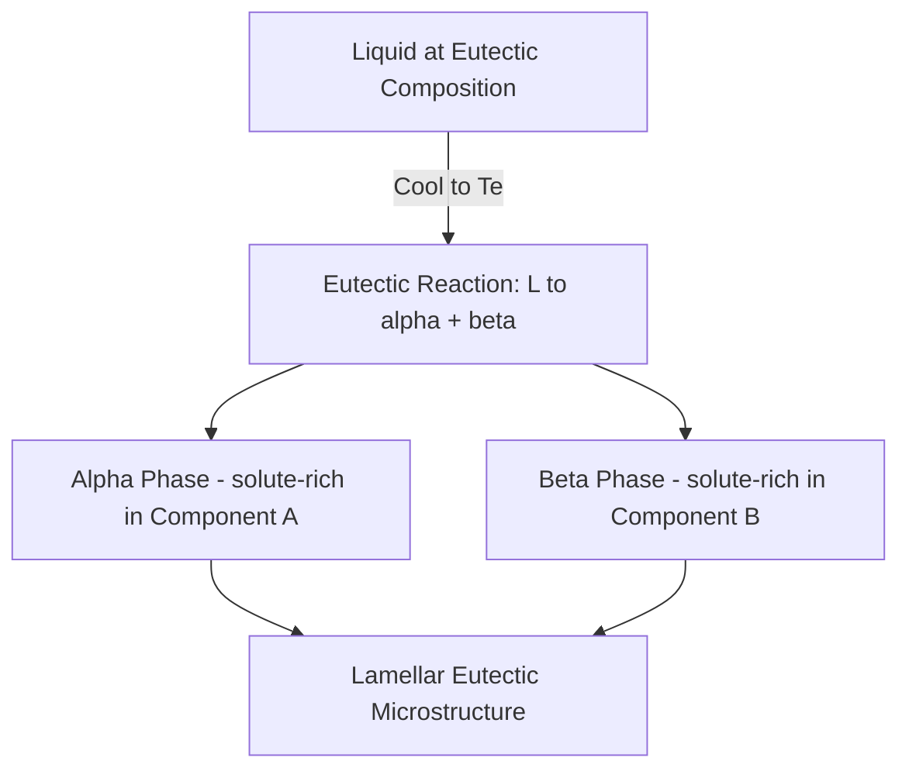

## Eutectic and Eutectoid Systems

### Fundamental Definitions

Eutectic and eutectoid reactions are **invariant reactions** — they occur at a fixed temperature and fixed composition for a given binary system, and both phases produced form simultaneously from a single parent phase upon cooling.

**Key Points**

- A **eutectic reaction** involves a liquid transforming isothermally into two distinct solid phases upon cooling:

  $$L \rightarrow \alpha + \beta$$
- A **eutectoid reaction** is the solid-state analog: one solid phase transforms isothermally into two different solid phases upon cooling:

  $$\gamma \rightarrow \alpha + \beta$$
- Both are classified as **invariant reactions** because, per the Gibbs phase rule at constant pressure ($F = C - P + 1$), a binary system ($C=2$) with three phases coexisting ($P=3$) has zero degrees of freedom ($F=0$) — temperature and all phase compositions are fixed and cannot be independently varied.
- The word "eutectic" derives from Greek for "easily melted" — the eutectic composition has the **lowest melting point** of any composition in the system, lower than either pure component's melting point.

### The Eutectic Phase Diagram

A binary eutectic system exhibits **limited (partial) solid solubility** of each component in the other, in contrast to the complete solubility of isomorphous systems.

**Key regions and lines:**

- **Liquidus** — boundary above which only liquid exists; it descends from each pure component's melting point toward the eutectic point.
- **Solvus** — boundary within the solid state marking the temperature-dependent solubility limit of one component in the other's solid solution.
- **Eutectic isotherm** — the horizontal line at the eutectic temperature $T_E$, along which the invariant reaction occurs.
- **Eutectic point** — the specific composition ($C_E$) and temperature ($T_E$) at which the eutectic reaction occurs; this is the single lowest-melting-point composition in the system.

### Eutectic Phase Diagram Schematic (svg_diagram)

<svg xmlns="http://www.w3.org/2000/svg" viewBox="0 0 800 480" font-family="Arial, sans-serif">
<text x="400" y="25" font-size="16" font-weight="bold" text-anchor="middle">Binary Eutectic Phase Diagram (svg_diagram)</text>
<line x1="90" y1="430" x2="720" y2="430" stroke="#333" stroke-width="2" />
<line x1="90" y1="430" x2="90" y2="60" stroke="#333" stroke-width="2" />
<text x="400" y="460" font-size="12" text-anchor="middle">Composition (wt% B)</text>
<text x="35" y="245" font-size="12" text-anchor="middle" transform="rotate(-90 35 245)">Temperature</text>

<text x="90" y="445" font-size="10" text-anchor="middle">0 (Pure A)</text>

<text x="720" y="445" font-size="10" text-anchor="middle">100 (Pure B)</text>

<text x="330" y="445" font-size="10" text-anchor="middle">CE</text>

<path d="M 90 150 L 330 330" fill="none" stroke="#c0392b" stroke-width="2.5" />
<path d="M 720 130 L 330 330" fill="none" stroke="#c0392b" stroke-width="2.5" />
<text x="180" y="220" font-size="11" fill="#c0392b">Liquidus</text>
<text x="560" y="200" font-size="11" fill="#c0392b">Liquidus</text>
<line x1="150" y1="330" x2="510" y2="330" stroke="#8e44ad" stroke-width="2.5" />
<text x="530" y="333" font-size="10" fill="#8e44ad">Eutectic Isotherm (Te)</text>
<circle cx="330" cy="330" r="4" fill="#000" />
<text x="330" y="315" font-size="9" text-anchor="middle">Eutectic Pt</text>
<path d="M 90 150 Q 110 250 150 330" fill="none" stroke="#2980b9" stroke-width="2" />
<path d="M 720 130 Q 680 240 510 330" fill="none" stroke="#2980b9" stroke-width="2" />
<text x="105" y="260" font-size="10" fill="#2980b9">Solidus</text>
<text x="640" y="250" font-size="10" fill="#2980b9">Solidus</text>
<path d="M 90 150 Q 90 250 90 300 Q 100 380 140 430" fill="none" stroke="#27ae60" stroke-width="1.5" stroke-dasharray="4,2" />
<path d="M 720 130 Q 710 250 690 300 Q 670 380 620 430" fill="none" stroke="#27ae60" stroke-width="1.5" stroke-dasharray="4,2" />
<text x="105" y="380" font-size="9" fill="#27ae60">Solvus</text>
<text x="650" y="380" font-size="9" fill="#27ae60">Solvus</text>

<text x="150" y="190" font-size="13" font-weight="bold">Liquid (L)</text>

<text x="200" y="290" font-size="10">L + α</text>

<text x="460" y="270" font-size="10">L + β</text>

<text x="300" y="380" font-size="11" font-weight="bold">α + β</text>

<text x="105" y="230" font-size="12" font-weight="bold">α</text>

<text x="670" y="200" font-size="12" font-weight="bold">β</text>

</svg>

### Classification of Alloy Compositions in a Eutectic System

**Key Points**

- **Eutectic composition** ($C_0 = C_E$): the alloy solidifies entirely at the single eutectic temperature $T_E$, forming 100% eutectic microstructure (a fine, characteristically lamellar or rod-like mixture of α and β).
- **Hypoeutectic composition** ($C_0 < C_E$, richer in component A): upon cooling, primary (proeutectoid... more precisely "proeutectic") α forms first as the alloy cools through the L + α field, followed by the remaining liquid (now at composition $C_E$) transforming to eutectic at $T_E$. Final microstructure: primary α + eutectic (α + β).
- **Hypereutectic composition** ($C_0 > C_E$): analogous, but primary β forms first, followed by eutectic at $T_E$. Final microstructure: primary β + eutectic (α + β).
- **Terminal solid solution compositions** (very A-rich or very B-rich, outside the eutectic-forming range): behave similarly to an isomorphous system locally, solidifying to a single-phase solid solution with no eutectic constituent, provided the composition remains within the solvus-bounded single-phase field upon cooling to room temperature.

### The Lever Rule Applied at the Eutectic Isotherm

Just above $T_E$, for a hypoeutectic alloy of composition $C_0$, the relative amounts of primary α and remaining liquid (at composition $C_E$) are found using the tie-line spanning the solidus ($C_{\alpha,max}$) to the eutectic composition ($C_E$):

$$W_{\alpha(\text{primary})} = \frac{C_E - C_0}{C_E - C_{\alpha,max}}$$

$$W_{L} = \frac{C_0 - C_{\alpha,max}}{C_E - C_{\alpha,max}}$$

Just below $T_E$, all remaining liquid transforms to eutectic, so the total fraction of eutectic microstructure equals $W_L$ calculated just above $T_E$, and total α (primary + eutectic α) can be calculated using the full solvus-to-solvus tie-line at room temperature.

**Example**

Consider a hypoeutectic Pb-Sn alloy with $C_0 = 40\text{ wt\% Sn}$, where $C_{\alpha,max} \approx 18.3\text{ wt\% Sn}$ and $C_E \approx 61.9\text{ wt\% Sn}$ (approximate values for the Pb-Sn system near the eutectic temperature of 183°C).

$$W_{\alpha(\text{primary})} = \frac{61.9 - 40}{61.9 - 18.3} = \frac{21.9}{43.6} \approx 0.502 \;(50.2\text{ wt\%})$$

$$W_L (\text{= fraction eutectic formed}) = 1 - 0.502 = 0.498 \;(49.8\text{ wt\%})$$

This means the final room-temperature microstructure consists of roughly 50 wt% primary (proeutectic) α and 50 wt% eutectic mixture.

### Eutectic Microstructure Morphology

**Key Points**

- Eutectic solidification typically produces a characteristic **lamellar** (alternating-plate) microstructure, since the two phases must grow cooperatively, with short-range diffusion of each component to its respective phase at the solid-liquid interface.
- The lamellar spacing is inversely related to the cooling rate: faster cooling produces finer (more closely spaced) lamellae, since less time is available for long-range diffusion.
- Other eutectic morphologies (rod-like, globular, "Chinese script," acicular) can occur depending on the volume fraction of each phase, interfacial energy anisotropy, and growth kinetics — the classic Pb-Sn eutectic exhibits alternating lamellae, while Al-Si eutectics can show a more irregular, flake-like silicon morphology unless modified (e.g., by sodium or strontium additions in casting practice).
- [Inference] Finer eutectic spacing generally correlates with improved mechanical properties (higher strength, sometimes improved ductility) due to a Hall-Petch-like strengthening effect from the increased phase-boundary density impeding dislocation motion, though the exact relationship is alloy-system-dependent.

### Eutectoid Reaction — The Fe-Fe₃C Example

The eutectoid reaction is mechanistically identical to the eutectic reaction but occurs entirely within the solid state, making it central to steel heat treatment.

**Key Points**

- In the Fe-Fe₃C system: $\gamma(\text{austenite, } 0.76\text{ wt\% C}) \rightarrow \alpha(\text{ferrite, } 0.022\text{ wt\% C}) + Fe_3C(\text{cementite, } 6.7\text{ wt\% C})$ at 727°C.
- The resulting lamellar microstructure is called **pearlite**, consisting of alternating plates of ferrite and cementite.
- **Hypoeutectoid steels** (< 0.76 wt% C) form proeutectoid ferrite prior to the eutectoid reaction, yielding a final microstructure of proeutectoid ferrite + pearlite.
- **Hypereutectoid steels** (> 0.76 wt% C) form proeutectoid cementite (often as grain-boundary films or networks) prior to the eutectoid reaction, yielding proeutectoid cementite + pearlite.
- Because the eutectoid reaction occurs entirely in the solid state, diffusion is significantly slower than in eutectic (liquid-to-solid) reactions, making the resulting lamellar spacing and reaction completeness considerably more sensitive to cooling rate — this sensitivity is the basis for Time-Temperature-Transformation (TTT) diagrams and the formation of non-equilibrium microstructures like bainite and martensite under faster cooling.

**Example**

Applying the lever rule to a hypoeutectoid steel with $C_0 = 0.4\text{ wt\% C}$, just above the eutectoid temperature, with $C_\alpha \approx 0.022\text{ wt\% C}$ (ferrite solvus limit) and $C_{eutectoid} = 0.76\text{ wt\% C}$:

$$W_{\alpha(\text{proeutectoid})} = \frac{0.76 - 0.4}{0.76 - 0.022} = \frac{0.36}{0.738} \approx 0.488 \;(48.8\text{ wt\%})$$

The remaining ≈51.2 wt% of the austenite (now at eutectoid composition) transforms entirely to pearlite at 727°C.

### Eutectic vs. Eutectoid — Comparative Summary

| Feature | Eutectic Reaction | Eutectoid Reaction |
| --- | --- | --- |
| Parent phase | Liquid | Solid |
| General form | $L \rightarrow \alpha + \beta$ | $\gamma \rightarrow \alpha + \beta$ |
| Diffusion mode | Liquid + solid-state diffusion | Solid-state diffusion only (slower) |
| Cooling-rate sensitivity | Moderate | High (strongly affects morphology/kinetics) |
| Classic example | Pb-Sn ($T_E = 183°C$, $C_E \approx 61.9\text{ wt\% Sn}$) | Fe-Fe₃C ($T=727°C$, $C=0.76\text{ wt\% C}$, forms pearlite) |

### Other Related Invariant Reactions (For Context)

**Key Points**

- **Peritectic reaction**: a liquid and one solid phase react isothermally to form a *different* solid phase upon cooling: $L + \alpha \rightarrow \beta$.
- **Peritectoid reaction**: the solid-state analog of a peritectic: two solid phases react to form a third solid phase: $\alpha + \beta \rightarrow \gamma$.
- **Monotectic reaction**: one liquid transforms into a solid plus a second, different liquid: $L_1 \rightarrow \alpha + L_2$.
- These are less commonly emphasized in introductory coursework compared to eutectic/eutectoid reactions but appear in more complex commercial alloy systems (e.g., peritectic reactions are significant in some steel and titanium alloy systems).

### Common Errors and Misconceptions

**Key Points**

- Confusing "eutectic composition" with "eutectic microstructure" — only an alloy *at* the eutectic composition forms 100% eutectic microstructure; hypo/hypereutectic alloys form a mixture of primary phase plus eutectic constituent, though the eutectic *constituent itself* (when it forms) always has the fixed eutectic composition.
- Assuming the eutectic reaction happens gradually over a temperature range — it is an **isothermal** (single-temperature) invariant reaction; extended apparent transformation ranges observed in practice are due to non-equilibrium (segregation/coring) effects, not equilibrium behavior.
- Forgetting that the solvus lines continue to shift with decreasing temperature below $T_E$, meaning the α and β phase compositions (and their relative amounts) continue to change with continued cooling even after the eutectic/eutectoid reaction is complete — the room-temperature lever rule calculation uses different (solvus-based) endpoint compositions than the one used at $T_E$.

**Next Steps**

- Time-Temperature-Transformation (TTT) diagrams and isothermal transformation of austenite
- Continuous-Cooling-Transformation (CCT) diagrams and practical steel heat treatments
- Martensitic transformation — diffusionless transformation contrasted with eutectoid decomposition
- Pearlite, bainite, and martensite microstructure-property relationships
- Cast iron microstructures (gray, white, ductile) via the eutectic/eutectoid Fe-Fe₃C-Si system
- Peritectic and peritectoid reactions in advanced alloy systems
- Coring, non-equilibrium eutectic solidification, and divorced eutectic morphology