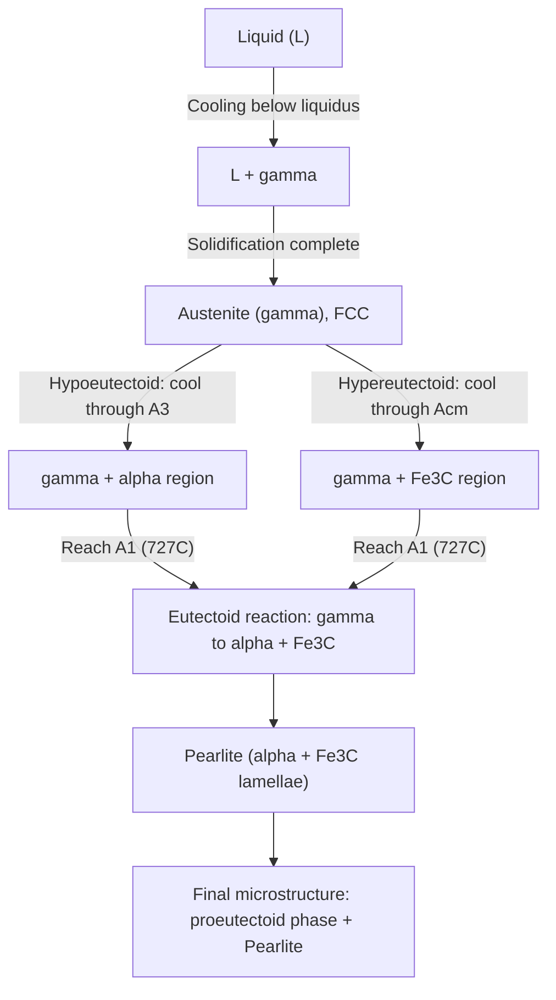

## The Iron-Iron Carbide Phase Diagram

### Overview and Significance

The iron-iron carbide (Fe-Fe₃C) phase diagram is the foundational reference for understanding the microstructural evolution of steels and cast irons. It is a metastable diagram — the true equilibrium system is iron-graphite (Fe-C), but because graphite nucleation is sluggish under normal cooling conditions, the Fe-Fe₃C system is used in practice since cementite (Fe₃C) forms preferentially and is stable enough for engineering purposes. The diagram spans compositions from pure iron (0% C) to 6.67 wt% carbon, which corresponds to the stoichiometric compound Fe₃C (cementite).

Ferrous alloys are classified based on their position on this diagram:

- **Steels**: 0.008–2.11 wt% C
- **Cast irons**: 2.11–6.67 wt% C

### Allotropes of Pure Iron

Iron exhibits polymorphism (allotropy), meaning it exists in more than one crystal structure depending on temperature:

- **α-ferrite (alpha iron)**: BCC (body-centered cubic) structure, stable from room temperature up to 912°C
- **γ-austenite (gamma iron)**: FCC (face-centered cubic) structure, stable from 912°C to 1394°C
- **δ-ferrite (delta iron)**: BCC structure, stable from 1394°C to the melting point at 1538°C

The transformation temperatures for pure iron are:

- 912°C: α (BCC) → γ (FCC)
- 1394°C: γ (FCC) → δ (BCC)
- 1538°C: δ → liquid (melting point)

These transformation temperatures shift with carbon content, which is the basis for the diagram's shape.

### Key Phases in the System

**Ferrite (α)**

BCC iron with a maximum solid solubility of only 0.022 wt% C at 727°C (the eutectoid temperature), dropping to about 0.005–0.008 wt% C at room temperature. The low solubility arises because the BCC interstitial sites are small and few carbon atoms can be accommodated without significant lattice strain. Ferrite is soft, ductile, and magnetic below its Curie temperature (770°C).

**Austenite (γ)**

FCC iron with much higher carbon solubility, maximum 2.11 wt% C at 1147°C. The FCC structure has larger octahedral interstitial sites, allowing greater carbon dissolution. Austenite is nonmagnetic, relatively soft, and highly ductile — this is the phase exploited during hot working and most heat-treatment austenitizing steps.

**Delta ferrite (δ)**

BCC structure stable only at high temperature, with maximum carbon solubility of 0.09 wt% C at 1493°C. It has minimal practical significance except in castings and welds solidifying through this region.

**Cementite (Fe₃C)**

An intermetallic compound (interstitial compound) containing 6.67 wt% C, with an orthorhombic crystal structure. Cementite is hard and brittle ([Unverified: exact hardness values vary by source, but it is commonly cited around 800–1100 HV) and forms the hard constituent in steel microstructures. It is metastable — given sufficient time and temperature, it can decompose into iron and graphite, $\text{Fe}_3\text{C} \rightarrow 3\text{Fe} + \text{C (graphite)}$.

**Liquid (L)**

The molten phase, present above the liquidus line, capable of dissolving carbon in all proportions up to the diagram's composition range.

### Invariant Reactions

Three invariant (isothermal, three-phase) reactions define the diagram's key transformation points:

**1. Peritectic Reaction** (1493°C, 0.53 wt% C for the resulting phase)

$$\delta + L \rightarrow \gamma$$

Occurs at 0.09 wt% C (δ) and 0.53 wt% C (liquid) combining to form austenite at 0.17 wt% C. This has limited practical relevance for most engineering steels since it occurs only at very low carbon content and high temperature.

**2. Eutectic Reaction** (1147°C, 4.30 wt% C)

$$L \rightarrow \gamma + \text{Fe}_3\text{C}$$

Liquid of eutectic composition transforms into austenite (2.11 wt% C) and cementite (6.67 wt% C) simultaneously. The resulting two-phase mixture is called **ledeburite**. This reaction governs the solidification behavior of cast irons.

**3. Eutectoid Reaction** (727°C, 0.76–0.77 wt% C)

$$\gamma \rightarrow \alpha + \text{Fe}_3\text{C}$$

This is the most important reaction for steel heat treatment. Austenite of eutectoid composition decomposes completely into a lamellar mixture of ferrite and cementite called **pearlite**. [Inference: the precise eutectoid composition and temperature vary slightly, 0.76–0.80 wt% C and 723–727°C, depending on the source and measurement method].

### Diagram Regions and Key Lines

| Line | Description |
| --- | --- |
| Liquidus | Boundary above which the alloy is fully liquid |
| Solidus | Boundary below which the alloy is fully solid |
| A₃ line | γ/(γ+α) boundary; solvus separating austenite from austenite+ferrite |
| Acm line | γ/(γ+Fe₃C) boundary; solubility limit of carbon in austenite above the eutectoid |
| A₁ line | The eutectoid isotherm at 727°C, horizontal across the diagram |

- **Hypoeutectoid steels** (<0.76 wt% C): cool through the α+γ region, forming proeutectoid ferrite at grain boundaries before the remaining austenite transforms to pearlite at A₁.
- **Hypereutectoid steels** (0.76–2.11 wt% C): cool through the γ+Fe₃C region, forming proeutectoid (network) cementite at grain boundaries before the remaining austenite transforms to pearlite.
- **Hypoeutectic cast irons** (2.11–4.30 wt% C) and **hypereutectic cast irons** (4.30–6.67 wt% C) follow analogous logic around the eutectic point.

### Simplified Diagram (SVG)

<svg xmlns="http://www.w3.org/2000/svg" viewBox="0 0 900 620" font-family="Arial, sans-serif">
<text x="450" y="25" font-size="18" font-weight="bold" text-anchor="middle">Fe-Fe3C Phase Diagram (svg_diagram)</text>

<line x1="100" y1="550" x2="820" y2="550" stroke="black" stroke-width="2" />
<line x1="100" y1="550" x2="100" y2="60" stroke="black" stroke-width="2" />

<text x="460" y="590" font-size="14" text-anchor="middle">Carbon Content (wt% C)</text>

<text x="35" y="310" font-size="14" text-anchor="middle" transform="rotate(-90 35 310)">Temperature (°C)</text>

<text x="100" y="570" font-size="12" text-anchor="middle">0</text>

<text x="220" y="570" font-size="12" text-anchor="middle">0.76</text>

<text x="260" y="570" font-size="12" text-anchor="middle">1.0</text>

<text x="400" y="570" font-size="12" text-anchor="middle">2.11</text>

<text x="580" y="570" font-size="12" text-anchor="middle">4.30</text>

<text x="800" y="570" font-size="12" text-anchor="middle">6.67</text>

<text x="80" y="550" font-size="12" text-anchor="end">727</text>

<text x="80" y="330" font-size="12" text-anchor="end">1147</text>

<text x="80" y="200" font-size="12" text-anchor="end">1493</text>

<text x="80" y="100" font-size="12" text-anchor="end">1538</text>

<line x1="100" y1="500" x2="800" y2="500" stroke="#b03a2e" stroke-width="2" />
<text x="850" y="504" font-size="12" fill="#b03a2e">A1 (727°C)</text>

<line x1="220" y1="330" x2="800" y2="330" stroke="#1a5276" stroke-width="2" />
<text x="850" y="334" font-size="12" fill="#1a5276">Eutectic (1147°C)</text>

<path d="M 100 100 Q 160 250 220 500" stroke="#117a65" stroke-width="2" fill="none" />
<text x="130" y="230" font-size="11" fill="#117a65">A3</text>

<path d="M 220 500 Q 300 400 400 330" stroke="#7d3c98" stroke-width="2" fill="none" />
<text x="330" y="420" font-size="11" fill="#7d3c98">Acm</text>

<path d="M 100 100 L 400 220 L 580 330" stroke="black" stroke-width="2" fill="none" />
<text x="480" y="240" font-size="11">Liquidus</text>

<path d="M 100 100 L 250 260 L 400 330" stroke="black" stroke-width="1.5" stroke-dasharray="4,3" fill="none" />
<text x="220" y="290" font-size="11">Solidus</text>

<line x1="800" y1="60" x2="800" y2="550" stroke="black" stroke-width="2" />
<text x="805" y="300" font-size="12" transform="rotate(-90 805 300)">Fe3C (6.67%)</text>

<text x="150" y="150" font-size="13" font-style="italic">L (Liquid)</text>

<text x="180" y="450" font-size="13" font-style="italic">α (Ferrite)</text>

<text x="330" y="420" font-size="13" font-style="italic">γ (Austenite)</text>

<text x="280" y="530" font-size="12" font-style="italic">α + Fe3C (Pearlite)</text>

<text x="500" y="450" font-size="12" font-style="italic">γ + Fe3C</text>

<text x="600" y="250" font-size="12" font-style="italic">L + γ</text>

<text x="650" y="500" font-size="12" font-style="italic">Ledeburite + Fe3C</text>

<circle cx="220" cy="500" r="4" fill="red" />
<text x="225" y="495" font-size="11" fill="red">Eutectoid (0.76%C)</text>
<circle cx="580" cy="330" r="4" fill="blue" />
<text x="585" y="325" font-size="11" fill="blue">Eutectic (4.30%C)</text>
</svg>

*(Diagram is schematic and not to scale; intended to convey topology, not precise coordinates.)*

### Microstructures Derived from the Diagram

**Pearlite**

Formed from eutectoid-composition austenite cooled slowly through 727°C. Consists of alternating lamellae of ferrite and cementite. Lamellar spacing decreases (finer pearlite) with faster cooling rates, increasing hardness and strength via a Hall-Petch-like mechanism applied to interlamellar spacing.

**Proeutectoid Ferrite**

Forms in hypoeutectoid steels as austenite cools through the α+γ region before reaching A₁; nucleates preferentially at prior austenite grain boundaries.

**Proeutectoid Cementite**

Forms in hypereutectoid steels as austenite cools through the γ+Fe₃C region before reaching A₁; also nucleates at grain boundaries, often forming a continuous brittle network — a microstructural feature that must be controlled (e.g., via normalizing) since it severely degrades toughness.

**Ledeburite**

The eutectic mixture of austenite and cementite formed in cast irons at 1147°C; upon further cooling below 727°C, the austenite component itself transforms to pearlite, yielding "transformed ledeburite" — pearlite plus cementite.

### Lever Rule Application

The relative amounts of two coexisting phases at a given temperature and composition are calculated using the lever rule. For a composition $C_0$ between phase boundaries at compositions $C_\alpha$ and $C_\gamma$:

$$W_\alpha = \frac{C_\gamma - C_0}{C_\gamma - C_\alpha}$$

$$W_\gamma = \frac{C_0 - C_\alpha}{C_\gamma - C_\alpha}$$

**Example**: For a hypoeutectoid steel with 0.40 wt% C just below 727°C, using $C_\alpha \approx 0.022$ wt% C and $C_{Fe_3C} = 6.67$ wt% C:

$$W_{\alpha} = \frac{6.67 - 0.40}{6.67 - 0.022} = \frac{6.27}{6.648} \approx 0.943 \, (94.3\%)$$

$$W_{Fe_3C} = \frac{0.40 - 0.022}{6.648} \approx 0.057 \, (5.7\%)$$

This tells us the alloy is approximately 94.3 wt% ferrite and 5.7 wt% cementite overall (combined across both proeutectoid ferrite and the ferrite within pearlite).

### Transformation Pathway Diagram (Mermaid)

### Practical Relevance to Heat Treatment

The diagram underlies nearly all conventional steel heat treatments:

- **Annealing/Normalizing**: heating into the austenite region then cooling to control pearlite morphology and grain size
- **Austenitizing**: the necessary first step (heating above A₃ or Acm) before quenching, spheroidizing, or hardening
- **Critical temperatures (A₁, A₃, Acm)**: used to set soak temperatures for heat-treatment schedules; incorrect targeting leads to incomplete transformation or excessive grain growth

[Inference: while the equilibrium diagram predicts pearlite as the eutectoid product under slow cooling, in practice, cooling rate strongly influences the outcome — rapid cooling suppresses diffusion-controlled pearlite formation and instead favors bainite or martensite, which are described by non-equilibrium diagrams like TTT and CCT curves. The Fe-Fe₃C diagram itself only applies strictly under near-equilibrium (very slow) cooling conditions.]

### Limitations of the Diagram

- It represents equilibrium conditions only; most industrial heat treatments involve non-equilibrium cooling rates, requiring supplementary tools (TTT/CCT diagrams)
- It does not capture the influence of alloying elements (Cr, Ni, Mo, etc.), which shift critical temperatures and phase boundaries substantially
- Cementite is metastable; at very high temperatures and long hold times, graphitization can occur, especially relevant to cast iron processing (e.g., malleabilization)

**Related Topics**

- Iron-Iron Carbide vs. Iron-Graphite equilibrium diagrams
- TTT (Time-Temperature-Transformation) diagrams
- CCT (Continuous Cooling Transformation) diagrams
- Classification and microstructures of cast irons (gray, white, ductile, malleable)
- Heat treatment processes: annealing, normalizing, quenching, tempering
- Hardenability and the Jominy end-quench test
- Effect of alloying elements on the Fe-Fe₃C diagram
- Martensitic transformation and its non-equilibrium nature
- Grain size control and its effect on mechanical properties