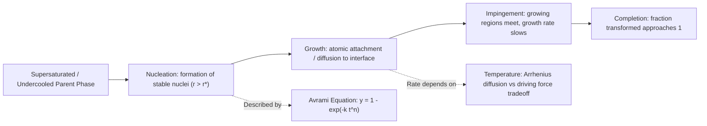

## Transformation Kinetics

### Overview

Transformation kinetics describes the rate at which phase transformations occur, in contrast to equilibrium phase diagrams, which describe only the thermodynamically stable end states without any reference to time. Equilibrium diagrams (such as the Fe-Fe₃C diagram) tell us *what* phases should form given infinite time; kinetics tells us *how fast* they actually form and what happens when cooling rates prevent full equilibrium from being reached. This distinction is central to materials engineering because virtually all industrial heat treatments occur under non-equilibrium (finite-rate) conditions.

### Thermodynamic vs. Kinetic Considerations

A phase transformation requires two conditions:

1. **Thermodynamic driving force**: the new phase must have lower free energy than the parent phase under the given conditions
2. **Kinetic feasibility**: atoms must be able to rearrange (via diffusion or shear) within the available time at the available temperature

A transformation can be thermodynamically favorable yet kinetically suppressed if insufficient time or atomic mobility is available — this is the basis for phenomena like undercooling, metastable phase retention (e.g., retained austenite), and the formation of non-equilibrium microstructures like martensite.

### Nucleation and Growth

Most solid-state phase transformations proceed via **nucleation and growth**, a two-stage mechanism:

**Nucleation**

The formation of small stable particles (nuclei) of the new phase within the parent phase. Nucleation can be:

- **Homogeneous**: nuclei form uniformly throughout the parent phase, requiring larger undercooling since no favorable sites reduce the energy barrier
- **Heterogeneous**: nuclei form preferentially at defects (grain boundaries, dislocations, inclusions, free surfaces), which lower the activation energy barrier by reducing the interfacial energy contribution. Heterogeneous nucleation is far more common in practical engineering systems.

The total free energy change for forming a spherical nucleus of radius $r$ combines a volumetric (favorable) term and a surface (unfavorable) term:

$$\Delta G = \frac{4}{3}\pi r^3 \Delta G_v + 4\pi r^2 \gamma$$

where $\Delta G_v$ is the free energy change per unit volume (negative, driving the transformation) and $\gamma$ is the surface energy per unit area (positive, resisting it). Differentiating with respect to $r$ and setting to zero yields the **critical nucleus radius**:

$$r^* = \frac{-2\gamma}{\Delta G_v}$$

and the corresponding **critical free energy barrier**:

$$\Delta G^* = \frac{16\pi \gamma^3}{3(\Delta G_v)^2}$$

Nuclei smaller than $r^*$ are unstable and redissolve; nuclei larger than $r^*$ are stable and grow spontaneously, lowering the system's free energy.

**Growth**

Once stable nuclei form, they grow by atomic addition at the interface. Growth rate is controlled by:

- Diffusion rate of atoms to the interface (for diffusional transformations)
- Rate of atomic attachment across the interface
- Release of latent heat, which can locally raise temperature and slow further transformation if not dissipated

### The Avrami Equation

The overall fraction of material transformed as a function of time, accounting for both nucleation and growth occurring simultaneously throughout the volume, is described by the **Avrami equation** (also called the Johnson-Mehl-Avrami-Kolmogorov, or JMAK, equation):

$$y = 1 - \exp(-kt^n)$$

where:

- $y$ = fraction transformed
- $t$ = time
- $k$ = rate constant (temperature-dependent, incorporates nucleation and growth rates)
- $n$ = Avrami exponent (depends on nucleation mechanism and growth geometry, typically ranging from 1 to 4)

This produces a characteristic **sigmoidal (S-shaped) curve** when fraction transformed is plotted against the logarithm of time: transformation starts slowly (nucleation-dominated incubation period), accelerates (rapid growth), then decelerates as untransformed regions become depleted and impinge on one another.

**Example calculation**: If $k = 0.01\, \text{min}^{-n}$ and $n = 2$, the fraction transformed after 10 minutes is:

$$y = 1 - \exp(-0.01 \times 10^2) = 1 - \exp(-1) = 1 - 0.368 = 0.632 \, (63.2\%)$$

[Inference: exact values of $k$ and $n$ are alloy- and temperature-specific and are typically determined experimentally rather than predicted from first principles; the equation's form is well established, but the constants require empirical fitting for any specific system.]

### Rate Dependence on Temperature

The transformation rate typically follows an **Arrhenius-type relationship**, since it is fundamentally diffusion-controlled at moderate undercooling:

$$\text{rate} \propto \exp\left(\frac{-Q}{RT}\right)$$

where $Q$ is the activation energy for the relevant diffusion process, $R$ is the gas constant, and $T$ is absolute temperature. However, the overall rate as a function of temperature for a solid-state transformation is non-monotonic overall (not simple Arrhenius behavior) because two competing effects operate simultaneously:

- At high temperature (small undercooling): diffusion is fast, but the thermodynamic driving force ($\Delta G_v$) is small, so nucleation rate is low
- At low temperature (large undercooling): driving force is large, but atomic mobility is low, so diffusion is sluggish

This competition produces a **"C-curve" (nose-shaped) behavior** when transformation start time is plotted against temperature — transformation is fastest at an intermediate temperature and slower both above and below it.

### TTT (Time-Temperature-Transformation) Diagrams

TTT diagrams plot temperature (y-axis) against the logarithm of time (x-axis) for **isothermal** transformation, capturing the C-curve behavior directly. For eutectoid steel, key features include:

- **Upper C-curve nose (~550°C)**: fastest transformation, minimum time to begin transformation
- **Above the nose**: austenite transforms to **pearlite**; coarser pearlite forms near the A₁ temperature, finer pearlite forms closer to the nose
- **Below the nose (but above Ms)**: austenite transforms to **bainite**, a non-lamellar ferrite-cementite mixture with different morphology (upper bainite vs. lower bainite depending on temperature)
- **Ms (martensite start) and Mf (martensite finish) lines**: horizontal lines below which austenite transforms to **martensite** via a diffusionless, shear-based (athermal) mechanism rather than nucleation-and-growth diffusion

TTT diagrams strictly apply only to isothermal holds (rapid quench to a temperature, then hold), which is an idealization not directly achievable in bulk components during continuous cooling.

### CCT (Continuous Cooling Transformation) Diagrams

Since most real heat treatments involve continuous cooling rather than isothermal holds, **CCT diagrams** are used in practice. CCT curves are shifted to longer times and slightly lower temperatures relative to TTT curves for the same alloy, because continuous cooling effectively "samples" a range of temperatures rather than holding at one. Key practical uses:

- Determining whether a given cooling rate (e.g., furnace cool, air cool, oil quench, water quench) will produce pearlite, bainite, martensite, or a mixture
- Identifying the **critical cooling rate**: the minimum cooling rate required to bypass the pearlite/bainite noses entirely and produce fully martensitic structure

### Transformation Kinetics Curve (Mermaid)

### Sigmoidal Transformation Curve (SVG)

<svg xmlns="http://www.w3.org/2000/svg" viewBox="0 0 700 400" font-family="Arial, sans-serif">
<text x="350" y="25" font-size="16" font-weight="bold" text-anchor="middle">Avrami Transformation Curve (svg_diagram)</text>
<line x1="80" y1="340" x2="650" y2="340" stroke="black" stroke-width="2" />
<line x1="80" y1="340" x2="80" y2="50" stroke="black" stroke-width="2" />

<text x="365" y="375" font-size="13" text-anchor="middle">log(time)</text>

<text x="30" y="195" font-size="13" text-anchor="middle" transform="rotate(-90 30 195)">Fraction Transformed (y)</text>

<text x="70" y="345" font-size="11" text-anchor="end">0</text>

<text x="70" y="60" font-size="11" text-anchor="end">1.0</text>

<path d="M 100 335 C 200 335, 250 320, 300 250 C 350 170, 400 90, 500 65 C 550 58, 600 55, 630 53" stroke="`#1a5276`" stroke-width="3" fill="none" />

<line x1="100" y1="340" x2="100" y2="330" stroke="black" />
<text x="100" y="360" font-size="11" text-anchor="middle">Incubation</text>
<line x1="350" y1="340" x2="350" y2="150" stroke="#888" stroke-dasharray="3,3" />
<text x="350" y="380" font-size="11" text-anchor="middle">Rapid growth</text>
<line x1="550" y1="340" x2="550" y2="60" stroke="#888" stroke-dasharray="3,3" />
<text x="550" y="380" font-size="11" text-anchor="middle">Impingement / completion</text>
</svg>

### Diffusional vs. Diffusionless Transformations

| Feature | Diffusional (e.g., pearlite, bainite formation) | Diffusionless (martensitic) |
| --- | --- | --- |
| Mechanism | Long-range atomic diffusion | Coordinated shear/shuffle of atoms, no long-range diffusion |
| Time dependence | Strongly time-dependent (Avrami kinetics) | Athermal — depends on temperature reached, not time held |
| Composition change | Product phases differ in composition from parent | Product retains parent composition |
| Temperature control | Isothermal or slow cooling | Rate must exceed critical cooling rate to avoid pearlite/bainite noses |
| Typical product | Pearlite, bainite, proeutectoid phases | Martensite |

### Factors Influencing Transformation Kinetics

- **Alloying elements**: most substitutional alloying elements (Cr, Mo, Ni, Mn) shift TTT/CCT noses to longer times, improving hardenability by allowing slower cooling rates to still achieve martensite
- **Grain size**: finer austenite grain size increases grain boundary area, providing more heterogeneous nucleation sites and generally accelerating pearlite/bainite formation (shifting the nose to shorter times), though it can also affect hardenability trends depending on the specific mechanism
- **Prior microstructure and homogeneity**: undissolved carbides or inhomogeneous carbon distribution in austenite affect local nucleation kinetics
- **Applied stress**: can influence both nucleation rate and, notably, martensite start temperature (stress-assisted or strain-induced transformation)

[Inference: while general trends (e.g., alloying additions delaying transformation) are well established, the magnitude of the shift is highly alloy-specific and typically must be read from empirically determined TTT/CCT diagrams for the specific steel grade rather than predicted generically.]

### Practical Example: Interpreting a Cooling Path on a CCT Diagram

Consider a eutectoid steel cooled continuously from the austenite region:

- **Slow furnace cool**: cooling curve crosses the pearlite region well above the nose → coarse pearlite, soft and ductile
- **Moderate air cool**: crosses closer to the nose → fine pearlite, higher strength/hardness than coarse pearlite
- **Fast oil quench**: may partially miss the pearlite nose → mixture of fine pearlite/bainite and some martensite
- **Very fast water quench**: cooling curve bypasses the nose entirely, crossing directly below Ms → fully martensitic, hardest and most brittle condition (as-quenched, prior to tempering)

This is the kinetic basis for selecting quenchants and cross-sectional thickness limits in heat-treatment specification, and it directly explains why thick sections often cannot be through-hardened even with aggressive quenching (surface cools fast enough to bypass the nose, but the core does not).

**Related Topics**

- TTT and CCT diagram construction and interpretation
- Hardenability and the Jominy end-quench test
- Martensite formation, tetragonality, and Ms/Mf temperature prediction
- Bainite: upper vs. lower bainite morphology and properties
- Tempering of martensite and secondary hardening
- Nucleation theory: homogeneous vs. heterogeneous nucleation energetics
- Grain growth kinetics and Zener pinning
- Precipitation hardening kinetics (age hardening curves)
- Diffusion mechanisms: Fick's laws and their role in transformation rate