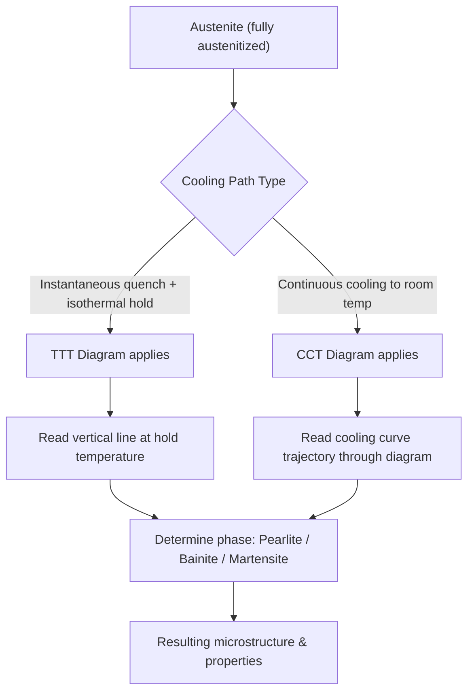

## TTT and CCT Diagrams

### Overview and Purpose

TTT (Time-Temperature-Transformation) and CCT (Continuous Cooling Transformation) diagrams are graphical tools used to predict the microstructure that results from cooling austenite under specified thermal conditions. They translate the kinetic behavior described by nucleation-and-growth theory and the Avrami equation into practical engineering charts, allowing selection of quenchants, cooling rates, and heat-treatment schedules to achieve a target microstructure (pearlite, bainite, martensite, or mixtures).

Both diagrams plot **temperature** on the vertical axis against **time** (on a logarithmic scale) on the horizontal axis. The fundamental difference is the thermal path each represents:

- **TTT diagrams**: isothermal transformation — the sample is rapidly quenched to a fixed temperature and held there while transformation proceeds
- **CCT diagrams**: continuous cooling — the sample cools steadily (or along some defined cooling curve) through a range of temperatures, more closely matching real industrial processes

### TTT Diagrams (Isothermal Transformation Diagrams)

**Construction Method**

TTT diagrams are built experimentally by austenitizing multiple small specimens, rapidly quenching each to a different target temperature (often in a salt bath to achieve near-instantaneous cooling), holding at that temperature, and periodically sampling to determine the onset and completion of transformation (via metallography, dilatometry, or magnetic measurements). Plotting the start and finish times for each temperature produces the characteristic curves.

**Key Features (for eutectoid steel, ~0.76 wt% C)**

- **Upper region (727°C down to ~550°C)**: austenite transforms to **pearlite**. Near A₁ (727°C), transformation is slow and produces coarse pearlite (large interlamellar spacing); as temperature decreases toward the nose, transformation accelerates and pearlite becomes progressively finer.
- **The "nose" (~550°C for eutectoid steel)**: the temperature of minimum transformation start time, representing the optimum balance between thermodynamic driving force and atomic mobility, as discussed under transformation kinetics.
- **Intermediate region (~550°C down to Ms)**: austenite transforms to **bainite**.
  - *Upper bainite* (formed at higher temperatures within this range): feathery morphology, coarser cementite particles
  - *Lower bainite* (formed at lower temperatures within this range): acicular (needle-like) morphology, finer carbide precipitation within ferrite laths, generally tougher than upper bainite for a given strength level
- **Ms (martensite start) line**: horizontal line marking the temperature at which martensite begins to form athermally upon cooling below it, independent of time
- **Mf (martensite finish) line**: horizontal line below which transformation to martensite is considered essentially complete; [Inference: some retained austenite typically persists below Mf in practice, particularly in higher-carbon steels, since Mf represents a practical completion point rather than an absolute one]

**Two C-Curves**

Eutectoid TTT diagrams typically show two separate C-shaped curves: one marking the **start** of transformation and one marking the **finish**, with the region between them representing partial transformation.

**Isothermal Interpretation Example**

If eutectoid austenite is quenched instantly to 600°C and held, the TTT diagram is read by drawing a vertical line at that temperature and noting where it crosses the start and finish curves — for example, transformation might begin at ~10 seconds and complete by ~1 minute, yielding fine pearlite. If instead quenched to 300°C (below the nose, above Ms) and held, the diagram shows transformation to bainite over a characteristic time range at that temperature.

### CCT Diagrams (Continuous Cooling Transformation Diagrams)

**Why CCT Diagrams Are Needed**

TTT diagrams strictly apply only to instantaneous quench-and-hold conditions, which are difficult to achieve in bulk components (mass and geometry limit how quickly a real part reaches a uniform target temperature). Since most industrial processes involve continuous cooling from the austenitizing temperature (furnace cooling, air cooling, oil/water quenching), CCT diagrams are the more practically relevant tool.

**Relationship to TTT Diagrams**

CCT curves are derived from the same underlying transformation kinetics as TTT curves but are shifted to **longer times and slightly lower temperatures**. This occurs because, during continuous cooling, the material spends only a limited time at any given temperature before moving to the next, effectively requiring more cumulative time before the transformation conditions at any single temperature are satisfied.

**Key Difference: No Bainite Region for Plain Carbon Steels**

For many plain carbon eutectoid steels, continuous cooling curves that are fast enough to avoid the pearlite nose typically drop directly to the Ms line without intersecting a bainite region — meaning bainite may not form under continuous cooling for these specific compositions, even though it can form under isothermal holding. [Inference: this behavior depends significantly on alloy composition; many alloy steels (with Cr, Mo, Ni additions) exhibit distinct, well-separated pearlite and bainite regions on their CCT diagrams, so the "missing bainite bay" is not universal across all steel grades.]

**Cooling Curves Overlaid on CCT Diagrams**

Different cooling media produce characteristically different cooling curve shapes when superimposed on the CCT diagram:

| Cooling Method | Approximate Cooling Curve Behavior | Typical Resulting Microstructure |
| --- | --- | --- |
| Furnace cool (annealing) | Very slow, shallow curve | Coarse pearlite |
| Air cool (normalizing) | Moderate slope | Fine pearlite |
| Oil quench | Steep slope | Fine pearlite / bainite mixture, possibly some martensite |
| Water quench | Very steep slope | Predominantly or fully martensite |

**Critical Cooling Rate**

The critical cooling rate is the minimum cooling rate whose curve is tangent to (or just misses) the "nose" of the CCT diagram, thereby avoiding the pearlite/bainite transformation region entirely and yielding a fully martensitic structure upon reaching Ms. Any cooling rate slower than this will intersect the nose and produce at least partial pearlite or bainite. Alloying additions that shift the CCT nose to longer times reduce the critical cooling rate required, which is the underlying mechanism of **hardenability**.

### TTT vs. CCT: Comparative Diagram (Mermaid)

### Schematic TTT Diagram (SVG)

<svg xmlns="http://www.w3.org/2000/svg" viewBox="0 0 750 450" font-family="Arial, sans-serif">
<text x="375" y="25" font-size="16" font-weight="bold" text-anchor="middle">Schematic TTT Diagram, Eutectoid Steel (svg_diagram)</text>
<line x1="90" y1="400" x2="700" y2="400" stroke="black" stroke-width="2" />
<line x1="90" y1="400" x2="90" y2="60" stroke="black" stroke-width="2" />
<text x="395" y="430" font-size="13" text-anchor="middle">log(time), seconds</text>
<text x="35" y="230" font-size="13" text-anchor="middle" transform="rotate(-90 35 230)">Temperature (°C)</text>

<line x1="90" y1="90" x2="700" y2="90" stroke="#b03a2e" stroke-width="2" stroke-dasharray="5,3" />
<text x="705" y="94" font-size="12" fill="#b03a2e">A1 = 727°C</text>

<line x1="90" y1="300" x2="700" y2="300" stroke="#8e44ad" stroke-width="2" />
<text x="705" y="304" font-size="12" fill="#8e44ad">Ms</text>

<line x1="90" y1="340" x2="700" y2="340" stroke="#8e44ad" stroke-width="1.5" stroke-dasharray="3,3" />
<text x="705" y="344" font-size="12" fill="#8e44ad">Mf</text>

<path d="M 110 90 C 150 150, 200 190, 260 210 C 320 225, 400 200, 500 150 C 580 115, 650 95, 690 90" stroke="black" stroke-width="2.5" fill="none" />

<text x="270" y="235" font-size="11">Start</text>

<path d="M 160 90 C 210 170, 260 230, 330 250 C 390 265, 460 240, 550 180 C 610 145, 660 110, 695 92" stroke="black" stroke-width="2.5" stroke-dasharray="6,4" fill="none" />

<text x="360" y="275" font-size="11">Finish</text>

<circle cx="260" cy="210" r="4" fill="#1a5276" />
<text x="150" y="205" font-size="11" fill="#1a5276">Nose (~550°C)</text>

<text x="450" y="130" font-size="13" font-style="italic">Austenite + Pearlite</text>

<text x="480" y="270" font-size="13" font-style="italic">Austenite + Bainite</text>

<text x="450" y="320" font-size="12" font-style="italic">Martensite</text>

</svg>

### Worked Example: Selecting a Quench for a Target Microstructure

Suppose a component requires a fully bainitic microstructure (common for applications needing a strength-toughness balance without the brittleness of untempered martensite). Using a TTT diagram:

1. Austenitize the steel above the Acm or A₃ line to ensure a homogeneous austenite structure
2. Rapidly quench (e.g., in a salt bath) to a temperature between the nose and Ms — for example, 350°C for a eutectoid steel
3. Hold isothermally at 350°C until the finish curve is crossed (read directly from the diagram)
4. Cool to room temperature (no further transformation occurs since the austenite has already fully transformed to bainite)

This process, called **austempering**, exploits the TTT diagram directly and produces bainite without the need for a separate tempering step, since bainite does not require post-transformation tempering to relieve internal stresses the way martensite does.

By contrast, if using a CCT diagram to select a **continuous** quench rate to avoid pearlite and reach the Ms line directly, the practitioner instead identifies the critical cooling rate curve and selects a quenchant (e.g., water vs. oil) whose curve lies to the left of (faster than) that critical curve at the relevant section thickness.

### Effect of Alloying Elements on TTT/CCT Diagrams

- **Carbon content**: increasing carbon content generally shifts the nose to longer times (improving hardenability) but also lowers Ms and Mf temperatures
- **Substitutional alloying elements** (Cr, Mo, Ni, Mn, V): most shift the C-curves to the right (longer times), reducing the critical cooling rate and improving hardenability; some (notably Mo and certain carbide-formers) can also separate the pearlite and bainite noses into two distinct curves
- **Grain size**: coarser austenite grain size reduces grain-boundary nucleation sites, shifting the pearlite/bainite noses to longer times (improving hardenability), though at some cost to toughness

[Inference: quantitative shifts from specific alloying additions are composition- and processing-dependent and are generally obtained from empirically measured diagrams (or hardenability correlations such as Grossmann's method) rather than derived analytically for a given steel grade.]

### Practical Engineering Applications

- **Austempering**: isothermal hold in the bainite region (via TTT diagram) to produce bainite directly, avoiding quench cracking risk associated with martensite formation
- **Martempering (marquenching)**: quench to just above Ms, hold briefly to equalize temperature throughout the section (minimizing thermal gradients and associated distortion/cracking), then air cool through the Ms-Mf range to form martensite, followed by conventional tempering
- **Hardenability prediction**: CCT diagrams combined with Jominy end-quench data allow prediction of the resulting hardness profile through a component's cross-section for a given quenchant and geometry
- **Process design for annealing/normalizing**: TTT/CCT diagrams inform target cooling rates to achieve desired pearlite coarseness for machinability or subsequent processing

**Related Topics**

- Nucleation and growth kinetics; the Avrami equation
- Bainite morphology: upper vs. lower bainite
- Martensite crystallography and the Ms/Mf temperature dependence on carbon content
- Hardenability: Jominy end-quench test and Grossmann's hardenability factor
- Austempering and martempering process design
- Tempering of martensite and secondary hardening reactions
- Effect of alloying elements on hardenability (multiplying factors)
- Quenchant selection and quench severity (H-values)