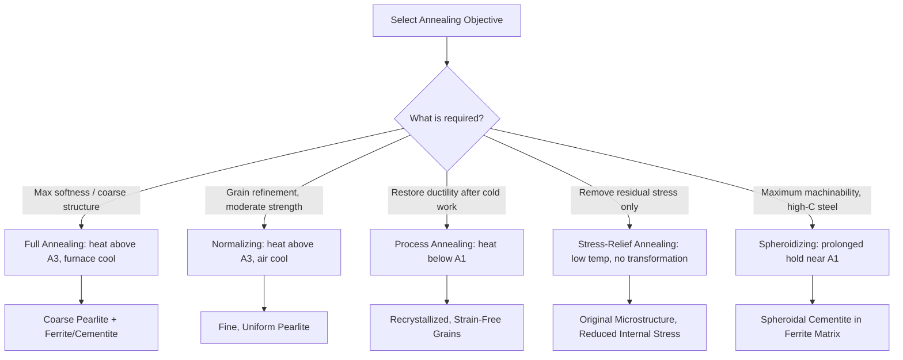

## Annealing Processes

### Overview and Purpose

Annealing refers to a family of heat-treatment processes involving heating a material to a specific temperature, holding it there for a sufficient time, and then cooling it (typically slowly) to achieve one or more of the following objectives: relieve internal stresses, soften the material, increase ductility, refine grain structure, homogenize composition, or produce a specific microstructure conducive to subsequent processing (machining, forming, further heat treatment). Annealing is fundamentally a diffusion-controlled, near-equilibrium process, distinguishing it from rapid-quench treatments like hardening.

The general annealing process consists of three stages:

1. **Heating** to the annealing temperature at a controlled rate (to avoid thermal stress/cracking)
2. **Holding (soaking)** at temperature for sufficient time to allow the intended microstructural change to occur throughout the section
3. **Cooling**, usually slowly (often furnace cooling), to avoid reintroducing stresses or undesired transformation products

### Classification of Annealing Processes

**Full Annealing**

Steel is heated to approximately 30–50°C above the A₃ line (for hypoeutectoid steels) or above A₁ (for hypereutectoid steels), held to fully austenitize, then furnace-cooled slowly. This produces coarse pearlite with proeutectoid ferrite or cementite, yielding a soft, ductile condition ideal for subsequent machining or cold working. [Inference: exact superheat values (30–50°C) vary somewhat by source and steel grade, but the general principle of a modest excursion above the critical line is standard practice.]

**Process Annealing (Subcritical Annealing)**

Heating to a temperature below A₁ (typically 550–650°C for steels), which does not involve austenitizing. Used primarily to restore ductility to cold-worked material by promoting recovery and recrystallization without a full phase transformation. Common between stages of cold forming (e.g., wire drawing, sheet stamping) to prevent cracking from work hardening.

**Stress-Relief Annealing**

Heating to a relatively low temperature (typically 450–650°C for steels, well below A₁) to relieve internal (residual) stresses from prior operations such as welding, machining, casting, or cold working, without significantly altering mechanical properties or microstructure. No phase transformation occurs; the mechanism is primarily thermally activated dislocation rearrangement and stress relaxation.

**Spheroidizing**

A prolonged treatment (heating near or slightly below A₁, sometimes with cycling just above and below it) intended to convert lamellar or platelike cementite (as in pearlite) into spheroidal (globular) particles dispersed in a ferrite matrix. This produces the softest, most machinable condition for high-carbon steels, since spheroidal carbides minimize the interfacial constraint on ferrite deformation compared to lamellar cementite. Commonly applied to hypereutectoid steels before machining or extensive cold working.

**Normalizing**

Technically a variant of annealing performed by austenitizing (heating above A₃ or Acm, typically 55–85°C above these lines for a more thorough austenitization than full annealing) followed by **air cooling** rather than furnace cooling. The faster cooling rate relative to full annealing produces finer pearlite, giving normalized steel higher strength and hardness than fully annealed steel, along with a more uniform, refined grain structure. Normalizing is often used to homogenize microstructure after casting or forging and to prepare steel for subsequent hardening operations.

**Recrystallization Annealing**

Applied to cold-worked metals to nucleate and grow new, strain-free grains, eliminating the dislocation substructure introduced by plastic deformation. Distinct from process annealing in terminology emphasis but mechanistically overlapping — the term is used generally across metals (not just steel) to describe the recovery-recrystallization-grain growth sequence.

### Microstructural Mechanisms

**Recovery**

The first stage in annealing cold-worked metal: reduction of point-defect concentration and rearrangement/annihilation of dislocations into lower-energy configurations (e.g., polygonization into subgrain boundaries) without migration of high-angle grain boundaries. Internal stresses are relieved and some ductility restored, but the original cold-worked grain shape and most strength increase from work hardening remain largely intact.

**Recrystallization**

New, strain-free equiaxed grains nucleate (preferentially at regions of highest dislocation density, such as grain boundaries and shear bands) and grow, consuming the strained microstructure. This restores ductility substantially and softens the material significantly, since dislocation density drops dramatically. The **recrystallization temperature** is conventionally defined as the temperature at which 50% recrystallization occurs within approximately one hour, and is typically 0.3–0.5 times the absolute melting temperature $T_m$ of the metal [Inference: this "0.3–0.5 $T_m$" rule is a widely used engineering approximation rather than a precise physical constant; actual recrystallization temperature depends on prior cold-work percentage, purity, and grain size].

**Grain Growth**

Following complete recrystallization, continued holding at temperature causes larger grains to grow at the expense of smaller ones, driven by reduction in total grain-boundary energy. This is generally undesirable beyond a certain point since excessive grain growth coarsens the microstructure and can degrade strength (per Hall-Petch relationship) and toughness.

### Recrystallization Behavior vs. Cold Work (SVG)

<svg xmlns="http://www.w3.org/2000/svg" viewBox="0 0 700 420" font-family="Arial, sans-serif">
<text x="350" y="25" font-size="16" font-weight="bold" text-anchor="middle">Recovery, Recrystallization, Grain Growth (svg_diagram)</text>
<line x1="80" y1="360" x2="650" y2="360" stroke="black" stroke-width="2" />
<line x1="80" y1="360" x2="80" y2="60" stroke="black" stroke-width="2" />
<text x="365" y="395" font-size="13" text-anchor="middle">Annealing Temperature (increasing)</text>
<text x="35" y="220" font-size="13" text-anchor="middle" transform="rotate(-90 35 220)">Property</text>

<path d="M 100 100 L 250 105 C 300 110, 330 300 400 320 C 450 330, 550 335, 630 335" stroke="`#b03a2e`" stroke-width="2.5" fill="none" />

<text x="500" y="315" font-size="11" fill="`#b03a2e`">Strength / Hardness</text>

<path d="M 100 320 L 250 315 C 300 310, 330 110 400 95 C 450 88, 550 85, 630 85" stroke="`#1a5276`" stroke-width="2.5" fill="none" />

<text x="480" y="75" font-size="11" fill="`#1a5276`">Ductility</text>

<path d="M 100 340 L 350 340 C 400 340, 420 330, 460 300 C 520 260, 580 220, 630 180" stroke="`#117a65`" stroke-width="2" stroke-dasharray="5,3" fill="none" />

<text x="560" y="200" font-size="11" fill="`#117a65`">Grain Size</text>

<line x1="250" y1="60" x2="250" y2="360" stroke="#888" stroke-dasharray="3,3" />
<line x1="400" y1="60" x2="400" y2="360" stroke="#888" stroke-dasharray="3,3" />

<text x="165" y="55" font-size="12" text-anchor="middle" font-style="italic">Recovery</text>

<text x="325" y="55" font-size="12" text-anchor="middle" font-style="italic">Recrystallization</text>

<text x="500" y="55" font-size="12" text-anchor="middle" font-style="italic">Grain Growth</text>

</svg>

### Comparison of Annealing Types

| Process | Typical Temperature Range (Steel) | Cooling Method | Primary Objective |
| --- | --- | --- | --- |
| Full annealing | Above A₃ (hypoeutectoid) | Furnace cool (slow) | Maximum softness, coarse pearlite |
| Normalizing | Above A₃ / Acm (higher than full anneal) | Air cool | Refine grain, moderate strength, homogenize |
| Process annealing | Below A₁ (~550–650°C) | Air cool | Restore ductility after cold work |
| Stress-relief annealing | Below A₁ (~450–650°C) | Slow cool | Remove residual stress, no microstructure change |
| Spheroidizing | Near/below A₁, prolonged | Slow cool | Maximum machinability, globular carbides |

### Annealing Process Flow (Mermaid)

### Worked Example: Selecting an Annealing Treatment

A cold-drawn low-carbon steel wire has become too brittle for further drawing operations due to work hardening. The engineer must decide between process annealing and full annealing.

- **Process annealing** (heating to ~600–650°C, below A₁) is the appropriate choice: it recrystallizes the cold-worked ferrite grains, restoring ductility, without incurring the cost and cycle time of austenitizing and furnace-cooling through the full transformation range. Full annealing would achieve similar softness but is unnecessarily energy- and time-intensive for a material that does not require phase transformation to correct the issue (work hardening resides in the ferrite grain structure, not in the phase constitution).

**Contrast case**: If instead a hypereutectoid tool steel casting exhibits a coarse, brittle as-cast dendritic structure with networked proeutectoid cementite, **normalizing** (rather than process annealing) would be selected first to homogenize and refine grain structure via full austenitization and air cooling, often followed by **spheroidizing** to convert the cementite network into machinable globular carbides before final machining and hardening.

### Effects on Mechanical Properties

- **Full annealing / spheroidizing**: lowest strength and hardness, highest ductility, best machinability for high-carbon/alloy steels
- **Normalizing**: intermediate strength/hardness between full annealing and hardened conditions; often specified as a final treatment for structural steel components requiring uniform properties without full hardening
- **Stress-relief annealing**: mechanical properties largely unchanged; primary benefit is dimensional stability and reduced risk of distortion/cracking in service or subsequent machining
- **Process annealing / recrystallization annealing**: restores ductility and reduces hardness from the cold-worked state, without necessarily returning to the fully annealed (never-cold-worked) baseline properties, depending on cycle parameters

[Inference: quantitative property values (e.g., specific hardness or elongation figures) are strongly dependent on exact alloy composition, prior processing history, and specific time-temperature parameters used; general trends described above are well established, but numeric outcomes require reference to material-specific data sheets or standards such as ASTM/SAE specifications.]

### Practical Considerations

- **Furnace atmosphere control**: annealing at elevated temperature risks oxidation/decarburization of steel surfaces; controlled or inert atmospheres (or vacuum furnaces) are often used for critical components
- **Cooling rate control**: even "slow" furnace cooling rates must be specified carefully, since cooling too quickly during full annealing can inadvertently produce finer pearlite (partially normalizing effect) rather than the intended coarse, soft structure
- **Section size effects**: thick sections cool more slowly at the core than at the surface even during "rapid" cooling steps, potentially producing property gradients through the cross-section
- **Non-ferrous applications**: annealing principles (recovery, recrystallization, grain growth) apply broadly to cold-worked non-ferrous metals (copper, aluminum, brass) as well, though these systems lack the allotropic phase transformations relevant to steel-specific full annealing/normalizing

**Related Topics**

- Cold working and strain hardening mechanisms
- Recrystallization temperature and its dependence on prior cold work
- Hardening and quenching (contrast with annealing objectives)
- Tempering of martensite following hardening
- Grain size control and Hall-Petch strengthening
- Decarburization and furnace atmosphere control
- Case hardening processes (carburizing, nitriding)
- Residual stress measurement and its engineering significance