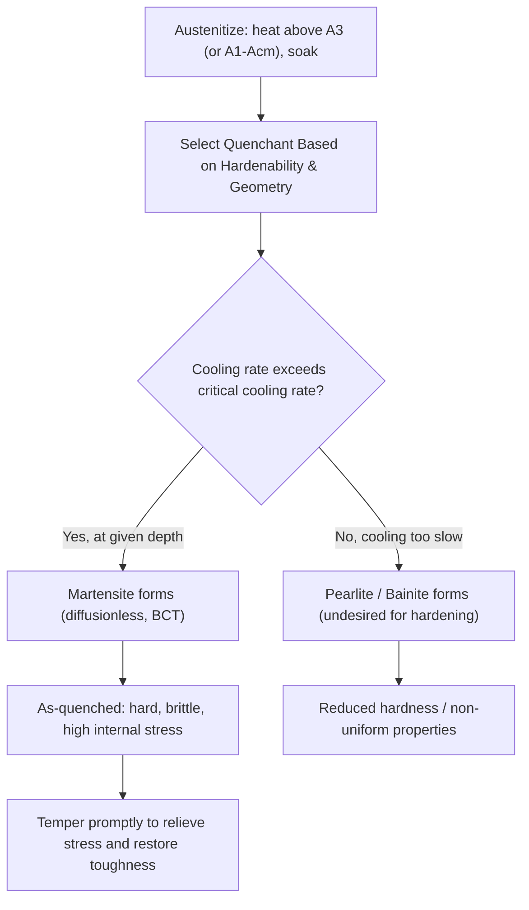

## Quenching and Hardening

### Overview and Purpose

Quenching and hardening is a heat-treatment process in which steel (or other hardenable alloys) is heated into the austenite phase field and then cooled rapidly enough to suppress diffusional transformation to pearlite or bainite, instead forcing the diffusionless (shear) transformation to **martensite**. The resulting martensitic microstructure is significantly harder and stronger than the annealed or normalized condition, at the cost of ductility and toughness, and is almost always followed by tempering to restore a usable balance of properties.

The process consists of three essential steps:

1. **Austenitizing**: heating above A₃ (hypoeutectoid) or A₁-Acm (hypereutectoid, sufficient to dissolve carbon into austenite without full carbide dissolution) and holding to homogenize
2. **Quenching**: rapid cooling at a rate exceeding the steel's critical cooling rate, bypassing the pearlite and bainite noses on the CCT diagram
3. **Tempering** (nearly always performed subsequently): reheating the as-quenched martensite to a lower temperature to relieve internal stresses and improve toughness, discussed as a related but distinct process

### Austenitizing Considerations

- **Temperature selection**: typically 30–50°C above A₃ for hypoeutectoid steels; for hypereutectoid steels, heating is usually kept between A₁ and Acm to avoid fully dissolving all cementite (retaining some undissolved carbide improves wear resistance and avoids excessive retained austenite from over-enrichment of austenite with carbon)
- **Soak time**: must be sufficient for thermal and compositional homogenization throughout the section but not excessive, since prolonged holding promotes grain growth, which degrades toughness and increases quench-cracking susceptibility
- **Atmosphere control**: oxidizing atmospheres cause scaling and decarburization of the surface, which can locally reduce hardenability and surface hardness; controlled/inert atmospheres or vacuum furnaces are used for critical applications

### The Martensitic Transformation

Martensite forms via a **diffusionless, shear-based** mechanism rather than nucleation-and-growth diffusion. Because carbon atoms cannot escape the rapidly cooling FCC austenite lattice as it attempts to transform to BCC, they become trapped in interstitial positions, distorting the lattice from cubic (BCC) to **body-centered tetragonal (BCT)**. This lattice distortion is the primary source of martensite's high hardness, since it severely restricts dislocation motion.

**Key characteristics of the transformation**:

- **Athermal**: the fraction of martensite formed depends only on the temperature reached below Ms, not on time held at that temperature (in contrast to pearlite/bainite formation)
- **Ms (martensite start) and Mf (martensite finish)**: temperatures bounding the transformation range; both decrease with increasing carbon content
- **Retained austenite**: some austenite typically persists untransformed below Mf, especially in higher-carbon and highly alloyed steels, since Mf is a practical rather than absolute completion point

An approximate empirical relationship for Ms temperature (in °C) as a function of carbon content in plain carbon steel is:

$$M_s \approx 539 - 423(\%C) - 30.4(\%Mn) - 17.7(\%Ni) - 12.1(\%Cr) - 7.5(\%Mo)$$

[Unverified: this specific empirical formula (often attributed to Andrews) is one of several similar correlations in the literature; coefficients vary somewhat between published versions, and actual Ms for a given heat should be verified experimentally or against alloy-specific data rather than relied upon predictively for critical applications.]

### Quenching Media and Severity

The choice of quenchant balances the need for a cooling rate fast enough to avoid the CCT nose against the risk of distortion and cracking from excessive thermal gradients and associated stresses.

| Quenchant | Relative Severity | Typical Application |
| --- | --- | --- |
| Brine (salt water) | Very high | Maximum hardness on simple carbon steel shapes; higher cracking risk |
| Water | High | Plain carbon steels, simple geometries |
| Oil | Moderate | Alloy steels with good hardenability; reduced distortion/cracking risk |
| Polymer (aqueous polymer solutions) | Adjustable (between water and oil) | Tunable severity, replacing oil in many modern operations for safety/environmental reasons |
| Air (forced or still) | Low | Air-hardening tool/alloy steels with high hardenability |
| Molten salt (for martempering) | Controlled/moderate | Isothermal holds near Ms per TTT diagram usage |

Quench severity is often characterized by the **Grossmann H-value**, a dimensionless factor quantifying the heat-transfer coefficient of a given quenchant/agitation combination relative to an idealized reference; higher H-values correspond to more severe (faster) quenching.

### Hardenability

Hardenability describes **how deeply** a steel can be hardened (i.e., how far below the surface martensite will form), as distinct from the maximum hardness achievable (which is governed primarily by carbon content alone). A steel can have high hardenability without necessarily reaching very high peak hardness, and vice versa.

**Factors affecting hardenability**:

- **Alloying elements** (Cr, Mo, Ni, Mn, and others): shift the CCT/TTT curves to longer times, lowering the critical cooling rate needed and allowing slower-cooling regions (e.g., the core of a thick section) to still bypass the pearlite/bainite noses
- **Austenite grain size**: coarser grain size reduces grain-boundary nucleation sites for pearlite, improving hardenability (though at a cost to toughness)
- **Homogeneity of austenite**: undissolved carbides or segregated composition create local variation in hardenability

**The Jominy End-Quench Test**

The standard method for quantifying hardenability. A cylindrical specimen (typically 25 mm diameter, 100 mm length per ASTM A255) is austenitized, then mounted vertically and water-quenched from one end only, producing a continuous range of cooling rates along its length (fastest at the quenched end, slowest at the far end). Hardness (typically Rockwell C) is measured at fixed intervals along the length and plotted against distance from the quenched end, producing a **hardenability curve**. Steels with higher hardenability show hardness remaining high over a longer distance from the quenched end; steels with low hardenability show hardness dropping off sharply near the quenched end.

### Jominy Hardenability Curve Concept (SVG)

<svg xmlns="http://www.w3.org/2000/svg" viewBox="0 0 700 400" font-family="Arial, sans-serif">
<text x="350" y="25" font-size="16" font-weight="bold" text-anchor="middle">Jominy End-Quench Hardenability Curves (svg_diagram)</text>
<line x1="80" y1="340" x2="650" y2="340" stroke="black" stroke-width="2" />
<line x1="80" y1="340" x2="80" y2="60" stroke="black" stroke-width="2" />
<text x="365" y="375" font-size="13" text-anchor="middle">Distance from Quenched End (mm)</text>
<text x="35" y="200" font-size="13" text-anchor="middle" transform="rotate(-90 35 200)">Hardness (HRC)</text>

<path d="M 100 90 C 200 95, 350 100, 500 110 C 570 115, 620 120, 630 122" stroke="`#1a5276`" stroke-width="2.5" fill="none" />

<text x="540" y="105" font-size="11" fill="`#1a5276`">Alloy steel (high hardenability)</text>

<path d="M 100 90 C 130 150, 160 260, 200 300 C 260 320, 400 330, 630 335" stroke="`#b03a2e`" stroke-width="2.5" fill="none" />

<text x="260" y="255" font-size="11" fill="`#b03a2e`">Plain carbon steel (low hardenability)</text>

<text x="100" y="360" font-size="11" text-anchor="middle">0</text>

<text x="630" y="360" font-size="11" text-anchor="middle">50</text>

</svg>

### Quench Cracking and Distortion

Rapid, non-uniform cooling generates significant internal stresses from two sources:

- **Thermal stress**: differential contraction between surface (cools first) and core (cools later)
- **Transformation stress**: martensite formation involves a volume expansion relative to austenite, and this transformation occurs at different times at different depths within the part, generating internal stress as the surface transforms before the core

If combined stresses exceed the material's strength (which is elevated but brittle in the as-quenched, untempered state), **quench cracking** can occur. Design and process mitigations include:

- Avoiding sharp corners, sudden section changes, and keyways near high-stress regions
- Selecting the least severe quenchant that still achieves adequate hardenability for the section size
- **Martempering (marquenching)**: quenching to just above Ms in a hot bath, holding briefly to equalize temperature across the section, then air-cooling slowly through the Ms-Mf range — this reduces thermal gradient-driven stress while still ultimately forming martensite
- Prompt tempering immediately after quenching (steel is rarely left in the as-quenched state for any significant time before tempering, given the high risk of delayed cracking from internal stress)

### Quenching and Hardening Process Flow (Mermaid)

### Worked Example: Section Size and Hardenability Interaction

A 50 mm diameter shaft made from a plain carbon steel (e.g., 1045) is water-quenched. The surface cools quickly enough to bypass the CCT nose and forms martensite, but the core cools much more slowly (insulated by the surrounding material) and may cross into the pearlite/bainite region before reaching Ms, especially given the steel's low hardenability. The result is a **hardened case with a softer core** — sometimes acceptable (e.g., for wear-resistant surfaces with a tough core) but potentially problematic if uniform through-hardness is required.

To achieve through-hardening in the same geometry, the engineer would instead select an alloy steel (e.g., 4140) with higher hardenability (via Cr-Mo additions), which shifts the CCT curve to longer times, allowing even the slower-cooling core to bypass the nose and form martensite despite the less severe cooling rate experienced there.

### Distinguishing Hardness from Hardenability

A common point of confusion: **maximum attainable hardness** is governed almost entirely by carbon content (since carbon controls the degree of tetragonal distortion in martensite), while **hardenability** (depth of hardening) is governed primarily by alloying content and grain size. Two steels with identical carbon content but different alloy content can reach the same peak surface hardness but harden to very different depths.

**Related Topics**

- Tempering of martensite and secondary hardening
- TTT and CCT diagrams (basis for critical cooling rate determination)
- Jominy end-quench testing and Grossmann's hardenability factor
- Martempering and austempering as stress-mitigation strategies
- Case hardening: carburizing, nitriding, induction and flame hardening
- Residual stress and quench cracking mechanisms
- Alloy steel design for hardenability (AISI/SAE alloy series)
- Retained austenite and its effect on dimensional stability