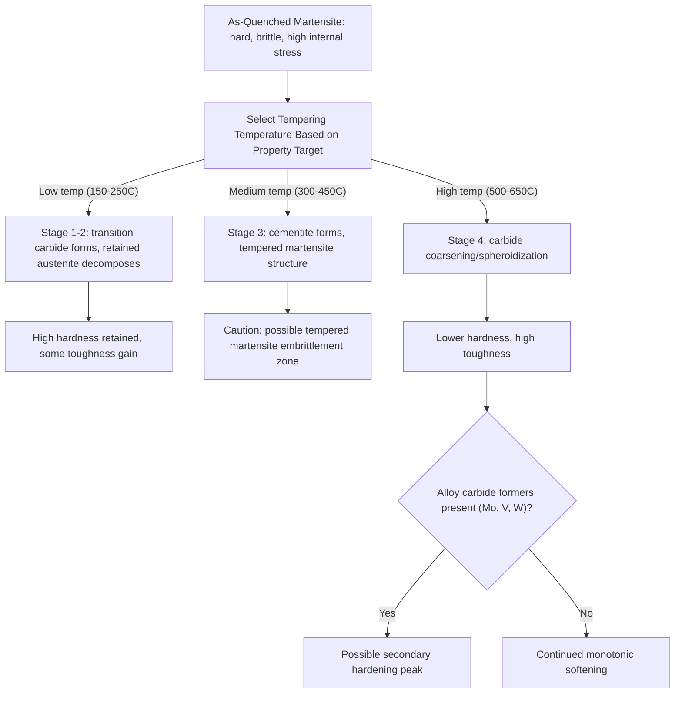

## Tempering of Steel

### Overview and Purpose

Tempering is a heat treatment applied to as-quenched martensitic steel, involving reheating to a temperature below A₁ and holding for a specified time, followed by cooling (usually in air). Its purpose is to relieve the internal stresses generated during quenching and to reduce the extreme hardness and brittleness of untempered martensite, trading some hardness/strength for substantially improved ductility and toughness. Tempering is almost always performed immediately after quenching, since untempered martensite is prone to spontaneous cracking from residual internal stress if left untreated.

The general relationship is straightforward: as tempering temperature increases (within the normal tempering range), hardness and strength decrease progressively while ductility and toughness increase, allowing the engineer to select a tempering temperature that positions the final properties at the desired point along this trade-off curve for the intended application.

### Microstructural Changes During Tempering

Tempering proceeds through several overlapping stages as temperature increases, driven by the thermodynamic instability of the supersaturated, tetragonally distorted martensite and any retained austenite:

**Stage 1 (~100–250°C): Formation of Transition (Epsilon) Carbide**

Carbon atoms, which are supersaturated in the martensite lattice, begin to diffuse and precipitate as fine transition carbides (often termed epsilon-carbide, a hexagonal iron carbide distinct from cementite). This partially relieves lattice strain, reducing the tetragonality of the martensite (moving it toward BCC ferrite) and causing a slight decrease in hardness alongside a significant reduction in brittleness.

**Stage 2 (~200–300°C): Decomposition of Retained Austenite**

Any retained austenite present from the original quench decomposes, typically into bainite-like products (ferrite plus cementite). This stage can partially overlap with Stage 1 and Stage 3 depending on the specific steel composition.

**Stage 3 (~250–350°C): Formation of Cementite**

The transition carbides formed in Stage 1 dissolve and are replaced by the more thermodynamically stable cementite (Fe₃C), which nucleates and grows as fine particles. By the end of this stage, the microstructure consists of a ferrite matrix (fully relieved of tetragonal distortion) with dispersed fine cementite particles, a structure often termed **tempered martensite**.

**Stage 4 (above ~350°C, extending to ~700°C): Carbide Coarsening (Spheroidization)**

With continued increase in tempering temperature, cementite particles coarsen (via Ostwald ripening, where larger particles grow at the expense of smaller ones to reduce total interfacial energy) and spheroidize. This progressively softens the steel further, approaching (but not fully reaching) the spheroidized-annealed condition at the highest tempering temperatures.

[Inference: the exact temperature ranges bounding each stage vary by source and by specific steel composition (particularly carbon content and alloying additions); the four-stage framework itself is standard and widely taught, but boundaries should be treated as approximate and overlapping rather than sharply delineated.]

### Property Changes with Tempering Temperature

| Tempering Temp Range | Typical Effect on Properties | Common Application |
| --- | --- | --- |
| Low (150–250°C) | Retains most hardness; modest ductility gain | Cutting tools, files, applications needing maximum wear resistance |
| Medium (300–450°C) | Balanced strength/toughness; some steels show reduced impact toughness in this range | Springs, some structural components |
| High (500–650°C) | Substantial hardness reduction; high toughness and ductility | Structural components, shafts, gears requiring toughness |

**Tempering curve behavior**: hardness generally decreases monotonically with increasing tempering temperature for plain carbon steels, though the rate of decrease varies across the stages described above. [Inference: the relationship is not perfectly linear and can show a plateau or even a slight secondary hardness increase in certain alloy steels, addressed separately under secondary hardening below.]

### Hardness vs. Tempering Temperature (SVG)

<svg xmlns="http://www.w3.org/2000/svg" viewBox="0 0 700 400" font-family="Arial, sans-serif">
<text x="350" y="25" font-size="16" font-weight="bold" text-anchor="middle">Hardness and Toughness vs Tempering Temperature (svg_diagram)</text>
<line x1="80" y1="340" x2="650" y2="340" stroke="black" stroke-width="2" />
<line x1="80" y1="340" x2="80" y2="60" stroke="black" stroke-width="2" />
<text x="365" y="375" font-size="13" text-anchor="middle">Tempering Temperature (°C)</text>
<text x="35" y="200" font-size="13" text-anchor="middle" transform="rotate(-90 35 200)">Property Magnitude</text>

<path d="M 100 80 C 200 100, 300 160, 400 220 C 480 265, 560 300, 630 320" stroke="`#b03a2e`" stroke-width="2.5" fill="none" />

<text x="480" y="245" font-size="11" fill="`#b03a2e`">Hardness</text>

<path d="M 100 320 C 200 300, 300 240, 400 180 C 480 135, 560 100, 630 85" stroke="`#1a5276`" stroke-width="2.5" fill="none" />

<text x="450" y="160" font-size="11" fill="`#1a5276`">Toughness / Ductility</text>

<text x="100" y="360" font-size="11" text-anchor="middle">150</text>

<text x="630" y="360" font-size="11" text-anchor="middle">650</text>

</svg>

### Temper Embrittlement Phenomena

**Tempered Martensite Embrittlement (TME) / 350°C (500°F) Embrittlement**

A localized loss of impact toughness observed in many steels when tempered in the range of approximately 260–400°C. [Inference: attributed by much of the literature to cementite precipitation along prior austenite grain boundaries and/or transformation of retained austenite films at grain boundaries into brittle products, though the precise mechanism is still discussed with some nuance across different alloy systems]. Practical guidance is generally to avoid tempering within this temperature range for applications where impact toughness is critical, selecting either a lower or higher tempering temperature instead.

**Temper (Reversible) Embrittlement**

A distinct, separate phenomenon occurring after tempering in the range of approximately 375–575°C, particularly in steels containing certain impurity elements (P, Sb, Sn, As) combined with alloying elements like Mn, Ni, or Cr. It is caused by segregation of these impurities to prior austenite grain boundaries during slow cooling through this temperature range after tempering. Unlike TME, this form is **reversible**: reheating above the embrittlement range and rapidly cooling through it can restore toughness, and the embrittlement can be reintroduced by slow cooling through the same range again — hence "reversible" or "two-step" embrittlement. This is a significant concern for large forgings and castings that inherently cool slowly through this range.

### Secondary Hardening

In certain alloy steels containing strong carbide-forming elements (Mo, V, W, Cr, Ti), tempering at higher temperatures (typically 500–600°C) can produce a **secondary hardness peak** rather than the monotonic softening seen in plain carbon steels. This occurs because these elements form fine, highly stable alloy carbides (distinct from cementite) that precipitate at these elevated tempering temperatures, providing precipitation strengthening that can temporarily offset or even exceed the softening from cementite coarsening. This effect is exploited extensively in tool steels and high-speed steels, which must retain hardness at the elevated temperatures generated during cutting operations (a property termed "red hardness" or hot hardness).

### Tempering Process Flow (Mermaid)

### Worked Example: Selecting a Tempering Temperature

A quenched 1080 steel component requires high wear resistance for a cutting edge application, with toughness being a secondary but non-negligible concern. Given the tempered martensite embrittlement range (~260–400°C), the engineer should avoid tempering within that window. Two reasonable options:

- **Temper at ~200°C**: retains high hardness (~58–60 HRC range for this carbon level, [Inference: exact hardness depends on specific quench conditions and prior austenitizing parameters]) with modest toughness improvement — suitable if wear resistance dominates over impact resistance
- **Temper at ~450°C**: sacrifices considerable hardness but gains substantially more toughness — more suitable if the component experiences impact loading in service

The choice depends on the governing failure mode expected in service (abrasive wear vs. impact fracture), illustrating that tempering temperature selection is a design decision balancing competing property requirements rather than a fixed default.

### Tempering Time Considerations

Tempering is a thermally activated, diffusion-controlled process, so **time and temperature can partially compensate for one another** within limits — lower temperature for longer time can approximate the effect of higher temperature for shorter time, a relationship often approximated using tempering parameter formulations such as the **Hollomon-Jaffe parameter**:

$$T_p = T(C + \log t)$$

where $T$ is absolute temperature, $t$ is time, and $C$ is a material-specific constant (often approximated as 15–20 for many steels). [Inference: the specific value of $C$ and the general applicability of this time-temperature equivalence are approximations that hold reasonably well within a bounded range of conditions but are not universally precise across all alloy systems and tempering regimes.] In practice, standard industrial tempering times (commonly 1–2 hours per inch of section thickness) are used, with temperature as the primary control variable and time held largely constant across a given specification.

**Related Topics**

- Quenching and hardening (precursor process to tempering)
- Martensite crystallography and the origin of tetragonal distortion
- Tempered martensite embrittlement and temper (reversible) embrittlement
- Secondary hardening and alloy carbide precipitation in tool steels
- Retained austenite and its decomposition during tempering
- Hollomon-Jaffe tempering parameter and time-temperature equivalence
- Case hardening processes and their post-treatment tempering requirements
- Residual stress relief mechanisms across annealing and tempering