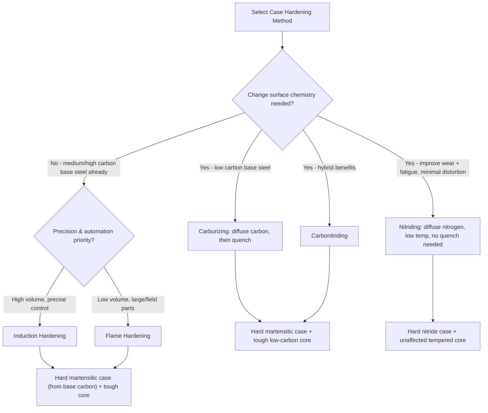

## Case Hardening Techniques

### Overview and Purpose

Case hardening refers to a family of processes that produce a hard, wear-resistant surface layer (the "case") on a component while retaining a tough, ductile core. This combination is desirable for parts subject to surface contact loading, wear, or fatigue (gears, cams, shafts, bearing races) where the surface must resist abrasion and contact stress while the core must resist impact and bending fatigue without brittle fracture. Case hardening methods are broadly divided into two categories:

1. **Thermochemical diffusion methods**: alter surface chemistry (adding carbon, nitrogen, or both) to increase hardenability or directly form hard compounds at the surface, followed in most cases by a hardening heat treatment
2. **Selective hardening methods**: alter only the surface microstructure via rapid, localized heating and quenching, without changing surface chemistry

### Carburizing

**Mechanism**: Low-carbon steel (typically 0.10–0.25 wt% C) is exposed to a carbon-rich environment at elevated temperature (typically 850–950°C, within the austenite range) to diffuse carbon into the surface, raising local carbon content (often to 0.8–1.0 wt% C at the surface) while the core remains at its original low carbon level. After carburizing, the part is quenched (directly or after reheating) to transform the now carbon-enriched surface into martensite, while the low-carbon core, having insufficient hardenability at that same cooling rate, transforms into a tougher ferrite-pearlite or low-carbon martensite/bainite structure.

**Common Carburizing Methods**:

- **Gas carburizing**: component is heated in a furnace atmosphere containing hydrocarbon gases (e.g., methane, propane) or carrier gas enriched with natural gas, which decompose at the surface to release atomic carbon for diffusion. Widely used industrially due to good process control and repeatability.
- **Pack carburizing**: component is packed in a carbon-rich solid medium (charcoal or coke, often with an energizer such as barium carbonate) inside a sealed container and heated; largely a legacy/low-volume method today given the process control advantages of gas and vacuum methods.
- **Liquid carburizing (salt bath)**: component is immersed in a molten cyanide-based salt bath; simultaneously introduces some nitrogen along with carbon, though environmental and safety concerns around cyanide salts have reduced its industrial use.
- **Vacuum carburizing**: performed in a low-pressure furnace with hydrocarbon gas introduced directly; offers excellent atmosphere control, reduced intergranular oxidation, and is well suited to combination with gas quenching for reduced distortion.

**Case Depth Control**: Case depth increases approximately with the square root of time, consistent with diffusion-controlled kinetics (Fick's second law):

$$x \approx K\sqrt{t}$$

where $x$ is case depth, $t$ is time, and $K$ is a temperature-dependent diffusion constant. This means doubling case depth requires roughly quadrupling the carburizing time at a given temperature — a significant practical consideration for process economics on deep-case applications.

### Nitriding

**Mechanism**: Nitrogen is diffused into the surface of steel at relatively low temperature (typically 500–550°C), well below the austenitizing range, forming hard iron and alloy nitrides directly within the surface layer without requiring a subsequent quench-and-temper cycle for the case itself. Because the process temperature is below A₁, nitriding produces minimal distortion compared to carburizing, and components are typically hardened and tempered to their final core properties *before* nitriding, since the nitriding temperature is below the tempering temperature already used and will not affect core properties.

**Common Nitriding Methods**:

- **Gas nitriding**: component is exposed to ammonia gas, which dissociates at the surface to release nascent nitrogen for diffusion
- **Salt bath (liquid) nitriding**: uses molten cyanide/cyanate salts; largely superseded in many applications by gas and plasma methods for environmental reasons
- **Plasma (ion) nitriding**: uses an electrical glow discharge in a low-pressure nitrogen-containing atmosphere to ionize nitrogen species, offering excellent process control, faster rates in some cases, and reduced environmental concerns compared to salt bath methods

**Alloy Requirements**: Nitriding is most effective on steels containing strong nitride-forming elements (Al, Cr, Mo, V), since these form very hard, stable alloy nitrides; plain carbon steels can be nitrided but achieve lower case hardness since iron nitrides alone are less hard than alloy nitrides.

**The White Layer (Compound Zone)**: The outermost nitrided layer often consists of a thin, brittle "white layer" (visible unetched under a microscope) composed of iron nitride compounds; this layer is sometimes removed by light grinding/lapping after nitriding if its brittleness is detrimental to the application (e.g., components subject to impact or bending fatigue at the surface).

### Carbonitriding

A hybrid process diffusing both carbon and nitrogen into the surface simultaneously, typically performed in a gas furnace at a temperature intermediate between carburizing and nitriding (typically 750–900°C), using a carburizing gas atmosphere enriched with ammonia. The added nitrogen improves hardenability of the case (allowing effective hardening even on lower-hardenability steels) and increases resistance to softening during tempering, but produces a somewhat shallower case than pure carburizing within a comparable process time.

### Comparison of Diffusion-Based Case Hardening Methods

| Process | Diffusing Species | Typical Temp. Range | Requires Quench After? | Typical Case Depth | Distortion Risk |
| --- | --- | --- | --- | --- | --- |
| Gas Carburizing | Carbon | 850–950°C | Yes | 0.5–1.5 mm (deep case possible) | Moderate-high |
| Nitriding | Nitrogen | 500–550°C | No | 0.1–0.5 mm (shallower) | Low |
| Carbonitriding | Carbon + Nitrogen | 750–900°C | Yes | Shallower than carburizing | Moderate |

[Inference: specific case depth ranges vary considerably with process time, steel grade, and application requirements; the values above represent typical/illustrative ranges rather than fixed limits, since deep-case carburizing for large gears, for example, can substantially exceed these figures.]

### Selective (Localized) Hardening Methods

These methods harden only a designated surface region using local austenitization followed by rapid self-quenching (via conduction of heat into the still-cool bulk of the part), without altering surface chemistry — they rely entirely on the base material's existing carbon content and hardenability.

**Induction Hardening**

An alternating current passed through a coil surrounding (or adjacent to) the workpiece induces eddy currents that rapidly heat the surface layer via electrical resistance, to a depth controlled by the frequency of the AC current (higher frequency → shallower heating depth, per the electromagnetic "skin effect"). Immediately following heating, the part is quenched (often via integrated water/polymer spray within the same fixture) to transform the heated surface layer to martensite. Widely used for shafts, gears, and crankshaft journals due to high process speed and excellent repeatability/automation potential.

**Flame Hardening**

An oxyacetylene or oxy-fuel torch is used to rapidly heat the surface of the component to the austenitizing range, immediately followed by a water or polymer quench spray. Less precise than induction hardening in terms of case depth control and repeatability, but requires less specialized equipment and is well suited to large components or low-volume/field applications.

**Requirements for Selective Hardening**: The base steel must contain sufficient carbon (typically medium-carbon steels, 0.35–0.6 wt% C) to achieve adequate hardness upon quenching, since these methods do not add carbon to the surface.

### Case Hardening Method Selection (Mermaid)

### Case Hardening Cross-Section Concept (SVG)

<svg xmlns="http://www.w3.org/2000/svg" viewBox="0 0 650 350" font-family="Arial, sans-serif">
<text x="325" y="25" font-size="16" font-weight="bold" text-anchor="middle">Case-Core Structure After Case Hardening (svg_diagram)</text>

<circle cx="200" cy="200" r="140" fill="#d6dbdf" stroke="black" stroke-width="2" />
<circle cx="200" cy="200" r="140" fill="none" stroke="#b03a2e" stroke-width="18" />
<circle cx="200" cy="200" r="90" fill="#aed6f1" stroke="#1a5276" stroke-width="1" />

<text x="200" y="90" font-size="12" text-anchor="middle" fill="`#b03a2e`" font-weight="bold">Case (hard martensite)</text>

<text x="200" y="205" font-size="13" text-anchor="middle" fill="`#1a5276`" font-weight="bold">Core (tough, ductile)</text>

<line x1="380" y1="320" x2="620" y2="320" stroke="black" stroke-width="2" />
<line x1="380" y1="320" x2="380" y2="60" stroke="black" stroke-width="2" />
<text x="500" y="340" font-size="12" text-anchor="middle">Depth from surface</text>
<text x="355" y="200" font-size="12" text-anchor="middle" transform="rotate(-90 355 200)">Hardness</text>

<path d="M 390 90 C 430 95, 470 110, 500 170 C 530 230, 560 270, 610 285" stroke="`#7d3c98`" stroke-width="2.5" fill="none" />

<text x="420" y="80" font-size="11">Surface</text>

<text x="560" y="300" font-size="11">Core</text>

</svg>

### Worked Example: Selecting a Case Hardening Process

A helical gear made from 8620 steel (a low-carbon alloy steel, ~0.20 wt% C) requires a hard, wear-resistant tooth surface with a deep enough case to withstand contact fatigue (pitting) over the gear's service life, while retaining a tough core to resist tooth-root bending fatigue. **Carburizing** is the appropriate choice: the low base carbon content means the steel has insufficient hardenability to through-harden usefully, and carburizing directly addresses this by enriching only the surface with carbon before quenching, achieving the case-core property combination required.

By contrast, a precision shaft made from 1045 steel (medium carbon, already hardenable as supplied) requiring a hardened wear surface only in specific bearing journal locations, with tight dimensional tolerances and minimal distortion elsewhere on the part, would be a strong candidate for **induction hardening**, since it can be applied selectively to just the journal regions without heat-treating the entire part.

### Distortion and Residual Stress Considerations

Case hardening processes generally introduce **beneficial compressive residual stress** at the surface (due to the volume expansion associated with martensite formation, or nitride formation, occurring at the surface while the core remains comparatively unchanged), which significantly improves fatigue resistance by counteracting the tensile stresses that drive fatigue crack initiation at the surface. This is a key reason case-hardened components often substantially outperform through-hardened components of similar surface hardness in fatigue-limited applications, in addition to their combination of surface hardness and core toughness.

Distortion risk varies significantly by method: carburizing (involving full furnace heating and subsequent quenching) carries the highest distortion risk among common methods, nitriding (low process temperature, no post-nitride quench) carries the lowest, and induction/flame hardening fall in between depending on the extent and rate of localized heating and quenching applied.

**Related Topics**

- Quenching and hardening fundamentals (martensite formation mechanism)
- Tempering (case-hardened parts are typically low-temperature tempered after quenching)
- Fick's laws of diffusion and case-depth prediction
- Residual stress and its role in fatigue performance
- Hardenability and alloy selection for carburizing grades (e.g., AISI 86xx, 87xx, 41xx series)
- Fatigue failure mechanisms: contact fatigue (pitting) vs. bending fatigue
- Surface hardness testing methods (Rockwell, microhardness case-depth profiling)
- Distortion control and fixturing in heat treatment