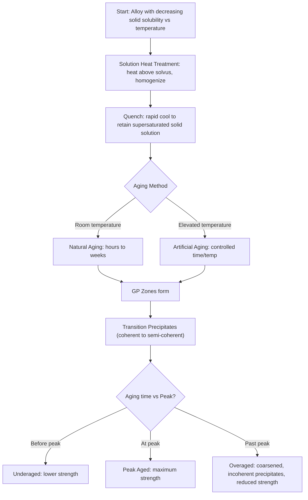

## Precipitation Hardening

### Overview and Purpose

Precipitation hardening (also called age hardening) is a heat-treatment strengthening mechanism applicable to alloy systems that exhibit **decreasing solid solubility with decreasing temperature**. It relies on producing a supersaturated solid solution and then allowing fine, coherent (or semi-coherent) second-phase precipitates to form throughout the matrix, which impede dislocation motion and thereby increase strength and hardness. Unlike hardening in steels (which relies on a diffusionless martensitic transformation), precipitation hardening is fundamentally a diffusion-controlled precipitation process, and unlike simple annealing, it deliberately produces a metastable, strengthened microstructure rather than an equilibrium one.

Precipitation hardening is the primary strengthening mechanism for many non-ferrous alloys — most notably aluminum alloys (e.g., 2xxx, 6xxx, 7xxx series), but also applicable to certain nickel-base superalloys, copper-beryllium alloys, magnesium alloys, and some precipitation-hardening (PH) stainless steels.

### Requirements for Precipitation Hardening

For an alloy system to be precipitation-hardenable, the phase diagram must exhibit:

1. **Appreciable maximum solid solubility** of the alloying (solute) element at elevated temperature
2. **Decreasing solid solubility** as temperature decreases, ideally approaching a low value near room temperature
3. **A solvus line** with sufficient slope, defining the boundary between the single-phase solid solution region and the two-phase region where a second phase can precipitate

The classic example is the aluminum-copper (Al-Cu) system, where the α (aluminum-rich solid solution) phase can dissolve up to approximately 5.65 wt% Cu at the eutectic temperature (~548°C) but only a small fraction of a percent at room temperature, providing the large solubility difference needed to drive the process.

### The Three-Step Process

**Step 1: Solution Heat Treatment (Solutionizing)**

The alloy is heated to a temperature within the single-phase (solid solution) region, above the solvus line, and held long enough to dissolve any second-phase particles present, producing a homogeneous single-phase solid solution.

**Step 2: Quenching**

The solutionized alloy is rapidly cooled (typically water quenched) to room temperature or a low temperature. Because cooling is too rapid for the equilibrium second phase to nucleate and grow via normal diffusion, the result is a **supersaturated solid solution (SSSS)** — a metastable single-phase structure containing far more solute than the equilibrium solubility limit at that temperature would normally allow.

**Step 3: Aging (Precipitation Heat Treatment)**

The supersaturated solid solution is held at an intermediate temperature (below the solvus, but elevated enough to provide adequate atomic mobility) for a controlled time, allowing the excess solute to precipitate out as fine second-phase particles distributed throughout the matrix. This can occur:

- **At room temperature**: termed **natural aging**, occurring over hours to days/weeks for some alloys (e.g., many 2xxx and 7xxx aluminum alloys show significant natural aging)
- **At an elevated temperature**: termed **artificial aging**, typically producing faster and more controllable strengthening, and is the standard commercial practice for achieving specified temper designations

### Aluminum-Copper Precipitation Sequence

The Al-Cu system is the classic textbook example illustrating the sequence of transitional (metastable) precipitates that form during aging before the equilibrium phase is finally reached:

$$\alpha_{SSSS} \rightarrow \text{GP zones} \rightarrow \theta'' \rightarrow \theta' \rightarrow \theta \, (\text{CuAl}_2, \text{ equilibrium})$$

- **GP (Guinier-Preston) zones**: extremely fine, fully coherent copper-rich clusters/disks (only a few atomic layers thick) that form first, at or near room temperature; provide some initial strengthening
- **θ″ (theta double-prime)**: a coherent, ordered transition precipitate, larger than GP zones, providing substantially greater strengthening due to increased coherency strain
- **θ′ (theta prime)**: a semi-coherent transition precipitate, larger still; typically corresponds to or is near the peak-strength condition for many Al-Cu alloys
- **θ (theta, equilibrium CuAl₂)**: the stable, fully incoherent equilibrium phase; its formation and subsequent coarsening corresponds to the overaged condition, where strength decreases

[Inference: the specific transition phase sequence, exact coherency states, and the aging time/temperature at which peak strength occurs are alloy-composition-specific and are generally established via experimental aging curves for each commercial alloy, rather than derivable purely from the binary Al-Cu phase diagram alone; real commercial alloys are also usually more complex multi-component systems (e.g., containing Mg, Si, Zn) with correspondingly more complex precipitation sequences.]

### Coherency and the Strengthening Mechanism

The strengthening effect of precipitates depends strongly on their **coherency** with the surrounding matrix lattice:

- **Coherent precipitates** (matching lattice registry with the matrix, as with GP zones and θ″): produce significant lattice strain fields around the particle, which strongly impede dislocation motion via strain-field interactions; dislocations are generally forced to cut through small coherent precipitates
- **Semi-coherent precipitates** (partial lattice matching, some misfit accommodated by dislocations at the interface, as with θ′): provide somewhat different strengthening character, often still requiring dislocations to cut through or bypass depending on size
- **Incoherent precipitates** (no lattice matching, as with the equilibrium θ phase once fully grown): dislocations bypass these via the **Orowan looping mechanism**, bowing around particles rather than cutting through them

As aging proceeds and precipitates coarsen from GP zones through to the equilibrium phase, the dominant dislocation-particle interaction mechanism shifts from cutting (favored by small, coherent particles) to Orowan bypass (favored by larger, incoherent particles), and this transition underlies the characteristic peak in the aging curve.

### The Aging Curve: Underaging, Peak Aging, Overaging

Plotting hardness or strength against aging time (at a fixed temperature) produces a characteristic curve:

- **Underaged**: aging time insufficient; precipitates are still small/coherent (GP zones, early transition phases); strength is below the maximum achievable
- **Peak aged**: the aging time/temperature combination that produces the optimum precipitate size and distribution (typically corresponding to the crossover between cutting- and bypass-dominated strengthening) for maximum strength
- **Overaged**: continued aging beyond the peak causes precipitates to coarsen (Ostwald ripening) and lose coherency, transitioning to the less effective Orowan bypass mechanism and increasing interparticle spacing, both of which reduce strength

**Higher aging temperatures** shift the peak to shorter times but often produce a lower peak strength (since faster diffusion accelerates coarsening past the optimal fine-precipitate condition), while **lower aging temperatures** shift the peak to longer times, sometimes producing higher peak strength (finer, more closely spaced precipitates) at the cost of significantly longer processing time. Selecting the aging schedule is therefore a practical trade-off between processing time and achievable peak strength/property combination.

### Aging Curve Behavior (SVG)

<svg xmlns="http://www.w3.org/2000/svg" viewBox="0 0 700 400" font-family="Arial, sans-serif">
<text x="350" y="25" font-size="16" font-weight="bold" text-anchor="middle">Precipitation Hardening: Aging Curves (svg_diagram)</text>
<line x1="80" y1="340" x2="650" y2="340" stroke="black" stroke-width="2" />
<line x1="80" y1="340" x2="80" y2="60" stroke="black" stroke-width="2" />
<text x="365" y="375" font-size="13" text-anchor="middle">log(Aging Time)</text>
<text x="35" y="200" font-size="13" text-anchor="middle" transform="rotate(-90 35 200)">Hardness / Strength</text>

<path d="M 100 300 C 200 200, 320 90, 400 80 C 460 75, 520 110, 600 200" stroke="`#1a5276`" stroke-width="2.5" fill="none" />

<text x="420" y="65" font-size="11" fill="`#1a5276`">Lower aging temp (peaks later, higher)</text>

<path d="M 100 310 C 160 220, 220 140, 270 130 C 330 122, 400 160, 500 260" stroke="`#b03a2e`" stroke-width="2.5" fill="none" />

<text x="330" y="115" font-size="11" fill="`#b03a2e`">Higher aging temp (peaks sooner, lower)</text>

<text x="140" y="330" font-size="11" font-style="italic">Underaged</text>

<text x="300" y="330" font-size="11" font-style="italic">Peak Aged</text>

<text x="500" y="330" font-size="11" font-style="italic">Overaged</text>

</svg>

### Precipitation Hardening Process Flow (Mermaid)

### Worked Example: Temper Designation Interpretation

Aluminum alloy temper designations directly reflect the precipitation-hardening process applied:

- **T4**: solution heat treated, then naturally aged to a substantially stable condition
- **T6**: solution heat treated, then artificially aged (peak-aged condition, maximum strength)
- **W**: solution heat treated only, unstable temper (typically used to describe the condition immediately after quenching, before natural aging has stabilized properties) — [Inference: the W designation is generally used only when explicitly noting an unstable, freshly quenched condition, since most naturally aging alloys will progress toward T4 within a defined period]

An engineer selecting between a T4 and T6 temper for a structural aluminum bracket would generally favor T6 for maximum strength-critical applications, while T4 might be selected when a better combination of formability (since T4 is somewhat softer than T6, allowing subsequent forming operations) and moderate strength is needed, followed potentially by a final artificial aging step after forming to reach T6-equivalent properties in the finished part.

### Distinguishing Precipitation Hardening from Steel Hardening

| Aspect | Precipitation Hardening (e.g., Al alloys) | Steel Quench Hardening |
| --- | --- | --- |
| Mechanism | Diffusion-controlled precipitation of a second phase | Diffusionless (shear) martensitic transformation |
| Strengthening source | Fine coherent/semi-coherent precipitates impeding dislocations | Lattice distortion (tetragonality) and high dislocation density in martensite |
| Key process steps | Solutionize, quench, age | Austenitize, quench, temper |
| Effect of "quench" step | Retains supersaturated solid solution (no transformation yet) | Directly produces the hardened phase (martensite) |
| Softening treatment | Overaging or solution + slow cool (reversing hardening) | Not directly comparable; annealing serves an analogous softening role |

### Practical Considerations

- **Retrogression and re-aging**: some aerospace aluminum alloys use a specialized short high-temperature treatment (retrogression) followed by re-aging to partially restore corrosion resistance lost during peak aging, while retaining most of the peak strength — an advanced process refinement beyond the basic three-step sequence
- **Stress corrosion cracking (SCC) susceptibility**: certain overaged and peak-aged conditions in high-strength aluminum alloys (particularly 7xxx series) show differing susceptibility to SCC, motivating some alloy/temper selections (e.g., T7x tempers, deliberately slightly overaged relative to T6) specifically to improve SCC resistance at some cost to peak strength
- **Natural aging variability**: alloys prone to significant natural aging require careful process control between quenching and any intended forming operations, since properties (and formability) continue to change with time at room temperature

**Related Topics**

- Solid solution strengthening mechanisms (contrast with precipitation strengthening)
- Dislocation-particle interactions: Orowan looping vs. particle shearing
- Aluminum alloy temper designation systems (T-series, O, H, W)
- Nickel-base superalloy strengthening via gamma-prime precipitation
- Precipitation-hardening (PH) stainless steels
- Overaging, retrogression, and re-aging treatments
- Stress corrosion cracking in high-strength aluminum alloys
- Solvus lines and solid solubility limits on binary phase diagrams