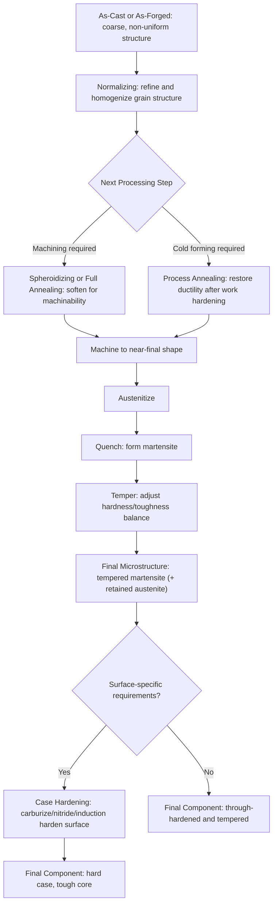

## Effects of Heat Treatment on Microstructure

### Overview

Heat treatment achieves its engineering purpose entirely through deliberate manipulation of microstructure — the phases present, their morphology, distribution, and scale directly determine mechanical properties. This topic synthesizes across the individual heat-treatment processes (annealing, quenching/hardening, tempering, case hardening, precipitation hardening) to examine the underlying microstructure-property relationships that make heat treatment such a powerful tool for tailoring material behavior without changing bulk composition.

The central principle: **the same chemical composition can yield dramatically different mechanical properties depending solely on the thermal history applied**, since thermal history controls which phases form, how finely they are distributed, and what internal stresses and defect structures result.

### Summary of Microstructures Produced by Common Heat Treatments (Steel)

| Treatment | Cooling Rate | Resulting Microstructure | Relative Hardness | Relative Toughness |
| --- | --- | --- | --- | --- |
| Full annealing | Very slow (furnace) | Coarse pearlite + proeutectoid phase | Lowest | Highest (of transformation products) |
| Normalizing | Moderate (air) | Fine pearlite + proeutectoid phase | Low-moderate | High |
| Austempering | Isothermal hold (bainite range) | Bainite | Moderate-high | Good balance |
| Quenching (as-quenched) | Very fast (exceeds critical rate) | Martensite (+ retained austenite) | Highest | Lowest (brittle) |
| Quench + low-temp temper | — | Tempered martensite (fine carbides) | High | Low-moderate |
| Quench + high-temp temper | — | Tempered martensite (coarse/spheroidized carbides) | Moderate | High |
| Spheroidizing | Prolonged, near A₁ | Spheroidal cementite in ferrite | Lowest (of hardened-capable steels) | Highest, best machinability |

### Grain Size Effects

Heat treatment strongly influences **austenite grain size** prior to transformation, which in turn affects the transformation products and final properties:

- **Finer prior austenite grain size**: provides more grain-boundary area for heterogeneous nucleation of ferrite, pearlite, and bainite, generally producing finer transformation products and improved toughness (per the Hall-Petch relationship, $\sigma_y = \sigma_0 + k_y d^{-1/2}$, where smaller grain size $d$ increases yield strength while also generally improving toughness — one of the few strengthening mechanisms that improves both simultaneously)
- **Coarser prior austenite grain size**: reduces nucleation sites, generally improving hardenability (since it also reduces heterogeneous nucleation sites for pearlite formation during cooling, requiring slower cooling to avoid it) but at a cost to toughness, and increasing the risk of quench cracking

**Grain refinement mechanisms** relevant to heat treatment include controlled austenitizing temperature (avoiding excessive grain growth via prolonged or excessive-temperature soaking) and the use of grain-refining alloying additions (e.g., fine aluminum nitride or vanadium/niobium carbonitride particles) that pin grain boundaries (Zener pinning) and restrict grain growth during heating.

### Microstructural Evolution Across a Heat-Treatment Sequence (Mermaid)

### Comparative Microstructure Schematic (SVG)

<svg xmlns="http://www.w3.org/2000/svg" viewBox="0 0 750 420" font-family="Arial, sans-serif">
<text x="375" y="25" font-size="16" font-weight="bold" text-anchor="middle">Microstructure vs Heat Treatment Path (svg_diagram)</text>

<rect x="40" y="60" width="180" height="140" fill="#f4f6f6" stroke="black" />
<text x="130" y="215" font-size="12" text-anchor="middle" font-weight="bold">Full Anneal</text>
<text x="130" y="230" font-size="11" text-anchor="middle" font-style="italic">Coarse Pearlite</text>
<g stroke="#7d3c98" stroke-width="2">
<line x1="55" y1="80" x2="205" y2="80" />
<line x1="55" y1="100" x2="205" y2="100" />
<line x1="55" y1="120" x2="205" y2="120" />
<line x1="55" y1="140" x2="205" y2="140" />
<line x1="55" y1="160" x2="205" y2="160" />
<line x1="55" y1="180" x2="205" y2="180" />
</g>

<rect x="280" y="60" width="180" height="140" fill="#f4f6f6" stroke="black" />
<text x="370" y="215" font-size="12" text-anchor="middle" font-weight="bold">Normalize</text>
<text x="370" y="230" font-size="11" text-anchor="middle" font-style="italic">Fine Pearlite</text>
<g stroke="#7d3c98" stroke-width="1.2">
<line x1="295" y1="70" x2="445" y2="70" />
<line x1="295" y1="80" x2="445" y2="80" />
<line x1="295" y1="90" x2="445" y2="90" />
<line x1="295" y1="100" x2="445" y2="100" />
<line x1="295" y1="110" x2="445" y2="110" />
<line x1="295" y1="120" x2="445" y2="120" />
<line x1="295" y1="130" x2="445" y2="130" />
<line x1="295" y1="140" x2="445" y2="140" />
<line x1="295" y1="150" x2="445" y2="150" />
<line x1="295" y1="160" x2="445" y2="160" />
<line x1="295" y1="170" x2="445" y2="170" />
<line x1="295" y1="180" x2="445" y2="180" />
<line x1="295" y1="190" x2="445" y2="190" />
</g>

<rect x="520" y="60" width="180" height="140" fill="#f4f6f6" stroke="black" />
<text x="610" y="215" font-size="12" text-anchor="middle" font-weight="bold">Quench</text>
<text x="610" y="230" font-size="11" text-anchor="middle" font-style="italic">Martensite (needles)</text>
<g stroke="#b03a2e" stroke-width="2">
<line x1="535" y1="80" x2="590" y2="120" />
<line x1="560" y1="70" x2="620" y2="110" />
<line x1="600" y1="90" x2="660" y2="70" />
<line x1="545" y1="140" x2="610" y2="160" />
<line x1="600" y1="150" x2="670" y2="130" />
<line x1="620" y1="170" x2="680" y2="190" />
<line x1="555" y1="180" x2="600" y2="195" />
</g>

<rect x="150" y="260" width="180" height="140" fill="#f4f6f6" stroke="black" />
<text x="240" y="415" font-size="12" text-anchor="middle" font-weight="bold">Spheroidize</text>
<g fill="#7d3c98">
<circle cx="180" cy="290" r="6" />
<circle cx="220" cy="300" r="5" />
<circle cx="260" cy="280" r="7" />
<circle cx="300" cy="310" r="5" />
<circle cx="190" cy="330" r="6" />
<circle cx="240" cy="340" r="5" />
<circle cx="280" cy="350" r="6" />
<circle cx="200" cy="370" r="5" />
<circle cx="250" cy="380" r="6" />
<circle cx="300" cy="360" r="5" />
</g>

<rect x="410" y="260" width="180" height="140" fill="#f4f6f6" stroke="black" />
<text x="500" y="415" font-size="12" text-anchor="middle" font-weight="bold">Temper (after Quench)</text>
<g fill="#b03a2e">
<circle cx="430" cy="280" r="3" />
<circle cx="450" cy="290" r="3" />
<circle cx="470" cy="275" r="3" />
<circle cx="490" cy="295" r="3" />
<circle cx="510" cy="280" r="3" />
<circle cx="530" cy="300" r="3" />
<circle cx="550" cy="285" r="3" />
<circle cx="440" cy="320" r="3" />
<circle cx="460" cy="330" r="3" />
<circle cx="480" cy="315" r="3" />
<circle cx="500" cy="335" r="3" />
<circle cx="520" cy="320" r="3" />
<circle cx="540" cy="340" r="3" />
<circle cx="560" cy="325" r="3" />
</g>
</svg>

### Property Trade-offs Across Microstructures

The overarching relationship visible across all steel heat treatments is a **hardness/strength vs. ductility/toughness trade-off**, though the specific mechanism differs by microstructure type:

- **Lamellar spacing effects (pearlite)**: finer interlamellar spacing (from faster cooling) increases the ferrite-cementite interfacial area, impeding dislocation motion similarly to a grain-boundary strengthening effect, increasing strength/hardness at some cost to ductility relative to coarse pearlite
- **Carbide morphology effects (spheroidized vs. lamellar)**: spheroidal cementite particles present less continuous interfacial constraint on the ferrite matrix than lamellar cementite, producing the softest, most ductile/machinable condition for a given carbon content
- **Martensite carbon content effects**: higher carbon content increases the tetragonal distortion of martensite, increasing achievable hardness but also increasing brittleness and quench-cracking susceptibility
- **Tempering carbide coarsening effects**: as discussed under tempering, progressive carbide coarsening with increasing tempering temperature trades hardness for toughness in a controllable, continuous manner

### Non-Ferrous Analogy: Aluminum Alloys

The microstructure-property relationship extends directly to non-ferrous systems, though via different mechanisms:

- **Solution heat-treated + quenched (unaged, "W" temper)**: supersaturated solid solution, moderate strength, good ductility, often unstable at room temperature
- **Naturally or artificially aged (T4/T6 etc.)**: fine coherent/semi-coherent precipitates distributed through the matrix, providing substantial strengthening via the mechanisms discussed under precipitation hardening
- **Overaged (T7x)**: coarsened, incoherent precipitates provide reduced but more stable strengthening, often selected specifically for improved stress-corrosion resistance at some cost to peak strength

This illustrates that despite the very different underlying transformation mechanisms (diffusionless martensitic shear in steel vs. diffusion-controlled precipitation in aluminum), the general engineering principle — controlling particle/phase size, distribution, and coherency through thermal history to tune the strength-ductility trade-off — is a unifying theme across heat-treatable alloy systems.

### Worked Example: Diagnosing an Unexpected Property Outcome

A batch of quenched-and-tempered 4340 steel components unexpectedly shows lower-than-specified hardness despite following the documented austenitizing temperature, quench media, and tempering schedule. Working through likely microstructural causes:

1. **Insufficient quench severity for section size**: if the component's cross-section exceeds the effective hardening depth for the given quenchant and steel hardenability, the core (and potentially near-surface regions on thicker sections) may have transformed partially to bainite/pearlite rather than fully to martensite, directly reducing measured hardness at sampled locations
2. **Excessive prior austenite grain growth**: if furnace soak time or temperature exceeded specification, coarse grains reduce nucleation sites for the (undesired, in this case) transformation products, but more importantly may indicate a furnace control issue affecting the actual temperature the parts experienced, an important process audit point
3. **Retained austenite**: if the alloy's Mf is below room temperature (plausible for this medium-carbon low-alloy steel, though [Inference: 4340's Mf is generally well above typical sub-zero treatment thresholds under normal composition, so this is a less likely primary cause than the quench severity issue above, but should not be ruled out without direct microstructural examination]), incomplete martensite transformation could contribute to lower apparent hardness

This example illustrates how heat-treatment-induced microstructural understanding directly supports root-cause diagnosis of unexpected mechanical property results in production settings — a common and practically important application of the concepts developed across this chapter.

### Cross-Process Summary Table: Objective-to-Microstructure Mapping

| Engineering Objective | Microstructural Target | Typical Process(es) |
| --- | --- | --- |
| Maximum ductility/softness for forming | Coarse or spheroidized ferrite-cementite | Full annealing, spheroidizing |
| Restore ductility after cold work | Recrystallized, strain-free grains | Process annealing |
| Uniform, moderate strength after casting/forging | Fine, uniform pearlite + ferrite | Normalizing |
| Maximum bulk hardness/strength | Martensite (as-quenched) | Quenching (rarely used untempered) |
| Balanced strength-toughness (bulk) | Tempered martensite | Quench + temper |
| Balanced strength-toughness (no distortion) | Bainite | Austempering |
| Hard wear surface, tough core | Martensitic case + ferrite-pearlite/bainite core | Carburizing, carbonitriding, induction/flame hardening |
| Hard, low-distortion surface | Alloy nitride compound layer | Nitriding |
| High strength in age-hardenable non-ferrous alloys | Fine coherent/semi-coherent precipitates | Solution treat + quench + age |

**Related Topics**

- Hall-Petch relationship and grain-size strengthening
- Mechanical testing methods for validating heat-treatment outcomes (hardness, tensile, impact/Charpy)
- Metallographic sample preparation and etching for microstructure examination
- Failure analysis and root-cause diagnosis in heat-treated components
- Alloy design for hardenability and heat-treatment response (AISI/SAE steel series)
- Residual stress interactions across sequential heat-treatment steps
- Non-destructive testing for case depth and hardness verification
- Process control and quality assurance in industrial heat-treatment operations