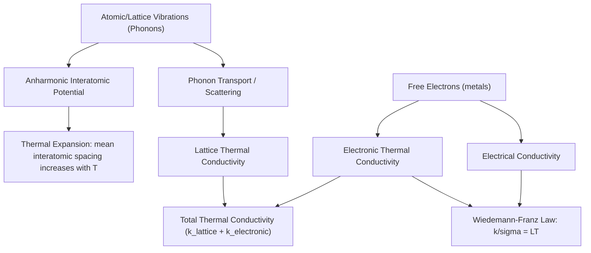

## Thermal Expansion and Conductivity

### Overview

Thermal expansion and thermal conductivity are two fundamental thermophysical properties governing how materials respond to and transmit heat. Both arise from the same underlying atomic-scale phenomenon — lattice vibrations (phonons) — but manifest as distinct macroscopic behaviors: thermal expansion describes dimensional change with temperature, while thermal conductivity describes the rate of heat energy transfer through a material. These properties are critical in civil and mechanical engineering design wherever temperature fluctuations occur, from bridge expansion joints to building insulation to electronic heat sinks.

### Thermal Expansion: Physical Origin

Thermal expansion arises from the **anharmonicity (asymmetry) of the interatomic potential energy curve**. In an idealized harmonic (symmetric, parabolic) potential well, atoms vibrating with increased thermal energy would oscillate symmetrically about the same equilibrium spacing, producing no net dimensional change. Real interatomic potentials, however, are asymmetric: the repulsive branch (at short interatomic distances) rises much more steeply than the attractive branch falls off at longer distances. As temperature increases and vibrational amplitude grows, the average interatomic spacing shifts to a larger value because the atom can move further on the shallow attractive side than on the steep repulsive side, producing net expansion.

**Consequence**: materials with **deeper, more symmetric (or "stiffer") interatomic potential wells** (generally correlating with higher melting points and higher elastic modulus) tend to exhibit **lower thermal expansion coefficients**, since the potential asymmetry contributing to expansion is less pronounced relative to the well depth. This is a genuine correlation observed broadly across materials, though [Inference: it should be treated as a general trend rather than a precise predictive relationship, since bonding type, crystal structure, and anisotropy also significantly influence expansion behavior independent of simple potential well depth].

### Linear and Volumetric Coefficients of Thermal Expansion

**Linear Coefficient of Thermal Expansion ($\alpha_l$)**

Describes the fractional change in length per unit temperature change:

$$\frac{\Delta l}{l_0} = \alpha_l \Delta T$$

or equivalently, $\alpha_l = \frac{1}{l_0}\frac{dl}{dT}$

**Volumetric Coefficient of Thermal Expansion ($\alpha_v$)**

Describes the fractional change in volume per unit temperature change:

$$\frac{\Delta V}{V_0} = \alpha_v \Delta T$$

For isotropic materials, the volumetric coefficient is approximately three times the linear coefficient:

$$\alpha_v \approx 3\alpha_l$$

This approximation follows from the fact that volume scales as the cube of a characteristic length, and for small $\alpha_l \Delta T$, the higher-order terms in the binomial expansion of $(1 + \alpha_l \Delta T)^3$ become negligible.

**Typical Linear CTE values** (order-of-magnitude reference, units of $10^{-6}$/°C): [Inference: precise values are alloy/composition/temperature-range dependent and should be taken from material-specific data sheets for engineering design; the following are broadly representative]

- Steel: approximately 11–13
- Aluminum alloys: approximately 22–24
- Concrete: approximately 10–14 (varies with aggregate type)
- Copper: approximately 16–17
- Invar (Fe-Ni alloy): approximately 1–2 (deliberately engineered for near-zero expansion)
- Polymers (typical thermoplastics): substantially higher than metals, often 50–200+

### Anisotropy in Thermal Expansion

Non-cubic crystal structures often exhibit **anisotropic thermal expansion**, meaning the coefficient differs along different crystallographic directions, since bonding strength and atomic packing can differ substantially between crystallographic axes. This is particularly significant in materials like graphite (very different expansion within the basal plane vs. perpendicular to it, due to the contrast between strong covalent in-plane bonds and weak van der Waals interlayer bonds) and certain ceramics. In polycrystalline aggregates of anisotropic materials, this can generate internal microstresses upon heating/cooling even in the absence of external constraint, sometimes contributing to microcracking in ceramics subjected to thermal cycling.

### Engineering Significance of Thermal Expansion in Civil Engineering

- **Expansion joints**: bridges, pavements, and buildings require expansion joints to accommodate dimensional changes without inducing excessive internal stress, since a fully constrained member prevented from expanding will develop compressive stress proportional to $E \alpha_l \Delta T$ (where $E$ is elastic modulus), which can be substantial for typical temperature swings
- **Composite/reinforced systems (e.g., reinforced concrete)**: steel reinforcement and concrete have reasonably well-matched CTE values (a fortunate coincidence rather than a designed one), which is one of several reasons steel reinforcement is compatible with concrete over a wide temperature range without inducing excessive differential-expansion stress
- **Bimetallic strips and thermostats**: intentionally exploit CTE mismatch between two bonded metals to produce controlled, temperature-dependent curvature
- **Precision instruments**: low-CTE alloys (e.g., Invar) are selected where dimensional stability across temperature variation is critical (precision measuring devices, certain structural components in temperature-variable environments)

### Thermal Expansion Curve Concept (SVG)

<svg xmlns="http://www.w3.org/2000/svg" viewBox="0 0 650 380" font-family="Arial, sans-serif">
<text x="325" y="25" font-size="16" font-weight="bold" text-anchor="middle">Interatomic Potential and Thermal Expansion (svg_diagram)</text>
<line x1="80" y1="320" x2="600" y2="320" stroke="black" stroke-width="2" />
<line x1="80" y1="320" x2="80" y2="50" stroke="black" stroke-width="2" />
<text x="340" y="355" font-size="12" text-anchor="middle">Interatomic Distance (r)</text>
<text x="35" y="185" font-size="12" text-anchor="middle" transform="rotate(-90 35 185)">Potential Energy</text>

<path d="M 150 60 C 180 150, 210 230, 260 280 C 300 310, 340 310, 380 285 C 430 250, 470 190, 520 100" stroke="`#1a5276`" stroke-width="2.5" fill="none" />

<line x1="290" y1="280" x2="290" y2="320" stroke="#888" stroke-dasharray="3,3" />
<text x="290" y="335" font-size="10" text-anchor="middle">r0 (low T)</text>
<line x1="150" y1="230" x2="380" y2="230" stroke="#b03a2e" stroke-width="1.5" />
<line x1="120" y1="180" x2="440" y2="180" stroke="#b03a2e" stroke-width="1.5" />

<circle cx="300" cy="230" r="4" fill="#b03a2e" />
<circle cx="315" cy="180" r="4" fill="#b03a2e" />
<text x="440" y="185" font-size="10" fill="#b03a2e">Higher T mean position</text>
<text x="400" y="235" font-size="10" fill="#b03a2e">Lower T mean position</text>
<line x1="300" y1="320" x2="300" y2="230" stroke="#888" stroke-dasharray="2,2" />
<line x1="315" y1="320" x2="315" y2="180" stroke="#888" stroke-dasharray="2,2" />
</svg>

### Thermal Conductivity: Physical Mechanisms

Thermal conductivity ($k$) quantifies a material's ability to conduct heat, defined via **Fourier's law**:

$$q = -k\frac{dT}{dx}$$

where $q$ is heat flux (energy per unit area per unit time), and $dT/dx$ is the temperature gradient. The negative sign indicates heat flows from high to low temperature.

Two primary mechanisms transport thermal energy through solids:

**Lattice Vibration (Phonon) Conduction**

Heat is transmitted via quantized lattice vibrations (phonons) propagating through the crystal structure and scattering off lattice imperfections, grain boundaries, other phonons (phonon-phonon scattering, dominant at higher temperatures), and impurity atoms. This mechanism operates in all solids, including electrical insulators.

**Electronic Conduction**

In metals and other electrically conductive materials, free (conduction) electrons also transport thermal energy, generally far more effectively than phonons alone. This is why metals typically exhibit substantially higher thermal conductivity than ceramics or polymers, which rely on phonon conduction alone.

**Total conductivity** in metals is the sum of both contributions:

$$k_{total} = k_{lattice} + k_{electronic}$$

with $k_{electronic}$ generally dominating in pure metals.

### The Wiedemann-Franz Law

For metals, thermal conductivity and electrical conductivity are related through the **Wiedemann-Franz law**, reflecting the shared role of free electrons in both electrical and thermal transport:

$$\frac{k}{\sigma} = LT$$

where $\sigma$ is electrical conductivity, $T$ is absolute temperature, and $L$ is the Lorenz number, theoretically approximately $2.44 \times 10^{-8}\, \text{W}\Omega/\text{K}^2$. [Inference: this relationship holds reasonably well for many pure metals at and above room temperature, but deviates at very low temperatures and in some alloys, since electron scattering mechanisms relevant to thermal vs. electrical transport are not identical in all regimes.] This law is why good electrical conductors (copper, silver, aluminum) are also generally good thermal conductors.

### Factors Affecting Thermal Conductivity

- **Alloying/impurities**: solute atoms scatter both phonons and electrons, generally **reducing** thermal conductivity relative to the pure base metal — pure copper and aluminum have notably higher thermal conductivity than their common alloys
- **Temperature**: for metals, thermal conductivity often decreases somewhat with increasing temperature above room temperature (increased phonon-phonon and electron-phonon scattering), though behavior varies by material; for many ceramics and polymers, conductivity can show more complex temperature dependence
- **Porosity**: porous materials (foams, insulating firebrick, some ceramics) have substantially reduced thermal conductivity, since air/void spaces conduct heat far less effectively than the solid matrix — this is the basis for most engineered thermal insulation
- **Crystal structure and defects**: grain boundaries, dislocations, and point defects all scatter phonons, generally reducing conductivity relative to a defect-free single crystal of the same composition
- **Bonding type**: covalently bonded ceramics with simple, highly ordered crystal structures (e.g., diamond, which has exceptionally high thermal conductivity despite being an electrical insulator) can exhibit very high phonon-conduction thermal conductivity due to efficient phonon transport through a stiff, low-defect lattice

### Comparative Thermal Conductivity Ranges

| Material Class | Approximate Thermal Conductivity (W/m·K) | Dominant Mechanism |
| --- | --- | --- |
| Pure metals (Cu, Ag, Al) | 200–400+ | Electronic |
| Metal alloys (steels) | 15–50 | Electronic + lattice |
| Diamond | Very high (>1000) | Lattice (phonon), exceptionally efficient |
| Dense ceramics (Al₂O₃) | 20–30 | Lattice |
| Concrete | ~1–2 | Lattice, reduced by porosity/aggregate structure |
| Polymers (typical) | 0.1–0.5 | Lattice, poor due to disordered structure |
| Insulating foams/fiberglass | 0.02–0.04 | Lattice, minimized via trapped air/porosity |

[Inference: these ranges are broadly representative but real material conductivity values vary with exact composition, processing, porosity, and temperature; engineering design should reference specific material data rather than these illustrative ranges.]

### Thermal Expansion and Conductivity Relationship Map (Mermaid)

### Worked Example: Thermal Stress from Restrained Expansion

A steel beam ($\alpha_l = 12 \times 10^{-6}$/°C, $E = 200$ GPa) is rigidly restrained at both ends and experiences a temperature increase of 40°C. Since the beam cannot physically expand, the thermal strain that would have occurred is instead converted entirely into compressive stress:

$$\sigma = E\alpha_l \Delta T = (200 \times 10^9\,\text{Pa})(12 \times 10^{-6}/°C)(40°C)$$

$$\sigma = 200 \times 10^9 \times 12 \times 10^{-6} \times 40 = 96 \times 10^6\,\text{Pa} = 96\,\text{MPa}$$

This is a substantial stress (approaching or exceeding the yield strength of some structural steels depending on grade), illustrating why expansion joints and controlled restraint are essential design features in structures spanning significant temperature ranges — without them, thermal cycling alone could induce yielding or fatigue damage over repeated cycles.

### Worked Example: Composite Conductivity Estimate (Simplified)

For a two-material composite with layers in series (heat flow perpendicular to layers), the effective thermal resistance adds directly (analogous to electrical resistors in series):

$$R_{total} = \frac{L_1}{k_1} + \frac{L_2}{k_2}$$

For layers in parallel (heat flow along the layers), the effective conductance adds instead, weighted by cross-sectional area fraction — this series/parallel framework provides a first-order estimate for composite and layered-material thermal behavior, though [Inference: real composite thermal conductivity, especially for particulate or fiber-reinforced composites with complex geometry, generally requires more sophisticated models (e.g., Maxwell-Eucken or effective medium approaches) for accurate prediction beyond simple layered geometries].

**Related Topics**

- Interatomic bonding and the potential energy curve (origin of anharmonicity)
- Fourier's law and steady-state/transient heat conduction analysis
- Wiedemann-Franz law and free-electron theory of metals
- Thermal stress analysis and expansion joint design in structures
- Insulation materials and building envelope thermal performance
- Phonon scattering mechanisms and thermal conductivity of ceramics
- Composite material effective property models (rule of mixtures, Maxwell-Eucken)
- Thermal shock resistance and thermal fatigue in ceramics and metals