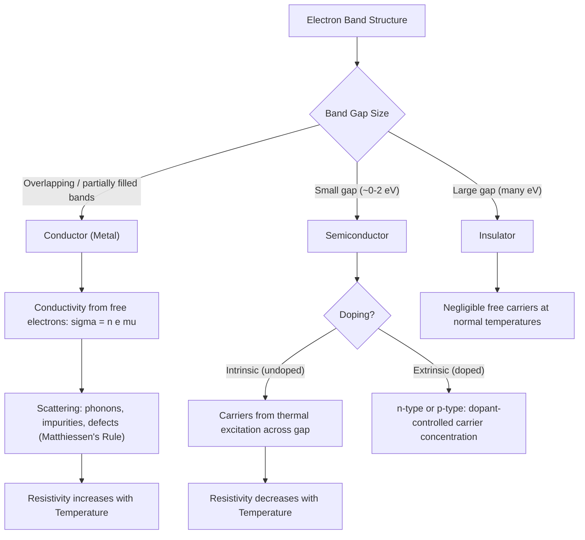

## Electrical Conductivity and Resistivity

### Overview

Electrical conductivity and resistivity are fundamental physical properties describing a material's ability to conduct or resist the flow of electric current. These properties span an enormous range across material classes — from highly conductive metals to insulating ceramics and polymers — and are governed by the availability and mobility of charge carriers (predominantly electrons, though ionic conduction is relevant in some materials). Understanding conductivity mechanisms is essential for selecting materials in electrical, electronic, and structural applications where electrical behavior matters (grounding systems, reinforcement corrosion via galvanic effects, electromagnetic shielding, sensors).

### Fundamental Definitions

**Electrical Resistivity ($\rho$)**: an intrinsic material property relating resistance to geometry via:

$$R = \rho \frac{L}{A}$$

where $R$ is resistance, $L$ is conductor length, and $A$ is cross-sectional area. Units are typically ohm-meters ($\Omega \cdot \text{m}$).

**Electrical Conductivity ($\sigma$)**: the reciprocal of resistivity:

$$\sigma = \frac{1}{\rho}$$

Units are typically siemens per meter (S/m).

**Ohm's Law (microscopic form)**: relates current density $J$ to electric field $E$ via conductivity:

$$J = \sigma E$$

This is the microscopic analog of the more familiar macroscopic form $V = IR$.

### Band Theory and Material Classification

Electrical conductivity behavior across material classes is best explained through **electron band theory**, which describes how electron energy levels group into bands (allowed energy ranges) separated by band gaps (forbidden energy ranges) in a crystalline solid.

**Conductors (Metals)**

In metals, the valence band and conduction band either overlap or the valence band is only partially filled, meaning electrons can move into adjacent, only slightly higher-energy states with minimal energy input, allowing free movement under an applied electric field. This is why metals exhibit high conductivity even at very low applied voltages.

**Semiconductors**

A moderate band gap (typically less than roughly 2 eV) separates a filled valence band from an empty conduction band at low temperature. At higher temperatures, thermal energy is sufficient to excite some electrons across the gap into the conduction band, leaving behind "holes" (effectively positive charge carriers) in the valence band; both electrons and holes contribute to conduction. Conductivity increases with temperature for intrinsic semiconductors, in direct contrast to the behavior of metals.

**Insulators**

A large band gap (typically greater than roughly 2 eV, often several eV or more) makes thermal excitation across the gap negligible at ordinary temperatures, resulting in very low conductivity. Common electrical insulators include most polymers, ceramics, and glasses.

### Band Structure Comparison (SVG)

<svg xmlns="http://www.w3.org/2000/svg" viewBox="0 0 750 380" font-family="Arial, sans-serif">
<text x="375" y="25" font-size="16" font-weight="bold" text-anchor="middle">Band Structures: Conductor, Semiconductor, Insulator (svg_diagram)</text>

<text x="120" y="60" font-size="13" text-anchor="middle" font-weight="bold">Metal</text>

<rect x="60" y="70" width="120" height="60" fill="`#aed6f1`" stroke="black" />

<rect x="60" y="130" width="120" height="60" fill="`#5dade2`" stroke="black" />

<text x="120" y="105" font-size="10" text-anchor="middle">Conduction Band</text>

<text x="120" y="165" font-size="10" text-anchor="middle">Valence Band</text>

<text x="120" y="210" font-size="10" text-anchor="middle" font-style="italic">Bands overlap</text>

<text x="375" y="60" font-size="13" text-anchor="middle" font-weight="bold">Semiconductor</text>

<rect x="315" y="70" width="120" height="50" fill="`#aed6f1`" stroke="black" />

<rect x="315" y="150" width="120" height="50" fill="`#5dade2`" stroke="black" />

<text x="375" y="100" font-size="10" text-anchor="middle">Conduction Band</text>

<text x="375" y="180" font-size="10" text-anchor="middle">Valence Band</text>

<text x="375" y="138" font-size="10" text-anchor="middle" font-style="italic">Small gap (~1 eV)</text>

<text x="630" y="60" font-size="13" text-anchor="middle" font-weight="bold">Insulator</text>

<rect x="570" y="70" width="120" height="40" fill="`#aed6f1`" stroke="black" />

<rect x="570" y="180" width="120" height="40" fill="`#5dade2`" stroke="black" />

<text x="630" y="95" font-size="10" text-anchor="middle">Conduction Band</text>

<text x="630" y="205" font-size="10" text-anchor="middle">Valence Band</text>

<text x="630" y="150" font-size="10" text-anchor="middle" font-style="italic">Large gap (&gt;several eV)</text>

</svg>

### Conduction Mechanism in Metals

In metals, conductivity depends on the concentration of free (conduction) electrons $n$, their charge $e$, and their **mobility** $\mu$ (a measure of how readily electrons accelerate under an applied field before being scattered):

$$\sigma = ne\mu$$

Electron mobility is limited by **scattering events** — collisions with lattice vibrations (phonons), impurity atoms, vacancies, dislocations, and grain boundaries — each of which interrupts the electron's directed drift velocity. The **Matthiessen's rule** approximation states that resistivity contributions from different scattering mechanisms add independently:

$$\rho_{total} = \rho_{thermal} + \rho_{impurity} + \rho_{deformation}$$

- $\rho_{thermal}$: increases with temperature, since increased lattice vibration amplitude increases phonon scattering — this is why pure metal resistivity increases roughly linearly with temperature over a substantial range
- $\rho_{impurity}$: increases with solute/impurity concentration, largely independent of temperature — alloying generally increases resistivity relative to the pure base metal (directly analogous to the reduction in thermal conductivity from alloying discussed under thermal conductivity)
- $\rho_{deformation}$: increases with dislocation density and cold work, since dislocations also scatter electrons, though this contribution is typically smaller than the thermal and impurity contributions for most engineering conditions

### Temperature Dependence: Metals vs. Semiconductors

This is one of the most practically important distinctions in electrical materials behavior:

- **Metals**: resistivity **increases** with increasing temperature (positive temperature coefficient of resistance), since increased phonon scattering reduces electron mobility even though carrier concentration remains essentially constant
- **Intrinsic semiconductors**: resistivity **decreases** with increasing temperature (negative temperature coefficient of resistance), since the dominant effect is the exponential increase in the number of thermally excited charge carriers crossing the band gap, which outweighs any mobility reduction from increased phonon scattering

$$\sigma_{intrinsic} \propto \exp\left(\frac{-E_g}{2k_BT}\right)$$

where $E_g$ is the band gap energy, $k_B$ is Boltzmann's constant, and $T$ is absolute temperature. This exponential relationship means semiconductor conductivity is highly temperature-sensitive, a property directly exploited in thermistor-type temperature sensors.

### Resistivity vs. Temperature Behavior (SVG)

<svg xmlns="http://www.w3.org/2000/svg" viewBox="0 0 700 380" font-family="Arial, sans-serif">
<text x="350" y="25" font-size="16" font-weight="bold" text-anchor="middle">Resistivity vs Temperature: Metal vs Semiconductor (svg_diagram)</text>
<line x1="80" y1="320" x2="650" y2="320" stroke="black" stroke-width="2" />
<line x1="80" y1="320" x2="80" y2="50" stroke="black" stroke-width="2" />
<text x="365" y="355" font-size="13" text-anchor="middle">Temperature</text>
<text x="35" y="185" font-size="13" text-anchor="middle" transform="rotate(-90 35 185)">Resistivity</text>

<path d="M 100 280 L 620 100" stroke="#b03a2e" stroke-width="2.5" fill="none" />
<text x="480" y="130" font-size="11" fill="#b03a2e">Metal (increases with T)</text>

<path d="M 100 90 C 200 200, 300 280, 400 305 C 470 312, 550 316, 620 318" stroke="`#1a5276`" stroke-width="2.5" fill="none" />

<text x="280" y="235" font-size="11" fill="`#1a5276`">Semiconductor (decreases with T)</text>

</svg>

### Extrinsic (Doped) Semiconductors

Practical semiconductor devices rely predominantly on **extrinsic** semiconductors, where controlled impurity doping introduces charge carriers independent of thermal excitation:

- **n-type doping**: donor impurities (e.g., phosphorus or arsenic in silicon) contribute extra electrons to the conduction band
- **p-type doping**: acceptor impurities (e.g., boron in silicon) create holes in the valence band

Doped semiconductor conductivity is generally much higher than intrinsic semiconductor conductivity at a given temperature, and the temperature dependence of extrinsic semiconductors is more complex than intrinsic behavior — showing distinct low-temperature (carrier freeze-out), intermediate ("extrinsic," dopant-dominated, relatively temperature-stable), and high-temperature (intrinsic behavior dominates again) regimes. [Inference: detailed extrinsic semiconductor behavior across these regimes is a substantial topic in its own right within semiconductor physics/electronic materials and is only summarized at a high level here.]

### Superconductivity (Brief Note)

Certain materials exhibit **superconductivity** below a characteristic critical temperature ($T_c$), where electrical resistivity drops abruptly and effectively to zero. This is a distinct quantum-mechanical phenomenon (related to Cooper pairing of electrons, in conventional superconductors) rather than an extension of normal conduction mechanisms, and is outside the scope of standard conduction-mechanism treatment for structural/engineering materials, though it is briefly noted here as the extreme limiting case of "high conductivity" behavior.

### Ionic Conduction

Some materials (many ceramics, electrolytes, certain polymers) conduct primarily via **ion migration** rather than electron movement, particularly at elevated temperature where ionic mobility increases substantially. This mechanism is generally much less efficient than metallic electron conduction (contributing to the typically low conductivity of ceramics at room temperature) but becomes practically significant in applications like solid oxide fuel cells and certain sensor technologies, which specifically exploit ionic conductivity in specialized ceramic materials.

### Comparative Resistivity Ranges

| Material Class | Approximate Resistivity ($\Omega \cdot$m) | Conduction Mechanism |
| --- | --- | --- |
| Silver, copper (best metallic conductors) | $10^{-8}$ | Electronic (free electron) |
| Structural steels | $10^{-7}$ | Electronic (free electron, reduced by alloying/impurities) |
| Intrinsic silicon (semiconductor) | ~$10^3$ | Electronic (thermally excited carriers) |
| Doped semiconductors | $10^{-5}$ to $10^{2}$ (highly dependent on doping level) | Electronic (extrinsic carriers) |
| Ceramics (typical electrical insulators) | $10^{8}$ to $10^{16}$ | Minimal (large band gap); some ionic contribution at high T |
| Polymers (typical) | $10^{10}$ to $10^{18}$ | Minimal (large band gap, no free carriers) |

[Inference: these ranges are order-of-magnitude illustrative references; actual resistivity values are highly composition-, purity-, doping-, and temperature-dependent and should be sourced from material-specific data for design purposes.]

### Electrical Conductivity Mechanism Map (Mermaid)

### Worked Example: Effect of Alloying on Conductivity

Pure copper has a resistivity of approximately $1.68 \times 10^{-8}\, \Omega \cdot \text{m}$ at room temperature, making it one of the best commercially practical electrical conductors. If a small amount of an alloying element (e.g., a few percent zinc, forming a brass) is added, resistivity increases substantially — often by a factor of 3–5× or more depending on the specific alloy and composition — since solute atoms disrupt the periodic lattice potential and scatter conduction electrons far more effectively than the thermal lattice vibrations alone. This is precisely why **high-purity, unalloyed copper** (rather than any copper alloy) is specified for electrical wiring applications where conductivity is the governing selection criterion, whereas structural or wear-resistant copper applications can tolerate (or specifically require) alloying despite the conductivity penalty. [Inference: exact conductivity reduction factors are alloy- and concentration-specific and should be referenced against specific alloy data (e.g., % IACS ratings) rather than the illustrative range given here.]

### Engineering and Civil Applications

- **Grounding and lightning protection systems**: rely on high-conductivity metals (typically copper) to safely conduct fault currents to earth
- **Reinforced concrete corrosion**: electrical conductivity of concrete pore solution (affected by moisture and dissolved ion content) governs the rate of corrosion-related electrochemical reactions at reinforcing steel, making electrical resistivity testing a common non-destructive technique for assessing concrete corrosion risk
- **Cathodic protection systems**: rely on controlled electrical/electrochemical behavior to mitigate corrosion of buried or submerged steel structures
- **Electromagnetic shielding**: high-conductivity metals are used to shield sensitive electronics from electromagnetic interference, since free electrons in conductors readily respond to and attenuate incident electromagnetic fields

**Related Topics**

- Band theory and semiconductor device physics
- Matthiessen's rule and electron scattering mechanisms
- Corrosion mechanisms and electrochemical cells in reinforced concrete
- Thermal conductivity and the Wiedemann-Franz law (shared electron transport basis)
- Dielectric materials and insulation behavior under electric fields
- Piezoelectric and ferroelectric ceramic materials
- Cathodic protection design for buried/submerged structures
- Semiconductor doping and p-n junction device fundamentals