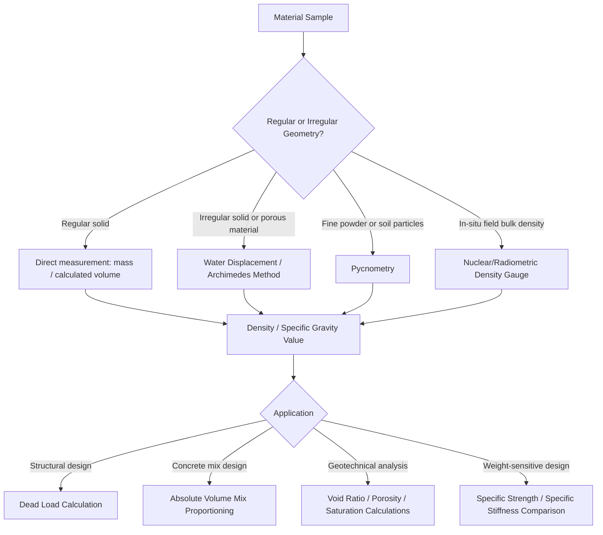

## Density and Specific Gravity

### Overview

Density and specific gravity are fundamental physical properties describing the mass-to-volume relationship of materials. While simple in definition, these properties underpin critical engineering calculations across structural design, material selection, quality control, and mix design in civil engineering, since nearly every structural performance metric of interest (strength-to-weight ratio, dead load calculations, buoyancy, concrete mix proportioning) depends directly or indirectly on density values.

### Definitions

**Density ($\rho$)**: mass per unit volume of a material:

$$\rho = \frac{m}{V}$$

Common units include kg/m³ (SI) and g/cm³ (commonly used in materials science, numerically equal to g/mL).

**Specific Gravity (SG)**: the dimensionless ratio of a material's density to the density of a reference substance, almost universally water at 4°C (where water density is very close to exactly 1000 kg/m³ or 1 g/cm³):

$$SG = \frac{\rho_{material}}{\rho_{water}}$$

Because water's density at 4°C is numerically 1 g/cm³, specific gravity values are numerically identical to density values expressed in g/cm³, making SG a convenient dimensionless shorthand widely used in geotechnical and materials testing contexts (e.g., specific gravity of soil solids, specific gravity of aggregates).

**Bulk Density vs. Absolute (True) Density**: an important distinction for porous or particulate materials —

- **Absolute (true/particle) density**: mass per unit volume of the solid material itself, excluding any internal or inter-particle void space
- **Bulk density**: mass per unit volume of the material as a bulk mass, including void space (air gaps between particles, internal porosity)

This distinction is critical for materials like aggregates, soils, powders, and porous ceramics, where bulk density can differ substantially from the true density of the solid constituent material depending on packing arrangement and porosity.

### Physical Origin of Density Differences

At the atomic scale, density is governed by two factors: **atomic mass** and **atomic packing efficiency** (how tightly atoms are arranged in the crystal structure or amorphous network):

- **Atomic mass**: heavier elements generally contribute to higher density, all else equal (e.g., lead vs. aluminum)
- **Packing efficiency**: crystal structures with higher atomic packing factor (APF) — the fraction of unit cell volume occupied by atoms, assuming hard-sphere atoms — pack atoms more tightly for a given atomic size and mass, increasing density. FCC and HCP structures (APF ≈ 0.74) pack more densely than BCC (APF ≈ 0.68), which in turn packs more densely than simple cubic (APF ≈ 0.52).

This explains observations such as iron's density change during allotropic transformation: γ-iron (FCC, denser packing) has slightly higher theoretical density than α-iron (BCC) at the same temperature, all else being equal, contributing to the small volume changes observed during steel phase transformations (relevant to the transformation-stress considerations addressed in quenching and hardening).

### Typical Density Values by Material Class

| Material | Approximate Density (kg/m³) |
| --- | --- |
| Steel | 7850 |
| Aluminum | 2700 |
| Concrete (normal weight) | 2300–2400 |
| Concrete (lightweight) | 1400–1800 |
| Wood (varies by species) | 400–800 |
| Glass | 2500 |
| Polymers (typical) | 900–1500 |
| Water (reference) | 1000 |
| Titanium | 4500 |
| Magnesium | 1740 |
| Lead | 11340 |

[Inference: exact density values vary with specific alloy composition, porosity, moisture content (for wood), and aggregate type (for concrete); the figures above are representative order-of-magnitude references appropriate for conceptual comparison rather than precise design values, which should be sourced from material-specific data.]

### Density Comparison Chart Concept (SVG)

<svg xmlns="http://www.w3.org/2000/svg" viewBox="0 0 700 400" font-family="Arial, sans-serif">
<text x="350" y="25" font-size="16" font-weight="bold" text-anchor="middle">Approximate Density Comparison (svg_diagram)</text>
<line x1="100" y1="350" x2="650" y2="350" stroke="black" stroke-width="2" />
<line x1="100" y1="350" x2="100" y2="50" stroke="black" stroke-width="2" />
<text x="35" y="200" font-size="12" text-anchor="middle" transform="rotate(-90 35 200)">Density (kg/m3)</text>

<rect x="120" y="320" width="50" height="30" fill="#a9dfbf" />
<text x="145" y="345" font-size="10" text-anchor="middle" transform="rotate(0 145 345)" />
<text x="145" y="365" font-size="10" text-anchor="middle">Wood</text>
<rect x="200" y="300" width="50" height="50" fill="#aed6f1" />
<text x="225" y="365" font-size="10" text-anchor="middle">Water</text>
<rect x="280" y="270" width="50" height="80" fill="#d5d8dc" />
<text x="305" y="365" font-size="10" text-anchor="middle">Concrete</text>
<rect x="360" y="230" width="50" height="120" fill="#f5b7b1" />
<text x="385" y="365" font-size="10" text-anchor="middle">Aluminum</text>
<rect x="440" y="80" width="50" height="270" fill="#f7dc6f" />
<text x="465" y="365" font-size="10" text-anchor="middle">Steel</text>
<rect x="520" y="60" width="50" height="290" fill="#bb8fce" />
<text x="545" y="365" font-size="10" text-anchor="middle">Lead</text>
</svg>

### Density Determination Methods

**Direct Measurement (Regular Solids)**: measure mass directly and calculate volume from geometric dimensions — straightforward for regular geometric shapes but impractical for irregular or porous samples.

**Water Displacement (Archimedes' Principle)**: for irregularly shaped solid samples, volume is determined by measuring the volume (or mass, via buoyant force) of fluid displaced when the sample is fully submerged:

$$\rho_{sample} = \frac{m_{dry}}{m_{dry} - m_{submerged}} \times \rho_{fluid}$$

This method (or variants of it) underlies standard test methods for specific gravity of aggregates (relevant to concrete mix design) and specific gravity of soil solids in geotechnical testing.

**Pycnometry**: uses a calibrated volumetric flask (pycnometer) to precisely determine the volume of a known mass of material (particularly fine powders or soil particles) by measuring the volume of fluid displaced within the precisely known pycnometer volume — offers higher precision than simple displacement methods for fine-grained or powder materials.

**Nuclear/Radiometric Methods**: used in field applications (e.g., in-situ soil density testing via nuclear density gauges) to determine bulk density non-destructively without extracting a physical sample.

### Engineering Significance in Civil Engineering

**Structural Dead Load Calculations**: material density directly determines the self-weight (dead load) contribution of structural members and materials, a fundamental input to structural design load combinations; errors or variability in assumed density values propagate directly into structural design margins.

**Concrete Mix Design**: aggregate specific gravity is a required input for calculating mix proportions by absolute volume method, since it allows conversion between the mass-based batching quantities used in practice and the absolute volumes that must sum to the total concrete volume (accounting for air content). Both **bulk specific gravity** (including internal aggregate pore volume) and **apparent specific gravity** (excluding pore volume) are used for different mix-design and moisture-correction calculations, along with **absorption** (related to porosity) as a complementary property.

**Lightweight vs. Normal-Weight Concrete**: achieved primarily by substituting lower-density lightweight aggregates (expanded shale, clay, slate, or pumice) for normal-weight aggregates, directly reducing structural dead load — a significant consideration for long-span structures or seismic design, where reduced mass directly reduces seismic demand per Newton's second law-based force calculations.

**Soil Classification and Compaction**: specific gravity of soil solids is a standard geotechnical property (typically ranging 2.6–2.8 for most mineral soils) used in calculating void ratio, porosity, and degree of saturation, all of which are foundational parameters in soil mechanics analysis.

**Buoyancy and Flotation**: relevant to marine structures, floating foundations, and uplift considerations for underground structures subject to groundwater — any structure with average density less than the surrounding fluid will experience net buoyant uplift, a critical check for structures like basements or tanks in high-water-table conditions.

### Strength-to-Weight (Specific Strength) Considerations

While not density itself, density is the necessary denominator for **specific strength** (strength per unit density) and **specific stiffness** (modulus per unit density), key figures of merit in weight-sensitive design (aerospace, but increasingly relevant in civil applications like long-span bridges and material selection for seismic mass reduction):

$$\text{Specific Strength} = \frac{\sigma_f}{\rho}$$

This is why materials with only moderate absolute strength but very low density (e.g., certain fiber-reinforced polymer composites, or aluminum relative to steel in some applications) can be competitive or superior choices when weight reduction is a design driver, despite having lower absolute strength than steel.

### Density Determination and Application Flow (Mermaid)

### Worked Example: Aggregate Specific Gravity in Concrete Mix Design

A coarse aggregate has a bulk (saturated surface-dry, SSD) specific gravity of 2.65 and is to be used in a concrete mix requiring 1100 kg of coarse aggregate per cubic meter of concrete (batched on an SSD mass basis). The absolute volume occupied by this aggregate in the mix is calculated as:

$$V_{aggregate} = \frac{m_{aggregate}}{SG_{aggregate} \times \rho_{water}} = \frac{1100\,\text{kg}}{2.65 \times 1000\,\text{kg/m}^3} = \frac{1100}{2650} \approx 0.415\,\text{m}^3$$

This absolute volume (approximately 0.415 m³ per cubic meter of concrete, or 41.5% of the total mix volume) is then subtracted, along with the absolute volumes of cement, water, fine aggregate, air, and any admixtures, to verify the mix proportions sum correctly to the target total volume of 1 m³ — illustrating the direct, practical role specific gravity plays in every concrete mix design calculation, not merely as an abstract material property.

### Worked Example: Effect of Porosity on Bulk Density

A ceramic brick has a true (absolute) particle density of 2600 kg/m³ but exhibits 20% porosity (air-filled voids) throughout its volume. The resulting bulk density is:

$$\rho_{bulk} = \rho_{true} \times (1 - \text{porosity fraction}) = 2600 \times (1 - 0.20) = 2080\,\text{kg/m}^3$$

This example illustrates why bulk density measurements (rather than true/absolute density of the base material) must be used for structural dead-load calculations involving porous materials such as brick, lightweight aggregate, or foamed/cellular materials, since the true material density alone would significantly overestimate the actual in-place weight of the porous bulk material.

**Related Topics**

- Atomic packing factor and crystal structure (FCC, BCC, HCP density implications)
- Concrete mix design by absolute volume method
- Aggregate properties: absorption, bulk vs. apparent specific gravity
- Soil mechanics: void ratio, porosity, and degree of saturation
- Lightweight aggregate concrete and structural dead-load reduction
- Buoyancy and uplift design considerations for below-grade structures
- Specific strength and specific stiffness in material selection
- Porosity and its effect on mechanical and thermal properties