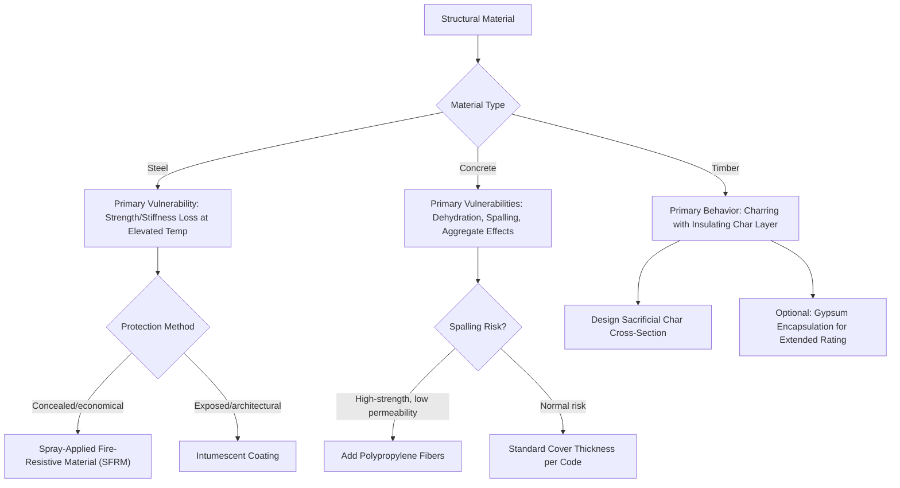

## Fire Resistance and Thermal Degradation

### Overview

Fire resistance describes a material's or assembly's ability to maintain structural integrity, load-bearing capacity, and separation function during exposure to fire, while thermal degradation refers to the physical and chemical breakdown processes materials undergo when exposed to elevated temperatures. These are closely related but distinct concepts: thermal degradation describes the underlying material-level mechanisms (strength loss, decomposition, spalling, charring), while fire resistance describes the resulting performance outcome, typically quantified through standardized fire-rating tests used in building code compliance.

### Thermal Degradation Mechanisms by Material Class

**Steel**

Steel does not burn, but it progressively loses strength and stiffness as temperature rises, becoming the critical vulnerability for unprotected steel structures in fire. Structural steel typically retains a large fraction of its room-temperature yield strength up to approximately 400°C, but strength drops sharply above this range, with typical design guidance treating steel as having lost roughly half its yield strength by around 550–600°C and continuing to decline further at higher temperatures. [Inference: exact strength-retention percentages at given temperatures vary by steel grade and are specified precisely in structural fire design codes and standards rather than being universal constants; the values given here are illustrative of the general trend.] Elastic modulus also degrades with temperature, generally at a somewhat different rate than yield strength, meaning both strength and stiffness-based failure modes (including buckling) must be checked in fire design.

**Concrete**

Concrete's thermal degradation is more complex, involving several concurrent mechanisms:

- **Dehydration of cement hydration products**: as temperature rises past roughly 100°C, free and chemically bound water is progressively driven off, altering the cement paste microstructure and reducing strength
- **Aggregate-paste thermal expansion mismatch**: aggregates and cement paste have differing thermal expansion coefficients, and this mismatch generates internal microcracking at elevated temperature, progressively degrading concrete strength and stiffness
- **Explosive spalling**: rapid heating (as in a real fire) can build up internal vapor pressure within the concrete pore structure faster than it can escape, particularly in dense, low-permeability, high-strength concretes; if this pressure exceeds the material's tensile capacity, violent surface spalling can occur, exposing reinforcement and accelerating structural degradation — this is a significant design concern for high-strength concrete and has led to specific mitigation strategies (e.g., polypropylene fiber addition, discussed below)
- **Aggregate-specific behavior**: some aggregates (notably certain siliceous aggregates) undergo detrimental phase transformations or volume changes at specific elevated temperatures, contributing additional degradation beyond the general paste effects; calcareous (limestone) aggregates are often considered to perform comparatively better in fire in some respects due to differing thermal behavior, though [Inference: aggregate-specific fire performance is a nuanced topic with some variation across specific aggregate sources and should be assessed against relevant fire-testing standards rather than generalized broadly]

**Timber**

Wood undergoes **pyrolysis** (thermal decomposition in the absence or limited presence of oxygen) when heated, producing a **char layer** at the exposed surface. Critically, this char layer, while itself possessing negligible structural strength, acts as an **insulating barrier**, slowing further heat penetration into the unburned wood core beneath it. This gives large-section (heavy) timber members a degree of inherent, predictable fire resistance despite wood being combustible — the char forms at a roughly predictable, code-tabulated rate (often on the order of 0.6–0.8 mm/min for many species under standard fire exposure, [Inference: exact charring rates are species- and density-dependent and are specified precisely in timber design codes rather than being a single universal value]), allowing structural fire design to be based on a reduced "effective" cross-section beneath the char layer, which retains near-room-temperature strength properties.

**Polymers**

Most polymers undergo significant softening (thermoplastics) or decomposition (thermosets and thermoplastics alike, at sufficiently high temperature) well below the temperatures steel or concrete can tolerate, generally limiting their use in primary load-bearing fire-rated structural applications without specific fire-retardant treatment or protective encapsulation. Polymer combustion also raises smoke generation and toxic gas evolution concerns that are significant considerations in life-safety fire design, separate from pure structural performance.

### Strength Retention vs. Temperature (SVG)

<svg xmlns="http://www.w3.org/2000/svg" viewBox="0 0 700 400" font-family="Arial, sans-serif">
<text x="350" y="25" font-size="16" font-weight="bold" text-anchor="middle">Relative Strength Retention vs Temperature (svg_diagram)</text>
<line x1="90" y1="340" x2="650" y2="340" stroke="black" stroke-width="2" />
<line x1="90" y1="340" x2="90" y2="50" stroke="black" stroke-width="2" />
<text x="370" y="375" font-size="13" text-anchor="middle">Temperature (°C)</text>
<text x="35" y="200" font-size="13" text-anchor="middle" transform="rotate(-90 35 200)">Fraction of Room-Temp Strength</text>

<text x="85" y="345" font-size="10" text-anchor="end">0</text>

<text x="85" y="60" font-size="10" text-anchor="end">1.0</text>

<text x="200" y="360" font-size="10" text-anchor="middle">300</text>

<text x="350" y="360" font-size="10" text-anchor="middle">600</text>

<text x="500" y="360" font-size="10" text-anchor="middle">900</text>

<path d="M 100 65 C 200 68, 260 90, 320 180 C 380 260, 450 310, 620 330" stroke="`#7d3c98`" stroke-width="2.5" fill="none" />

<text x="420" y="245" font-size="11" fill="`#7d3c98`">Steel</text>

<path d="M 100 70 C 220 100, 320 160, 420 230 C 500 280, 560 310, 620 325" stroke="`#b03a2e`" stroke-width="2.5" fill="none" />

<text x="480" y="200" font-size="11" fill="`#b03a2e`">Concrete</text>

</svg>

### Standardized Fire Testing and Ratings

**Standard Fire Test Curves**: fire resistance testing exposes assemblies to a standardized time-temperature curve (e.g., ASTM E119 in North America, or equivalent standards internationally) representing an idealized post-flashover compartment fire, rather than any specific real fire, to provide a consistent, comparable basis for rating different assemblies.

**Fire Resistance Rating**: expressed as a time duration (commonly 1, 2, 3, or 4 hours) representing how long a tested assembly maintained specified performance criteria under the standard fire exposure, which for load-bearing elements includes maintaining structural load-carrying capacity, and for separating elements (walls, floors) also includes limiting temperature rise on the unexposed face and preventing flame/hot gas passage.

**Fire Endurance Criteria** generally address:

- **Structural adequacy**: continued ability to support the applied design load without collapse
- **Integrity**: absence of cracks, holes, or openings that would allow fire/hot gas passage
- **Insulation**: limiting temperature rise on the unexposed surface below a specified threshold, relevant for compartmentation elements

### Passive Fire Protection Strategies

**Structural Steel**:

- **Spray-applied fire-resistive materials (SFRM)**: cementitious or mineral fiber-based coatings applied directly to steel surfaces, providing insulation that slows the rate of steel temperature rise during fire exposure
- **Intumescent coatings**: thin paint-like coatings that expand substantially (foam up) when heated, forming an insulating char layer; often preferred where aesthetic/architectural exposure of the steel member is desired, since the unreacted coating is thin
- **Concrete encasement**: fully or partially encasing structural steel members in concrete, leveraging concrete's much higher thermal mass and lower thermal diffusivity to substantially slow heat transfer to the steel
- **Board/membrane protection**: gypsum board or similar fire-rated board systems enclosing structural members

**Reinforced Concrete**:

- **Concrete cover**: the thickness of concrete between the exposed surface and embedded reinforcement is a primary fire-design parameter, since adequate cover delays the time for reinforcement to reach critical temperature (steel reinforcement, being embedded, benefits from the insulating effect of the surrounding concrete)
- **Polypropylene fiber addition**: fine polypropylene fibers are sometimes added to high-strength/low-permeability concrete mixes specifically to mitigate explosive spalling risk — the fibers melt at relatively low temperature during fire exposure, creating additional microchannels that help relieve internal vapor pressure buildup before it reaches damaging levels

**Timber**:

- **Sacrificial (additional) cross-section**: designing heavy timber members with extra cross-sectional area beyond structural requirements, allowing for the calculated charring depth over the required fire-resistance duration while retaining sufficient uncharred structural cross-section
- **Encapsulation**: covering mass timber assemblies with gypsum board or similar protective layers to delay the onset of charring and extend the time before structural fire effects begin

### Fire Resistance Strategy Selection (Mermaid)

### Worked Example: Sacrificial Timber Section Design

A glulam beam requires a 1-hour fire-resistance rating and is exposed to fire on three sides. If the applicable charring rate for the timber species is taken as 0.7 mm/min [Inference: illustrative value; actual design charring rates are specified per applicable timber design code for the specific species/product], the char depth accumulated over 60 minutes is:

$$d_{char} = 0.7\,\text{mm/min} \times 60\,\text{min} = 42\,\text{mm}$$

The structural engineer designs the beam's cross-section such that, after subtracting this 42 mm charring depth from each fire-exposed face, the remaining ("residual") cross-section is still adequate to carry the applicable fire-condition design loads (typically a reduced load combination compared to ambient-condition design, per applicable structural fire design provisions). This illustrates the core methodology of timber fire design: rather than preventing burning, the approach accepts a predictable sacrificial loss of cross-section and ensures adequate residual capacity remains.

### Worked Example: Steel Critical Temperature Concept

An unprotected steel beam is designed to carry a service load corresponding to 60% of its room-temperature capacity under normal (ambient) design load combinations. Using simplified strength-retention behavior (where steel might retain roughly 60% of room-temperature yield strength at approximately 550–600°C, [Inference: illustrative figure, exact retention curves are specified in structural fire design standards and vary by steel grade]), the beam's **critical temperature** — the temperature at which its reduced capacity equals the applied fire-condition load — occurs in this general temperature range. Passive fire protection (SFRM or intumescent coating) is then sized specifically to ensure the steel does not reach this critical temperature within the required fire-resistance rating duration, illustrating that protection design is fundamentally a heat-transfer delay problem targeted at a specific, load-dependent critical temperature threshold, rather than a fixed universal temperature limit applicable to all steel members regardless of loading.

### Distinguishing Fire Resistance from Reaction-to-Fire

Two related but distinct fire performance concepts are often discussed together:

- **Fire resistance**: how long a structural element or assembly maintains performance (load-bearing capacity, integrity, insulation) when exposed to fire — the focus of this topic
- **Reaction to fire**: how a material contributes to fire growth and development (ignitability, flame spread, heat release rate, smoke/toxic gas production) — a separate but complementary set of properties, particularly relevant for interior finish materials and cladding, and governed by different testing standards than fire-resistance ratings

**Related Topics**

- Structural fire design methods (prescriptive vs. performance-based approaches)
- Concrete spalling mechanisms and fiber-reinforced mitigation strategies
- Timber charring rates and mass timber fire design provisions
- Passive fire protection materials: SFRM, intumescent coatings, board systems
- Building code fire-resistance rating requirements and compartmentation
- Reaction-to-fire testing and flame spread classification of materials
- High-temperature mechanical property testing methods for structural materials
- Thermal conductivity and diffusivity's role in heat transfer during fire exposure