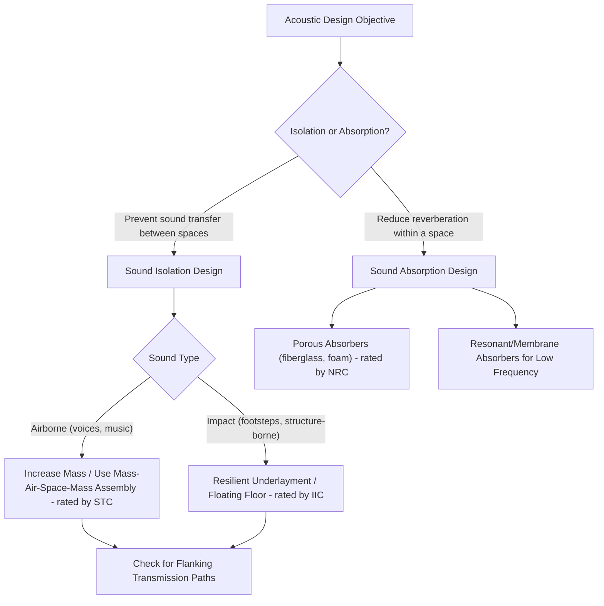

## Acoustic Properties Relevant to Construction

### Overview

Acoustic properties govern how construction materials and assemblies interact with sound energy — whether by blocking its transmission, absorbing it to reduce reverberation, or, in some cases, transmitting structure-borne vibration. These properties are governed by a combination of material density, stiffness, damping capacity, and porosity, and are central to building design for occupant comfort, speech intelligibility, and regulatory compliance (noise ordinances, building code acoustic requirements for multi-family and commercial construction).

### Fundamental Acoustic Concepts

**Sound Pressure and the Decibel Scale**

Sound intensity is conventionally expressed on a logarithmic decibel (dB) scale because the human ear responds to an enormous range of sound pressures (spanning roughly 12 orders of magnitude from threshold of hearing to threshold of pain). Sound pressure level is defined as:

$$L_p = 20\log_{10}\left(\frac{p}{p_0}\right)$$

where $p$ is the measured sound pressure and $p_0$ is a reference pressure (conventionally $20\, \mu\text{Pa}$, approximating the threshold of human hearing). Because the scale is logarithmic, a 10 dB increase corresponds to a 10-fold increase in sound intensity but is perceived subjectively as roughly a doubling of loudness — an important distinction when interpreting acoustic performance ratings, since seemingly small dB differences can represent substantial actual differences in sound energy.

**Frequency and Human Hearing Sensitivity**

Human hearing sensitivity varies with frequency, generally most sensitive in the range relevant to speech (roughly 500 Hz–4 kHz) and less sensitive at very low and very high frequencies. This is why acoustic ratings often use frequency-weighted metrics (discussed below) rather than simple broadband sound level measurements, to better correlate with subjective human perception of building acoustic performance.

### Two Distinct Acoustic Design Objectives

Construction acoustics generally addresses two related but mechanistically distinct objectives, which are frequently conflated by non-specialists but require different material solutions:

**Sound Isolation (Transmission Loss)**: preventing sound from passing from one space to another (e.g., between adjacent apartments, or from exterior traffic noise into a building interior) — governed primarily by mass, stiffness, and assembly design (isolation via decoupling)

**Sound Absorption**: reducing reverberation and reflected sound energy *within* a given space — governed primarily by surface porosity and material composition that converts acoustic energy into heat through friction within the material

A common design misunderstanding is assuming a highly sound-*absorptive* material (e.g., acoustic foam) will also provide good sound *isolation* between rooms — in fact, lightweight, porous absorptive materials are typically poor sound isolators, since isolation depends primarily on mass and assembly stiffness rather than surface porosity.

### Sound Transmission Loss and Mass

**Transmission Loss (TL)** quantifies how much sound energy an assembly (wall, floor, partition) blocks, expressed in dB, and is frequency-dependent. Transmission loss for a single, limp (non-rigid) panel is governed approximately by the **mass law**:

$$TL \approx 20\log_{10}(f \cdot m) - C$$

where $f$ is frequency, $m$ is the surface mass (mass per unit area) of the panel, and $C$ is a constant depending on the specific formulation and units used. The key practical implication of the mass law is that **transmission loss increases by approximately 6 dB for each doubling of either surface mass or frequency** — meaning heavier, denser materials generally provide better sound isolation for a given assembly type, all else being equal.

**Sound Transmission Class (STC)**: a single-number rating derived from an assembly's transmission loss measured across a standard range of frequencies (typically 125 Hz to 4000 Hz), providing a simplified, commonly specified metric for comparing wall, floor, ceiling, and window/door assembly sound isolation performance in building codes and specifications. Higher STC ratings indicate better sound isolation performance.

### Beyond Simple Mass: The Mass-Air-Space-Mass Principle

While the mass law explains single-panel behavior, real wall and floor assemblies often use a **decoupled, multi-layer construction** (e.g., two separate gypsum board layers separated by an air gap or resilient framing) to achieve substantially better transmission loss than a single panel of equivalent total mass would provide. This works because:

- The air gap (or resilient connection) mechanically **decouples** the two mass layers, preventing direct rigid-body vibration transfer between them
- Each interface (mass-air, air-mass) provides additional impedance mismatch that reflects/attenuates sound energy
- This mass-air-space-mass configuration behaves somewhat like a mechanical low-pass filter/spring-mass-spring system, providing transmission loss well in excess of what the mass law alone would predict for the same total assembly mass

This principle underlies common high-performance sound-isolation assemblies: staggered-stud or double-stud wall framing (avoiding a continuous rigid stud path between the two wall faces), resilient channel mounting of gypsum board, and floating floor systems (a structural floor layer mechanically isolated from the finish floor via resilient material).

### Mass-Air-Space-Mass Assembly Concept (SVG)

<svg xmlns="http://www.w3.org/2000/svg" viewBox="0 0 700 380" font-family="Arial, sans-serif">
<text x="350" y="25" font-size="16" font-weight="bold" text-anchor="middle">Decoupled Wall Assembly Concept (svg_diagram)</text>

<rect x="70" y="80" width="30" height="220" fill="#aeb6bf" stroke="black" />
<text x="85" y="320" font-size="11" text-anchor="middle">Single Panel</text>
<text x="85" y="335" font-size="10" text-anchor="middle" font-style="italic">(Mass Law only)</text>

<path d="M 20 190 C 40 170, 55 210, 70 190" stroke="#b03a2e" stroke-width="2" fill="none" />
<path d="M 100 190 C 130 170, 150 210, 175 190" stroke="#b03a2e" stroke-width="2" fill="none" />
<text x="145" y="150" font-size="10" fill="#b03a2e">Moderate attenuation</text>

<rect x="280" y="80" width="20" height="220" fill="#aeb6bf" stroke="black" />
<rect x="440" y="80" width="20" height="220" fill="#aeb6bf" stroke="black" />
<rect x="300" y="80" width="140" height="220" fill="#eaf2f8" stroke="none" />
<text x="370" y="320" font-size="11" text-anchor="middle">Decoupled Double-Wall</text>
<text x="370" y="335" font-size="10" text-anchor="middle" font-style="italic">(Mass-Air-Space-Mass)</text>
<text x="370" y="195" font-size="10" text-anchor="middle" fill="#1a5276">Air Gap / Resilient Channel</text>

<path d="M 230 190 C 250 170, 265 210, 280 190" stroke="#b03a2e" stroke-width="2" fill="none" />
<path d="M 460 190 C 480 175, 490 200, 500 195" stroke="#b03a2e" stroke-width="1" stroke-dasharray="2,2" fill="none" />
<text x="540" y="150" font-size="10" fill="#b03a2e">Substantially greater attenuation</text>
</svg>

### Sound Absorption

**Absorption Coefficient ($\alpha$)**: a frequency-dependent value between 0 (fully reflective) and 1 (fully absorptive) describing the fraction of incident sound energy absorbed rather than reflected by a material surface.

**Porous Absorbers**: materials like fiberglass insulation, mineral wool, and acoustic foam absorb sound energy primarily through **viscous friction** as sound waves propagate into the interconnected pore structure, converting acoustic energy into small amounts of heat. Absorption generally increases with material thickness and is most effective at mid-to-high frequencies for typical building insulation thicknesses, since low-frequency (long wavelength) sound requires proportionally thicker absorptive material to be effectively absorbed.

**Resonant/Membrane Absorbers**: perforated panels or membrane systems tuned to absorb specific frequency ranges via resonance effects, often used to target problematic low-frequency reverberation that porous absorbers alone handle less effectively.

**Noise Reduction Coefficient (NRC)**: a single-number average of a material's absorption coefficients across a standard set of mid-frequency bands, commonly used as a simplified specification metric for interior finish materials (ceiling tiles, wall panels) in room acoustic design, analogous in role to how STC simplifies transmission loss data.

### Impact Sound and Structure-Borne Noise

A distinct acoustic transmission pathway relevant particularly to multi-family floor/ceiling assemblies is **impact sound** (e.g., footsteps, dropped objects) transmitted as structure-borne vibration through the floor structure itself, as opposed to **airborne sound** transmitted through the air and then through the assembly. Impact sound isolation is quantified by the **Impact Insulation Class (IIC)**, a separate rating from STC, since a floor assembly can perform very differently for impact versus airborne sound depending on its construction.

**Impact sound mitigation strategies** include:

- **Resilient underlayment**: a resilient material layer beneath the finish flooring (carpet pad, cork, or specialized acoustic underlayment) that absorbs/decouples impact energy before it reaches the structural floor
- **Floating floor systems**: a finish floor layer mechanically isolated (floated) from the structural floor slab via a resilient interlayer, directly analogous to the mass-air-space-mass principle applied vertically
- **Carpet and soft floor coverings**: inherently better for impact sound than hard-surface flooring (tile, hardwood) directly bonded to a structural floor, since soft coverings absorb impact energy at the point of contact

### Flanking Transmission

Even a wall or floor assembly with excellent laboratory-measured STC/IIC can underperform significantly in the field due to **flanking transmission** — sound bypassing the primary partition via indirect paths such as continuous structural framing members, shared ductwork, electrical outlet penetrations, gaps around pipe penetrations, or a continuous floor/ceiling structure spanning beneath a supposedly isolating wall. Addressing flanking paths (sealing penetrations, structurally isolating framing where the assembly design intends decoupling, using acoustic sealant at wall-floor-ceiling junctions) is frequently as important to real-world acoustic performance as the primary partition's inherent laboratory rating, and is a common source of discrepancy between lab-tested and field-measured acoustic performance.

### Acoustic Design Decision Flow (Mermaid)

### Worked Example: Mass Law Estimation

A single gypsum board partition has a surface mass of 10 kg/m². Using the simplified mass-law relationship, if surface mass is doubled to 20 kg/m² (e.g., by adding a second layer of gypsum board directly laminated to the first, without an air gap), the mass law predicts a transmission loss improvement of approximately:

$$\Delta TL \approx 20\log_{10}(2) \approx 6\,\text{dB}$$

However, if instead of directly laminating the second layer, the designer creates a **decoupled** double-wall assembly (separate stud framing or resilient channel, with an air gap between the two gypsum layers) using the same total mass, the mass-air-space-mass effect typically provides substantially **greater** improvement than the roughly 6 dB predicted by mass alone — often achieving STC improvements of 10-15+ points beyond a comparably massed single or directly-laminated assembly [Inference: the exact magnitude of improvement is highly assembly-specific, depending on air gap width, framing type/spacing, and insulation fill, and should be verified against tested assembly data (e.g., manufacturer STC-rated assembly listings) rather than estimated from the simplified mass law alone, since the mass law does not capture decoupling effects]. This example illustrates why acoustic design guidance consistently favors decoupled assembly strategies over simply adding mass when significant sound isolation improvement is required within limited wall thickness.

### Practical Material Selection Summary

| Material/Strategy | Primary Acoustic Function | Governing Property |
| --- | --- | --- |
| Dense materials (concrete, multiple gypsum layers) | Sound isolation (transmission loss) | Mass (per mass law) |
| Decoupled/staggered stud framing | Enhanced isolation beyond mass alone | Mechanical decoupling |
| Fiberglass/mineral wool cavity insulation | Absorption within wall cavity, improving assembly STC | Porosity/friction absorption |
| Acoustic ceiling tile, wall panels | Reduce room reverberation | Surface porosity (NRC) |
| Resilient underlayment, floating floors | Impact sound isolation | Decoupling/damping |
| Acoustic sealant at penetrations/junctions | Prevent flanking transmission | Airtight seal |

**Related Topics**

- STC and IIC rating systems and standardized test methods
- Mass law and its limitations for multi-layer assemblies
- Flanking transmission diagnosis and mitigation
- Room acoustics: reverberation time and the Sabine equation
- Vibration isolation for mechanical equipment in buildings
- Building code acoustic performance requirements for multi-family construction
- Damping materials and viscoelastic constrained-layer damping
- Material porosity and its relationship to both thermal and acoustic performance