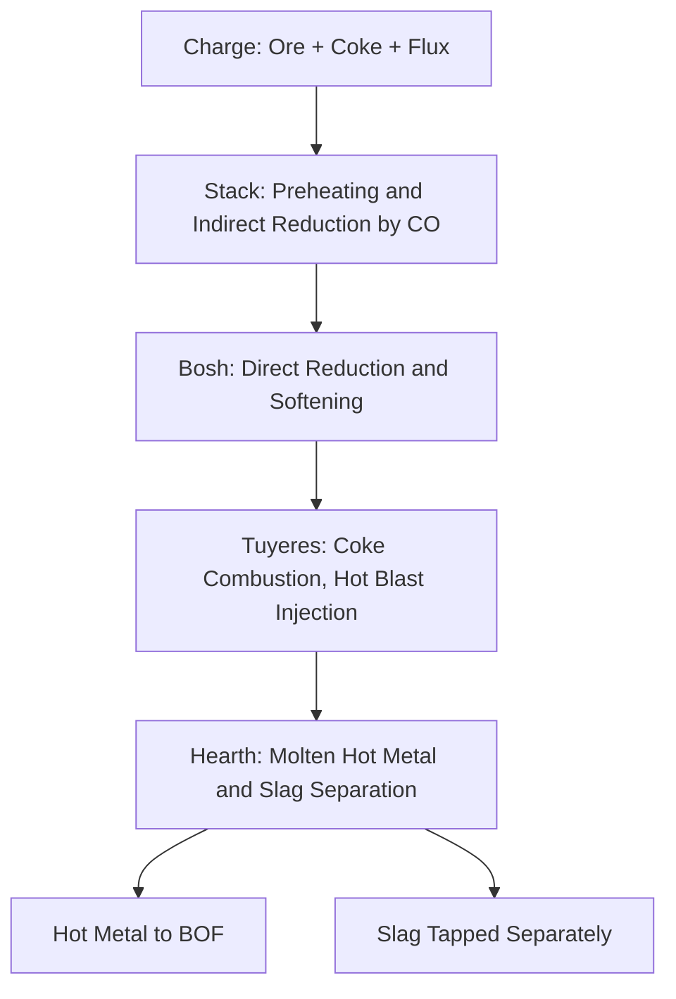
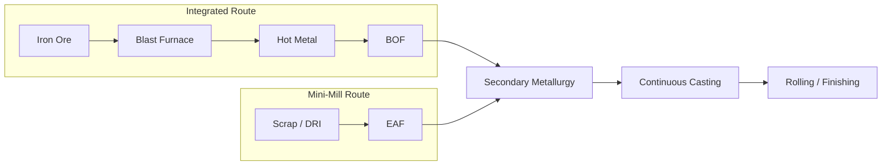

## Iron Production and Steelmaking Processes

### Overview

Iron and steel production is a sequence of physicochemical transformations that convert iron ore (primarily iron oxides) into usable metallic products. The overall pathway moves from ore beneficiation through ironmaking (blast furnace or direct reduction), to steelmaking (oxygen or electric arc refining), and finally to secondary metallurgy and casting. Steel is fundamentally an iron-carbon alloy, with carbon content distinguishing it from cast iron and wrought iron.

### Raw Materials

**Key Points**

- Iron ore: primarily hematite ($Fe_2O_3$) and magnetite ($Fe_3O_4$); typically beneficiated to 60–68% Fe content pellets or sinter
- Coke: produced by pyrolysis of coking coal in the absence of oxygen; serves as fuel, reducing agent, and structural support in the blast furnace burden
- Limestone ($CaCO_3$) or dolomite: flux material that combines with silica and other gangue impurities to form slag
- Scrap steel: recycled feedstock, dominant input for electric arc furnace (EAF) routes

### Ironmaking Route 1: Blast Furnace (BF)

The blast furnace is a continuous countercurrent reactor. Ore, coke, and flux are charged from the top; preheated air (or oxygen-enriched air) is blown in near the bottom (tuyeres).

**Key Points**

- Coke combustion at tuyeres generates carbon monoxide and heat:

  $$2C + O_2 \rightarrow 2CO$$
- Indirect reduction of iron oxides by CO occurs in the upper/middle shaft (stepwise reduction):

  $$3Fe_2O_3 + CO \rightarrow 2Fe_3O_4 + CO_2$$

  $$Fe_3O_4 + CO \rightarrow 3FeO + CO_2$$

  $$FeO + CO \rightarrow Fe + CO_2$$
- Direct reduction by carbon occurs at higher temperatures near the bosh/hearth:

  $$FeO + C \rightarrow Fe + CO$$
- Limestone calcines and fluxes silica gangue into slag:

  $$CaCO_3 \rightarrow CaO + CO_2$$

  $$CaO + SiO_2 \rightarrow CaSiO_3 \text{ (slag)}$$
- Molten iron (hot metal) collects in the hearth, saturated with 3.5–4.5% carbon plus Si, Mn, P, S impurities; this is **pig iron** or hot metal
- Furnace operates continuously for years between relines; internal temperatures range from ~200°C at the throat to ~2000°C at the tuyeres

### Ironmaking Route 2: Direct Reduction (DRI)

Direct reduction produces solid metallic iron (sponge iron) below the melting point of iron, using reducing gases (CO, $H_2$) or, in emerging processes, pure hydrogen.

**Key Points**

- Common processes: MIDREX and HYL/Energiron (gas-based, shaft furnace); rotary kiln coal-based processes (e.g., SL/RN)
- Reduction reaction using syngas:

  $$Fe_2O_3 + 3CO \rightarrow 2Fe + 3CO_2$$

  $$Fe_2O_3 + 3H_2 \rightarrow 2Fe + 3H_2O$$
- Product is DRI (direct reduced iron) or HBI (hot briquetted iron) when compacted for storage/transport stability
- DRI is primarily used as a clean, low-residual charge material for EAF steelmaking
- [Inference] Hydrogen-based DRI ("H-DRI") is increasingly deployed as a decarbonization pathway since it eliminates $CO_2$ generation from reduction chemistry when green hydrogen is used, though industrial-scale adoption and economics remain in active development as of recent years

### Steelmaking Route 1: Basic Oxygen Furnace (BOF)

BOF (also called BOS, Basic Oxygen Steelmaking, or LD process) converts hot metal from the blast furnace into steel by oxidizing excess carbon and impurities.

**Key Points**

- Molten hot metal (~4% C) plus steel scrap (typically 10–30% of charge) loaded into a tiltable vessel
- High-purity oxygen lance blown onto/into the melt at supersonic velocity
- Oxidation reactions reduce carbon and remove impurities:

  $$C + \tfrac{1}{2}O_2 \rightarrow CO$$

  $$Si + O_2 \rightarrow SiO_2$$

  $$Mn + \tfrac{1}{2}O_2 \rightarrow MnO$$

  $$2P + \tfrac{5}{2}O_2 \rightarrow P_2O_5$$
- Lime (CaO) added to form basic slag, which absorbs $P_2O_5$ and $SiO_2$
- Process duration: typically 15–20 minutes per heat ("blow"), enabling very high throughput (100–400 tonnes per heat)
- Exothermic reactions supply sufficient heat; no external fuel required during the blow

### Steelmaking Route 2: Electric Arc Furnace (EAF)

EAF melts primarily scrap steel (and/or DRI/HBI) using electric arcs between graphite electrodes and the charge.

**Key Points**

- Three-phase electrodes strike arcs to the metallic charge, generating melting temperatures via resistive and radiative heating
- Charge flexibility: scrap, DRI, HBI, pig iron in varying proportions
- Refining accomplished through oxygen lancing, slag formers (lime, fluorspar), and alloy additions
- Lower capital intensity per tonne and higher feedstock flexibility than integrated BF-BOF routes; well suited to mini-mill operations
- [Inference] EAF steelmaking generally has a substantially lower carbon footprint per tonne than the BF-BOF route when powered by low-carbon electricity, since it bypasses coke-based ore reduction entirely

### Secondary Metallurgy (Ladle Refining)

After primary steelmaking, molten steel undergoes ladle-stage refining to achieve precise chemistry and cleanliness.

**Key Points**

- Ladle furnace: electrode reheating maintains temperature during alloying and trimming
- Vacuum degassing (e.g., RH degasser, VD/VOD): removes dissolved hydrogen, nitrogen, and reduces carbon to ultra-low levels
- Alloying additions: ferroalloys (FeMn, FeSi, FeCr, FeV) added to hit target composition
- Inclusion modification: calcium treatment converts hard alumina inclusions to softer, less harmful globular inclusions
- Deoxidation: aluminum or silicon added to remove dissolved oxygen ("killing" the steel), producing killed steel with minimal porosity

### Casting and Solidification

**Key Points**

- Continuous casting: molten steel poured into a water-cooled copper mold, withdrawn as a solidifying strand, then cut into slabs, blooms, or billets
- Ingot casting: legacy batch method, still used for specialty/forging-grade steels
- Solidification structure (columnar to equiaxed transition) affects segregation and subsequent mechanical properties
- Slabs feed flat-rolled products (plate, sheet, coil); blooms/billets feed long products (structural sections, bar, rod)

### Comparison of BF-BOF vs. EAF Routes

| Aspect | BF-BOF (Integrated) | EAF (Mini-Mill) |
| --- | --- | --- |
| Primary feedstock | Iron ore, coke, flux | Scrap, DRI/HBI |
| Typical capacity per unit | Very large (continuous BF) | Flexible, batch |
| Capital intensity | High | Moderate |
| $CO_2$ intensity | Higher (coke-based reduction) | Lower (feedstock/grid dependent) |
| Product flexibility | Broad, including high-purity flat products | Broad, historically strong in long products |

### Worked Example: Mass Balance Concept

**Example**

For a simplified BOF charge of 200 t hot metal at 4.0% C targeting a finished steel carbon content of 0.20% C, the mass of carbon oxidized (ignoring scrap dilution and yield losses) is:

$$\Delta C = 200{,}000 \text{ kg} \times (0.040 - 0.0020) = 7{,}600 \text{ kg carbon removed}$$

This carbon is oxidized predominantly to CO gas, captured as BOF off-gas, which can be cleaned and used as a fuel source elsewhere in the plant. [Unverified: exact yield and capture efficiency vary by plant configuration and are not standardized figures.]

### Process Flow Diagram (svg_diagram)

<svg xmlns="http://www.w3.org/2000/svg" viewBox="0 0 800 320">
<text x="400" y="24" font-size="16" font-weight="bold" text-anchor="middle">Iron and Steel Production Chain (svg_diagram)</text>
<rect x="20" y="60" width="140" height="50" rx="6" fill="#dbe9f6" stroke="#2b6cb0" />
<text x="90" y="90" font-size="12" text-anchor="middle">Iron Ore + Coke + Flux</text>
<rect x="200" y="60" width="140" height="50" rx="6" fill="#dbe9f6" stroke="#2b6cb0" />
<text x="270" y="85" font-size="12" text-anchor="middle">Blast Furnace</text>
<text x="270" y="100" font-size="10" text-anchor="middle">(Ironmaking)</text>
<rect x="380" y="60" width="140" height="50" rx="6" fill="#fbe5d0" stroke="#c05621" />
<text x="450" y="85" font-size="12" text-anchor="middle">Hot Metal</text>
<text x="450" y="100" font-size="10" text-anchor="middle">(~4% C)</text>
<rect x="560" y="60" width="140" height="50" rx="6" fill="#e2d9f3" stroke="#553c9a" />
<text x="630" y="85" font-size="12" text-anchor="middle">BOF</text>
<text x="630" y="100" font-size="10" text-anchor="middle">(Steelmaking)</text>
<rect x="20" y="180" width="140" height="50" rx="6" fill="#dbe9f6" stroke="#2b6cb0" />
<text x="90" y="205" font-size="12" text-anchor="middle">Scrap / DRI</text>
<rect x="200" y="180" width="140" height="50" rx="6" fill="#e2d9f3" stroke="#553c9a" />
<text x="270" y="205" font-size="12" text-anchor="middle">EAF</text>
<text x="270" y="220" font-size="10" text-anchor="middle">(Steelmaking)</text>
<rect x="380" y="140" width="140" height="50" rx="6" fill="#d5f0e0" stroke="#2f855a" />
<text x="450" y="165" font-size="12" text-anchor="middle">Ladle Refining</text>
<text x="450" y="180" font-size="10" text-anchor="middle">(Secondary Metallurgy)</text>
<rect x="560" y="140" width="140" height="50" rx="6" fill="#fdf1c7" stroke="#b7791f" />
<text x="630" y="165" font-size="12" text-anchor="middle">Continuous Casting</text>
<line x1="160" y1="85" x2="200" y2="85" stroke="#333" marker-end="url(#arrow)" />
<line x1="340" y1="85" x2="380" y2="85" stroke="#333" marker-end="url(#arrow)" />
<line x1="520" y1="85" x2="560" y2="85" stroke="#333" marker-end="url(#arrow)" />
<line x1="160" y1="205" x2="200" y2="205" stroke="#333" marker-end="url(#arrow)" />
<line x1="630" y1="110" x2="630" y2="140" stroke="#333" marker-end="url(#arrow)" />
<line x1="340" y1="205" x2="450" y2="205" stroke="#333" marker-end="url(#arrow)" />
<line x1="450" y1="205" x2="450" y2="190" stroke="#333" marker-end="url(#arrow)" />
<line x1="520" y1="165" x2="560" y2="165" stroke="#333" marker-end="url(#arrow)" />
</svg>

### Conclusion

Iron and steel production integrates thermochemical reduction, oxidative refining, and controlled solidification to convert raw ore or scrap into engineered steel products. The choice between the BF-BOF and EAF routes reflects trade-offs in feedstock availability, capital investment, product mix, and increasingly, carbon intensity targets.

**Related Topics**

- Classification of Steels (Carbon, Alloy, Stainless)
- Iron-Carbon Phase Diagram and Microstructures
- Heat Treatment of Steel (Annealing, Normalizing, Quenching, Tempering)
- Cast Iron Types (Gray, Ductile, White, Malleable)
- Structural Steel Grades and Specifications (ASTM A36, A992, etc.)
- Corrosion of Ferrous Metals and Protective Coatings
- Hydrogen-Based Steelmaking and Decarbonization Pathways