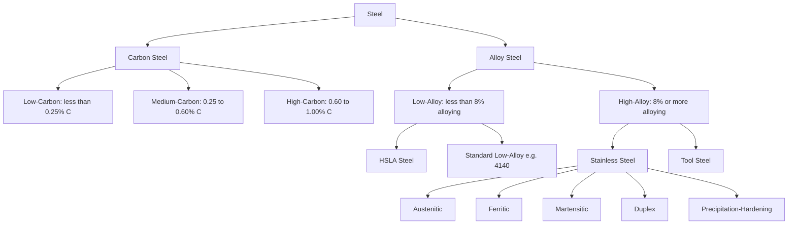

## Classification of Carbon and Alloy Steels

### Overview

Steel classification systems organize the vast range of iron-carbon alloys by chemical composition, primary alloying strategy, and application-driven property targets. The two broadest categories are carbon steels (iron-carbon with only incidental alloying elements) and alloy steels (deliberate additions of elements beyond carbon to achieve specific mechanical, thermal, or corrosion properties).

### Carbon Steel Classification

Carbon steels are classified by carbon content, which directly controls hardness, strength, and ductility through its effect on microstructure.

**Key Points**

- **Low-carbon (mild) steel**: 0.05–0.25% C; soft, ductile, readily weldable; used for structural shapes, sheet, wire, pipe
- **Medium-carbon steel**: 0.25–0.60% C; higher strength and hardness with reduced ductility; used for gears, axles, machine parts, rail
- **High-carbon steel**: 0.60–1.00% C; high hardness and wear resistance after heat treatment, lower ductility; used for cutting tools, springs, high-strength wire
- **Ultra-high-carbon steel**: 1.00–2.00% C; very high hardness, limited toughness; specialty and historical applications (e.g., Damascus-type steels)

Carbon content also determines which phases form on cooling, governed by the iron-iron carbide phase diagram: hypoeutectoid steels (<0.8% C) form proeutectoid ferrite plus pearlite; eutectoid steel (0.8% C) forms pearlite only; hypereutectoid steels (>0.8% C) form proeutectoid cementite plus pearlite.

### AISI/SAE Designation System

**Key Points**

- Four-digit numbering system: first two digits indicate primary alloying element(s); last two (or three for high-carbon) digits indicate carbon content in hundredths of a percent
- 10XX series: plain carbon steel (e.g., 1020 = 0.20% C plain carbon; 1045 = 0.45% C)
- 11XX series: resulfurized free-machining carbon steel
- 13XX: manganese steel
- 40XX: molybdenum steel
- 41XX: chromium-molybdenum steel (widely used structural/machinery alloy, e.g., 4140, 4340)
- 43XX: nickel-chromium-molybdenum steel
- 51XX: chromium steel
- 61XX: chromium-vanadium steel
- 86XX/87XX: nickel-chromium-molybdenum, lower alloy content variants
- 92XX: silicon-manganese steel (common spring steel)

**Example**

AISI 4340 decodes as: "4" = nickel-chromium-molybdenum family, "3" = specific sub-grade within that family, "40" = 0.40% carbon. This grade is widely used for high-strength aircraft and machinery components requiring good toughness after quench-and-temper heat treatment.

### Alloy Steel Classification by Alloying Purpose

Alloy steels contain deliberate additions of elements such as Cr, Ni, Mo, V, W, Mn (above ~1.65%), Si (above ~0.60%), or Cu (above ~0.60%) to modify base carbon-steel behavior.

**Key Points**

- **Low-alloy steel**: total alloying content typically below 8%; improves hardenability, strength, and toughness while retaining reasonable weldability and cost
- **High-alloy steel**: total alloying content above 8%; includes stainless steels, tool steels, and specialty alloys with substantially altered corrosion resistance or high-temperature performance
- **High-Strength Low-Alloy (HSLA) steel**: small additions (<0.15% total) of Nb, V, Ti; achieves strength through microalloying-induced grain refinement and precipitation hardening rather than bulk alloy content; widely used in structural and automotive applications for weight reduction

### Effects of Common Alloying Elements

| Element | Primary Effect |
| --- | --- |
| Manganese (Mn) | Increases hardenability, strength; counteracts sulfur embrittlement |
| Chromium (Cr) | Increases hardenability, wear and corrosion resistance |
| Nickel (Ni) | Improves toughness and low-temperature impact resistance |
| Molybdenum (Mo) | Increases hardenability, reduces temper embrittlement, improves high-temperature strength |
| Vanadium (V) | Refines grain structure, forms carbides for wear resistance |
| Silicon (Si) | Deoxidizer; increases strength and elasticity (spring steels) |
| Sulfur (S) | Improves machinability (as MnS inclusions); generally an impurity otherwise |
| Phosphorus (P) | Increases strength/hardness slightly; generally embrittling, kept low |
| Tungsten (W) | Forms hard carbides; retains hardness at elevated temperature (tool steels) |

### Stainless Steel Subclassification

Stainless steels are high-alloy steels with a minimum of approximately 10.5% chromium, which forms a passive chromium oxide surface layer.

**Key Points**

- **Austenitic** (300 series, e.g., 304, 316): Cr-Ni based, non-magnetic, excellent corrosion resistance and formability; not hardenable by heat treatment
- **Ferritic** (400 series, e.g., 430): Cr-based, magnetic, moderate corrosion resistance, lower cost than austenitic
- **Martensitic** (400 series, e.g., 410, 420): hardenable by heat treatment, magnetic, used where hardness/wear resistance is prioritized over corrosion resistance
- **Duplex**: mixed austenitic-ferritic microstructure; combines high strength with good corrosion resistance, used in aggressive chemical/marine environments
- **Precipitation-hardening (PH)**: e.g., 17-4 PH; hardened via aging heat treatment forming fine precipitates, combining high strength with corrosion resistance

### Tool Steel Subclassification

**Key Points**

- **Water-hardening (W)**: high carbon, minimal alloying, economical but low hardenability depth
- **Cold-work (O, A, D series)**: oil-hardening, air-hardening, or high-carbon high-chromium; used for dies, punches, shear blades
- **Hot-work (H series)**: Cr-Mo-V alloyed for strength retention at elevated temperature; die casting and forging dies
- **High-speed steel (M, T series)**: Mo-based (M) or W-based (T); retains cutting-edge hardness at high temperature; used in cutting tools
- **Shock-resisting (S series)**: optimized for toughness under impact loading

### Classification Overview Diagram

### Structural and Civil Engineering Relevance

**Key Points**

- ASTM A36: standard structural carbon steel, minimum yield strength 250 MPa (36 ksi), widely used for structural shapes and plates
- ASTM A992: preferred for wide-flange structural shapes in building construction, minimum yield 345 MPa (50 ksi) with tighter yield-to-tensile ratio control for seismic performance
- ASTM A572: high-strength low-alloy structural steel, available in multiple grades (42, 50, 60, 65 ksi yield)
- Reinforcing bar (rebar): ASTM A615 (carbon steel) and A706 (low-alloy, improved weldability for seismic applications)
- Weathering steel (ASTM A588/A242): Cu-Cr-Ni alloyed HSLA steel forming a stable protective oxide patina, reducing long-term maintenance painting needs on exposed structures

### Comparative Summary

| Category | Alloying Level | Typical Yield Strength | Primary Selection Driver |
| --- | --- | --- | --- |
| Plain carbon steel | Minimal | 200–400 MPa | Cost, general structural/mechanical use |
| HSLA steel | Microalloyed | 300–550 MPa | Strength-to-weight, weldability |
| Low-alloy steel (e.g., 4140) | Moderate | Varies with heat treatment, up to 1000+ MPa | Hardenability, toughness, wear resistance |
| Stainless steel | High (Cr/Ni based) | 200–1000+ MPa depending on type | Corrosion resistance |
| Tool steel | High (carbide formers) | N/A (hardness-focused) | Wear resistance, cutting/forming performance |

**Conclusion**

Steel classification links composition directly to achievable microstructure and, therefore, to mechanical and environmental performance. Carbon content sets the baseline strength-ductility trade-off, while deliberate alloying extends steel's capability into hardenability, corrosion resistance, high-temperature service, and wear resistance, with standardized designation systems (AISI/SAE, ASTM) allowing engineers to specify grades reliably across industries.

**Related Topics**

- Iron-Carbon Phase Diagram and Microstructures
- Heat Treatment of Steel (Annealing, Normalizing, Quenching, Tempering)
- Hardenability and the Jominy End-Quench Test
- Structural Steel Design per AISC Specifications
- Corrosion Mechanisms and Protection of Steel
- Weldability of Carbon and Alloy Steels
- Rebar Grades and Reinforced Concrete Design