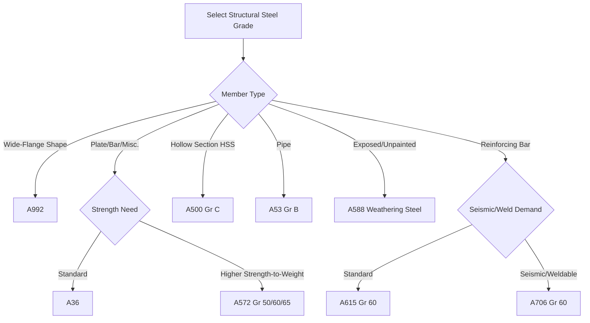

## Structural Steel Grades and Designations

### Overview

Structural steel grades are standardized material specifications that define mechanical properties, chemical composition limits, and quality requirements for steel used in load-bearing construction applications. In the United States, ASTM International standards govern these designations; internationally, systems such as EN 10025 (Europe) and various national standards apply analogous frameworks. Grade selection drives structural design capacity, weldability, ductility demand satisfaction, and long-term durability.

### Core Mechanical Property Parameters

**Key Points**

- **Yield strength ($F_y$)**: stress at which the material begins plastic deformation; primary basis for allowable and design strength in structural calculations
- **Tensile strength ($F_u$)**: ultimate stress before fracture; used to check rupture limit states (e.g., bolted connection net section)
- **Yield-to-tensile ratio ($F_y/F_u$)**: lower ratios indicate greater reserve ductility beyond yield, important for seismic energy dissipation
- **Elongation**: percentage strain at fracture over a gauge length, indicating ductility
- **Charpy V-notch (CVN) toughness**: energy absorbed in an impact test at a specified temperature; governs brittle fracture resistance, particularly relevant for low-temperature service or fracture-critical members

### ASTM A36 — General Structural Steel

**Key Points**

- Minimum yield strength: 250 MPa (36 ksi); tensile strength: 400–550 MPa (58–80 ksi)
- Carbon steel with modest manganese content; good weldability
- Historically the default general-purpose structural steel for plates, bars, and shapes
- Largely superseded by A992 for wide-flange shapes in building construction but remains common for plates and miscellaneous steel

### ASTM A992 — Wide-Flange Structural Shapes

**Key Points**

- Minimum yield strength: 345 MPa (50 ksi); tensile strength: 450–620 MPa (65–90 ksi)
- Maximum yield-to-tensile ratio capped at 0.85, ensuring ductile reserve capacity important for seismic performance
- Required for W-shapes under AISC specifications since the early 2000s, effectively replacing A36 and A572 Gr. 50 as the standard rolled wide-flange material
- Additional requirements on carbon equivalent for weldability control

### ASTM A572 — High-Strength Low-Alloy Structural Steel

**Key Points**

- Available in multiple grades by yield strength: Grade 42 (290 MPa), Grade 50 (345 MPa), Grade 60 (415 MPa), Grade 65 (450 MPa)
- Achieves strength through microalloying (vanadium, niobium, or titanium) and controlled processing rather than high carbon content, preserving weldability
- Common for plates, bars, and shapes where higher strength-to-weight than A36 is desired

### ASTM A588 / A242 — Weathering (Atmospheric Corrosion-Resistant) Steel

**Key Points**

- Yield strength: 345 MPa (50 ksi) typical
- Contains copper, chromium, nickel, and phosphorus additions promoting formation of a stable, adherent oxide patina under cyclic wet-dry exposure
- Patina reduces long-term corrosion rate without painting, commonly used in bridges and exposed architectural structures
- [Inference] Performance depends on appropriate exposure conditions; poor detailing (e.g., continuous wetting, deicing salt exposure without drainage) can prevent proper patina formation and accelerate corrosion instead

### ASTM A500 / A53 — Hollow Structural Sections and Pipe

**Key Points**

- A500: cold-formed welded and seamless HSS (rectangular, square, round); Grade C most common, yield strength 345 MPa (50 ksi) for round, 315 MPa (46 ksi) for shaped sections historically, with A500 Grade C now unified at 50 ksi across shapes in current editions
- A53: standard pipe, used both for structural columns and piping applications, Grade B yield strength 240 MPa (35 ksi)

### ASTM A325 / A490 / F3125 — Structural Bolts

**Key Points**

- High-strength bolts for structural steel connections, now consolidated under ASTM F3125
- A325-equivalent (Type 1): tensile strength 830 MPa (120 ksi) for diameters up to 1 inch
- A490-equivalent: tensile strength 1040 MPa (150 ksi), used where higher connection capacity is needed
- Installed to specified pretension via turn-of-nut, calibrated wrench, twist-off (tension-control), or direct tension indicator methods

### ASTM A615 / A706 — Reinforcing Steel

**Key Points**

- A615: carbon steel deformed and plain bars, Grades 40, 60, 75, 80, 100 (denoting yield strength in ksi); Grade 60 (420 MPa) is the conventional default in reinforced concrete
- A706: low-alloy reinforcing steel with tighter chemical and mechanical property control, including a maximum yield-to-tensile ratio and elongation requirements, specified where welding or seismic ductility demand governs

### Designation Comparison Table

| Standard | Typical Grade | Min. Yield (MPa / ksi) | Min. Tensile (MPa / ksi) | Primary Use |
| --- | --- | --- | --- | --- |
| A36 | — | 250 / 36 | 400–550 / 58–80 | General plates, bars, misc. steel |
| A992 | — | 345 / 50 | 450–620 / 65–90 | Wide-flange (W) shapes |
| A572 | Gr. 50 | 345 / 50 | 450 / 65 | HSLA plates, shapes, bars |
| A588 | — | 345 / 50 | 485 / 70 | Weathering/exposed steel |
| A500 | Gr. C | 345 / 50 | 425 / 62 | HSS tube sections |
| A53 | Gr. B | 240 / 35 | 415 / 60 | Structural/utility pipe |
| A615 | Gr. 60 | 420 / 60 | 620 / 90 | Reinforcing bar |
| A706 | Gr. 60 | 420 / 60 | 550 / 80 (max Fy/Fu 1.25) | Seismic/weldable rebar |

### Grade Selection Logic

### Weldability Considerations

**Key Points**

- Carbon equivalent (CE) formulas (e.g., IIW formula) estimate weldability and hydrogen cracking susceptibility from chemical composition:

  $$CE = C + \frac{Mn}{6} + \frac{Cr + Mo + V}{5} + \frac{Ni + Cu}{15}$$
- Lower CE generally indicates easier welding without extensive preheat; A992 and A572 specify controls supporting good weldability at typical structural thicknesses
- AWS D1.1 (Structural Welding Code – Steel) governs prequalified welding procedures compatible with these ASTM grades

### Fracture Toughness and Service Temperature

**Key Points**

- Fracture-critical members (e.g., certain bridge girders) may require supplemental Charpy V-notch testing (Zone 2 or Zone 3 designations under AASHTO/ASTM A709) based on minimum service temperature
- ASTM A709 is the AASHTO-referenced bridge steel specification, paralleling A36/A572/A992 grades but adding toughness zone requirements specific to bridge applications

**Conclusion**

Structural steel grade designations translate metallurgical composition and processing into standardized, code-referenceable mechanical properties. Selecting the correct grade requires matching yield/tensile strength demand, ductility (yield-to-tensile ratio) requirements for seismic design, weldability via carbon equivalent, and environmental exposure considerations such as weathering resistance or low-temperature toughness.

**Related Topics**

- AISC Specification for Structural Steel Buildings (ANSI/AISC 360)
- Load and Resistance Factor Design (LRFD) vs. Allowable Stress Design (ASD)
- Structural Welding Code Requirements (AWS D1.1)
- Bolted Connection Design and Slip-Critical Joints
- Seismic Design Categories and Ductile Detailing
- Fatigue and Fracture Mechanics in Steel Structures
- Corrosion Protection Systems for Structural Steel