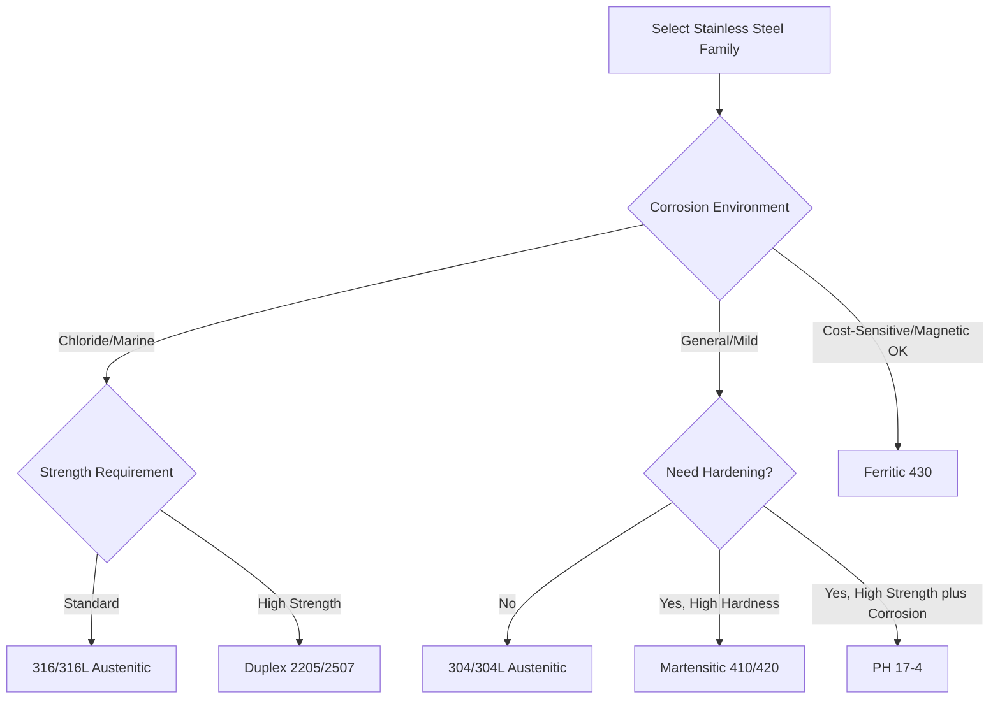

## Stainless Steels

### Overview

Stainless steels are iron-based alloys containing a minimum of approximately 10.5% chromium, which forms a thin, adherent, self-healing chromium oxide passive film on the surface. This passive layer provides corrosion resistance far exceeding plain carbon or low-alloy steels. Stainless steels are subdivided into five major families based on crystal structure and hardening mechanism: austenitic, ferritic, martensitic, duplex, and precipitation-hardening.

### Passivation Mechanism

**Key Points**

- Chromium reacts with atmospheric oxygen to form a nanometer-scale $Cr_2O_3$ film that is thermodynamically stable and largely impermeable to further oxidation
- The film self-repairs when mechanically damaged, provided sufficient oxygen and chromium are available at the surface
- Corrosion resistance improves with increasing chromium content and is further enhanced by molybdenum (pitting resistance) and nitrogen (pitting and strength)
- Passivation can be disrupted by chloride ions, reducing environments, or surface contamination (e.g., embedded carbon steel particles from fabrication), leading to localized attack

### Austenitic Stainless Steels (300 Series)

**Key Points**

- Face-centered cubic (FCC) austenite structure stabilized at room temperature by nickel (typically 8–20%) and chromium (16–26%)
- Non-magnetic in the annealed condition; not hardenable by heat treatment (only by cold working)
- Excellent formability, weldability, and toughness across a wide temperature range, including cryogenic service
- **Type 304**: Cr 18%, Ni 8%; general-purpose grade, widely used in food processing, architectural, and general corrosion-resistant applications
- **Type 316**: adds 2–3% molybdenum, substantially improving resistance to chloride-induced pitting and crevice corrosion; used in marine, chemical processing, and pharmaceutical applications
- **Low-carbon "L" grades** (304L, 316L): carbon capped at 0.03% to reduce sensitization (chromium carbide precipitation at grain boundaries during welding), which otherwise depletes chromium locally and promotes intergranular corrosion

### Ferritic Stainless Steels (400 Series)

**Key Points**

- Body-centered cubic (BCC) ferrite structure, chromium content typically 10.5–27%, low nickel
- Magnetic; not hardenable by heat treatment; lower ductility and toughness than austenitic grades, particularly at low temperature
- Generally lower cost than austenitic grades due to reduced nickel content
- **Type 430**: common general-purpose ferritic grade for automotive trim, appliances, decorative applications
- Susceptible to grain growth and embrittlement at elevated welding temperatures; often used in thinner sections where this is less critical

### Martensitic Stainless Steels (400 Series)

**Key Points**

- Body-centered tetragonal martensite structure achieved through quench-and-temper heat treatment, analogous to carbon/alloy steel hardening
- Magnetic; hardenable, offering the highest strength and hardness among stainless families but at reduced corrosion resistance relative to austenitic/ferritic grades
- **Type 410**: general-purpose martensitic grade for cutlery, valves, fasteners
- **Type 420**: higher carbon, used for cutting tools and surgical instruments requiring higher hardness
- Lower chromium content (typically 11.5–18%) than other families, since higher carbon (needed for hardening) requires balancing to avoid excessive carbide formation that would otherwise deplete free chromium

### Duplex Stainless Steels

**Key Points**

- Mixed microstructure of approximately 50% austenite and 50% ferrite, achieved through balanced chromium, nickel, molybdenum, and nitrogen content
- Combines higher strength (roughly double the yield strength of standard austenitic grades) with good ductility and superior resistance to chloride stress corrosion cracking
- **Standard duplex (2205)**: Cr ~22%, Ni ~5%, Mo ~3%, N ~0.15%
- **Super duplex (2507)**: higher alloy content for enhanced pitting resistance, used in demanding offshore and chemical processing environments
- Pitting Resistance Equivalent Number (PREN) commonly used to rank chloride resistance:

  $$PREN = \%Cr + 3.3(\%Mo) + 16(\%N)$$

### Precipitation-Hardening (PH) Stainless Steels

**Key Points**

- Achieve high strength through aging heat treatment that precipitates fine intermetallic particles (e.g., copper-rich phases) within a martensitic or semi-austenitic matrix
- **17-4 PH**: Cr ~17%, Ni ~4%, Cu ~4%; solution-treated then aged at 480–620°C depending on desired strength/toughness balance (H900 through H1150 condition designations)
- Combines strength comparable to alloy steels with corrosion resistance approaching standard stainless grades
- Used in aerospace, valve components, and high-strength fastener applications

### Family Comparison Table

| Family | Crystal Structure | Magnetic | Heat Treatable | Typical Cr / Ni | Relative Corrosion Resistance | Relative Strength |
| --- | --- | --- | --- | --- | --- | --- |
| Austenitic | FCC | No | No (work hardening only) | 18/8 typical | Excellent | Moderate |
| Ferritic | BCC | Yes | No | 11–27 / low | Good | Moderate |
| Martensitic | BCT (hardened) | Yes | Yes | 11.5–18 / low | Fair | High |
| Duplex | Mixed FCC/BCC | Yes (ferrite phase) | No | 22–25 / 5–7 | Excellent (chlorides) | High |
| PH | Martensitic + precipitates | Yes | Yes (aging) | 15–17 / 4–7 | Good | Very High |

### Selection Logic

### Welding Considerations

**Key Points**

- Austenitic grades: generally good weldability; low-carbon (L) or stabilized (Ti/Nb-bearing, e.g., 321, 347) grades preferred to avoid sensitization in heat-affected zones
- Ferritic grades: prone to grain coarsening and reduced toughness in the heat-affected zone; thinner sections and controlled heat input are typical mitigations
- Martensitic grades: require preheat and post-weld heat treatment to control hardness and cracking risk in the heat-affected zone due to martensite formation on cooling
- Duplex grades: welding parameters must maintain phase balance (avoiding excess ferrite or austenite) in the fusion zone, often requiring matching filler metal with controlled nitrogen content

### Civil Engineering and Structural Applications

**Key Points**

- Architectural cladding, handrails, and façade elements: predominantly Type 304/316 for appearance and durability
- Reinforcing bar in aggressive environments (marine, deicing salt exposure): stainless reinforcing per ASTM A955, often Type 316LN, used where extended service life offsets higher material cost
- Bridge components in coastal or high-chloride environments: duplex grades increasingly specified for expansion joints, cables, and fasteners due to superior stress corrosion cracking resistance
- [Inference] Life-cycle cost analysis often favors stainless steel in aggressive exposure conditions despite higher initial material cost, due to reduced maintenance and extended service life, though the crossover point depends heavily on project-specific factors

**Conclusion**

Stainless steel family selection balances corrosion resistance, mechanical strength, magnetic behavior, and fabricability against cost. Austenitic grades dominate general corrosion-resistant applications, martensitic and PH grades serve strength-critical uses, and duplex grades are increasingly specified where chloride exposure and high strength are simultaneously required.

**Related Topics**

- Pitting and Crevice Corrosion Mechanisms
- Passivation and Surface Treatment of Stainless Steel
- Welding Metallurgy of Stainless Steel
- Stress Corrosion Cracking in Chloride Environments
- Stainless Reinforcing Steel (ASTM A955)
- Nickel-Based Alloys for Severe Corrosion Service
- Life-Cycle Cost Analysis for Corrosion-Resistant Materials