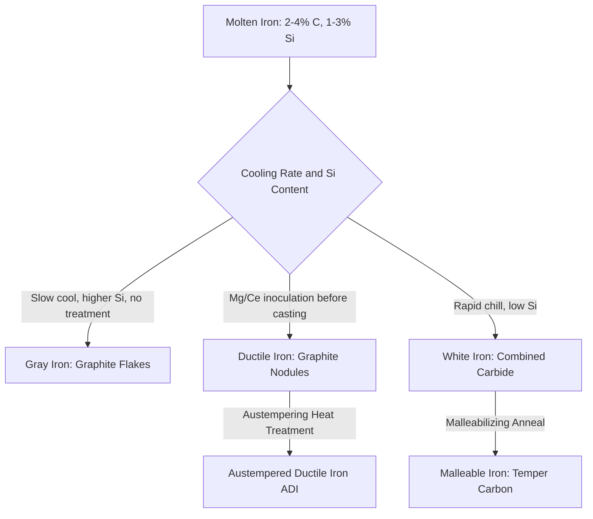

## Cast Irons: Gray, Ductile, White, and Malleable

### Overview

Cast irons are iron-carbon-silicon alloys with carbon content generally between 2% and 4%, well above the maximum solubility of carbon in austenite. This high carbon content, combined with silicon (typically 1–3%), controls whether carbon precipitates as free graphite or remains combined as iron carbide (cementite), which in turn determines the four principal cast iron types: gray, ductile (nodular), white, and malleable. Cast irons are valued for excellent castability, machinability, vibration damping, and compressive strength, though tensile ductility varies dramatically by type.

### Fundamental Metallurgy: Graphitization

**Key Points**

- Carbon in cast iron can exist as free graphite flakes/nodules or as combined cementite ($Fe_3C$); the balance is controlled by silicon content, cooling rate, and inoculation practice
- Higher silicon content and slower cooling promote graphitization (graphite formation); rapid cooling and low silicon suppress it, favoring cementite retention (white iron)
- The carbon equivalent (CE) value predicts solidification behavior:

  $$CE = \%C + \tfrac{1}{3}(\%Si + \%P)$$
- Graphite morphology (flake, nodular/spheroidal, or temper carbon aggregates) is the primary microstructural distinction between gray, ductile, and malleable iron

### Gray Cast Iron

**Key Points**

- Graphite precipitates as interconnected flakes within a pearlitic, ferritic, or mixed matrix
- Flake morphology creates internal stress concentrations, resulting in low tensile strength and near-zero ductility (elongation typically under 1%), while compressive strength remains high (roughly 3–4x tensile strength)
- Excellent vibration damping capacity due to graphite flake interfaces absorbing mechanical energy; widely used for machine tool bases, engine blocks
- Good machinability: graphite flakes act as chip breakers and provide self-lubrication during cutting
- ASTM A48 classification by tensile strength class (e.g., Class 20, 30, 40, corresponding approximately to minimum tensile strength in ksi)
- [Inference] The characteristic gray fracture surface appearance, from which the alloy takes its name, results directly from exposed graphite flakes at the fracture plane

### Ductile (Nodular/Spheroidal Graphite) Cast Iron

**Key Points**

- Graphite forms as discrete spherical nodules rather than flakes, achieved through inoculation with magnesium (and often cerium) immediately before casting
- Spherical graphite eliminates the stress-concentration effect of flakes, yielding substantially improved tensile strength and ductility (elongation commonly 5–25% depending on matrix structure) while retaining good castability
- Matrix structure (ferritic, pearlitic, or martensitic via heat treatment) can be tailored to balance strength, ductility, and hardness
- ASTM A536 designation format: (tensile strength ksi)-(yield strength ksi)-(% elongation), e.g., 65-45-12
- Used for automotive crankshafts, gears, pipe fittings, and pressure-containing components where gray iron's brittleness is unacceptable
- Austempered ductile iron (ADI): specialized heat treatment (austenitizing followed by austempering) producing an ausferrite matrix with strength-to-weight ratios competitive with steel, used in gears and heavy-duty structural components

### White Cast Iron

**Key Points**

- Carbon remains almost entirely combined as cementite ($Fe_3C$) rather than precipitating as graphite, achieved through low silicon content and/or rapid solidification (chilling)
- Extremely hard and wear-resistant but brittle, with essentially no tensile ductility
- Fracture surface appears white/silvery due to the absence of exposed graphite
- Used where abrasion resistance is paramount and impact loading is limited: mill liners, crusher components, wear plates
- Often produced as a "chilled" surface layer on gray iron castings (chilled iron castings), combining a wear-resistant white iron surface with a tougher gray iron core

### Malleable Cast Iron

**Key Points**

- Starting material is white cast iron, subsequently heat-treated (malleabilization) to decompose cementite into graphite aggregates called temper carbon
- Two-stage anneal: first stage graphitizes at approximately 900–950°C; second stage (for ferritic malleable iron) slow-cools through the eutectoid range to fully decompose remaining cementite, or is accelerated for pearlitic malleable iron to retain some combined carbon for higher strength
- Temper carbon nodules are irregular/rosette-shaped rather than the smooth spheres of ductile iron, but still avoid the stress concentration of gray iron flakes
- Produces good ductility (up to ~10-18% elongation for ferritic grades) and moderate-to-high strength, historically used for pipe fittings, small automotive/machinery components
- ASTM A47/A220 designations for ferritic and pearlitic malleable iron respectively
- Largely superseded by ductile iron in new designs since ductile iron achieves comparable properties directly from the melt without the added malleabilization heat treatment step, though malleable iron remains specified for legacy and specific fitting applications

### Comparative Property Table

| Type | Graphite Form | Tensile Strength (typical) | Elongation | Key Characteristic |
| --- | --- | --- | --- | --- |
| Gray | Flakes | 20–40 ksi (140–275 MPa) | <1% | Damping, machinability, low cost |
| Ductile | Spheroidal nodules | 60–120 ksi (415–825 MPa) | 2–25% | Strength/ductility combination |
| White | None (all combined carbide) | Low (brittle) | ~0% | Maximum hardness/wear resistance |
| Malleable | Temper carbon (irregular) | 40–90 ksi (275–620 MPa) | 2–18% | Ductility without direct spheroidizing |

### Process and Transformation Relationships

### Mechanical Behavior Illustration (svg_diagram)

<svg xmlns="http://www.w3.org/2000/svg" viewBox="0 0 700 260">
<text x="350" y="22" font-size="15" font-weight="bold" text-anchor="middle">Graphite Morphology Comparison (svg_diagram)</text>
<rect x="30" y="50" width="180" height="150" fill="none" stroke="#555" stroke-width="1" />
<text x="120" y="215" font-size="12" text-anchor="middle">Gray Iron (Flakes)</text>
<path d="M60,90 L90,100 L70,110" stroke="#333" stroke-width="3" fill="none" />
<path d="M110,80 L140,95 L120,105" stroke="#333" stroke-width="3" fill="none" />
<path d="M70,140 L100,150 L80,160" stroke="#333" stroke-width="3" fill="none" />
<path d="M130,130 L165,140 L140,155" stroke="#333" stroke-width="3" fill="none" />
<path d="M50,170 L85,180 L60,190" stroke="#333" stroke-width="3" fill="none" />
<rect x="260" y="50" width="180" height="150" fill="none" stroke="#555" stroke-width="1" />
<text x="350" y="215" font-size="12" text-anchor="middle">Ductile Iron (Nodules)</text>
<circle cx="300" cy="90" r="8" fill="#333" />
<circle cx="350" cy="110" r="9" fill="#333" />
<circle cx="400" cy="85" r="7" fill="#333" />
<circle cx="310" cy="150" r="8" fill="#333" />
<circle cx="370" cy="160" r="9" fill="#333" />
<circle cx="410" cy="140" r="7" fill="#333" />
<rect x="490" y="50" width="180" height="150" fill="none" stroke="#555" stroke-width="1" />
<text x="580" y="215" font-size="12" text-anchor="middle">Malleable Iron (Temper Carbon)</text>
<path d="M520,90 Q535,80 545,92 Q555,100 540,105 Q525,108 520,90 Z" fill="#333" />
<path d="M580,110 Q595,100 605,112 Q615,120 600,125 Q585,128 580,110 Z" fill="#333" />
<path d="M540,150 Q555,140 565,152 Q575,160 560,165 Q545,168 540,150 Z" fill="#333" />
<path d="M610,150 Q625,140 635,152 Q645,160 630,165 Q615,168 610,150 Z" fill="#333" />
</svg>

### Applications Summary

**Key Points**

- Gray iron: engine blocks, machine tool beds, pipe (soil pipe), brake rotors/drums
- Ductile iron: pressure pipe (water/sewer mains), crankshafts, gears, wind turbine hubs, heavy machinery housings
- White iron: ball mill liners, slurry pump components, dredge pump parts, crusher jaws
- Malleable iron: pipe fittings, hand tools, small brackets, agricultural equipment components

**Conclusion**

The cast iron family spans an unusually broad property range for a single alloy system, from the brittle, wear-resistant extreme of white iron to the steel-competitive strength and ductility of austempered ductile iron. This range is governed almost entirely by controlling whether and how carbon precipitates as graphite, making silicon content, cooling rate, and inoculation/heat treatment practice the central design variables in cast iron selection.

**Related Topics**

- Iron-Carbon and Iron-Silicon-Carbon Phase Relationships
- Ductile Iron Pipe Design (AWWA C150/C151)
- Austempered Ductile Iron (ADI) Production and Applications
- Casting Processes: Sand, Investment, and Centrifugal Casting
- Machinability and Damping Capacity of Cast Irons
- Heat Treatment of Cast Irons
- Wear-Resistant Materials for Mineral Processing Equipment