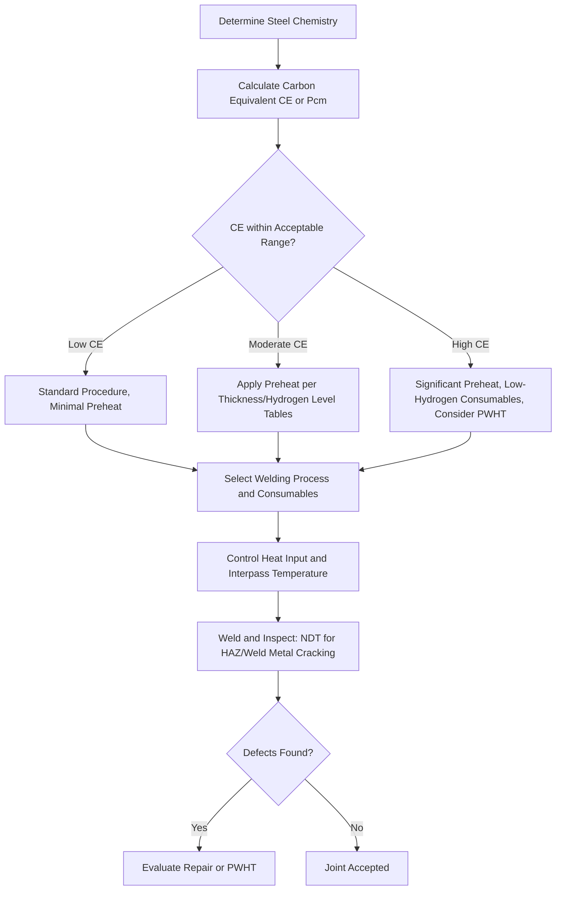

## Weldability of Steels

### Overview

Weldability describes the ease with which a steel can be joined by welding while achieving a sound joint free of unacceptable defects, with mechanical properties adequate for service. It is governed primarily by chemical composition (particularly carbon and alloying content), section thickness, restraint conditions, and the welding process/heat input used. Weldability is not a fixed material property but a practical assessment of susceptibility to specific defect mechanisms, chiefly hydrogen-induced cold cracking, under given fabrication conditions.

### Carbon Equivalent (CE) Concept

**Key Points**

- Carbon equivalent formulas estimate a steel's hardenability and cracking susceptibility by combining the effects of carbon and other alloying elements into a single index
- IIW (International Institute of Welding) formula, most widely used for structural steels:

  $$CE_{IIW} = C + \frac{Mn}{6} + \frac{Cr + Mo + V}{5} + \frac{Ni + Cu}{15}$$
- General guidance: $CE < 0.35$ indicates good weldability with minimal preheat; $CE$ between 0.35–0.45 requires increasing preheat/control; $CE > 0.45$ indicates higher cracking risk requiring significant precautions
- Alternative Pcm (Ito-Bessyo) formula is preferred for lower-carbon, higher-strength modern steels:

  $$P_{cm} = C + \frac{Si}{30} + \frac{Mn + Cu + Cr}{20} + \frac{Ni}{60} + \frac{Mo}{15} + \frac{V}{10} + 5B$$
- [Inference] Pcm generally provides more accurate cracking risk prediction than CE_IIW for steels with carbon content below approximately 0.17%, since CE_IIW was originally calibrated on higher-carbon compositions

### Hydrogen-Induced (Cold) Cracking

**Key Points**

- Occurs after welding, typically within hours to days, in the heat-affected zone (HAZ) or weld metal, at temperatures below approximately 150°C
- Requires three simultaneous conditions: susceptible microstructure (untempered martensite from rapid HAZ cooling), diffusible hydrogen (from moisture, contamination, or electrode coating), and tensile stress (residual or applied)
- Higher carbon equivalent produces harder, more crack-susceptible HAZ microstructures for a given cooling rate
- Mitigated primarily through preheat (slows cooling rate, reduces martensite formation, allows hydrogen diffusion out), low-hydrogen electrodes/consumables, and controlled interpass temperature

### Preheat and Heat Input Control

**Key Points**

- Preheat temperature is typically determined from carbon equivalent, section thickness, and hydrogen level of the welding consumable, per methods such as AWS D1.1 Annex or equivalent standards
- Heat input affects cooling rate: higher heat input slows cooling (reducing hardening in the HAZ) but can coarsen grain structure and reduce toughness if excessive
- Interpass temperature control (maintaining a minimum temperature between weld passes) sustains the benefit of preheat throughout multi-pass welding
- Post-weld heat treatment (PWHT), typically stress-relief annealing, may be specified for thick sections or high-restraint joints to reduce residual stress and allow hydrogen diffusion

### Weldability by Steel Category

**Key Points**

- **Low-carbon steel (<0.25% C)**: generally excellent weldability; minimal preheat required except in thick sections or low-temperature conditions
- **Medium-carbon steel (0.25–0.60% C)**: moderate weldability; preheat and controlled interpass temperature typically necessary; post-weld tempering may be needed to restore HAZ toughness
- **High-carbon steel (>0.60% C)**: poor weldability; welding generally avoided or requires extensive preheat, controlled cooling, and PWHT; often welded only for repair applications
- **HSLA steel**: generally good weldability due to low carbon content despite higher strength, since strengthening comes from microalloying/grain refinement rather than carbon
- **Low-alloy quenched-and-tempered steel (e.g., 4140, 4340)**: moderate-to-poor weldability depending on hardened condition; typically welded in the annealed or normalized condition with subsequent heat treatment, or with careful preheat/PWHT control if welded in the hardened condition
- **Austenitic stainless steel**: good general weldability but susceptible to sensitization (chromium carbide precipitation at grain boundaries) unless low-carbon (L-grade) or stabilized (Ti/Nb-bearing) grades are used
- **Martensitic stainless steel**: poor weldability; hardens significantly in the HAZ, requiring preheat and PWHT to control cracking

### Structural Steel Weldability Reference

| Grade | Typical CE Range | Preheat Need (general guidance) | Notes |
| --- | --- | --- | --- |
| A36 | 0.30–0.40 | Minimal, except cold/thick sections | Baseline general structural weldability |
| A992 | ~0.38–0.47 (capped by spec) | Moderate, per AWS D1.1 tables | Controlled CE for seismic/welding demand |
| A572 Gr 50 | 0.35–0.45 | Moderate | HSLA microalloying keeps carbon low |
| A588 | 0.35–0.45 | Moderate | Weathering alloy additions considered in CE |
| A709 (bridge steel) | Grade-dependent | Per AASHTO/AWS tables, often more conservative | Fracture-critical toughness overlay |

### Weldability Assessment Workflow

### Other Weldability-Related Defects

**Key Points**

- **Lamellar tearing**: occurs in thick, restrained joints (e.g., T- and corner joints) where through-thickness ductility of the base metal is insufficient to accommodate weld shrinkage strains; mitigated by joint design, through-thickness tested steel (Z-grade per EN 10164), or buttering techniques
- **Hot cracking (solidification cracking)**: occurs in the weld metal during solidification, associated with sulfur/phosphorus segregation and high restraint; controlled through consumable selection and dilution control, more common in stainless and high-alloy welds
- **HAZ softening**: can occur in quenched-and-tempered steels where welding heat locally over-tempers the HAZ, reducing strength below base metal; managed through heat input limits

### Testing and Qualification

**Key Points**

- Procedure Qualification Records (PQR) and Welding Procedure Specifications (WPS) document tested parameters (preheat, heat input, consumables) demonstrating acceptable joint properties for a given material and thickness range
- AWS D1.1 (Structural Welding Code – Steel) provides prequalified WPS parameters for common structural steel/process combinations, avoiding the need for procedure qualification testing when parameters fall within prequalified limits
- Mechanical testing of qualification welds typically includes tensile, bend, and Charpy V-notch (where toughness is specified) testing of the weld and HAZ

**Conclusion**

Weldability in structural and mechanical steels is fundamentally a hydrogen-cracking risk management problem, governed by chemical composition (expressed through carbon equivalent), section restraint, and process-controlled cooling rate. Modern structural and HSLA steels are engineered for good weldability by keeping carbon content low while achieving strength through microalloying, whereas higher-carbon and hardened alloy steels require careful preheat, heat input control, and post-weld heat treatment to avoid cracking.

**Related Topics**

- Heat-Affected Zone (HAZ) Microstructure and Properties
- Welding Processes: SMAW, GMAW, FCAW, SAW
- AWS D1.1 Structural Welding Code Requirements
- Non-Destructive Testing of Welds (UT, RT, MT, PT)
- Residual Stress and Distortion Control in Welded Structures
- Fracture Toughness Requirements for Fracture-Critical Members
- Post-Weld Heat Treatment (Stress Relief Annealing)