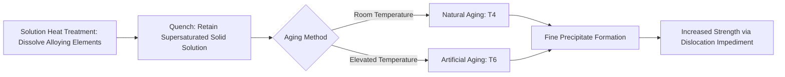

## Aluminum and Aluminum Alloys

### Overview

Aluminum is a lightweight, non-ferrous metal with a density of approximately 2.70 g/cm³, roughly one-third that of steel. Pure aluminum is relatively soft and low-strength, but alloying with elements such as copper, magnesium, silicon, manganese, and zinc, combined with strain hardening or precipitation (age) hardening, produces a wide range of structural alloys. Aluminum's natural oxide film ($Al_2O_3$) provides inherent corrosion resistance without additional coating in many environments.

### Fundamental Properties

**Key Points**

- Density: ~2.70 g/cm³ (vs. ~7.85 g/cm³ for steel)
- Elastic modulus: ~69 GPa (approximately one-third that of steel), meaning aluminum structures are more deflection-governed than strength-governed in many designs
- Excellent thermal and electrical conductivity relative to steel
- Face-centered cubic (FCC) crystal structure, giving good ductility and no ductile-to-brittle transition temperature, making aluminum well suited to cryogenic applications
- Naturally forms a thin, adherent, self-healing $Al_2O_3$ passive oxide layer providing corrosion resistance in most atmospheric and neutral-pH environments

### Wrought Alloy Designation System (Aluminum Association 4-Digit)

**Key Points**

- First digit indicates the primary alloying element/series:
  - 1XXX: Pure aluminum (99%+), excellent corrosion resistance and conductivity, low strength
  - 2XXX: Copper (Al-Cu), high strength via precipitation hardening, lower corrosion resistance, used in aerospace (e.g., 2024)
  - 3XXX: Manganese (Al-Mn), moderate strength, good corrosion resistance, not heat treatable
  - 4XXX: Silicon (Al-Si), used primarily for welding filler wire and brazing, lowers melting point
  - 5XXX: Magnesium (Al-Mg), good strength and excellent corrosion resistance including marine environments, not heat treatable, widely used in marine and structural applications
  - 6XXX: Magnesium and Silicon (Al-Mg-Si), moderate strength, excellent extrudability, good corrosion resistance and weldability; most common structural/architectural alloy family (e.g., 6061, 6063)
  - 7XXX: Zinc (Al-Zn-Mg-Cu), highest strength wrought alloys via precipitation hardening, used in aerospace (e.g., 7075), generally lower corrosion resistance and weldability than 6XXX
- Second digit indicates modification of original alloy; last two digits identify specific alloy within the series (or purity level for 1XXX)

### Heat-Treatable vs. Non-Heat-Treatable Alloys

**Key Points**

- **Heat-treatable (precipitation-hardenable)**: 2XXX, 6XXX, 7XXX series; strengthened through solution heat treatment, quenching, and aging (natural or artificial) to precipitate fine intermetallic phases that impede dislocation motion
- **Non-heat-treatable (strain-hardenable)**: 1XXX, 3XXX, 5XXX series; strengthened only through cold working (strain hardening); temper designation reflects degree of cold work

### Temper Designation System

**Key Points**

- **F**: as fabricated, no special property control
- **O**: annealed, softest temper, maximum ductility
- **H**: strain hardened (non-heat-treatable alloys), followed by digits indicating degree and process (e.g., H14 = strain hardened, half hard)
- **T**: thermally treated (heat-treatable alloys), followed by digits, e.g.:
  - T4: solution heat treated, naturally aged
  - T6: solution heat treated, artificially aged (commonly the highest-strength standard temper)
  - T651: T6 plus stress relief by stretching, common for plate products

**Example**

6061-T6 designates the 6XXX series (Mg-Si) alloy in the solution-treated and artificially aged condition, yielding typical yield strength around 275 MPa (40 ksi), a standard structural and architectural extrusion/plate specification.

### Casting Alloy Designation System

**Key Points**

- Casting alloys use a separate 3-digit-plus-decimal system (e.g., 356.0, 319.0), distinct from wrought designations
- Common casting series: 3XX.0 (Al-Si-Mg or Al-Si-Cu, most widely used for structural and automotive castings), 4XX.0 (Al-Si, good castability), 5XX.0 (Al-Mg, good corrosion resistance)
- Silicon content improves fluidity and castability by lowering the effective melting range and reducing shrinkage; commonly used in sand, permanent mold, and die casting processes

### Comparative Alloy Series Table

| Series | Primary Alloying | Heat Treatable | Relative Strength | Corrosion Resistance | Typical Application |
| --- | --- | --- | --- | --- | --- |
| 1XXX | None (pure Al) | No | Low | Excellent | Electrical conductors, chemical equipment |
| 2XXX | Cu | Yes | High | Fair (requires protection) | Aerospace structures |
| 3XXX | Mn | No | Low-Moderate | Good | Roofing, siding, cookware |
| 5XXX | Mg | No | Moderate | Excellent (marine) | Marine, pressure vessels, structural |
| 6XXX | Mg + Si | Yes | Moderate | Good | Architectural extrusions, structural |
| 7XXX | Zn (+Mg, Cu) | Yes | Very High | Fair-Moderate | Aerospace, high-performance structures |

### Age Hardening Mechanism

**Key Points**

- Solution heat treatment dissolves alloying elements into a supersaturated solid solution at elevated temperature
- Rapid quenching retains the supersaturated state at room temperature
- Aging (natural at room temperature, or artificial at elevated temperature, e.g., 150–190°C) allows controlled precipitation of fine coherent/semi-coherent intermetallic particles (e.g., $Mg_2Si$ in 6XXX, $CuAl_2$ in 2XXX) that impede dislocation motion, increasing strength
- Overaging (excessive time/temperature) causes precipitate coarsening and strength reduction, defining a practical aging window

### Corrosion Behavior

**Key Points**

- General atmospheric corrosion resistance is excellent due to the stable oxide film, but resistance varies significantly by alloy series
- 2XXX and 7XXX series (copper-bearing) have reduced corrosion resistance and may require cladding (thin pure aluminum layer, e.g., Alclad) or coating for protection
- 5XXX and 6XXX series offer good-to-excellent corrosion resistance without additional protection in most environments
- Galvanic corrosion risk is significant when aluminum contacts more noble metals (e.g., steel, copper) in the presence of an electrolyte; isolation (gaskets, coatings, non-conductive fasteners) is standard mitigation
- Exfoliation and stress corrosion cracking can occur in certain high-strength tempers (especially 7XXX) under sustained tensile stress in corrosive environments; overaged tempers (e.g., T73) trade some strength for improved stress corrosion resistance

### Welding Considerations

**Key Points**

- Aluminum's high thermal conductivity and oxide film require higher heat input and oxide removal (mechanical or chemical) prior to welding compared to steel
- Common processes: Gas Tungsten Arc Welding (GTAW/TIG) and Gas Metal Arc Welding (GMAW/MIG), typically with alternating current (TIG) to disrupt the oxide film
- 2XXX and 7XXX series are generally difficult to weld due to hot cracking susceptibility; often joined mechanically or by specialized processes instead
- 5XXX and 6XXX series generally weld well; 6XXX series experiences some strength loss in the heat-affected zone due to overaging of the T6 precipitate structure, often requiring post-weld artificial aging to partially recover strength

### Structural and Civil Engineering Applications

**Key Points**

- Aluminum Association and Aluminum Design Manual (ADM) govern structural aluminum design in the U.S., paralleling AISC for steel
- Common structural applications: pedestrian bridges, marine structures, curtain wall and window framing systems, roofing/siding, transmission towers, and temporary/modular structures where weight savings are critical
- Extrudability of 6XXX series enables complex structural cross-sections not economically achievable in steel, widely used in architectural facades and framing systems

**Conclusion**

Aluminum alloy selection balances strength (via alloying and temper), corrosion resistance, weldability, and cost, with the 5XXX and 6XXX series dominating general structural and architectural applications due to their favorable combination of moderate strength, excellent corrosion resistance, and good fabricability, while 2XXX and 7XXX series serve strength-critical aerospace applications at the expense of corrosion resistance and weldability.

**Related Topics**

- Aluminum Design Manual and Structural Aluminum Design
- Anodizing and Surface Finishing of Aluminum
- Galvanic Corrosion and Dissimilar Metal Contact
- Extrusion Process for Aluminum Shapes
- Precipitation Hardening Mechanisms in Non-Ferrous Alloys
- Aluminum Welding Processes and Filler Metal Selection
- Copper and Copper Alloys