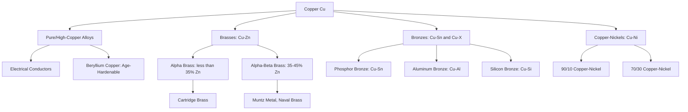

## Copper and Copper Alloys

### Overview

Copper is a non-ferrous metal distinguished by exceptionally high electrical and thermal conductivity, good corrosion resistance, and excellent ductility. In its pure form, copper serves electrical applications almost exclusively; alloyed with tin, zinc, aluminum, nickel, or beryllium, it produces a broad family of engineering alloys, most notably brasses (Cu-Zn) and bronzes (Cu-Sn and other Cu-X systems), used extensively in plumbing, architectural, marine, and mechanical applications.

### Fundamental Properties

**Key Points**

- Density: ~8.96 g/cm³; face-centered cubic (FCC) crystal structure providing excellent ductility and no ductile-to-brittle transition
- Electrical conductivity: second only to silver among metals; used as the International Annealed Copper Standard (IACS) reference (100% IACS)
- Thermal conductivity: high, making copper alloys useful for heat exchangers and applications requiring rapid heat transfer
- Forms a protective oxide/patina layer over time (initially $Cu_2O$, developing toward basic copper carbonates/sulfates in atmospheric exposure), providing long-term corrosion resistance, most visibly recognized as the green patina on architectural copper roofing
- Antimicrobial surface properties are a documented characteristic of copper and many copper alloys, relevant in some healthcare and public touch-surface applications

### Copper Alloy Classification (UNS System)

**Key Points**

- Unified Numbering System (UNS) designates copper alloys with C1XXXX through C9XXXX prefixes
- Wrought alloys: C10000–C79999; Cast alloys: C80000–C99999
- Broad families within the system: coppers (C1XXXX), high-copper alloys (C2XXXX beryllium coppers etc. depending on subgroup), brasses (C2XXXX–C4XXXX), bronzes (C5XXXX–C6XXXX phosphor/aluminum/silicon bronzes), copper-nickels (C7XXXX)

### Brasses (Copper-Zinc Alloys)

**Key Points**

- Zinc content typically 5–40%; increasing zinc raises strength and lowers cost but reduces corrosion resistance and ductility beyond certain thresholds
- **Alpha brasses** (<35% Zn): single-phase FCC structure, excellent cold workability, used for deep-drawn and cold-formed products (cartridge brass, C26000, ~30% Zn)
- **Alpha-beta (duplex) brasses** (35–45% Zn): two-phase structure, higher strength but reduced cold formability, typically hot worked (e.g., Muntz metal, C28000)
- **Admiralty brass** and **naval brass**: tin-inhibited brasses with improved resistance to dezincification and seawater corrosion, historically used in marine condenser tubing
- Susceptible to **dezincification** (selective leaching of zinc leaving a porous copper structure) in certain high-zinc alloys under specific environmental conditions; arsenic or antimony inhibitors added to resist this in dezincification-resistant grades
- Susceptible to **season cracking** (stress corrosion cracking) in ammonia-containing environments under residual tensile stress; stress-relief annealing after forming mitigates this risk

### Bronzes (Copper-Tin and Other Copper-X Alloys)

**Key Points**

- **Tin bronze (phosphor bronze)**: Cu-Sn with phosphorus as deoxidizer, good strength, corrosion resistance, and wear resistance; used for springs, bearings, bushings
- **Aluminum bronze**: Cu-Al (typically 5–12% Al), excellent corrosion resistance including in seawater, high strength, used for marine hardware, pumps, valves
- **Silicon bronze**: Cu-Si, good strength and corrosion resistance with good weldability, used for architectural hardware and welding filler applications
- **Nomenclature note**: many modern "bronze" alloys used architecturally are technically brasses by composition but retain historical "bronze" naming for marketing/architectural purposes; true bronze refers specifically to tin-bearing (or historically defined) copper alloys

### Copper-Nickel Alloys

**Key Points**

- Typical compositions: 90/10 (C70600) and 70/30 (C71500) copper-nickel
- Exceptional resistance to seawater corrosion and biofouling, widely used for marine piping, heat exchanger tubing, and offshore/shipbuilding applications
- Single-phase solid solution across the full composition range (complete mutual solubility of Cu and Ni), providing good ductility and weldability

### Beryllium Copper

**Key Points**

- High-copper alloy (typically 0.5–2% Be) that is precipitation (age) hardenable, achieving strength levels comparable to some alloy steels while retaining high electrical/thermal conductivity
- Used for non-sparking tools, springs, electrical connectors, and mold/tooling components requiring both strength and conductivity
- [Unverified: specific handling/safety precautions during machining due to beryllium oxide dust toxicity are well documented in industry safety literature but exact regulatory limits vary by jurisdiction and are not detailed here]

### Comparative Alloy Family Table

| Family | Primary Alloying | Key Characteristic | Typical Application |
| --- | --- | --- | --- |
| Pure Copper (C1XXXX) | None | Maximum conductivity | Electrical wiring, roofing |
| Alpha Brass | Zn <35% | Excellent cold formability | Cartridge cases, tubing, fasteners |
| Alpha-Beta Brass | Zn 35–45% | Higher strength, hot worked | Architectural hardware, forgings |
| Phosphor Bronze | Sn + P | Strength, wear resistance | Springs, bearings, bushings |
| Aluminum Bronze | Al 5–12% | Seawater corrosion resistance | Marine hardware, pumps, valves |
| Copper-Nickel | Ni 10–30% | Biofouling/seawater resistance | Marine piping, heat exchangers |
| Beryllium Copper | Be 0.5–2% | Age-hardenable, high strength + conductivity | Springs, non-sparking tools |

### Alloy Family Relationship Diagram

### Corrosion Mechanisms Specific to Copper Alloys

**Key Points**

- **Dezincification**: selective zinc dissolution from brass, producing weakened, porous copper-rich structure; mitigated by inhibited (As, Sb, or P-bearing) brass grades
- **Stress corrosion cracking (season cracking)**: occurs in brasses under residual tensile stress in ammonia or ammonium-compound environments; mitigated by stress-relief annealing
- **Erosion-corrosion**: high-velocity flow can disrupt protective oxide films, particularly relevant in piping/tubing applications; velocity limits are typically specified per alloy for water and seawater service
- **Galvanic corrosion**: copper alloys are relatively noble in the galvanic series, meaning they can accelerate corrosion of less noble metals (e.g., steel, aluminum, zinc) in electrical contact within an electrolyte; this is a consideration for the *other* metal more than for copper itself

### Civil and Structural Engineering Applications

**Key Points**

- Architectural roofing, flashing, and cladding: pure copper and some bronze alloys, valued for the protective patina and long service life (often 50–100+ years)
- Plumbing tube and fittings: copper (Type K, L, M per ASTM B88) widely used for water distribution due to corrosion resistance and antimicrobial properties
- Electrical grounding systems: copper's high conductivity makes it standard for grounding conductors and busbars in structures
- Marine and waterfront structures: aluminum bronze and copper-nickel alloys for fasteners, fittings, and piping exposed to seawater
- Bearing and expansion joint components: phosphor bronze bushings and bearing plates in bridge and structural applications requiring low-friction sliding surfaces

**Conclusion**

Copper alloy selection is driven primarily by the combination of conductivity, corrosion resistance (particularly in aggressive or marine environments), and mechanical property requirements. Brasses offer cost-effective strength and formability for general applications, bronzes and copper-nickels provide superior corrosion resistance for marine and severe-service environments, and beryllium copper serves specialized applications demanding both high strength and conductivity.

**Related Topics**

- Galvanic Series and Dissimilar Metal Corrosion
- Architectural Metals and Patina Development
- Copper Plumbing Tube Standards (ASTM B88)
- Precipitation Hardening Mechanisms in Non-Ferrous Alloys
- Bearing and Expansion Joint Materials in Structures
- Aluminum and Aluminum Alloys
- Zinc and Zinc Coatings (Galvanizing)