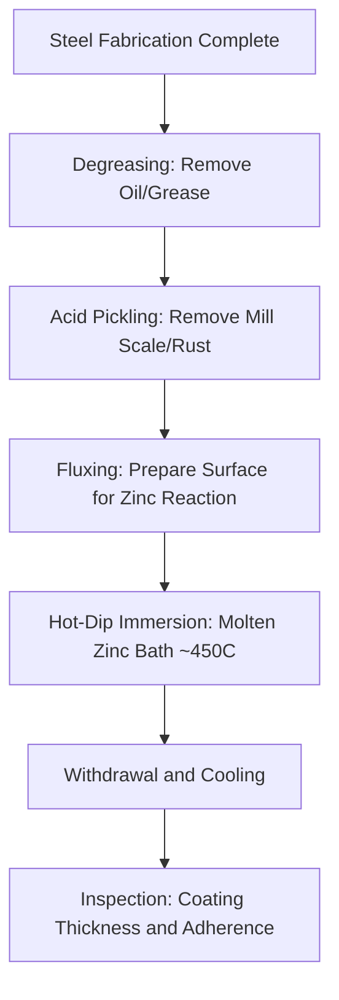

## Zinc and Galvanizing Processes

### Overview

Zinc is a non-ferrous metal primarily valued in civil and structural engineering not as a standalone structural material but as a sacrificial and barrier coating for steel. Galvanizing, the process of applying zinc coatings to steel, exploits zinc's position in the galvanic series (more anodic/less noble than iron) to provide both barrier protection and cathodic (sacrificial) protection at coating discontinuities. This makes galvanized steel one of the most widely used corrosion protection systems in construction.

### Fundamental Properties of Zinc

**Key Points**

- Density: ~7.14 g/cm³; hexagonal close-packed (HCP) crystal structure
- Relatively low melting point (~420°C), enabling economical hot-dip processing
- Anodic to steel/iron in the galvanic series, meaning zinc corrodes preferentially, sacrificially protecting exposed steel at scratches, cut edges, or coating defects
- Forms a protective zinc oxide/zinc carbonate patina in atmospheric exposure, significantly slowing further corrosion compared to bare zinc

### Corrosion Protection Mechanism

**Key Points**

- **Barrier protection**: the zinc coating physically separates the steel substrate from the corrosive environment
- **Cathodic (sacrificial) protection**: where the coating is breached (scratch, cut edge, bolt hole), zinc adjacent to the exposed steel corrodes preferentially, protecting the steel via galvanic action, since zinc is more electrochemically active
- This self-healing behavior at small defects is the key advantage of galvanizing over purely barrier coatings (e.g., paint), which offer no protection once breached
- Corrosion rate of zinc itself is substantially slower than steel in most atmospheric environments, and further decreases over time as protective corrosion products (basic zinc carbonate) form on the surface

### Hot-Dip Galvanizing Process

**Key Points**

- Governed in the U.S. primarily by ASTM A123 (structural shapes/plate) and A153 (hardware/fasteners)
- Process sequence: surface preparation (degreasing, acid pickling, fluxing) followed by immersion in a molten zinc bath (~450°C)
- Metallurgical reaction between iron and zinc forms a series of zinc-iron intermetallic layers (Gamma, Delta, Zeta phases) beneath an outer layer of relatively pure zinc (Eta phase), providing a coating that is metallurgically bonded rather than merely applied
- Coating thickness is a function of steel chemistry (particularly silicon and phosphorus content, which affect reaction kinetics — the "Sandelin effect" causes excessively thick, less adherent coatings on certain silicon ranges), immersion time, and withdrawal rate
- Typical coating thickness for structural steel: 45–100+ micrometers, varying by ASTM A123 requirements based on material thickness category

### Coating Structure (Metallurgical Cross-Section)

**Key Points**

- **Gamma layer**: innermost, high iron content (~75% Zn/25% Fe), thin and brittle
- **Delta layer**: intermediate (~90% Zn/10% Fe), typically the thickest intermetallic layer, hard and abrasion-resistant
- **Zeta layer**: (~94% Zn/6% Fe), columnar structure
- **Eta layer**: outermost, essentially pure zinc, relatively soft and ductile, provides the sacrificial reservoir
- This layered intermetallic structure is unique to hot-dip galvanizing and provides superior abrasion resistance compared to mechanically applied coatings

### Other Zinc Coating Methods

**Key Points**

- **Electrogalvanizing**: zinc applied via electrodeposition; produces thinner, more uniform coatings than hot-dip, commonly used for sheet steel (e.g., automotive body panels), but with less sacrificial protection reserve
- **Zinc metallizing (thermal spray)**: molten zinc particles sprayed onto prepared steel surface; used for field application, large structures, or repair where hot-dip immersion is impractical, per ASTM A780 for repair of damaged galvanized coatings
- **Zinc-rich paint**: cold-applied coating containing high zinc dust content in an organic or inorganic binder, providing some sacrificial protection but generally less robust than metallurgically bonded coatings; commonly used for field touch-up and repair
- **Continuous galvanizing (sheet/coil)**: high-speed hot-dip process for coil steel, producing coatings such as G60/G90 (U.S.) or Z-designations (metric), used extensively for roofing, siding, and light structural applications
- **Galvannealing**: hot-dip coated sheet subjected to additional heat treatment to fully convert the coating to iron-zinc intermetallic phases, improving paint adhesion and weldability at the expense of some corrosion performance and formability

### Service Life and Environmental Factors

**Key Points**

- Galvanized coating service life is approximately proportional to coating thickness and inversely related to atmospheric corrosivity category (per ISO 9223 categories: C1 rural/dry through C5/CX marine-industrial)
- [Inference] Rural and suburban atmospheric environments generally provide multi-decade service life for standard hot-dip galvanized coatings, while marine and heavy industrial environments substantially reduce service life due to higher chloride/sulfur exposure, consistent with general galvanic corrosion principles, though exact service life projections depend on site-specific conditions and are typically estimated using published zinc corrosion rate data
- Duplex systems (paint applied over galvanized steel) provide synergistic protection exceeding the sum of either system alone, since the galvanizing provides sacrificial protection at paint film defects while paint reduces the overall zinc corrosion rate

### Comparative Coating Method Table

| Method | Typical Coating Thickness | Bond Type | Typical Application |
| --- | --- | --- | --- |
| Hot-Dip (Batch) | 45–100+ µm | Metallurgical (intermetallic) | Structural steel, fabricated components |
| Continuous Hot-Dip (Sheet) | 10–30 µm (G60–G90) | Metallurgical | Roofing, siding, light structural |
| Electrogalvanizing | 5–15 µm | Mechanical/electrochemical bond | Automotive sheet, appliances |
| Thermal Spray (Metallizing) | Variable, field-applied | Mechanical bond | Field application, large structures, repair |
| Zinc-Rich Paint | Variable, thin | Mechanical/binder-dependent | Touch-up, repair of damaged galvanizing |

### Design and Fabrication Considerations

**Key Points**

- Venting and drainage holes should be designed into hollow/closed sections to prevent trapped air (explosion risk in molten zinc) and allow proper zinc flow and drainage
- Design guidance typically recommends completing all welding, cutting, and drilling prior to galvanizing, since post-galvanizing modification exposes bare steel requiring repair per ASTM A780
- Bolted connection design must account for zinc coating thickness in hole clearances and faying surface slip coefficients for slip-critical joints
- Galvanized steel embedded in concrete requires consideration of potential hydrogen gas evolution reaction with fresh alkaline concrete; typically managed through passivating chromate treatments or accepted as a minor, self-limiting reaction depending on application

### Civil Engineering Applications

**Key Points**

- Structural steel for bridges, transmission towers, and outdoor structures where long-term low-maintenance corrosion protection is prioritized
- Guardrail, highway signage structures, and light poles: extensively galvanized per state DOT specifications
- Rebar (galvanized reinforcing steel per ASTM A767): used in aggressive chloride exposure environments as an alternative or complement to epoxy-coated or stainless rebar
- Chain-link fencing, culverts, and drainage structures: continuous or hot-dip galvanized steel for cost-effective corrosion resistance in exposed applications

**Conclusion**

Galvanizing provides structural steel with a metallurgically bonded, self-healing corrosion protection system combining barrier and sacrificial (cathodic) protection mechanisms. Hot-dip galvanizing per ASTM A123/A153 remains the dominant method for structural and fabricated steel components, with coating thickness and resulting service life governed by steel chemistry, immersion parameters, and the corrosivity of the service environment.

**Related Topics**

- Galvanic Series and Dissimilar Metal Corrosion
- ASTM A123/A153/A767 Galvanizing Specifications
- Duplex Coating Systems (Paint over Galvanizing)
- Epoxy-Coated and Stainless Reinforcing Steel Alternatives
- Atmospheric Corrosivity Categories (ISO 9223)
- Cathodic Protection Systems for Buried/Submerged Steel
- Copper and Copper Alloys