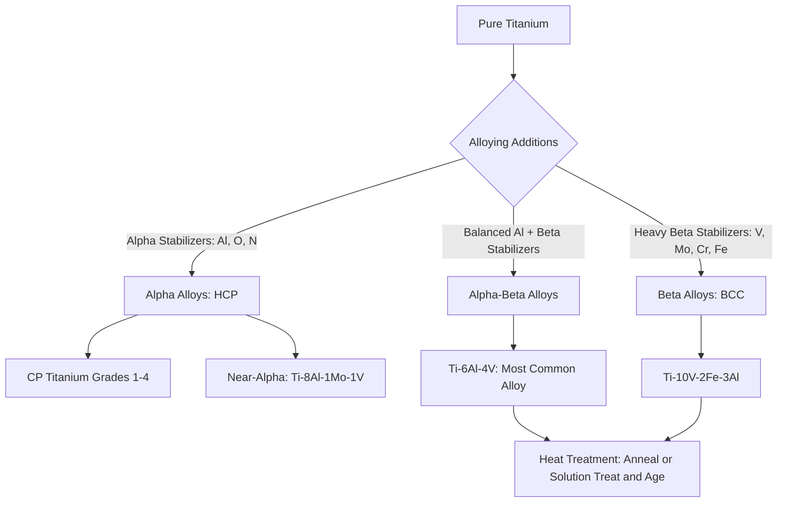

## Titanium Alloys

### Overview

Titanium is a non-ferrous metal characterized by an exceptional strength-to-weight ratio, outstanding corrosion resistance, and biocompatibility, at a significantly higher cost than steel or aluminum. Its engineering utility stems from an allotropic transformation between two crystal structures, alpha and beta, which alloying elements can stabilize to different degrees, producing a classification system of alpha, near-alpha, alpha-beta, and beta titanium alloys with distinct property profiles.

### Fundamental Properties

**Key Points**

- Density: ~4.51 g/cm³, roughly 60% of steel's density and about 1.7 times aluminum's density
- Excellent strength-to-weight ratio, with some alloys achieving strength comparable to alloy steels at nearly half the weight
- Exceptional corrosion resistance across a wide range of environments (seawater, chlorides, many acids) due to a highly stable, self-healing $TiO_2$ passive oxide film
- Low thermal conductivity and low elastic modulus (~105–120 GPa, roughly half that of steel) relative to strength, resulting in more flexible structural behavior for a given cross-section
- Biocompatible, making it the material of choice for many medical implants
- Significantly higher raw material and processing cost than steel or aluminum, generally restricting use to applications where weight, corrosion resistance, or biocompatibility justify the premium

### Allotropic Transformation: Alpha and Beta Phases

**Key Points**

- Pure titanium exists as **alpha phase** (hexagonal close-packed, HCP) below approximately 883°C and transforms to **beta phase** (body-centered cubic, BCC) above this temperature (the beta transus)
- Alloying elements are classified by their effect on this transformation:
  - **Alpha stabilizers**: aluminum, oxygen, nitrogen, carbon; raise the beta transus temperature, expanding the alpha phase field
  - **Beta stabilizers**: vanadium, molybdenum, chromium, iron, niobium; lower the beta transus, expanding the beta phase field (further subdivided into beta-isomorphous and beta-eutectoid formers)
  - **Neutral elements**: tin, zirconium; have minimal effect on phase stability but contribute solid-solution strengthening
- Controlling alpha/beta phase balance through composition and heat treatment is the central mechanism for tailoring titanium alloy properties

### Alloy Classification

**Key Points**

- **Alpha alloys**: single-phase HCP structure, good weldability, good creep resistance and oxidation resistance at elevated temperature, not heat-treatable for strengthening; commercially pure (CP) titanium grades fall in this category
- **Near-alpha alloys**: small additions of beta stabilizers for modest strength improvement while retaining good high-temperature creep resistance; used in aerospace turbine engine components (e.g., Ti-8Al-1Mo-1V)
- **Alpha-beta alloys**: mixed microstructure, heat-treatable for strength via controlled cooling and aging; **Ti-6Al-4V** is by far the most widely used titanium alloy, accounting for a majority of titanium alloy usage across aerospace, medical, and industrial applications
- **Beta alloys**: fully retained BCC beta phase at room temperature through heavy beta stabilizer content, offering the highest strength (via subsequent aging) and excellent formability in the solution-treated condition, though generally higher density and lower creep resistance than alpha/near-alpha grades

### Ti-6Al-4V: The Workhorse Alloy

**Key Points**

- Composition: ~6% aluminum (alpha stabilizer), ~4% vanadium (beta stabilizer), balance titanium
- Achieves a favorable balance of strength (yield strength typically 830–1100 MPa depending on processing), moderate ductility, good fatigue performance, and reasonable weldability
- Available in multiple ASTM grades (e.g., Grade 5 for general use, Grade 23/ELI for higher toughness, lower interstitial content, common in medical and cryogenic applications)
- Heat treatable through annealing (stress relief, mill anneal) or solution treatment and aging (STA) for higher strength at some ductility cost
- [Inference] Ti-6Al-4V's dominance in aerospace and medical applications reflects the extensive design/property database and processing experience accumulated over decades, making it the default choice even when other alloys might offer marginal property advantages for specific applications

### Commercially Pure (CP) Titanium

**Key Points**

- Graded by oxygen and iron content (ASTM Grades 1–4), with increasing interstitial content raising strength but reducing ductility
- Excellent corrosion resistance, good weldability, primarily selected for corrosion-critical applications rather than high strength
- Widely used in chemical processing equipment, marine hardware, and architectural applications where corrosion resistance is the primary driver

### Comparative Property Table

| Alloy Type | Example | Yield Strength (typical) | Weldability | Primary Selection Driver |
| --- | --- | --- | --- | --- |
| CP Titanium (Grade 2) | — | 275 MPa | Excellent | Corrosion resistance, moderate strength |
| Alpha (near-alpha) | Ti-8Al-1Mo-1V | 830 MPa | Good | High-temperature creep resistance |
| Alpha-Beta | Ti-6Al-4V | 830–1100 MPa | Fair-Good | Balanced strength/weight, general aerospace/medical use |
| Beta | Ti-10V-2Fe-3Al | 1100–1300+ MPa (aged) | Fair | Maximum strength, good formability pre-aging |

### Phase Diagram and Alloy Relationship

### Processing and Fabrication

**Key Points**

- Titanium is highly reactive with oxygen, nitrogen, and hydrogen at elevated temperature, requiring inert gas shielding (argon) or vacuum processing during welding and heat treatment to avoid embrittlement from interstitial contamination
- Machining requires low cutting speeds, sharp tooling, and effective cooling due to titanium's low thermal conductivity, which concentrates heat at the cutting edge and promotes tool wear
- Forming operations often require elevated temperature (warm/hot forming) due to titanium's relatively high springback and lower ductility compared to aluminum at room temperature
- Common welding processes: Gas Tungsten Arc Welding (GTAW) and Electron Beam Welding (EBW), both requiring careful atmosphere control

### Corrosion Resistance Characteristics

**Key Points**

- Highly resistant to seawater, chloride-bearing solutions, and many oxidizing acids, generally outperforming stainless steel in aggressive chloride environments
- Resistant to pitting and crevice corrosion under conditions that would attack most stainless steel grades
- Poor resistance in strongly reducing, non-oxidizing acid environments (e.g., concentrated hydrochloric or sulfuric acid) where the passive oxide film cannot be sustained
- Excellent galvanic compatibility as a cathode; titanium is quite noble in the galvanic series, meaning it can accelerate corrosion of less noble metals in contact, similar to the consideration noted for copper alloys

### Civil and Structural Engineering Applications

**Key Points**

- Architectural cladding and roofing for iconic structures, valued for corrosion resistance, light weight, and distinctive appearance (e.g., titanium panel systems on notable museum and cultural buildings)
- Seismic isolation and structural hardware in specialized applications where superior fatigue and corrosion performance justify cost
- Marine and offshore structural hardware, particularly fasteners and components in splash-zone or submerged chloride-rich environments
- Bridge expansion joint components and specialty fasteners in highly corrosive environments where service life extension offsets high initial material cost
- [Inference] Titanium's use in mainstream civil/structural construction remains limited primarily by cost relative to stainless steel or coated carbon steel alternatives, restricting adoption to applications with unusually demanding corrosion, weight, or architectural requirements

**Conclusion**

Titanium alloys occupy a specialized niche defined by an unmatched combination of strength-to-weight ratio and corrosion resistance, governed metallurgically by the alpha-beta phase balance achievable through alloying. Ti-6Al-4V remains the dominant workhorse alloy across aerospace and medical fields, while in civil and structural engineering, titanium is reserved for applications where its performance advantages clearly justify its substantially higher cost relative to steel, stainless steel, or aluminum alternatives.

**Related Topics**

- Alpha-Beta Phase Diagrams and Heat Treatment of Titanium
- Corrosion Resistance in Chloride and Marine Environments
- Aerospace Structural Alloys and Design Considerations
- Welding of Reactive Metals (Inert Gas Shielding Requirements)
- Architectural Metal Cladding Systems
- Galvanic Compatibility and Dissimilar Metal Design
- Aluminum and Aluminum Alloys