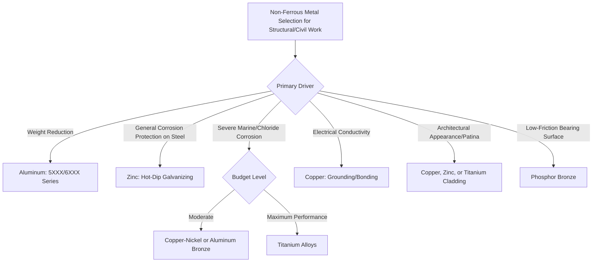

## Applications in Civil and Structural Work

### Overview

Non-ferrous metals—aluminum, copper, zinc, and titanium—serve distinct, often complementary roles in civil and structural engineering, generally selected not to replace structural steel wholesale but to address specific requirements steel cannot efficiently satisfy: weight reduction, corrosion resistance in aggressive environments, electrical conductivity, or architectural expression. This synthesizes application patterns across the non-ferrous metal families for structural and civil work.

### Selection Drivers Across Non-Ferrous Metals

**Key Points**

- **Weight-critical applications**: aluminum's density advantage (~1/3 of steel) drives selection for movable structures, temporary works, and long-span elements where self-weight governs design
- **Corrosion-critical applications**: copper alloys, zinc coatings, and titanium each address different corrosion environments; zinc as a sacrificial coating on steel, copper-nickel and aluminum bronze for direct seawater exposure, titanium for extreme chloride/marine severity
- **Electrical/conductivity applications**: copper remains the default for grounding, bonding, and lightning protection systems in structures
- **Architectural expression**: aluminum, copper (patina), titanium, and zinc all serve as exposed architectural cladding materials, selected partly for weathering characteristics and appearance evolution over time
- **Cost hierarchy**: as a general rule, galvanized/coated steel is most economical, followed by aluminum, then copper alloys, with titanium reserved for applications where its unique property combination is essential

### Aluminum in Structural and Civil Work

**Key Points**

- Pedestrian and vehicular bridges: aluminum truss and girder bridges reduce foundation loads and enable rapid installation, particularly valuable for temporary or remote-access structures
- Curtain wall and window framing systems: 6XXX series extrusions dominate commercial building envelope systems due to extrudability, corrosion resistance, and moderate strength
- Marine structures: docks, gangways, and floating structures benefit from corrosion resistance and buoyancy-favorable weight
- Transmission towers and antenna structures: weight savings reduce foundation and erection costs in remote locations
- Roofing and siding: 3XXX series sheet products for long-span metal roofing systems
- Governed by the Aluminum Design Manual (ADM) for allowable stress and LRFD structural design methods paralleling AISC 360 for steel

### Copper Alloys in Structural and Civil Work

**Key Points**

- Architectural roofing, flashing, and cladding: pure copper sheet valued for the protective patina developing over decades, providing extended service life with minimal maintenance
- Bearing plates and expansion joint hardware: phosphor bronze bushings provide low-friction sliding surfaces in bridge bearings and structural expansion joints
- Marine hardware and fittings: aluminum bronze and copper-nickel alloys for fasteners, propeller shafting supports, and piping in waterfront structures
- Electrical grounding and lightning protection: copper conductors and ground rods remain the default due to conductivity and corrosion resistance in soil
- Plumbing and water distribution: copper tube (ASTM B88) for potable water systems within buildings

### Zinc/Galvanizing in Structural and Civil Work

**Key Points**

- Structural steel corrosion protection: hot-dip galvanizing (ASTM A123) for bridges, transmission towers, guardrail, and outdoor structural steel where long-term low-maintenance protection is prioritized over the alternative of ongoing paint maintenance
- Reinforcing steel: galvanized rebar (ASTM A767) as an alternative to epoxy-coated or stainless rebar in chloride-exposed concrete (bridge decks, marine structures, parking structures)
- Highway and roadside hardware: signage structures, light poles, and guardrail extensively specified as galvanized per state DOT standards
- Duplex systems (paint over galvanizing) for structures requiring both extended service life and specific aesthetic color requirements

### Titanium in Structural and Civil Work

**Key Points**

- Architectural cladding for landmark buildings, valued for corrosion resistance, light weight relative to strength, and distinctive weathering appearance
- Seismic and vibration isolation hardware in specialized high-performance structures
- Marine and offshore splash-zone hardware where even stainless steel corrosion rates are considered insufficient
- Use remains limited primarily by cost, restricting adoption to applications with unusually demanding performance or architectural requirements relative to available budget

### Application Selection Framework

### Comparative Selection Table

| Application Need | Steel Baseline | Non-Ferrous Alternative | Key Advantage |
| --- | --- | --- | --- |
| General corrosion protection | Painted steel | Galvanized (zinc-coated) steel | Sacrificial + barrier protection, low maintenance |
| Long-span/movable structures | Steel | Aluminum (5XXX/6XXX) | ~1/3 weight, reduces foundation/erection cost |
| Marine/seawater piping and fittings | Stainless steel | Copper-nickel, aluminum bronze | Superior biofouling and seawater resistance |
| Electrical grounding | N/A (non-conductive concern) | Copper | Highest practical conductivity |
| Extreme chloride/severe marine | Duplex stainless | Titanium | Superior chloride pitting/crevice resistance |
| Bridge bearing surfaces | Steel-on-steel | Phosphor bronze | Low friction, wear resistance |
| Architectural cladding with evolving patina | Painted steel | Copper, zinc, titanium | Self-renewing weathered appearance, low maintenance |

### Design and Compatibility Considerations

**Key Points**

- Galvanic compatibility must be evaluated whenever dissimilar metals are placed in electrical contact within an electrolyte (moisture); the galvanic series position of each metal determines which corrodes preferentially
- Isolation techniques (gaskets, non-conductive coatings, dielectric fasteners) are standard practice where dissimilar structural metals must interface (e.g., aluminum curtain wall framing against steel structure, copper flashing against galvanized steel roofing)
- Fastener material selection should generally match or be more noble than the base structural metal being joined to avoid accelerated fastener corrosion, though this must be balanced against galvanic effects on the joined material itself
- Life-cycle cost analysis, incorporating material cost, installation cost, maintenance requirements, and expected service life, is the standard framework for justifying non-ferrous metal selection over conventional coated/painted steel, particularly for aggressive-environment or long-design-life structures

**Conclusion**

Non-ferrous metals occupy targeted, well-established roles in civil and structural engineering rather than serving as general steel replacements. Aluminum addresses weight-critical applications, zinc provides the dominant corrosion protection system for structural steel itself, copper alloys serve electrical, marine, and low-friction bearing needs, and titanium is reserved for the most demanding corrosion or weight-performance requirements where cost is a secondary concern. Effective design requires attention to galvanic compatibility whenever these metals interface with steel or with each other.

**Related Topics**

- Galvanic Series and Dissimilar Metal Corrosion
- Life-Cycle Cost Analysis for Material Selection
- Aluminum Design Manual (ADM) Structural Design Methods
- Bridge Bearing and Expansion Joint Design
- Corrosion Protection Systems for Structural Steel
- Architectural Metal Cladding Systems
- Atmospheric Corrosivity Categories (ISO 9223)