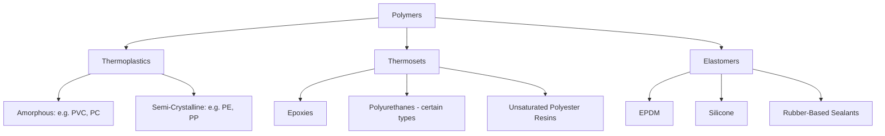

## Polymer Structure and Classification

### Overview

Polymers are macromolecules composed of repeating structural units (monomers) linked by covalent bonds into long chains. Their engineering properties—stiffness, ductility, thermal behavior, and durability—derive fundamentally from molecular architecture: chain structure, degree of crystallinity, cross-linking, and molecular weight. Construction polymers span an enormous property range, from flexible sealants to rigid structural composites, governed by these underlying structural classifications.

### Fundamental Molecular Structure

**Key Points**

- Monomers are small repeating molecular units joined through polymerization (addition or condensation reactions) to form long-chain macromolecules
- Degree of polymerization and molecular weight strongly influence mechanical properties: higher molecular weight generally increases strength, toughness, and melt viscosity
- Polymer chains can be **linear**, **branched**, or **cross-linked (network)**, with cross-linking density fundamentally determining whether a polymer can be melted and reshaped (thermoplastic) or not (thermoset)
- Chain flexibility, backbone chemistry (e.g., presence of aromatic rings, side groups), and intermolecular forces (van der Waals, hydrogen bonding) govern stiffness and glass transition behavior

### Thermoplastics vs. Thermosets vs. Elastomers

**Key Points**

- **Thermoplastics**: linear or branched chains held together by secondary (intermolecular) forces only; soften and flow upon heating, re-solidify on cooling, and can generally be reprocessed/recycled multiple times; examples relevant to construction include PVC, polyethylene (PE), polypropylene (PP), and polycarbonate (PC)
- **Thermosets**: chains are chemically cross-linked into a rigid three-dimensional network during curing; once cured, cannot be melted or reshaped without degradation; examples include epoxies, polyurethanes (certain formulations), and unsaturated polyester resins used in fiber-reinforced composites
- **Elastomers**: lightly cross-linked networks with highly flexible chains that allow large reversible elastic deformation; examples include rubber-based sealants, EPDM roofing membranes, and silicone sealants

### Crystallinity and Morphology

**Key Points**

- Polymer chains can pack into ordered **crystalline** regions or remain disordered as **amorphous** regions; most thermoplastics are semi-crystalline, containing both phases
- Degree of crystallinity affects density, stiffness, strength, chemical resistance, and optical clarity (higher crystallinity generally reduces transparency)
- Crystallinity is favored by regular chain structure (minimal branching, symmetric side groups) and slower cooling rates during processing
- Amorphous polymers (e.g., polycarbonate, unmodified PVC) tend toward higher transparency and more isotropic shrinkage; semi-crystalline polymers (e.g., HDPE, PP) tend toward greater chemical resistance and more pronounced processing shrinkage

### Glass Transition and Melting Behavior

**Key Points**

- **Glass transition temperature ($T_g$)**: temperature below which an amorphous polymer (or the amorphous regions of a semi-crystalline polymer) becomes rigid and glassy; above $T_g$, chain segments gain mobility and the material becomes rubbery/flexible
- **Melting temperature ($T_m$)**: applies to the crystalline regions of semi-crystalline polymers; above $T_m$, crystalline order breaks down and the material flows
- These transition temperatures govern service temperature range: a polymer used below its $T_g$ in an application requiring flexibility (e.g., a sealant) will become brittle and prone to cracking
- [Inference] Selection of construction polymers for exterior applications typically accounts for the full expected service temperature range relative to $T_g$, since brittleness at low temperature and softening/creep at high temperature both represent failure modes tied to these transition points

### Structural Classification Diagram

### Common Construction Polymer Families

**Key Points**

- **Polyvinyl chloride (PVC)**: rigid or plasticized thermoplastic; rigid PVC for pipe, siding, window profiles; plasticized (flexible) PVC for roofing membranes, flooring, and wire insulation
- **Polyethylene (PE)**: semi-crystalline thermoplastic; high-density PE (HDPE) for pipe and geomembranes, low-density PE (LDPE) for vapor barriers and sheeting
- **Polypropylene (PP)**: semi-crystalline thermoplastic with good chemical resistance and fatigue resistance; used in pipe, geotextiles, and fiber reinforcement
- **Polystyrene (PS)**: amorphous thermoplastic, commonly expanded (EPS) or extruded (XPS) for rigid foam insulation
- **Polycarbonate (PC)**: amorphous thermoplastic with high impact resistance and optical clarity; used in glazing and skylight applications
- **Epoxy resins**: thermoset, widely used as adhesives, coatings, and the matrix phase in fiber-reinforced polymer (FRP) composites
- **Polyurethane (PU)**: versatile chemistry spanning rigid foam insulation, flexible foam, elastomeric coatings, and sealants depending on formulation
- **Silicone**: elastomeric, exceptional UV and thermal stability, widely used in high-performance sealants and glazing gaskets

### Comparative Property Overview

| Family | Class | Crystallinity | Typical Construction Use |
| --- | --- | --- | --- |
| PVC (rigid) | Thermoplastic | Amorphous | Pipe, window profiles, siding |
| HDPE | Thermoplastic | Semi-crystalline | Pipe, geomembranes |
| Polypropylene | Thermoplastic | Semi-crystalline | Pipe, geotextiles, fiber reinforcement |
| Polystyrene (EPS/XPS) | Thermoplastic | Amorphous | Rigid foam insulation |
| Polycarbonate | Thermoplastic | Amorphous | Glazing, skylights |
| Epoxy | Thermoset | N/A (network) | Adhesives, coatings, FRP matrix |
| Polyurethane | Varies by formulation | N/A (typically network or elastomeric) | Foam insulation, sealants, coatings |
| Silicone | Elastomer | N/A (network) | Sealants, glazing gaskets |

### Molecular Weight and Mechanical Performance

**Key Points**

- Higher molecular weight (longer average chain length) generally increases tensile strength, impact resistance, and resistance to environmental stress cracking, but also increases melt viscosity, complicating processing
- Molecular weight distribution (polydispersity) affects both processing behavior and mechanical consistency; narrower distributions generally provide more predictable performance
- Degradation mechanisms (UV exposure, thermal aging, hydrolysis) typically act by breaking chains (chain scission), reducing molecular weight and therefore mechanical properties over service life—this underlies the need for UV stabilizers and antioxidants in exterior-exposed construction polymers

### Additives and Formulation

**Key Points**

- **Plasticizers**: small molecules incorporated between polymer chains to increase flexibility and reduce $T_g$ (e.g., in flexible PVC roofing membranes); can migrate/volatilize over time, contributing to embrittlement with age
- **UV stabilizers and antioxidants**: mitigate chain scission from ultraviolet exposure and oxidative degradation, critical for exterior-exposed products
- **Fillers and reinforcements**: particulate fillers (calcium carbonate, talc) reduce cost and can modify stiffness; fiber reinforcement (glass, carbon) fundamentally changes the composite's mechanical performance, covered separately under fiber-reinforced polymer composites
- **Flame retardants**: incorporated to meet building code fire performance requirements, particularly relevant for foam insulation and interior finish applications

**Conclusion**

Polymer classification by chain architecture (thermoplastic, thermoset, elastomer) and morphology (amorphous vs. semi-crystalline) provides the foundational framework for understanding why different construction polymers behave so differently in service. These structural distinctions directly predict processability, temperature-dependent mechanical behavior, chemical resistance, and long-term durability, forming the basis for informed material selection across piping, insulation, membrane, sealant, and composite applications in construction.

**Related Topics**

- Thermoplastic Piping Materials (PVC, HDPE, PP)
- Fiber-Reinforced Polymer (FRP) Composites in Construction
- Polymer Degradation Mechanisms (UV, Thermal, Hydrolytic)
- Rigid Foam Insulation Materials (EPS, XPS, Polyurethane)
- Sealants and Elastomeric Membranes
- Adhesives and Structural Bonding in Construction
- Fire Performance and Flame Retardancy of Polymers