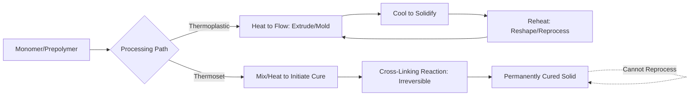
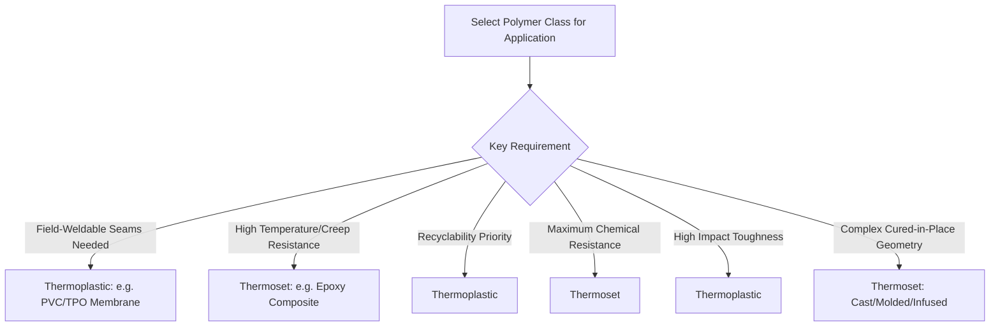

## Thermoplastics Versus Thermosets

### Overview

Thermoplastics and thermosets represent the two fundamental polymer processing classes, distinguished by molecular cross-linking. This distinction governs not only how each material is processed and reprocessed, but also its mechanical behavior, chemical resistance, temperature response, and end-of-life recyclability—making the thermoplastic/thermoset choice one of the most consequential early decisions in polymer material selection for construction applications.

### Molecular Basis of the Distinction

**Key Points**

- **Thermoplastics** consist of linear or branched polymer chains held together only by secondary intermolecular forces (van der Waals forces, hydrogen bonding, chain entanglement); no covalent bonds link separate chains
- **Thermosets** form a covalently cross-linked three-dimensional network during a curing reaction, permanently joining what were originally separate monomer or prepolymer molecules into a single interconnected macromolecule
- This structural difference is irreversible for thermosets: once cured, the cross-linked network cannot be melted and reshaped without breaking covalent bonds, which causes degradation rather than simple softening
- Thermoplastics can be repeatedly heated above their melting/softening point, reshaped, and cooled, since heating only overcomes the weaker secondary forces between chains, not covalent backbone bonds

### Processing Behavior Comparison

**Key Points**

- **Thermoplastics**: processed by heating to a flowable state (extrusion, injection molding, thermoforming), then cooling to solidify; process is reversible, enabling regrind and reprocessing of scrap material
- **Thermosets**: processed through a curing reaction (heat-activated, chemically activated via catalyst/hardener, or both) that is irreversible; once cured, the part's shape is permanently fixed
- Thermoset curing can occur at room temperature (two-part epoxies, polyester resins with catalyst) or require elevated temperature/pressure (compression molding of some composite systems)
- Cure time and exotherm control are critical processing parameters for thermosets, particularly in thick sections where reaction heat can accumulate and cause thermal degradation or dimensional distortion

### Mechanical and Thermal Property Comparison

**Key Points**

- **Temperature resistance**: thermosets generally retain mechanical properties to higher temperatures than comparable thermoplastics, since the cross-linked network resists softening; thermoplastics progressively lose stiffness as temperature approaches $T_g$ (amorphous) or $T_m$ (crystalline regions)
- **Creep resistance**: thermosets generally exhibit lower long-term creep under sustained load due to the restraining effect of the cross-linked network; thermoplastics, particularly above $T_g$, are more prone to time-dependent deformation under sustained stress
- **Impact toughness**: thermoplastics generally offer higher impact toughness and fracture resistance, since chain mobility allows energy-absorbing plastic deformation; thermosets tend toward more brittle failure, as the rigid network limits large-scale chain movement
- **Chemical resistance**: highly cross-linked thermosets often exhibit superior resistance to solvents and chemical attack, since the network structure resists chain separation/dissolution that can occur in thermoplastics exposed to compatible solvents

### Recyclability and End-of-Life Considerations

**Key Points**

- Thermoplastics are generally mechanically recyclable: scrap and post-consumer material can be reground, remelted, and reprocessed into new products, though repeated reprocessing gradually degrades molecular weight and properties
- Thermosets cannot be mechanically recycled through remelting; end-of-life options are generally limited to mechanical grinding into filler material (with reduced value), incineration for energy recovery, or specialized chemical recycling processes that break down the network
- [Inference] This recyclability difference is an increasingly significant factor in material selection for construction products as embodied-carbon and circularity requirements become more prominent in specification and procurement decisions, though the practical impact varies substantially by jurisdiction, product category, and available recycling infrastructure

### Comparative Property Table

| Property | Thermoplastics | Thermosets |
| --- | --- | --- |
| Cross-linking | None (secondary forces only) | Covalent network |
| Reprocessability | Yes, repeatedly (with property degradation) | No (permanent cure) |
| Temperature resistance | Moderate, governed by $T_g$/$T_m$ | Generally higher |
| Creep resistance | Lower (especially above $T_g$) | Generally higher |
| Impact toughness | Generally higher | Generally lower (more brittle) |
| Chemical/solvent resistance | Variable, can be dissolved by compatible solvents | Generally higher |
| Typical processing | Extrusion, injection molding, thermoforming | Casting, compression molding, resin infusion, spray-up |
| Recyclability | Mechanical recycling feasible | Limited (grinding, incineration, specialized chemical recycling) |

### Representative Construction Applications

**Key Points**

- **Thermoplastic applications**: PVC and HDPE piping, polycarbonate/acrylic glazing, PP geotextiles and geomembranes, PVC and TPO roofing membranes, vinyl siding and window profiles
- **Thermoset applications**: epoxy adhesives and coatings, epoxy or polyester matrix in fiber-reinforced polymer (FRP) rebar and structural shapes, polyurethane rigid foam insulation (certain formulations), unsaturated polyester resin in composite panels

### Weldability and Joining Differences

**Key Points**

- Thermoplastics can generally be joined by heat welding (fusion welding, hot-air welding, solvent welding for some chemistries), since localized heating re-melts the material at the joint interface, forming a continuous bond upon cooling
- Thermosets cannot be heat-welded, since the cured network will not re-flow; joining relies on mechanical fastening or adhesive bonding
- This distinction is particularly relevant for field-installed products: thermoplastic geomembranes and roofing membranes are commonly joined by heat-welded seams, while thermoset composite components typically rely on bolted or adhesively bonded connections

### Selection Framework

**Conclusion**

The thermoplastic-thermoset distinction, rooted in the presence or absence of covalent cross-linking, cascades into nearly every practical aspect of polymer material behavior in construction: how it is processed and joined, how it responds to sustained load and elevated temperature, how tough or brittle it behaves under impact, and whether it can be recycled at end of life. Neither class is universally superior; selection depends on matching these fundamental trade-offs to the specific performance and lifecycle requirements of the application.

**Related Topics**

- Polymer Structure and Classification
- Fiber-Reinforced Polymer (FRP) Composites in Construction
- Thermoplastic Piping Materials (PVC, HDPE, PP)
- Heat-Welded Membrane Systems (TPO, PVC Roofing)
- Polymer Degradation Mechanisms (UV, Thermal, Hydrolytic)
- Adhesives and Structural Bonding in Construction
- Creep Behavior in Polymeric Construction Materials