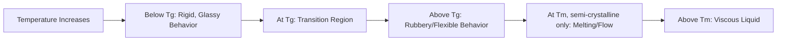

## Mechanical and Thermal Behavior of Polymers

### Overview

Polymers exhibit fundamentally different mechanical and thermal behavior than metals or ceramics, governed by viscoelasticity: their response to load depends simultaneously on stress, strain, temperature, and time. This time- and temperature-dependent behavior—absent or negligible in most structural metals at service temperatures—requires distinct analytical approaches and design considerations for polymers used in construction.

### Viscoelasticity Fundamentals

**Key Points**

- Polymers exhibit both elastic (instantaneous, recoverable) and viscous (time-dependent, energy-dissipating) response to applied stress, unlike purely elastic metals (below yield) or purely viscous fluids
- Under constant stress, polymers exhibit **creep**: progressive deformation increasing with time even though stress remains constant
- Under constant strain, polymers exhibit **stress relaxation**: the stress required to maintain that strain decreases over time as molecular chains reorganize
- These behaviors arise from time-dependent chain segment motion (sliding, uncoiling, reptation) within the polymer network, distinguishing polymers from metals where deformation mechanisms (dislocation motion) are comparatively rate-independent at typical service conditions

### Stress-Strain Behavior

**Key Points**

- Polymer stress-strain curves vary dramatically by class: rigid thermoplastics and thermosets show relatively linear elastic behavior followed by yielding or brittle fracture; elastomers show highly nonlinear, large-strain-capable behavior with a much lower initial modulus
- Elastic modulus of polymers (typically 0.01–4 GPa for unreinforced plastics) is one to three orders of magnitude lower than structural metals (steel ~200 GPa), meaning polymer components are frequently deflection-governed rather than strength-governed in design
- Yield behavior in thermoplastics is often accompanied by **necking** and, in some semi-crystalline polymers, **cold drawing**, where chain alignment in the neck region produces a stable, elongated drawn section before eventual fracture
- Brittle fracture (without significant yielding) becomes more likely at lower temperatures, higher strain rates, in the presence of stress concentrations (notches, sharp corners), and in more highly cross-linked or highly crystalline materials

### Temperature-Dependent Behavior

**Key Points**

- **Glass transition temperature ($T_g$)**: marks the transition from rigid, glassy behavior (below $T_g$) to more flexible, rubbery behavior (above $T_g$) in amorphous regions; modulus can drop by orders of magnitude across this transition
- **Melting temperature ($T_m$)**: applies to crystalline regions of semi-crystalline polymers; above $T_m$, the material loses solid mechanical integrity and flows
- Service temperature range relative to $T_g$ fundamentally determines whether a polymer behaves as a rigid structural material or a flexible, elastomer-like material in a given application
- Low-temperature embrittlement is a critical design consideration for exterior polymer products (roofing membranes, sealants, pipe) in cold climates, where a polymer formulated to be flexible at moderate temperatures may become brittle and crack-prone well above its nominal $T_g$ due to formulation, aging, or plasticizer loss effects

### Creep and Long-Term Deformation

**Key Points**

- Creep behavior is typically characterized through creep modulus (apparent modulus decreasing with time under sustained load) rather than a single static modulus value, since polymer stiffness under sustained load is time-dependent
- Creep rate increases with temperature, applied stress level, and proximity to $T_g$; well below $T_g$, creep rates are typically much lower
- Long-term structural applications (e.g., FRP structural members, polymer bearing pads, sustained-load fasteners) require creep data over the intended service life, often extrapolated from accelerated short-term testing using time-temperature superposition methods
- [Inference] Design codes and manufacturer specifications for load-bearing polymer products typically incorporate creep-based reduction factors or specify maximum sustained-load limits well below short-term strength, reflecting the practical need to keep long-term deformation within serviceable limits, though specific factors vary by product standard and application

### Impact and Fracture Behavior

**Key Points**

- Impact resistance in polymers is strongly rate-dependent: many polymers that behave in a ductile manner under slow loading become brittle under rapid impact loading, since chain mobility (needed for ductile yielding) cannot keep pace with rapid strain rates
- **Ductile-to-brittle transition temperature**: many polymers exhibit a temperature below which impact fracture behavior shifts from ductile/tough to brittle; this is analogous to, but mechanistically distinct from, the ductile-to-brittle transition in body-centered cubic metals like ferritic steel
- Notch sensitivity varies significantly by polymer type; some polymers (e.g., polycarbonate) retain good notched impact strength, while others are highly notch-sensitive, with impact strength dropping sharply in the presence of small surface flaws or sharp geometric features

### Fatigue Behavior

**Key Points**

- Polymers exhibit fatigue behavior under cyclic loading, generally characterized by S-N (stress-life) curves similar in concept to metal fatigue analysis, though underlying mechanisms differ (localized heating/softening from hysteresis losses can contribute to polymer fatigue failure, distinct from purely crack-propagation-driven metal fatigue)
- Cyclic loading at sufficient frequency can generate significant internal heating (hysteretic heating) in some polymers due to viscoelastic energy dissipation, potentially leading to thermal softening failure distinct from classical fatigue crack growth
- Fatigue performance is relevant to applications such as roofing membranes under thermal cycling, elastomeric bearings under repeated traffic loading, and polymer pipe under pressure cycling

### Environmental and Aging Effects on Mechanical Behavior

**Key Points**

- UV exposure and thermal aging cause chain scission (breaking of polymer backbone bonds), progressively reducing molecular weight and, consequently, strength, ductility, and impact resistance over time
- Plasticizer migration/volatilization in flexible formulations (e.g., plasticized PVC) causes progressive stiffening and embrittlement with age, independent of chain scission mechanisms
- Moisture absorption (particularly relevant to some thermosets and fiber-reinforced composites) can plasticize the polymer matrix, reducing stiffness and strength while sometimes improving impact toughness—a trade-off requiring consideration in design
- Chemical exposure (solvents, oils, alkaline concrete environments) can cause swelling, softening, or environmental stress cracking depending on polymer-chemical compatibility

### Comparative Property Summary Table

| Behavior | Polymers (General) | Structural Steel (Comparison) |
| --- | --- | --- |
| Elastic modulus | 0.01–4 GPa (unreinforced) | ~200 GPa |
| Time-dependence under load | Significant (creep, stress relaxation) | Negligible at typical service temperature |
| Temperature sensitivity of stiffness | High, especially near $T_g$ | Low, until near recrystallization/tempering temperatures |
| Impact behavior | Strongly rate- and temperature-dependent | Ductile-to-brittle transition in BCC steels, generally at lower relative service-temperature sensitivity |
| Fatigue mechanism | Crack growth plus hysteretic heating | Primarily crack initiation/growth |
| UV/environmental degradation | Significant concern (chain scission, plasticizer loss) | Primarily electrochemical corrosion, distinct mechanism |

### Design Implications for Construction Applications

**Key Points**

- Deflection limits, rather than strength limits, frequently govern polymer component design given the comparatively low elastic modulus
- Sustained-load applications must account for creep-reduced long-term stiffness/strength rather than relying on short-term test values
- Service temperature range must be checked against both $T_g$ (flexibility/brittleness) and any relevant $T_m$ (loss of structural integrity) with appropriate margin
- Fiber reinforcement (addressed separately under FRP composites) is the primary strategy for substantially increasing polymer stiffness and reducing creep sensitivity for structural applications

**Conclusion**

The mechanical and thermal behavior of polymers is fundamentally governed by viscoelasticity, producing time-, temperature-, and rate-dependent responses that have no direct equivalent in typical structural metal behavior at service temperatures. Effective use of polymers in construction requires design approaches that explicitly account for creep, temperature-dependent stiffness relative to $T_g$/$T_m$, rate-dependent impact behavior, and long-term environmental degradation, rather than applying static, single-value property assumptions common in metal design.

**Related Topics**

- Polymer Structure and Classification
- Thermoplastics Versus Thermosets
- Fiber-Reinforced Polymer (FRP) Composites in Construction
- Polymer Degradation Mechanisms (UV, Thermal, Hydrolytic)
- Elastomeric Bearings and Expansion Joint Design
- Creep and Long-Term Deformation in Construction Materials
- Ductile-to-Brittle Transition in Materials