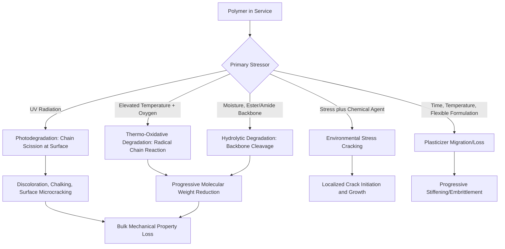

## Polymer Degradation and Weathering

### Overview

Polymer degradation encompasses the chemical and physical mechanisms by which polymers lose performance over service life, driven primarily by ultraviolet radiation, thermal exposure, moisture, chemical attack, and mechanical stress, often acting synergistically. Unlike most structural metals, where corrosion is the dominant long-term degradation mode, polymers degrade primarily through molecular-level chain scission, cross-linking, or additive loss—mechanisms that directly and often unpredictably alter mechanical properties, making degradation resistance a central design consideration for exterior-exposed construction polymers.

### Photodegradation (UV Degradation)

**Key Points**

- Ultraviolet radiation, particularly UV-B and UV-A wavelengths present in sunlight, carries sufficient photon energy to break certain polymer backbone bonds directly (chain scission) or initiate free-radical oxidative degradation chains
- Aromatic and certain unsaturated polymer structures (e.g., polymers containing double bonds or aromatic rings) are generally more UV-susceptible than fully saturated aliphatic structures, though susceptibility varies significantly by specific chemistry
- Photodegradation typically manifests first as surface effects: discoloration (yellowing or chalking), loss of gloss, and surface microcracking, before progressing to bulk mechanical property loss as degradation penetrates deeper into the material
- UV stabilizers (hindered amine light stabilizers/HALS, UV absorbers) and carbon black or other UV-blocking pigments are standard formulation additions to extend service life of exterior-exposed products

### Thermal Degradation and Thermo-Oxidative Aging

**Key Points**

- Elevated service or processing temperatures accelerate oxidative chain scission reactions, following an approximately exponential relationship with temperature (consistent with Arrhenius-type reaction kinetics), meaning modest temperature increases can substantially accelerate long-term degradation rate
- Thermo-oxidative degradation proceeds through a free-radical chain mechanism: initiation (bond breaking, often UV- or heat-initiated), propagation (oxygen reacting with radical sites, generating new radicals), and termination
- Antioxidants are formulated into polymers specifically to interrupt this radical chain mechanism, significantly extending service life under thermal and oxidative stress
- Processing-related thermal degradation (during extrusion, molding) can pre-damage molecular weight distribution even before the product enters service, making processing temperature control a quality factor distinct from in-service aging

### Hydrolytic Degradation

**Key Points**

- Certain polymer chemistries (notably those containing ester or amide linkages in the backbone, such as some polyesters and polyurethanes) are susceptible to hydrolysis: water molecules chemically react with and cleave these linkages, causing chain scission
- Hydrolytic degradation rate increases with temperature, moisture exposure duration, and, for some chemistries, pH extremes (acidic or alkaline conditions accelerate hydrolysis)
- Relevant to below-grade or continuously wet construction applications: buried polyester-based geotextiles, some polyurethane foam formulations, and polyester-based FRP composites in wet environments warrant hydrolysis resistance evaluation
- Polymers without hydrolyzable backbone linkages (e.g., polyethylene, polypropylene, PVC) are generally not susceptible to this specific mechanism, though they remain susceptible to UV and thermo-oxidative pathways

### Chemical and Environmental Stress Cracking

**Key Points**

- **Environmental stress cracking (ESC)**: occurs when a polymer under sustained tensile stress is exposed to a specific chemical agent (often a surfactant, oil, or solvent) that is not aggressive to the unstressed polymer alone, but promotes crack initiation and propagation when combined with stress; well documented in certain semi-crystalline thermoplastics
- Chemical compatibility must be verified for the specific service environment, since even chemically "resistant" polymers can experience accelerated failure under the combined effect of stress and a compatible but individually non-damaging chemical agent
- Alkaline environments (fresh concrete, cementitious contact) require specific evaluation for polymers used in direct or near-continuous contact, as compatibility varies significantly by polymer chemistry

### Plasticizer Migration and Loss

**Key Points**

- Flexible polymer formulations (notably plasticized PVC) rely on small-molecule plasticizers incorporated between polymer chains to reduce effective glass transition temperature and impart flexibility
- Plasticizers can migrate to the surface and volatilize (evaporate) or leach out over time, particularly under elevated temperature or when in contact with certain other materials that absorb plasticizer
- Progressive plasticizer loss causes the material to stiffen and embrittle over time, independent of chain scission degradation, and is a well-documented aging mechanism in flexible PVC roofing membranes and similar products
- Formulation strategies (higher molecular weight plasticizers, polymeric plasticizers) can reduce migration rate but generally cannot eliminate this aging mechanism entirely

### Degradation Mechanism Overview Diagram

### Weathering Test Methods and Standards

**Key Points**

- **Natural (outdoor) weathering**: exposure racks at defined geographic/climatic test sites (e.g., Florida for high UV/humidity, Arizona for high UV/dry heat) provide realistic but slow (multi-year) degradation data
- **Accelerated weathering**: laboratory devices (xenon arc, UV-fluorescent, per ASTM G154/G155) simulate concentrated UV exposure with controlled temperature and moisture cycling to estimate long-term performance in compressed timeframes
- [Inference] Correlation between accelerated laboratory weathering results and actual field service life is generally treated as approximate rather than precisely predictive, since accelerated methods cannot perfectly replicate the full spectrum, intensity, and cyclic combination of natural weathering factors, which is why many construction product standards specify both accelerated testing and periodic field performance verification
- Standard test methods evaluate specific property retention (tensile strength, elongation, color change, surface cracking) after defined accelerated exposure duration as pass/fail or comparative performance criteria

### Degradation Susceptibility by Common Construction Polymer

| Polymer | UV Susceptibility | Hydrolysis Susceptibility | Common Mitigation |
| --- | --- | --- | --- |
| PVC (rigid) | Moderate (chalking) | Low | UV stabilizers, pigments |
| PVC (flexible/plasticized) | Moderate, plus plasticizer loss | Low | UV stabilizers, migration-resistant plasticizers |
| Polyethylene (HDPE/LDPE) | Moderate-High (unstabilized) | Low | Carbon black, HALS stabilizers |
| Polypropylene | High (unstabilized) | Low | Antioxidants, UV stabilizers, pigments |
| Polyurethane (certain types) | Moderate-High | Moderate-High (ester-based types) | UV-resistant topcoats, stabilizer packages |
| Epoxy | Moderate (surface chalking, generally protected/coated) | Low | Protective topcoats for exterior use |
| EPDM | Low-Moderate (good inherent UV resistance) | Low | Minimal additional stabilization often needed |
| Silicone | Low (excellent inherent UV/thermal stability) | Low | Minimal additional stabilization typically needed |

### Design and Specification Implications

**Key Points**

- Products intended for direct, sustained exterior exposure should be specified with documented accelerated weathering performance data and, where available, field service history relevant to the intended climate
- Protective strategies (UV-resistant topcoats, ballast/cover systems on roofing membranes, pigmentation) can substantially extend service life of inherently UV-susceptible polymers without requiring a different base polymer chemistry
- Below-grade, submerged, or continuously wet applications warrant specific evaluation of hydrolytic stability, particularly for ester-linkage-containing polymers
- Combined stress-and-chemical exposure scenarios (environmental stress cracking risk) should be evaluated specifically for the intended service chemical environment, rather than relying solely on general chemical resistance charts developed for unstressed conditions

**Conclusion**

Polymer degradation in construction applications proceeds through several distinct but often interacting molecular mechanisms—photodegradation, thermo-oxidation, hydrolysis, environmental stress cracking, and plasticizer loss—each with different sensitivity to UV exposure, temperature, moisture, and chemical environment. Effective long-term performance depends on matching polymer chemistry and stabilizer formulation to the specific combination of environmental stressors the product will encounter, supported by both accelerated laboratory testing and, where available, field performance data.

**Related Topics**

- Polymer Structure and Classification
- Mechanical and Thermal Behavior of Polymers
- UV Stabilizers and Antioxidant Additives
- Roofing Membrane Systems (TPO, PVC, EPDM)
- Accelerated Weathering Test Standards (ASTM G154/G155)
- Environmental Stress Cracking in Thermoplastics
- Fiber-Reinforced Polymer (FRP) Composites in Construction