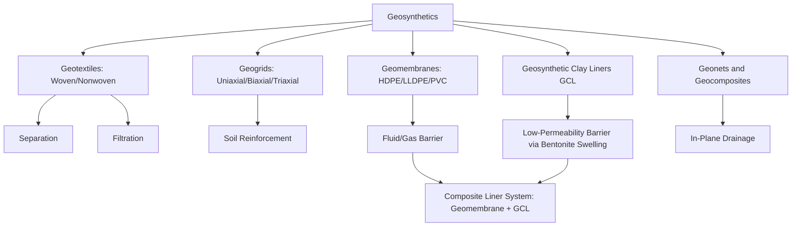

## Geosynthetics and Geomembranes

### Overview

Geosynthetics are polymer-based products engineered for use in geotechnical, environmental, and civil engineering applications, functioning through interaction with soil, rock, or other geotechnical materials. Geomembranes—a specific geosynthetic subcategory—are relatively impermeable polymeric sheets used primarily as fluid or gas barriers. Together, this product family enables applications ranging from landfill liners and reservoir containment to soil reinforcement, filtration, and drainage that would be impractical or impossible using conventional construction materials alone.

### Geosynthetic Functional Categories

**Key Points**

- **Separation**: preventing intermixing of dissimilar soil/aggregate layers (e.g., geotextile between subgrade and aggregate base in pavement systems)
- **Filtration**: allowing water passage while retaining soil particles, analogous to a graded filter but achieved through engineered pore structure rather than particle gradation
- **Drainage**: providing a plane or path for fluid movement within or along the geosynthetic structure (geonets, geocomposites)
- **Reinforcement**: providing tensile resistance within soil mass to improve stability (geogrids, high-strength woven geotextiles) for retaining walls, embankments over soft soils, and slope stabilization
- **Containment/barrier**: preventing or substantially reducing fluid or gas migration (geomembranes, geosynthetic clay liners)
- A single geosynthetic product may serve multiple functions simultaneously (e.g., a woven geotextile providing both separation and reinforcement)

### Geotextiles

**Key Points**

- Permeable fabric-like materials manufactured from synthetic polymer fibers, primarily polypropylene and polyester
- **Woven geotextiles**: fibers interlaced in a defined pattern, generally offering higher tensile strength and lower elongation, suited to reinforcement applications
- **Nonwoven geotextiles**: fibers bonded through needle-punching, heat-bonding, or chemical bonding into a random, felt-like structure, generally offering better filtration/drainage characteristics and higher elongation at break
- Key design properties: apparent opening size (AOS, governing filtration/soil retention), permittivity (cross-plane flow capacity), grab tensile strength, puncture resistance, and UV resistance for exposed applications
- Common applications: subgrade separation in roadways, filtration around drainage aggregate, erosion control, silt fencing, and reinforcement layers in retaining structures

### Geogrids

**Key Points**

- Open, grid-like structures with large apertures designed to interlock with surrounding soil or aggregate particles, providing tensile reinforcement primarily through this soil interlock mechanism rather than surface friction alone
- **Uniaxial geogrids**: high strength in one direction, used for retaining wall and steep slope reinforcement where load direction is predictable
- **Biaxial geogrids**: comparable strength in two perpendicular directions, used for base course reinforcement under distributed loading (roadways, parking areas)
- **Triaxial (multi-axial) geogrids**: strength distributed across multiple directions, used for similar base reinforcement applications with claimed improved multi-directional load distribution
- Commonly manufactured from high-density polyethylene (HDPE), polypropylene (PP), or polyester (PET), with polyester grids typically coated (e.g., PVC coating) for protection during installation and service

### Geomembranes

**Key Points**

- Relatively impermeable polymeric sheets, typically 0.5–2.5 mm (20–100 mil) thick, used as primary or secondary containment barriers
- **High-density polyethylene (HDPE)**: most widely used geomembrane material; excellent chemical resistance, good UV resistance when properly formulated, relatively brittle at low temperature relative to more flexible alternatives; dominant choice for landfill liners and caps
- **Linear low-density polyethylene (LLDPE)**: more flexible than HDPE, better conformability to irregular subgrades and better puncture/tear resistance, commonly used where flexibility is prioritized over the somewhat higher chemical resistance of HDPE
- **Polyvinyl chloride (PVC)**: flexible, good workability and seaming characteristics, commonly used in smaller containment ponds and secondary containment, generally less chemically resistant than polyethylene-based products for aggressive containment applications
- **Reinforced polypropylene (fPP-R) and other specialty membranes**: used where specific combinations of flexibility, chemical resistance, or installation characteristics are required
- Seaming is a critical installation-quality factor: field seams are typically joined by fusion (hot-wedge or extrusion) welding for HDPE/LLDPE or solvent/heat welding for PVC, with weld integrity verified through destructive and non-destructive (air pressure, vacuum box) testing

### Geosynthetic Clay Liners (GCLs)

**Key Points**

- Composite product combining a thin layer of bentonite clay sandwiched between or bonded to geotextile layers (or bonded to a geomembrane in composite GCL products)
- Functions as a low-permeability barrier through bentonite's swelling behavior when hydrated, which closes pore spaces and creates a very low hydraulic conductivity layer
- Commonly used as a composite system with a geomembrane (geomembrane plus GCL) in landfill liner and cap systems, providing redundant containment where a geomembrane defect could otherwise allow leakage
- More susceptible to performance reduction from certain chemical environments (e.g., high-ionic-strength leachate) than geomembranes alone, requiring compatibility evaluation for aggressive containment applications

### Geocomposites and Geonets

**Key Points**

- **Geonets**: extruded polymer (typically HDPE) net structures providing an in-plane drainage path, commonly laminated between geotextile layers to form a **geocomposite drainage layer**
- Used for landfill leachate collection layers, retaining wall backfill drainage, and green roof/plaza deck drainage systems
- Transmissivity (in-plane flow capacity under confined loading conditions) is the primary design property, which decreases under increasing normal (compressive) load—an important design consideration for deep burial or high-load applications

### Functional Classification Diagram

### Design and Installation Considerations

**Key Points**

- Chemical compatibility testing (e.g., per EPA Method 9090 or equivalent) is standard practice for geomembrane selection in containment applications exposed to specific leachates or chemicals, since long-term chemical resistance cannot be assumed from generic polymer resistance charts alone
- UV exposure protection is critical for exposed geomembrane applications (e.g., floating covers, exposed liner slopes); many products rely on carbon black loading and UV stabilizer packages, with cover soil or ballast used where feasible to limit direct UV exposure duration
- Puncture and tear resistance during installation (from underlying subgrade irregularities, construction traffic, or overlying material placement) is a critical practical failure mode, often addressed through cushion geotextiles placed beneath geomembranes over rough subgrades
- Interface friction (geosynthetic-to-soil or geosynthetic-to-geosynthetic) governs slope stability in lined slope applications, particularly critical for landfill cover and liner systems on steep slopes; interface shear strength testing is standard design practice for these applications
- Construction Quality Assurance (CQA) programs, including seam testing and installation documentation, are standard practice for critical containment applications given the difficulty and cost of post-installation repair

### Comparative Application Table

| Product | Primary Function | Common Base Polymer | Typical Application |
| --- | --- | --- | --- |
| Woven Geotextile | Reinforcement, separation | Polypropylene, polyester | Retaining wall reinforcement, roadway subgrade |
| Nonwoven Geotextile | Filtration, separation | Polypropylene, polyester | Drainage filtration, erosion control |
| Geogrid | Reinforcement | HDPE, PP, coated polyester | Retaining walls, base course reinforcement |
| HDPE Geomembrane | Containment barrier | HDPE | Landfill liners/caps, industrial ponds |
| LLDPE Geomembrane | Containment barrier | LLDPE | Flexible/irregular subgrade containment |
| PVC Geomembrane | Containment barrier | PVC | Smaller ponds, secondary containment |
| GCL | Low-permeability barrier | Bentonite + geotextile/geomembrane | Composite liner systems |
| Geonet/Geocomposite | Drainage | HDPE | Leachate collection, wall drainage |

**Conclusion**

Geosynthetics and geomembranes extend conventional geotechnical and civil engineering practice by providing engineered functions—separation, filtration, drainage, reinforcement, and containment—through polymer-based products tailored to specific soil, fluid, and chemical interaction requirements. Material selection depends on matching functional requirements, chemical compatibility, installation conditions, and long-term durability expectations, with composite systems (such as geomembrane plus GCL) frequently employed to provide redundancy in critical containment applications.

**Related Topics**

- Polymer Structure and Classification
- Polymer Degradation and Weathering
- Landfill Liner and Cap System Design
- Retaining Wall Design with Reinforced Soil
- Slope Stability and Interface Shear Strength
- Construction Quality Assurance (CQA) for Lined Facilities
- Drainage Design in Geotechnical Structures