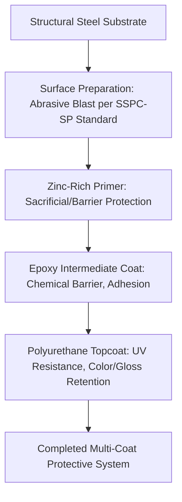
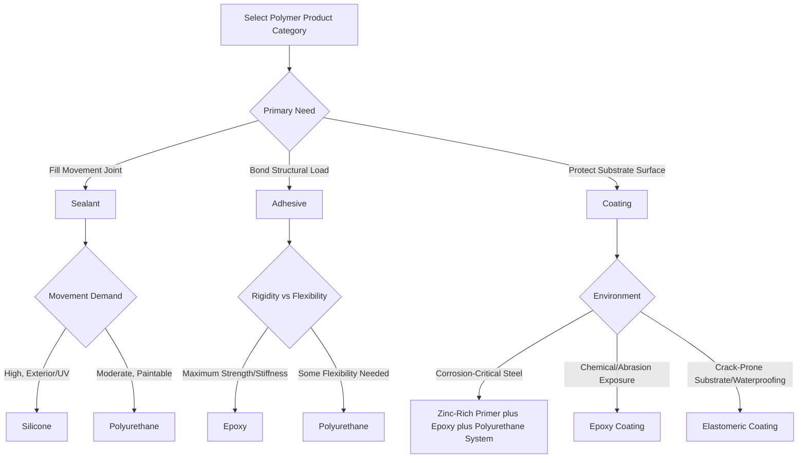

## Sealants, Adhesives, and Protective Coatings

### Overview

Sealants, adhesives, and protective coatings are polymer-based materials that perform joining, gap-filling, or surface-protection functions distinct from the load-bearing structural roles of most other construction materials. Though chemically related and sometimes overlapping in formulation, each category is defined by a distinct primary function—sealants exclude environmental elements while accommodating movement, adhesives transfer structural or semi-structural load between substrates, and coatings protect underlying surfaces from environmental degradation—governing fundamentally different property requirements and selection criteria.

### Sealants: Function and Classification

**Key Points**

- Primary function: fill joints and gaps to exclude air, water, dust, and other elements while accommodating anticipated joint movement (thermal expansion/contraction, structural deflection, seismic movement) without losing adhesion or cohesion
- **Movement capability** is a defining sealant property, typically expressed as a percentage of joint width the sealant can accommodate in extension and compression (e.g., ±25%, ±50%)
- **Silicone sealants**: excellent UV and thermal stability, wide service temperature range, high movement capability; widely used for structural glazing, curtain wall joints, and exterior weatherproofing where long-term performance is critical
- **Polyurethane sealants**: good mechanical properties and paintability, moderate movement capability, commonly used for pavement joints, precast concrete panel joints, and general construction joints
- **Polysulfide sealants**: excellent chemical and fuel resistance, historically significant in insulating glass unit (IGU) secondary seals and immersed/submerged joint applications
- **Acrylic (latex) sealants**: lower cost, easier application and paintability, lower movement capability and durability, typically limited to interior or low-movement applications

### Adhesives: Function and Classification

**Key Points**

- Primary function: transfer load (structural, semi-structural, or non-structural) between two substrates through the adhesive bondline, requiring adequate adhesive strength, cohesive strength, and substrate compatibility
- **Epoxy adhesives**: high strength and stiffness, excellent for structural bonding applications including anchor bolt/rebar doweling into concrete, structural steel bonding, and FRP composite bonding; generally rigid with limited movement accommodation
- **Polyurethane adhesives**: good strength with greater flexibility than epoxies, commonly used for panel bonding, flooring adhesives, and applications requiring some joint movement tolerance
- **Acrylic (structural) adhesives**: fast curing, good gap-filling capability, used in structural glazing and metal bonding applications
- **Cyanoacrylate and specialty adhesives**: rapid bonding for specific material combinations, generally limited to smaller-scale or specialty construction applications rather than primary structural connections
- Structural adhesive anchoring systems (epoxy, vinylester, or polyurethane-based) for post-installed rebar and anchor bolts are governed by product-specific code evaluation reports (e.g., ICC-ES ESR reports) establishing design values

### Protective Coatings: Function and Classification

**Key Points**

- Primary function: protect underlying substrate (steel, concrete, wood) from environmental degradation—corrosion, moisture, UV, chemical attack, abrasion—while often providing aesthetic finish
- **Epoxy coatings**: excellent chemical and abrasion resistance, good adhesion, commonly used for structural steel primers, concrete floor coatings, and tank linings; generally chalks under prolonged UV exposure unless topcoated, limiting standalone exterior use
- **Polyurethane coatings**: excellent UV resistance and gloss retention as topcoats, good flexibility and abrasion resistance, commonly paired over epoxy primers in multi-coat structural steel systems (epoxy primer/intermediate, polyurethane topcoat)
- **Zinc-rich primers**: (organic or inorganic binder with high zinc dust content) provide galvanic/sacrificial protection to steel, typically as the base coat in high-performance multi-coat structural steel coating systems
- **Alkyd coatings**: traditional oil-based coatings, generally lower performance and shorter service life than epoxy/polyurethane systems, still used in lower-demand or maintenance-repaint applications
- **Elastomeric coatings**: high-elongation coatings (acrylic or polyurethane-based) used for waterproofing applications on concrete, masonry, and roofing where substrate movement or cracking is anticipated

### Multi-Coat Protective Systems for Steel

**Key Points**

- High-performance structural steel coating systems typically combine multiple layers, each serving a distinct function: zinc-rich primer (sacrificial/barrier protection) plus epoxy intermediate coat (barrier/chemical resistance, adhesion bridge) plus polyurethane topcoat (UV resistance, gloss, color retention)
- This layered approach exploits the complementary strengths of each coating chemistry, since no single coating chemistry optimally satisfies all required functions (sacrificial protection, chemical barrier, and UV/weathering resistance) simultaneously
- Surface preparation (typically abrasive blast cleaning to a specified standard, e.g., SSPC-SP or NACE/SSPC joint standards) is critical to coating system performance, since inadequate surface preparation is a leading cause of premature coating failure regardless of coating chemistry quality

### Comparative Function Table

| Category | Primary Function | Key Performance Metric | Common Chemistries |
| --- | --- | --- | --- |
| Sealant | Exclude elements, accommodate movement | Movement capability (% joint width) | Silicone, polyurethane, polysulfide, acrylic |
| Adhesive | Transfer load between substrates | Bond strength, cure time, substrate compatibility | Epoxy, polyurethane, acrylic |
| Coating | Protect substrate surface | Barrier/UV/chemical/abrasion resistance | Epoxy, polyurethane, zinc-rich, elastomeric |

### Selection Framework by Application Requirement

### Durability and Service Life Considerations

**Key Points**

- Sealant service life is strongly governed by UV exposure, joint movement cycling, and substrate adhesion compatibility; silicone sealants generally offer the longest exterior service life among common chemistries due to superior UV and thermal stability
- Adhesive long-term performance requires consideration of creep under sustained load (particularly relevant for structural adhesive anchors and bonded connections), as well as compatibility with substrate movement and environmental exposure
- Coating service life depends heavily on proper surface preparation, dry film thickness control, and appropriate chemistry selection for the exposure environment; premature failure is more commonly attributable to installation/preparation deficiencies than to inherent coating chemistry limitations
- [Inference] Manufacturer warranty periods for sealants, adhesives, and coatings are generally understood within the industry as a practical minimum service life indicator rather than a precise failure prediction, since actual performance depends significantly on installation quality, exposure severity, and substrate condition specific to each project

### Testing and Specification Standards

**Key Points**

- Sealants: ASTM C920 governs elastomeric joint sealant classification by type, grade, class (movement capability), and use
- Adhesive anchors: ICC-ES acceptance criteria (e.g., AC308 for adhesive anchors in concrete) establish qualification testing protocols underlying code-recognized design values
- Protective coatings: SSPC (Society for Protective Coatings) and NACE/AMPP standards govern surface preparation and coating application/inspection practices for structural steel
- Compatibility testing between sealant, adhesive, or coating products and adjacent materials (substrates, other sealants, insulation) is standard practice, since chemical incompatibility between products can cause degradation, staining, or bond failure even when each product performs acceptably in isolation

**Conclusion**

Sealants, adhesives, and protective coatings each address a distinct functional need in construction—movement-accommodating exclusion, load-transferring bonding, and surface protection respectively—despite sharing overlapping polymer chemistry families. Effective selection requires matching the specific chemistry to the governing performance requirement (movement capability for sealants, bond strength and creep resistance for adhesives, barrier/UV/chemical resistance for coatings), supported by proper substrate preparation and adherence to relevant testing standards.

**Related Topics**

- Polymer Structure and Classification
- Polymer Degradation and Weathering
- Structural Adhesive Anchoring Systems (ICC-ES AC308)
- Surface Preparation Standards for Steel Coatings (SSPC/NACE)
- Elastomeric Bearings and Expansion Joint Design
- Fiber-Reinforced Polymer (FRP) Composites in Construction
- Waterproofing Systems for Concrete and Masonry