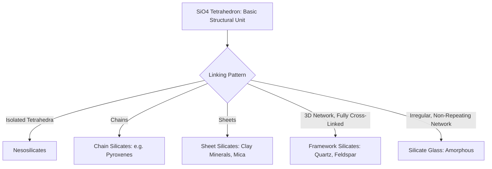

## Structure and Bonding in Ceramics

### Overview

Ceramics are inorganic, non-metallic materials characterized predominantly by ionic and covalent atomic bonding, in contrast to the metallic bonding of metals and the covalent-chain/secondary-force bonding of polymers. This bonding character fundamentally governs ceramic behavior: high hardness, high compressive strength, high melting points, and generally low fracture toughness (brittleness), making an understanding of ceramic bonding and structure essential context for construction materials such as concrete constituents, brick, glass, and refractories.

### Ionic and Covalent Bonding in Ceramics

**Key Points**

- **Ionic bonding**: electrostatic attraction between oppositely charged ions, formed through electron transfer between a metallic (electropositive) and non-metallic (electronegative) element; characteristic of oxide ceramics such as magnesium oxide (MgO) and, in part, many silicate structures
- **Covalent bonding**: electron sharing between atoms with directional, defined bond angles; characteristic of ceramics such as silicon carbide (SiC) and diamond (a ceramic in the broad materials-science sense, though carbon-based)
- Most technical and construction-relevant ceramics exhibit **mixed ionic-covalent bonding**, with the specific ratio determined by the electronegativity difference between constituent elements; higher electronegativity difference favors more ionic character
- Both bonding types are strong and largely non-directional (ionic) or strongly directional (covalent), and critically, neither type provides the delocalized electron mobility of metallic bonding—this absence of free electron mobility is the fundamental reason ceramics are electrically insulating and cannot deform plastically via dislocation glide as readily as metals

### Why Ceramic Bonding Produces Brittleness

**Key Points**

- In metals, metallic bonding is non-directional, allowing atoms to slide past one another (dislocation motion) while maintaining bonding, enabling plastic deformation
- In ionic ceramics, dislocation motion along certain planes would bring ions of like charge into close proximity, creating strong electrostatic repulsion that resists slip; in covalent ceramics, the fixed, directional bond angles similarly resist the atomic rearrangement needed for slip
- This restricted dislocation mobility means ceramics have very limited capacity for plastic deformation at room temperature, so applied stress that would cause a metal to yield instead causes a ceramic to fracture with minimal preceding plastic strain
- [Inference] This bonding-derived brittleness is the fundamental reason ceramic materials in construction (concrete, brick, tile, glass) require design approaches emphasizing compressive loading and crack control rather than the tensile ductility-based design approaches appropriate for steel

### Crystalline Structure in Ceramics

**Key Points**

- Many ceramics are crystalline, with atoms/ions arranged in repeating, ordered three-dimensional lattice structures, though the specific structures are generally more complex than the simple cubic/hexagonal structures common in metals, due to the need to accommodate multiple ion types and charge balance
- Common ceramic crystal structure types include rock salt structure (e.g., MgO), fluorite structure, and perovskite structure, among others, each characterized by specific ion packing arrangements and coordination numbers
- **Coordination number** (number of nearest-neighbor ions surrounding a given ion) is governed largely by the radius ratio between cation and anion, following established geometric packing principles
- Crystalline ceramics generally exhibit well-defined melting points and can show anisotropic (direction-dependent) properties depending on crystal structure symmetry

### Amorphous (Glass) Structure in Ceramics

**Key Points**

- Some ceramic materials, notably silicate glasses, lack long-range atomic order and are instead classified as **amorphous** or **glassy**, retaining only short-range order (the local bonding arrangement around individual atoms) without a repeating long-range lattice
- Glass structure is often described as a continuous random network, where the same basic structural unit found in crystalline silicates (the $SiO_4$ tetrahedron) is present, but connected in an irregular, non-repeating pattern rather than a periodic lattice
- Amorphous ceramics do not exhibit a sharp melting point; instead, they soften gradually over a temperature range as viscosity decreases, characterized by a glass transition temperature analogous in concept (though different in physical origin) to the polymer glass transition
- This structural distinction (crystalline vs. amorphous) parallels, but is mechanistically distinct from, the crystalline/amorphous distinction discussed for polymers

### The Silicate Tetrahedron: Structural Basis of Many Ceramics

**Key Points**

- The fundamental structural unit in the majority of silicate-based ceramics (including many minerals, clays, and glasses) is the $SiO_4$ tetrahedron: one silicon atom covalently/ionically bonded to four oxygen atoms arranged tetrahedrally
- These tetrahedra can link by sharing corner oxygen atoms in various configurations, producing structures ranging from isolated tetrahedra to chains, sheets, and fully three-dimensional networks
- The degree and pattern of tetrahedral linking strongly influences resulting material properties: sheet silicate structures (as in clay minerals) contribute to the platy, easily cleaved morphology relevant to clay behavior in soil and brick-making, while fully cross-linked three-dimensional networks (as in quartz) produce much higher hardness and stability

### Defects in Ceramic Structures

**Key Points**

- Ceramics contain point defects analogous to those in metals (vacancies, interstitials) but with an added constraint: charge neutrality must generally be maintained, meaning defects often occur in coupled pairs (e.g., a cation vacancy paired with an interstitial cation, known as a Frenkel defect, or paired cation-anion vacancies, known as a Schottky defect)
- Unlike metals, where dislocations are the primary mechanism for controlled plastic deformation, dislocations in ceramics are difficult to move and more often associated with brittle fracture initiation than with beneficial ductility
- Microscopic flaws (pores, microcracks, inclusions) act as stress concentrators and are the dominant factor controlling actual ceramic strength, since theoretical bond-strength-based strength is essentially never achieved in bulk ceramic materials due to these flaws (a foundational concept in ceramic fracture mechanics, related to Griffith crack theory)

### Property Consequences of Ceramic Bonding and Structure

**Key Points**

- **High melting point**: strong ionic/covalent bonds require substantial thermal energy to disrupt, giving ceramics generally much higher melting/softening points than metals or polymers
- **High hardness**: strong, largely non-slip-accommodating bonds resist indentation and scratching
- **High compressive strength, low tensile strength**: ceramics resist compressive loading well (atoms pushed together, bonds resist further compression) but are highly sensitive to tensile stress concentrations at flaws, since crack propagation under tension requires no plastic accommodation to proceed
- **Low fracture toughness**: limited plastic deformation capacity means cracks propagate with little energy absorption once initiated, in sharp contrast to ductile metal fracture behavior
- **Electrical and thermal insulation**: absence of delocalized (free) electrons, in contrast to metallic bonding, generally makes ceramics poor electrical and thermal conductors (with some notable exceptions in specialized ceramic classes)
- **Chemical stability**: strong bonding and high oxidation state of constituent elements (already often present as oxides) generally confer good chemical and corrosion resistance relative to metals

### Bonding-Property Relationship Summary Table

| Bonding/Structural Feature | Resulting Property |
| --- | --- |
| Strong ionic/covalent bonds | High melting point, high hardness |
| Directional/non-slip-accommodating bonds | Limited plastic deformation, brittleness |
| Absence of free electrons | Electrical/thermal insulation (general case) |
| Flaw-sensitive tensile behavior | Low tensile strength relative to compressive strength |
| Strong, stable oxide-type bonding | Good chemical/corrosion resistance |
| Amorphous (glass) structure | Gradual softening, no sharp melting point |

**Conclusion**

The ionic and covalent bonding characteristic of ceramics, combined with either crystalline or amorphous structural arrangement, fundamentally explains their defining engineering behavior: exceptional hardness and compressive strength paired with pronounced brittleness and flaw sensitivity. This bonding-structure-property relationship underlies the behavior of essentially every ceramic-based construction material, from crystalline aggregate and clay brick to amorphous glass, and explains why ceramic and cementitious materials in construction are designed primarily for compressive loading with careful attention to crack control and flaw minimization.

**Related Topics**

- Silicate Mineral Structures and Clay Behavior
- Fracture Mechanics and Griffith Crack Theory
- Glass Composition and Manufacturing Processes
- Refractory Ceramics and High-Temperature Applications
- Portland Cement Chemistry and Hydration
- Brittle Fracture Behavior and Flaw Sensitivity
- Compressive vs. Tensile Design Philosophy in Brittle Materials