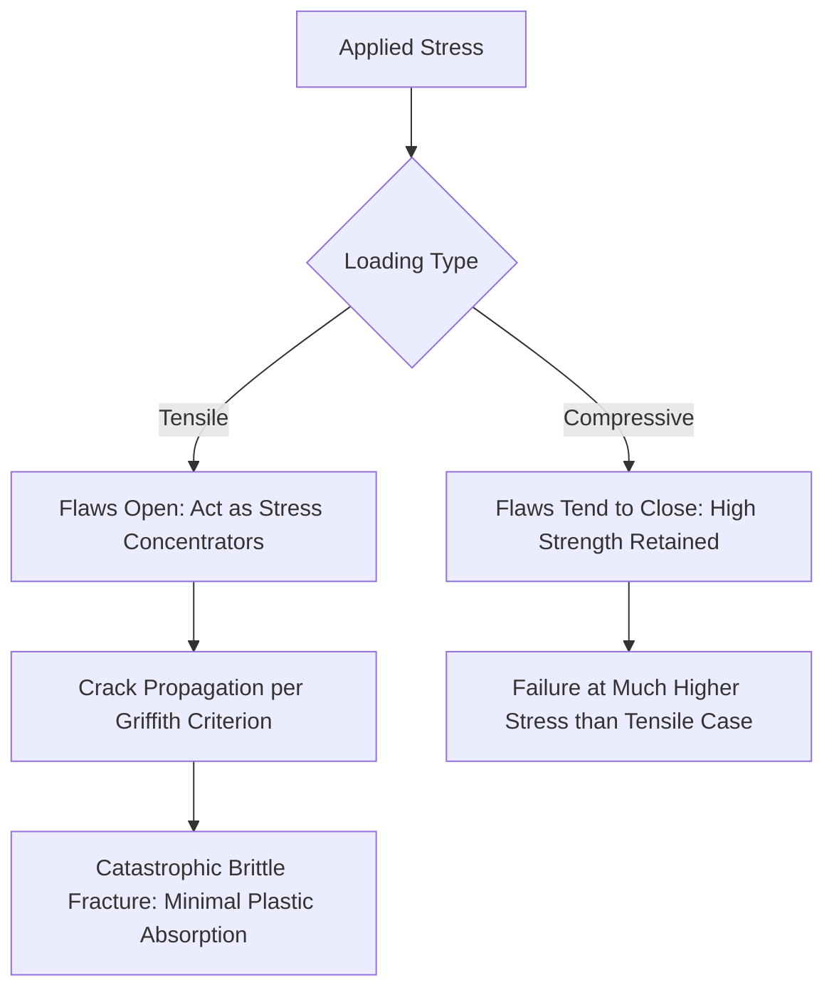

## Mechanical Behavior of Ceramic Materials

### Overview

The mechanical behavior of ceramics is dominated by brittle fracture mechanics rather than the plastic deformation-based yielding characteristic of metals. Because ionic and covalent bonding severely restricts dislocation mobility, ceramics carry load almost entirely elastically until sudden fracture, with actual failure governed not by intrinsic bond strength but by the size and distribution of pre-existing microscopic flaws. This flaw-dominated failure mode explains the characteristic scatter in ceramic strength data and the strongly asymmetric compressive-versus-tensile strength behavior central to construction material design.

### Elastic Behavior and Stiffness

**Key Points**

- Ceramics exhibit nearly linear elastic stress-strain behavior up to the point of fracture, with essentially no plastic deformation region visible on a macroscopic stress-strain curve at room temperature
- Elastic modulus values are generally high relative to polymers and often comparable to or exceeding structural metals (e.g., alumina ~300–400 GPa, versus steel ~200 GPa), reflecting the strength of ionic/covalent bonding
- Because failure occurs before significant plastic strain accumulates, ceramic design relies on elastic stress analysis (rather than plastic limit-state analysis common in ductile steel design) combined with statistically-based strength criteria

### Flaw-Dominated Fracture: Griffith Theory

**Key Points**

- Actual measured ceramic strength is typically only a small fraction of the theoretical strength calculated from atomic bond energies, a discrepancy explained by the presence of microscopic flaws (pores, microcracks, inclusions) that act as stress concentrators
- **Griffith crack theory** establishes that the stress required to propagate a crack is inversely proportional to the square root of the flaw size, meaning larger pre-existing flaws dramatically reduce the stress at which fracture initiates:

  $$\sigma_f = \sqrt{\frac{2E\gamma_s}{\pi a}}$$

  where $\sigma_f$ is fracture stress, $E$ is elastic modulus, $\gamma_s$ is surface energy, and $a$ is the flaw size
- Because flaw size and distribution vary statistically from specimen to specimen (and even within a single specimen), ceramic strength exhibits considerably more scatter than typical metal strength, necessitating statistical strength analysis rather than single-value design strength

### Weibull Statistical Strength Analysis

**Key Points**

- The **Weibull distribution** is the standard statistical framework for characterizing ceramic (and other brittle material) strength, accounting for the probabilistic nature of flaw-controlled failure
- The Weibull modulus (shape parameter) quantifies strength variability: a higher Weibull modulus indicates more consistent strength (narrower flaw size distribution), while a lower modulus indicates greater scatter and less predictable failure stress
- Weibull analysis also captures the "size effect" in brittle materials: larger volumes or surface areas of material have statistically higher probability of containing a critical flaw, meaning larger ceramic components generally exhibit lower characteristic strength than smaller specimens of the same material
- [Inference] This size effect is a key reason ceramic and cementitious construction materials often show reduced apparent strength in larger structural elements or test specimens compared to small laboratory samples, reinforcing the importance of specimen-size-appropriate testing standards for design strength values

### Compressive vs. Tensile Strength Asymmetry

**Key Points**

- Ceramics characteristically exhibit compressive strength substantially higher than tensile strength, often by a factor of 10 or more, in sharp contrast to most metals where compressive and tensile yield strength are approximately equal
- Under compressive loading, existing flaws/cracks tend to close or are less effective at concentrating stress in a crack-propagating manner; under tensile loading, flaws open and act as highly effective stress concentrators, promoting crack propagation at much lower applied stress
- This asymmetry is the fundamental reason construction ceramics and cementitious materials (concrete, brick, stone) are designed primarily as compression-carrying elements, with tensile loading either avoided through geometry (arches, compression-only structural forms) or accommodated through composite reinforcement (steel rebar in reinforced concrete)

### Fracture Toughness

**Key Points**

- **Fracture toughness ($K_{IC}$)** quantifies a material's resistance to crack propagation, representing the critical stress intensity factor at which a crack of given size will propagate catastrophically
- Ceramics generally exhibit low fracture toughness relative to metals, since the crack-tip plastic zone that blunts and arrests cracks in ductile metals is largely absent in ceramics due to restricted dislocation mobility
- Toughening mechanisms in engineered ceramics (transformation toughening, fiber reinforcement, microcrack toughening) can substantially improve fracture toughness relative to monolithic ceramics, though even toughened ceramics generally remain more brittle than structural metals
- In construction ceramics, fiber reinforcement (steel, synthetic, or glass fibers in concrete; fiber-cement products) is a widely used practical toughening strategy that improves post-cracking behavior and energy absorption

### Hardness and Wear Resistance

**Key Points**

- Ceramics generally exhibit high hardness due to strong, resistant atomic bonding, making them valuable for wear-resistant and abrasion-resistant applications (tile, refractory linings, certain aggregate types)
- Hardness testing methods for ceramics typically use indentation techniques (Vickers, Knoop) suited to brittle, high-hardness materials, in contrast to some hardness scales developed primarily for metals
- High hardness generally correlates with good wear/abrasion resistance but does not correlate with high fracture toughness; a material can be simultaneously very hard and very brittle

### Fatigue Behavior in Ceramics

**Key Points**

- Unlike metals, where fatigue failure is primarily driven by cyclic plastic deformation-induced crack initiation and growth, ceramic fatigue (where observed) is more often attributed to slow crack growth from pre-existing flaws under sustained or cyclic stress, sometimes assisted by environmental factors (moisture-assisted subcritical crack growth, notably in some glasses and oxide ceramics)
- **Static fatigue** (delayed failure under sustained, constant load below the short-term fracture strength) is a documented phenomenon in some ceramics and glasses, attributed to slow, environmentally-assisted crack growth from existing flaws over time
- This behavior has practical relevance for sustained-load ceramic and glass construction elements (e.g., structural glass), where design must account for potential long-term strength reduction under sustained stress, distinct from classical metal fatigue mechanisms

### Comparative Mechanical Behavior Table

| Property | Ceramics | Structural Steel (Comparison) |
| --- | --- | --- |
| Stress-strain behavior | Linear elastic to fracture | Elastic, then ductile yielding |
| Elastic modulus | High (often comparable to/exceeding steel) | ~200 GPa |
| Compressive vs. tensile strength | Highly asymmetric (compression much greater) | Approximately equal |
| Fracture toughness | Low | High |
| Strength predictability | Statistical (Weibull), flaw-dependent | Relatively consistent, less flaw-sensitive |
| Size effect on strength | Significant (larger volume, lower strength) | Comparatively minor |
| Fatigue mechanism | Slow crack growth, sometimes environmentally assisted | Cyclic plastic deformation, crack growth |

### Fracture Behavior Illustration

### Design Implications for Construction

**Key Points**

- Structural design with ceramic and cementitious materials (concrete, masonry, structural glass) generally uses statistically-derived characteristic strength values (accounting for Weibull-type variability) combined with substantial safety factors, rather than the deterministic yield-strength-based approach common in ductile metal design
- Geometry that avoids or minimizes tensile stress (arches, compression-only vaults, prestressing in concrete) is a longstanding and effective strategy for working within ceramic materials' fundamental strength asymmetry
- Reinforcement (steel rebar in concrete, interlayers in laminated structural glass) is the standard practical solution for providing tensile capacity and post-cracking ductility that the base ceramic material cannot provide alone
- Quality control focused on minimizing flaw size and porosity (proper concrete consolidation, controlled firing of brick/tile, careful glass manufacturing) directly improves realized strength by reducing the critical flaw population

**Conclusion**

Ceramic mechanical behavior is fundamentally governed by brittle, flaw-sensitive fracture mechanics rather than the ductile yielding behavior of metals, producing characteristic high compressive strength, low tensile strength, low fracture toughness, and statistically variable strength dependent on flaw population and specimen size. These behaviors directly inform the compression-oriented, reinforcement-dependent design philosophy applied throughout ceramic and cementitious construction materials, from unreinforced masonry to reinforced concrete and structural glass.

**Related Topics**

- Structure and Bonding in Ceramics
- Griffith Crack Theory and Fracture Mechanics
- Weibull Statistical Strength Analysis
- Reinforced Concrete Design Principles
- Structural Glass Design and Laminated Glazing
- Fiber Reinforcement in Cementitious Materials
- Compressive vs. Tensile Design Philosophy in Brittle Materials