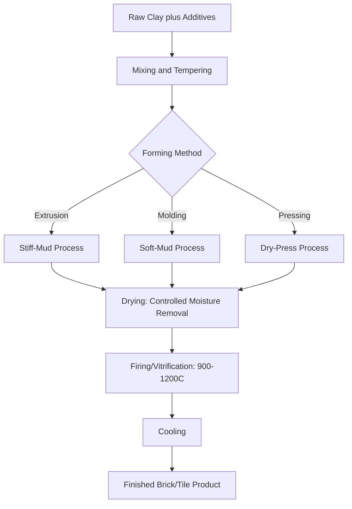

## Traditional Ceramics: Brick and Tile

### Overview

Brick and tile are among the oldest engineered construction materials, produced by shaping clay or clay-bearing raw materials and firing them at elevated temperature to achieve a hardened, durable ceramic body. Despite their ancient origins, modern brick and tile manufacturing involves precisely controlled raw material selection, forming, drying, and firing processes that determine the resulting product's strength, durability, water absorption, and appearance.

### Raw Materials

**Key Points**

- Primary raw material is clay, a fine-grained aluminosilicate mineral (predominantly kaolinite, illite, or montmorillonite clay minerals) that exhibits plasticity when mixed with water, enabling shaping, and hardens permanently upon firing
- Clay's plasticity derives from its sheet-silicate crystal structure (discussed under ceramic bonding and structure), which allows thin water films between clay platelets to enable sliding/reshaping while wet
- Additives commonly blended with clay include shale, sand (to reduce shrinkage and control plasticity), and organic or inorganic pore-forming agents (to control final density and thermal properties)
- Raw material composition (particularly iron oxide content) strongly influences fired color: iron oxide contributes red/brown coloration under oxidizing firing conditions, while different firing atmospheres or clay chemistries produce buff, gray, or other color ranges

### Manufacturing Process: Forming

**Key Points**

- **Stiff-mud (extrusion) process**: clay with relatively low moisture content is extruded through a die under pressure, producing a continuous column subsequently cut to individual brick length; this is the dominant modern brick manufacturing method, well suited to high-volume production and enabling cored (hollow-core) brick designs
- **Soft-mud process**: higher-moisture clay is pressed into molds, historically the traditional method, now largely used for specialty or hand-molded appearance products
- **Dry-press process**: low-moisture clay is pressed under high mechanical pressure into molds, producing very precise dimensions, typically used for specialty or high-precision products

### Manufacturing Process: Drying and Firing

**Key Points**

- **Drying**: formed (green) units must be carefully dried to remove excess moisture before firing; drying rate must be controlled to avoid cracking from differential shrinkage as water is removed from the clay structure
- **Firing (vitrification)**: green units are fired in kilns at temperatures typically ranging from approximately 900°C to 1200°C depending on clay composition and desired properties
- During firing, clay mineral structure undergoes irreversible transformation: chemically bound water is driven off, and at sufficiently high temperature, partial melting (vitrification) of certain mineral phases creates a glassy bonding matrix that fuses particles together, developing the final hardness and strength of the fired product
- Firing temperature and duration directly control the degree of vitrification: higher firing temperature/longer duration generally produces lower porosity, higher strength, lower water absorption, and darker color, up to the point where excessive firing causes warping or bloating

### Classification of Brick by Application

**Key Points**

- **Building (common) brick**: general structural and backup wall use, per ASTM C62 grading by durability (weathering resistance: SW, MW, NW grades based on severe, moderate, or negligible weathering exposure)
- **Facing brick**: selected/manufactured for appearance in exposed exterior wythes, per ASTM C216, with additional grading for appearance (Type FBX, FBS, FBA) alongside weathering grade
- **Paving brick**: manufactured for higher abrasion resistance and compressive strength, per ASTM C902, used in pedestrian and vehicular paving applications
- **Hollow/cored brick**: units manufactured with core holes to reduce weight and material usage while maintaining adequate strength, common in modern extruded brick production
- **Structural clay tile**: larger hollow clay units historically used for backup wythes and fireproofing, largely superseded by concrete masonry units (CMU) in most modern construction but still specified for specific fireproofing or acoustic applications

### Key Physical Properties and Testing

**Key Points**

- **Compressive strength**: primary structural property, tested per ASTM C67; fired clay brick typically achieves compressive strengths ranging from approximately 2,500 psi to over 15,000 psi depending on clay composition, forming method, and firing degree
- **Water absorption**: measures porosity, directly correlated with freeze-thaw durability and efflorescence potential; lower absorption generally indicates higher degree of vitrification and better weathering resistance
- **Saturation coefficient**: ratio of water absorption under normal (24-hour cold) immersion to absorption under boiling immersion; used as an indicator of pore structure and freeze-thaw resistance, with lower saturation coefficients generally indicating better resistance to freeze-thaw damage
- **Freeze-thaw durability**: directly tested (per ASTM C67 freeze-thaw procedures) for brick intended for severe weathering exposure, since water absorbed into pore structure can cause damaging expansive stress upon freezing
- **Efflorescence**: surface deposit of soluble salts migrating to the brick surface and crystallizing upon evaporation; related to both raw material soluble salt content and moisture movement through the fired unit, tested per ASTM C67 procedures

### Comparative Brick Grade/Type Table

| Standard | Product | Key Classification Basis |
| --- | --- | --- |
| ASTM C62 | Building brick | Weathering grade (SW/MW/NW) |
| ASTM C216 | Facing brick | Weathering grade plus appearance type (FBX/FBS/FBA) |
| ASTM C902 | Paving brick | Abrasion resistance, application class |
| ASTM C67 | Test methods | Compressive strength, absorption, freeze-thaw, efflorescence |

### Roof and Wall Tile

**Key Points**

- **Roof tile**: clay tile manufactured with similar processes to brick, formed into interlocking or overlapping profiles (barrel/Spanish, flat, interlocking styles) for weather-shedding roof covering; valued for durability, fire resistance, and long service life relative to organic roofing materials
- **Structural and ceramic wall tile**: fired clay tile for interior/exterior wall finish, ranging from unglazed quarry tile to glazed decorative tile; glazing (a fused glass surface layer applied before a second, lower-temperature firing) provides impervious, easily cleaned, and decoratively colored surfaces
- **Glazing process**: a glass-forming compound (frit) is applied to the bisque-fired (or unfired, for single-fire processes) tile surface and fired to fuse into a continuous vitreous coating, distinct in composition and firing behavior from the clay body itself

### Masonry Wall System Considerations

**Key Points**

- Brick masonry wall performance depends not only on individual unit properties but on the composite behavior with mortar, including bond strength between brick and mortar, differential movement characteristics, and moisture management (flashing, weep holes) in cavity wall systems
- Brick's relatively high compressive strength and low tensile strength (consistent with general ceramic mechanical behavior) means brick masonry is designed primarily for compressive/gravity loading, with reinforcement (reinforced masonry) or supplementary structural systems required where tensile or lateral (seismic/wind) demands are significant
- Thermal and moisture movement of fired clay units is generally modest but must be accommodated through appropriately spaced control/expansion joints in large masonry wall areas

**Conclusion**

Brick and tile manufacturing transforms plastic clay raw material into a durable, dimensionally stable ceramic building product through controlled forming, drying, and firing, with the degree of vitrification achieved during firing serving as the primary control over strength, porosity, and weathering durability. Standardized grading systems (ASTM C62, C216, C902) allow specification of brick appropriate to structural, appearance, and exposure requirements, while the same fundamental ceramic principles of flaw-sensitive, compression-favoring mechanical behavior that govern all ceramics apply directly to brick and tile masonry design.

**Related Topics**

- Structure and Bonding in Ceramics
- Mechanical Behavior of Ceramic Materials
- Masonry Wall Design and Reinforced Masonry
- Mortar Types and Masonry Bond Strength
- Freeze-Thaw Durability of Porous Construction Materials
- Efflorescence and Moisture Movement in Masonry
- Glass Composition and Manufacturing Processes