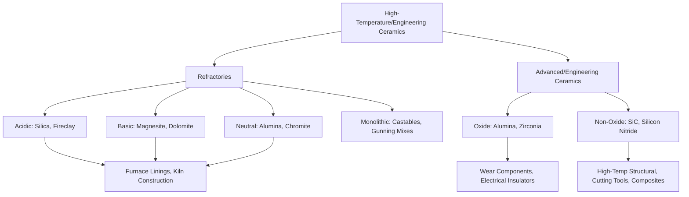

## Refractory and Advanced Ceramics

### Overview

Refractory ceramics are materials engineered to withstand extreme temperatures while resisting chemical attack, mechanical stress, and thermal shock in high-temperature industrial and construction applications. Advanced (engineering) ceramics extend beyond traditional oxide-based refractories to include specially processed materials—often non-oxide ceramics or highly purified/engineered oxide ceramics—offering enhanced mechanical, thermal, or functional properties for demanding structural, mechanical, and specialty construction applications.

### Refractory Ceramics: Function and Classification

**Key Points**

- Refractories are defined by their ability to maintain structural and chemical stability at temperatures generally exceeding 600°C, with many applications extending well above 1000°C, distinguishing them from standard construction ceramics like brick and tile
- **Acidic refractories** (e.g., silica-based, fireclay): resist attack from acidic slags/atmospheres, historically dominant in furnace linings exposed to acidic process conditions
- **Basic refractories** (e.g., magnesite, dolomite-based): resist attack from basic (alkaline) slags, common in steelmaking furnace linings where basic slag chemistry is standard
- **Neutral refractories** (e.g., alumina, chromite, carbon-based): resist both acidic and basic attack, used where chemical compatibility with the specific process environment is uncertain or variable, or where general-purpose chemical resistance is required

### Key Refractory Performance Properties

**Key Points**

- **Refractoriness**: the fundamental ability to withstand high temperature without deforming or melting, historically assessed via pyrometric cone equivalent (PCE) testing, comparing softening behavior against standardized reference cones
- **Refractoriness under load (RUL)**: measures deformation behavior under combined high temperature and applied mechanical load, more representative of actual service conditions than simple refractoriness alone, since most refractory applications involve simultaneous thermal and structural loading
- **Thermal shock resistance**: ability to withstand rapid temperature change without cracking or spalling; governed by a combination of thermal expansion coefficient, thermal conductivity, elastic modulus, and strength—materials with low thermal expansion and high thermal conductivity generally exhibit better thermal shock resistance, since these properties minimize thermally induced stress gradients
- **Chemical/slag resistance**: resistance to chemical attack and dissolution by molten slag, glass, or process chemicals specific to the service environment; this is why acidic/basic/neutral classification is central to refractory selection
- **Creep resistance at temperature**: ability to resist slow, time-dependent deformation under sustained load at elevated service temperature, particularly relevant for refractories supporting structural load in furnace construction

### Refractory Product Forms

**Key Points**

- **Fired brick shapes**: pre-formed and fired refractory brick for furnace lining construction, analogous in manufacturing concept to structural clay brick but with refractory raw materials and higher firing temperatures
- **Monolithic refractories (castables, gunning mixes, ramming mixes)**: unformed refractory materials installed in place (cast, gunned, or rammed) rather than pre-fired into brick shapes, increasingly dominant in modern refractory installation due to installation flexibility and reduced joint-related weak points compared to jointed brick construction
- **Insulating refractories**: engineered for low thermal conductivity (often through controlled porosity) to minimize heat loss through furnace walls, generally traded off against reduced mechanical strength and refractoriness compared to dense refractories

### Advanced (Engineering) Ceramics: Overview

**Key Points**

- Advanced ceramics are distinguished from traditional ceramics (brick, tile, refractories, pottery) by highly controlled raw material purity, particle size, and processing, enabling superior and more consistent mechanical, thermal, or functional properties
- Generally categorized as **oxide ceramics** (alumina $Al_2O_3$, zirconia $ZrO_2$) and **non-oxide ceramics** (silicon carbide SiC, silicon nitride $Si_3N_4$, boron carbide $B_4C$), each offering distinct property profiles
- Processing typically involves powder synthesis/purification, forming (pressing, extrusion, injection molding, or additive manufacturing), and sintering (high-temperature densification) to achieve near-theoretical density and optimized microstructure

### Advanced Ceramic Types and Properties

**Key Points**

- **Alumina ($Al_2O_3$)**: widely used engineering ceramic, good hardness, wear resistance, electrical insulation, and moderate cost; used in wear components, electrical insulators, and cutting tool inserts
- **Zirconia ($ZrO_2$)**: notable for transformation toughening, where stress-induced phase transformation absorbs fracture energy, giving zirconia-toughened ceramics substantially higher fracture toughness than most monolithic ceramics; used in wear components and specialty structural applications
- **Silicon carbide (SiC)**: very high hardness, good thermal shock resistance, retains strength at elevated temperature, used in wear-resistant components, high-temperature structural applications, and as reinforcement in ceramic-matrix and metal-matrix composites
- **Silicon nitride ($Si_3N_4$)**: excellent thermal shock resistance and high-temperature strength retention, used in high-performance bearing, cutting tool, and high-temperature structural applications

### Refractory and Advanced Ceramic Relationship Diagram

### Construction and Civil Engineering Applications

**Key Points**

- Industrial furnace, kiln, and boiler lining construction: refractory brick and monolithic castables for cement kilns, steel furnaces, incinerators, and power generation boilers
- Fire-resistant construction assemblies: certain refractory and ceramic fiber products used in fireproofing applications for structural steel protection and fire-rated wall/floor assemblies
- High-temperature process equipment: chimney/flue linings, waste-to-energy facility linings, and industrial process vessels requiring sustained high-temperature and chemical resistance
- Advanced ceramic components in construction equipment: wear-resistant liners in material handling and processing equipment (crushers, conveyors) exposed to abrasive conditions, leveraging the high hardness of advanced ceramics like alumina and silicon carbide

### Comparative Property Table

| Material | Max Service Temp (approx.) | Key Strength | Typical Application |
| --- | --- | --- | --- |
| Fireclay brick | ~1400-1500°C | Cost-effective, general purpose | General furnace lining |
| Silica brick | ~1650°C | High refractoriness in acidic environments | Glass furnace, coke oven linings |
| Magnesite (basic) | ~1800-2000°C+ | Basic slag resistance | Steelmaking furnace linings |
| Alumina (dense) | ~1700-1800°C | Chemical inertness, hardness | Neutral refractory, wear components |
| Silicon carbide | ~1600°C+ (application-dependent) | Thermal shock resistance, hardness | High-wear, high-temp structural |
| Zirconia (toughened) | Application-dependent | Highest fracture toughness among monolithic ceramics | Wear components, structural ceramics |

### Selection Considerations

**Key Points**

- Refractory selection is fundamentally driven by service temperature, chemical environment (slag/atmosphere acidity or basicity), and mechanical/thermal cycling demands specific to the application
- [Inference] Monolithic (castable) refractory installation has become increasingly favored over traditional brick construction in many modern industrial applications due to faster installation, reduced joint-related failure points, and improved adaptability to complex geometries, though brick construction remains preferred for certain high-wear or specific chemical-resistance applications where monolithic material performance has not fully matched jointed brick performance
- Advanced ceramic component selection for construction/industrial equipment applications balances hardness/wear resistance against fracture toughness and cost, since the hardest ceramics are not necessarily the most damage-tolerant in service

**Conclusion**

Refractory ceramics provide the essential high-temperature lining and structural materials for industrial furnaces, kilns, and process equipment integral to construction material production (notably cement and steel manufacturing itself), while advanced engineering ceramics extend ceramic material capability into high-performance wear-resistant, thermally stable, and structurally demanding applications beyond the reach of traditional oxide-based refractories. Both categories rely on the same fundamental ceramic bonding and flaw-sensitive fracture principles, applied through increasingly sophisticated raw material processing and property engineering.

**Related Topics**

- Structure and Bonding in Ceramics
- Mechanical Behavior of Ceramic Materials
- Portland Cement and Steel Production Kiln/Furnace Systems
- Fireproofing Systems for Structural Steel
- Thermal Shock Resistance and Fracture Mechanics
- Ceramic-Matrix and Metal-Matrix Composites
- Traditional Ceramics: Brick and Tile