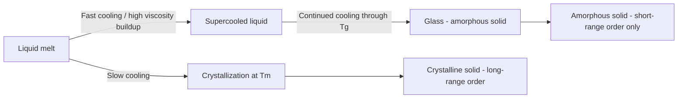

## Glass Composition and Structure

### Definition and Fundamental Nature

Glass is an amorphous solid formed when a liquid is cooled below its freezing point without undergoing crystallization, resulting in a rigid material that retains the disordered, random atomic structure characteristic of a liquid. This state is often called the **vitreous state**. Unlike crystalline solids, which possess long-range periodic order, glass exhibits only **short-range order** — meaning atomic arrangements are consistent only within the immediate neighborhood of a given atom (typically the first coordination shell), with no repeating pattern extending through the bulk material.

The defining structural feature of glass is the absence of translational symmetry. This is why glasses are sometimes described as "frozen liquids" or "supercooled liquids," although this description is imprecise since a true supercooled liquid is still in metastable equilibrium, whereas glass is a non-equilibrium, kinetically arrested state.

### The Glass Transition

The **glass transition temperature ($T_g$)** is the temperature range over which an amorphous material transitions from a hard, brittle (glassy) state to a viscous, rubbery, or liquid state upon heating. Unlike melting at a crystalline melting point $T_m$, the glass transition is not a true first-order thermodynamic phase transition; it is a kinetic phenomenon associated with a dramatic change in molecular mobility and viscosity over a narrow temperature range.

**Key Points**

- Below $T_g$: atoms/ions are essentially frozen in position; the material behaves elastically (glassy state).
- Above $T_g$: sufficient thermal energy allows structural rearrangement; viscosity drops rapidly (supercooled liquid/rubbery state).
- $T_g$ depends on cooling rate: slower cooling allows more time for structural relaxation, generally producing a lower $T_g$ and a denser, more relaxed glass structure.
- On a volume-versus-temperature diagram, crystallization produces a discontinuous volume drop at $T_m$; glass formation instead shows a change in slope (not a discontinuity) at $T_g$, reflecting a change in thermal expansion coefficient rather than a first-order transition.

### Conditions for Glass Formation

Not all materials form glasses easily. Several theoretical frameworks describe why certain compositions vitrify readily while others crystallize.

**Zachariasen's Random Network Theory (1932)**

Zachariasen proposed that oxide glasses form extended, three-dimensional networks analogous to crystalline networks but lacking periodicity and symmetry. For an oxide $A_mO_n$ to form a glass, several rules generally apply:

1. An oxygen atom is linked to no more than two network-forming cations.
2. The coordination number of the network-forming cation is small (typically 3 or 4).
3. Cation-centered polyhedra (triangles or tetrahedra) share only corners with each other, not edges or faces.
4. At least three corners of each polyhedron are shared with adjacent polyhedra, creating a continuous, interconnected but non-periodic network.

**Kinetic Theory of Glass Formation**

An alternative (and complementary) view holds that any material can theoretically form a glass if cooled fast enough to bypass nucleation and crystal growth. Glass-forming ability is therefore linked to:

- The **critical cooling rate** — the minimum rate required to avoid detectable crystallization.
- **Viscosity behavior** — network liquids like silica have viscosities that rise so steeply upon cooling that atomic mobility (and thus the ability to rearrange into a crystal lattice) is suppressed before crystallization can occur.

### Network Formers, Modifiers, and Intermediates

Glass composition is conventionally described using three categories of oxides.

**Network Formers**

These cations readily form the covalent, polyhedral backbone of the glass network on their own. Common network formers and their typical coordination:

| Oxide | Cation Coordination | Polyhedron |
| --- | --- | --- |
| $SiO_2$ | 4 | Tetrahedron |
| $B_2O_3$ | 3 | Triangle |
| $GeO_2$ | 4 | Tetrahedron |
| $P_2O_5$ | 4 | Tetrahedron |

Silica ($SiO_2$) is the archetypal network former. Each silicon atom bonds to four oxygen atoms in a tetrahedral $[SiO_4]^{4-}$ unit. These tetrahedra link at their corners by sharing bridging oxygens, forming a continuous three-dimensional random network. Pure fused silica (vitreous silica) is itself a glass, but its extremely high melting/working temperature (softening near 1200°C) makes it costly to process industrially.

**Network Modifiers**

Modifiers are typically alkali (Na⁺, K⁺, Li⁺) or alkaline-earth (Ca²⁺, Mg²⁺, Ba²⁺) cations. They do not join the network directly; instead, they break Si-O-Si bridging bonds, converting **bridging oxygens (BO)** into **non-bridging oxygens (NBO)**:

$$\equiv\text{Si-O-Si} \equiv \; + \; \text{Na}_2\text{O} \rightarrow \; 2 \left(\equiv\text{Si-O}^- \; \text{Na}^+\right)$$

This depolymerizes the network, reducing connectivity. The effects of adding modifiers include:

- Lower viscosity at a given temperature (easier melting and forming).
- Lower $T_g$ and softening point.
- Increased thermal expansion coefficient.
- Reduced chemical durability, since the network is less cross-linked.

**Intermediates (Conditional Formers)**

Certain oxides, such as $Al_2O_3$, $TiO_2$, $ZrO_2$, and $PbO$, cannot form a glass network alone but can substitute into the network structure under the right conditions, usually by adopting the coordination of adjacent network-forming polyhedra. For example, $Al^{3+}$ can substitute for $Si^{4+}$ in tetrahedral sites (as $[AlO_4]^{5-}$), but because aluminum has one fewer positive charge, a charge-compensating cation (commonly Na⁺) must sit nearby to maintain electrical neutrality. This is the structural basis of **aluminosilicate glasses**.

### Structural Description Using Network Connectivity

A widely used quantitative descriptor of network structure is the **$Q^n$ notation**, where $n$ denotes the number of bridging oxygens per network-forming tetrahedron (0 to 4).

- $Q^4$: fully polymerized tetrahedron (all four oxygens bridging) — found in pure vitreous silica.
- $Q^3$: three bridging oxygens, one non-bridging — sheet-like connectivity.
- $Q^2$: two bridging oxygens — chain-like connectivity.
- $Q^1$: one bridging oxygen — dimer/terminal units.
- $Q^0$: fully depolymerized, isolated tetrahedra (orthosilicate-like).

As modifier content increases, the average $Q^n$ decreases, and the glass network becomes progressively more fragmented, directly correlating with reduced viscosity and lower processing temperatures.

**Structural diagram: 2D schematic of silicate network (SVG diagram)**

<svg xmlns="http://www.w3.org/2000/svg" viewBox="0 0 640 340" font-family="Arial, sans-serif">
<text x="320" y="24" text-anchor="middle" font-size="15" font-weight="bold" fill="#222">Random Network Structure: Silica Glass vs Soda-Lime Silicate Glass (svg_diagram)</text>

<text x="150" y="50" text-anchor="middle" font-size="13" fill="#333" font-weight="bold">Vitreous Silica (SiO2) - Q4</text>

<g stroke="#555" stroke-width="2" fill="none">

<line x1="60" y1="90" x2="110" y2="120" />

<line x1="110" y1="120" x2="170" y2="95" />

<line x1="170" y1="95" x2="230" y2="130" />

<line x1="110" y1="120" x2="100" y2="180" />

<line x1="100" y1="180" x2="150" y2="220" />

<line x1="150" y1="220" x2="210" y2="190" />

<line x1="210" y1="190" x2="230" y2="130" />

<line x1="150" y1="220" x2="140" y2="280" />

<line x1="140" y1="280" x2="200" y2="300" />

<line x1="200" y1="300" x2="230" y2="250" />

<line x1="230" y1="250" x2="210" y2="190" />

<line x1="60" y1="90" x2="40" y2="150" />

<line x1="40" y1="150" x2="100" y2="180" />

</g>

<g fill="`#2a6f97`">

<circle cx="60" cy="90" r="7" />

<circle cx="110" cy="120" r="7" />

<circle cx="170" cy="95" r="7" />

<circle cx="230" cy="130" r="7" />

<circle cx="100" cy="180" r="7" />

<circle cx="150" cy="220" r="7" />

<circle cx="210" cy="190" r="7" />

<circle cx="140" cy="280" r="7" />

<circle cx="200" cy="300" r="7" />

<circle cx="230" cy="250" r="7" />

<circle cx="40" cy="150" r="7" />

</g>

<text x="150" y="325" text-anchor="middle" font-size="11" fill="#444">Fully connected, cross-linked Si-O tetrahedra (2D analogy)</text>

<text x="480" y="50" text-anchor="middle" font-size="13" fill="#333" font-weight="bold">Soda-Lime Glass (with Na2O, CaO) - Q3/Q2</text>

<g stroke="#555" stroke-width="2" fill="none">

<line x1="400" y1="90" x2="450" y2="120" />

<line x1="450" y1="120" x2="510" y2="95" />

<line x1="450" y1="120" x2="440" y2="180" />

<line x1="510" y1="95" x2="560" y2="130" />

<line x1="440" y1="180" x2="490" y2="220" />

<line x1="490" y1="220" x2="480" y2="280" />

</g>

<g fill="`#2a6f97`">

<circle cx="400" cy="90" r="7" />

<circle cx="450" cy="120" r="7" />

<circle cx="510" cy="95" r="7" />

<circle cx="560" cy="130" r="7" />

<circle cx="440" cy="180" r="7" />

<circle cx="490" cy="220" r="7" />

<circle cx="480" cy="280" r="7" />

</g>

<circle cx="560" cy="130" r="6" fill="#e63946" />
<text x="580" y="134" font-size="10" fill="#e63946">NBO</text>
<circle cx="600" cy="160" r="8" fill="#f4a261" />
<text x="600" y="182" text-anchor="middle" font-size="10" fill="#7a4a12">Na+</text>
<circle cx="480" cy="280" r="6" fill="#e63946" />
<text x="500" y="284" font-size="10" fill="#e63946">NBO</text>
<circle cx="520" cy="300" r="8" fill="#f4a261" />
<text x="520" y="322" text-anchor="middle" font-size="10" fill="#7a4a12">Ca2+</text>

<text x="480" y="325" text-anchor="middle" font-size="11" fill="#444">Depolymerized network; modifier cations occupy interstitial sites</text>

</svg>

### Common Commercial Glass Compositions

**Soda-Lime-Silica Glass**

The most widely produced glass, accounting for roughly 90% of manufactured glass by volume (windows, bottles, containers).

Typical composition (by weight):

- $SiO_2$: ~70-74% (network former)
- $Na_2O$: ~12-16% (modifier, from soda ash, lowers melting point)
- $CaO$: ~5-11% (modifier/stabilizer, improves chemical durability)
- $MgO$, $Al_2O_3$: minor additions for further durability and workability

The soda lowers the melting/forming temperature dramatically compared to pure silica (roughly from ~1700°C to ~1000-1500°C processing range), while the lime is essential because pure soda-silica glass is water-soluble; calcium improves chemical resistance by moderating network disruption and reducing ion mobility.

**Borosilicate Glass**

Composition dominated by $SiO_2$ (~70-80%) and $B_2O_3$ (~7-13%), with smaller amounts of $Na_2O$/$K_2O$ and $Al_2O_3$. Boron oxide, itself a network former (triangular $BO_3$ units, which can convert to tetrahedral $BO_4$ units depending on composition — the "boron anomaly"), produces a glass with:

- Low coefficient of thermal expansion (~3 × 10⁻⁶/°C, versus ~9 × 10⁻⁶/°C for soda-lime glass).
- High thermal shock resistance, since low expansion minimizes stress from rapid temperature changes.
- Common trade name: Pyrex/Duran-type laboratory and kitchen glassware.

**Lead (Lead-Alkali) Glass**

Contains $PbO$ (commonly 18-40%) substituting for some $CaO$/modifier content, alongside $SiO_2$ and $K_2O$. Lead oxide acts as a modifier/intermediate that increases:

- Refractive index (used in "crystal" glassware and optical lenses for higher brilliance).
- Density and electrical resistivity.
- Workability (longer working range, softer at lower temperature) — historically valued for cut glass and radiation shielding (X-ray/gamma shielding glass).

**Aluminosilicate Glass**

High $SiO_2$ and $Al_2O_3$ content with reduced alkali content. Offers higher softening points and better chemical/thermal durability than soda-lime glass; used in high-temperature thermometer tubing, fiberglass, and (in chemically strengthened forms) smartphone cover glass.

**Fused Silica (Vitreous Silica) Glass**

Nearly pure $SiO_2$ (>99.5%). Exceptional properties:

- Very high softening point (~1650°C).
- Extremely low thermal expansion, giving outstanding thermal shock resistance.
- High UV and optical transparency, used in optical fibers, precision optics, and semiconductor processing equipment.
- Expensive to produce due to the high melting temperature required.

### Short-Range vs. Long-Range Order: Structural Comparison

| Property | Crystalline Solid | Glass (Amorphous Solid) |
| --- | --- | --- |
| Atomic order | Long-range periodic order | Short-range order only |
| Melting behavior | Sharp melting point $T_m$ | Gradual softening over $T_g$ range |
| Bond angles/lengths | Fixed, repeating | Variable, distributed around a mean |
| Isotropy | Often anisotropic | Isotropic (properties uniform in all directions) |
| Volume vs. temperature | Discontinuous drop at $T_m$ | Continuous change in slope at $T_g$ |
| X-ray diffraction pattern | Sharp Bragg peaks | Broad, diffuse halos |

### Radial Distribution Function (RDF)

The structure of glass is experimentally characterized using X-ray or neutron diffraction combined with the **radial distribution function**, $g(r)$, which describes the probability of finding an atom at a distance $r$ from a reference atom. In a crystal, $g(r)$ shows sharp, well-defined peaks extending to large $r$ because of periodicity. In glass, $g(r)$ shows a sharp first peak (corresponding to the nearest-neighbor bond distance, e.g., Si-O ≈ 1.62 Å in silica), a broader second peak (next-nearest neighbor, e.g., O-O or Si-Si distances, related to the tetrahedral bond angle), and rapidly diminishing, smeared-out peaks at larger distances — quantitatively demonstrating the loss of long-range order beyond a few atomic spacings.

### Mechanical and Physical Property Implications of Structure

**Key Points**

- **Brittleness**: The disordered, cross-linked network cannot accommodate dislocation-based plastic deformation the way metals do; there are no slip systems. Stress concentrates at surface flaws (Griffith flaws), leading to brittle fracture at stresses far below the theoretical bond strength.
- **Elastic modulus**: Governed by bond strength and network connectivity/cross-link density. Higher network connectivity (more bridging oxygens, e.g., fused silica) generally correlates with higher stiffness once composition effects on density and packing are accounted for. [Inference: precise modulus trends depend on specific competing effects of density, packing, and modifier type, and are typically obtained empirically or via bond-topology models such as Makishima-Mackenzie rather than derived from a single universal rule.]
- **Thermal expansion**: Strongly connected networks (high $Q^n$, few NBOs) exhibit low thermal expansion, since bond bending (not stretching) accommodates thermal vibration. Modifier-rich networks expand more because ionic modifier-oxygen bonds are more compliant.
- **Chemical durability**: Alkali-rich, highly modified glasses are more susceptible to ion exchange and leaching (e.g., Na⁺ exchange with H⁺ from aqueous environments), which underlies weathering and staining phenomena in older glass. Higher network connectivity and additions like $Al_2O_3$ improve resistance.
- **Optical transparency**: Related to the absence of grain boundaries and the wide electronic band gap of oxide glasses, which prevents absorption in the visible spectrum; transition metal impurities (e.g., $Fe^{2+}/Fe^{3+}$) introduce coloration by absorbing specific wavelengths.

### Relevance to Civil Engineering Applications

**Example**

Architectural glazing (soda-lime float glass) is manufactured by floating molten glass on a bed of molten tin, producing flat, uniform-thickness sheets exploiting the low viscosity and workability provided by the network-modifying alkali/alkaline-earth oxides. Structural safety glazing further modifies base soda-lime compositions through thermal or chemical tempering:

- **Thermal tempering**: Rapid cooling of the glass surface induces compressive residual stress at the surface and tensile stress in the core, increasing resistance to fracture and, upon failure, causing the glass to shatter into small, less-hazardous granular fragments rather than long shards.
- **Chemical strengthening (ion exchange)**: Smaller Na⁺ ions near the glass surface are exchanged for larger K⁺ ions (typically in a molten salt bath), which forces the surface network into compression as the larger ions are wedged into the existing structure — used for architectural and high-strength glazing, and analogous to the process used in aluminosilicate cover glass.

Understanding network structure and modifier content is therefore directly relevant to selecting glass compositions for building facades, insulated glazing units, and fire-rated glazing, where thermal expansion mismatch, thermal shock resistance, and long-term chemical durability against weathering are key design considerations.

### Related Topics

- Glass Transition Temperature and Viscosity-Temperature Relationships (Fulcher-Vogel-Tammann equation)
- Tempered and Laminated Safety Glass in Construction
- Ceramic Crystal Structures vs. Glass-Ceramics
- Fiberglass and Glass Fiber-Reinforced Polymers (GFRP) in Structural Applications
- Chemical Durability and Weathering of Glass in Building Envelopes
- Optical and Thermal Properties of Glazing Systems (Low-E Coatings)
- Bioactive and Specialty Glasses (Borosilicate, Aluminosilicate Applications)