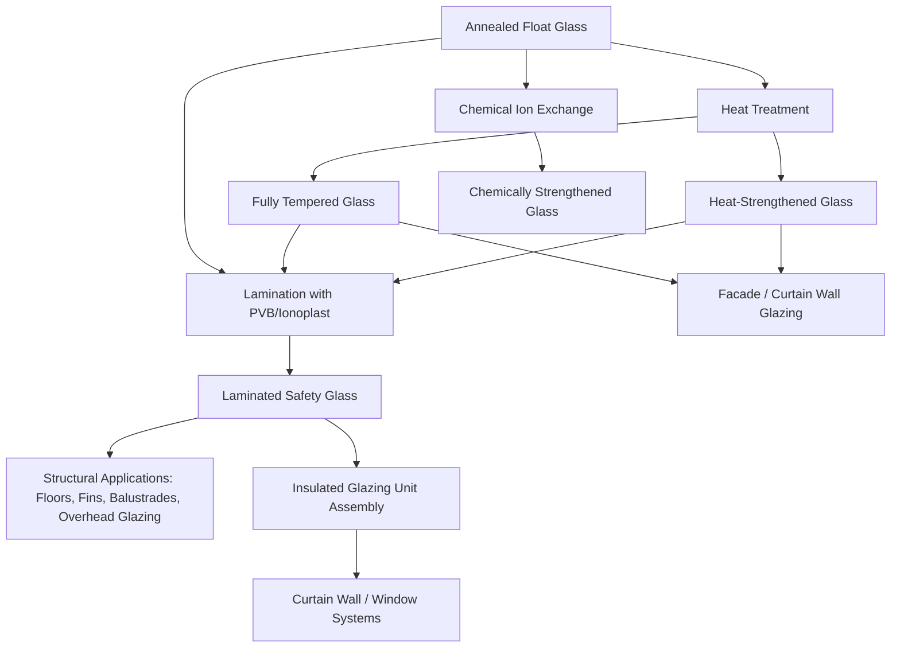

## Architectural and Structural Glass Applications

### Overview and Role in Construction

Glass has evolved from a purely infill, non-structural glazing material into a primary structural element capable of bearing gravity, wind, and even seismic loads in modern construction. This transition has been enabled by advances in glass strengthening processes, laminated interlayer technology, and structural connection design (bolted point-fixings, structural silicone glazing, and glass fins/beams). Architectural and structural glass applications span curtain walls, skylights, canopies, floors, staircases, balustrades, and fully glazed structural facades.

**Key Points**

- Glass in construction serves both **enclosure functions** (weather-tightness, thermal/acoustic insulation, daylighting) and, increasingly, **load-bearing structural functions**.
- Design philosophy differs fundamentally from steel or concrete because glass is a brittle, elastic material with no yield point or ductility to redistribute stress — failure is sudden and originates at surface flaws.
- Modern structural glass design relies heavily on **redundancy** (lamination, multiple plies) to prevent catastrophic collapse if one layer fractures.

### Types of Glass Used in Construction

**Annealed (Float) Glass**

Produced by the float process (molten glass floated on a bed of liquid tin), annealed glass is cooled slowly to relieve internal residual stresses. It is the baseline product from which all other architectural glass types are derived through further processing.

- Relatively low strength (surface flaws govern failure); breaks into large, sharp shards.
- Rarely used alone in overhead or safety-critical applications; typically upgraded via heat treatment or lamination.

**Heat-Strengthened Glass**

Produced by heating annealed glass to near its softening point (~620-650°C) and then cooling it at a moderate rate. This induces a moderate level of surface compressive stress (typically 24-52 MPa, per ASTM C1048 classification).

- Approximately twice the mechanical and thermal resistance of annealed glass.
- Breaks into larger fragments similar to annealed glass (not small dice), making it less "safety" oriented than fully tempered glass, but often preferred over tempered glass for facades because it avoids **spontaneous nickel sulfide (NiS) breakage risk**.

**Fully Tempered (Toughened) Glass**

Produced similarly to heat-strengthened glass but with a faster, more aggressive quench, inducing higher surface compression (typically ≥69 MPa surface compressive stress per ASTM C1048).

- Approximately 4x the strength of annealed glass of equal thickness.
- Upon fracture, shatters into small, relatively blunt granular fragments (dicing behavior), classified as a **safety glazing material** under building codes (e.g., referenced in ANSI Z97.1, CPSC 16 CFR 1201).
- Susceptible to rare spontaneous fracture from inclusions of nickel sulfide stones that undergo a volumetric phase change over time — a durability consideration in overhead or facade glazing, often mitigated by **heat-soak testing** (holding tempered glass at ~290°C for a set duration to intentionally trigger and screen out unstable NiS-containing panels before installation).

**Laminated Glass**

Constructed from two or more glass plies (annealed, heat-strengthened, or tempered) permanently bonded with an interlayer, most commonly **polyvinyl butyral (PVB)** or **ionoplast (SentryGlas)**, under heat and pressure (autoclaving).

- On fracture, glass fragments remain adhered to the interlayer, providing post-breakage residual capacity and preventing shards from falling — critical for overhead glazing, floors, balustrades, and blast/hurricane-resistant glazing.
- Ionoplast interlayers offer substantially higher stiffness, tear strength, and edge stability compared to standard PVB, allowing thinner laminated sections for structural applications (glass floors, fins, stair treads).
- Laminated Glass structural behavior depends on **interlayer shear coupling**, which is temperature- and load-duration-dependent: at short load durations and low temperatures, the interlayer behaves stiffly, effectively coupling the plies to act nearly as a monolithic section; at long durations and high temperatures, the interlayer relaxes (viscoelastic behavior), and the plies behave more independently (layered, uncoupled behavior). This is typically modeled using an **effective thickness** approach (per methods described in EN 16612 or similar standards) for structural design.

**Insulated Glazing Units (IGUs)**

Two or more glass panes separated by a spacer and a sealed, often gas-filled (argon/krypton), air gap to improve thermal performance.

- Governed by thermal design metrics: **U-value** (heat transfer coefficient), **solar heat gain coefficient (SHGC)**, and **visible light transmittance (VLT)**.
- Often combined with **low-emissivity (Low-E) coatings** — thin metallic or metal-oxide layers (e.g., silver-based) applied to a glass surface to reflect long-wave infrared radiation while transmitting visible light, reducing heat transfer.
- Structural design of IGUs must also account for **capillary/pressure effects**: altitude changes between the point of manufacture and installation, and barometric pressure changes, induce additional stress on the sealed unit due to gas volume changes.

**Chemically Strengthened Glass**

Produced via an ion-exchange process: the glass is immersed in a molten potassium salt bath, and smaller Na⁺ ions near the surface are exchanged for larger K⁺ ions, wedging the surface into a state of compression without the optical distortion (roller-wave distortion) associated with thermal tempering.

- Used where very thin glass with high strength and minimal thickness is needed (thin structural glass fins, some point-fixed applications), though at higher cost than thermal tempering.

### Structural Design Principles for Glass

**Load-Resistance Philosophy**

Because glass exhibits no plastic deformation before failure, structural glass design is fundamentally a **fracture mechanics problem**, governed by the statistical distribution of surface flaws (following Weibull statistics) rather than a deterministic yield criterion as in steel design.

$$\sigma_{allow} = \frac{\sigma_{characteristic}}{\gamma_M \cdot k_{mod} \cdot k_{sp}}$$

Where $\gamma_M$ is a material safety factor, $k_{mod}$ accounts for load duration effects (glass exhibits static fatigue — strength decreases under sustained loading, described by **subcritical crack growth**), and $k_{sp}$ accounts for surface profile/finish (annealed vs. tempered vs. edge condition).

**Key Points**

- **Static fatigue**: Glass strength is time-dependent; a pane that can sustain a high short-duration wind gust load may fail under a much lower load sustained over hours or days (e.g., snow load on a sloped skylight), due to slow crack growth driven by moisture-assisted stress corrosion at crack tips.
- **Edge condition**: Cut, ground, or polished edges significantly affect strength since edges typically contain the largest flaws; design codes (e.g., ASTM E1300 in the U.S.) provide different allowable stress values based on edge treatment.
- **Redundancy requirement**: Codes for overhead glazing and structural glass floors typically mandate laminated construction with at least one ply capable of independently supporting the design load after failure of another ply (a "sacrificial ply" design philosophy).

**Reference Standard**

ASTM E1300 ("Standard Practice for Determining Load Resistance of Glass in Buildings") provides the primary U.S. methodology for calculating allowable lateral (wind) load resistance of glass based on plate theory (non-linear large-deflection behavior of thin glass plates), glass type, aspect ratio, and support conditions. Eurocode-aligned approaches (e.g., EN 16612, prEN 13474) use similar principles with probabilistic/limit-state formulations.

### Structural Glass Elements and Systems

**Structural Glass Fins and Beams**

Vertical glass fins (typically laminated tempered or heat-strengthened glass, sometimes with structural steel or stainless-steel edge reinforcement) are used to provide lateral stability to large glazed facades or atria, replacing traditional steel mullions to maximize transparency. Glass beams (laminated, sometimes with embedded steel or CFRP reinforcement bonded into slots for post-failure redundancy) support glass roofs or canopies.

**Structural Silicone Glazing (SSG)**

A glazing method in which structural silicone sealant (rather than mechanical frames) bonds glass panes to a supporting metal frame, allowing frameless or minimally framed facade appearances. Design requires careful evaluation of the silicone joint's tensile/shear capacity against wind loads, accounting for long-term durability (UV, weathering) per guidelines such as ASTM C1401.

**Point-Fixed (Bolted) Glazing Systems**

Glass panels are supported at discrete points via countersunk or friction-grip bolted connections (e.g., "spider" fittings) rather than continuous frame edges, commonly used for glass curtain walls, canopies, and glass roofs where maximum transparency is desired. Stress concentration around bolt holes is a critical design consideration, often requiring tempered or chemically strengthened glass with polished hole edges.

**Glass Floors and Stair Treads**

Typically constructed from multiple laminated plies (three or more, often combining heat-strengthened and tempered glass) with a non-slip or interlayer-embedded treatment, designed with significant redundancy so that failure of the top ply does not compromise overall load-carrying capacity, following the sacrificial-ply design principle.

**Curtain Wall and Facade Systems**

Large-scale, non-load-bearing (with respect to building gravity loads) exterior wall assemblies composed of IGUs supported by a metal (aluminum or steel) grid framework, engineered primarily to resist wind loads, accommodate building movement (thermal expansion, seismic drift) via flexible framing/gasket details, and provide the building envelope's thermal and moisture barrier.

### Thermal and Environmental Performance Considerations

**Example**

A typical high-performance curtain wall specification for a temperate climate might specify a double-glazed IGU with a Low-E coated inner pane, argon gas fill, and warm-edge spacer, achieving a U-value in the range of approximately 1.1-1.7 W/(m²·K) — substantially better than a single clear glazing unit, which typically exceeds 5.5 W/(m²·K). [Inference: exact U-values depend on specific coating formulation, gap width, and framing thermal breaks, and should be verified against manufacturer NFRC/CEN-certified performance data for a specific product.]

**Key Points**

- **Thermal stress cracking**: Uneven heating across a glass pane (e.g., partial shading by an external frame or adjacent building) creates a temperature differential between the shaded (cooler) edge and the exposed (hotter) center, inducing tensile stress at the edge that can cause thermal fracture — a key reason heat-strengthened or tempered glass is specified in facades with high solar exposure or dark-tinted/coated glass (which absorbs more solar energy).
- **Solar control glazing**: Tinted, reflective, or spectrally selective coated glass reduces solar heat gain while managing daylighting and glare.
- **Acoustic performance**: Laminated glass with a viscoelastic PVB interlayer provides superior sound transmission loss compared to monolithic glass of equal thickness, since the interlayer damps resonant vibration transmission through the pane (relevant to facades near airports, highways).

### Safety, Code Compliance, and Failure Considerations

**Key Points**

- Building codes (e.g., International Building Code (IBC) Chapter 24 in the U.S., or local equivalents) mandate safety glazing (laminated or tempered) in hazardous locations: doors, adjacent sidelites, shower/bath enclosures, and overhead glazing.
- **Overhead glazing** (skylights, canopies) universally requires laminated construction so that fractured fragments remain retained rather than falling as a hazard.
- Post-breakage residual strength testing (pendulum impact tests, e.g., per EN 12600 or ANSI Z97.1) classifies glazing materials by their behavior under human-impact loading for use in doors and low-level glazing.
- Blast-resistant and hurricane-resistant glazing use heavily laminated assemblies (often with thick ionoplast interlayers) designed and tested per standards such as ASTM F1642 (blast) or ASTM E1996/E1886 (windborne debris impact for hurricane zones), where the glass is expected to crack under design load but the laminate must remain intact and retained in the frame.

### Related Topics

- Fracture Mechanics and Weibull Statistics for Brittle Materials
- Structural Design Standards: ASTM E1300 and Eurocode Glass Design (EN 16612)
- Curtain Wall Systems and Building Envelope Thermal Performance
- Laminated Interlayer Materials: PVB vs. Ionoplast (SentryGlas) Behavior
- Nickel Sulfide Inclusions and Heat-Soak Testing Protocols
- Point-Fixed and Structural Silicone Glazing Connection Design
- Blast, Impact, and Hurricane-Resistant Glazing Standards