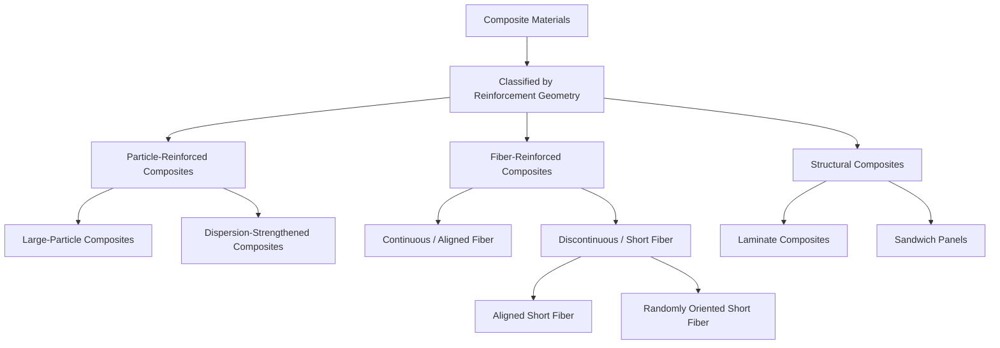

## Classification of Composite Materials

### Definition and General Concept

A composite material is a macroscopic combination of two or more distinct constituent materials, with different physical or chemical properties, that remain separate and distinguishable at the macro/microstructural level within the finished structure, yet act together to produce properties superior to (or otherwise different from) those of the individual constituents acting alone. Composites are engineered to exploit favorable properties of each constituent while mitigating their individual weaknesses.

**Key Points**

- Composites are distinguished from **alloys** or **solid solutions**, in which constituents are combined at the atomic scale and lose their individual identity.
- The two essential structural roles in nearly all composites are the **matrix** (continuous phase) and the **reinforcement** (discontinuous or embedded phase).
- The interface/interphase region between matrix and reinforcement is critical to load transfer and overall composite performance.

### Classification by Matrix Material

**Polymer Matrix Composites (PMCs)**

The most widely used composite class in civil and structural engineering, employing a polymer resin (thermosetting or thermoplastic) as the continuous phase.

- **Thermosetting matrices**: epoxy, polyester, vinyl ester, phenolic resins. Cure via irreversible cross-linking reactions; cannot be remelted or reshaped once cured. Epoxy offers superior mechanical strength, adhesion, and durability; polyester and vinyl ester are lower-cost alternatives common in large structural FRP (fiber-reinforced polymer) applications.
- **Thermoplastic matrices**: polypropylene, nylon, PEEK. Can be reheated and reshaped; offer better impact toughness and recyclability but generally lower thermal resistance than thermosets.
- Common in civil applications: FRP rebar, FRP wraps for structural strengthening/retrofit, pultruded structural profiles, FRP bridge decks.

**Metal Matrix Composites (MMCs)**

Reinforcement (typically ceramic particles, whiskers, or continuous fibers such as SiC or Al₂O₃) embedded in a metallic matrix (commonly aluminum, titanium, or magnesium alloys).

- Offer higher specific stiffness/strength and improved high-temperature performance compared to unreinforced metal alloys, at the cost of reduced ductility and higher manufacturing complexity/cost.
- Used in aerospace, automotive brake components, and specialized structural applications; less common in mainstream civil construction due to cost.

**Ceramic Matrix Composites (CMCs)**

Ceramic fiber reinforcement (e.g., SiC, carbon fiber) within a ceramic matrix (e.g., SiC, Al₂O₃, glass-ceramic).

- Primary objective is to overcome the inherent brittleness of monolithic ceramics: crack deflection and fiber pull-out mechanisms at the fiber-matrix interface absorb energy and prevent catastrophic, unstable crack propagation, providing pseudo-ductile fracture behavior.
- Used in high-temperature applications (turbine components, thermal protection systems); niche relevance to civil engineering, primarily in high-performance refractory and fire-protection applications.

**Cementitious/Concrete Matrix Composites**

The matrix is a cement-based binder (Portland cement paste, mortar, or concrete), directly central to civil engineering.

- **Fiber-reinforced concrete (FRC)**: steel, glass, synthetic (polypropylene, polyvinyl alcohol), or natural fibers dispersed throughout the concrete matrix to control cracking, improve toughness, ductility, and post-cracking residual strength.
- **Textile-reinforced concrete (TRC)** and **FRP-reinforced concrete**: continuous fiber grids or bars (often carbon, glass, or basalt FRP) used as primary tensile reinforcement or external strengthening in place of or supplementing conventional steel reinforcement.

### Classification by Reinforcement Geometry/Type

This is the most fundamental classification framework in composite materials science, dividing composites by the shape and scale of the reinforcing phase.

**Particle-Reinforced Composites**

The reinforcing phase consists of particles (roughly equiaxed dimensions) dispersed within the matrix.

- **Large-particle composites**: particle size is large enough (typically >1 μm, often much larger) that the particle-matrix interaction is analyzed using continuum mechanics rather than atomic/molecular theory. Load is shared between matrix and particles based on their relative volume fractions and elastic moduli. **Concrete** (Portland cement paste matrix reinforced with sand and coarse aggregate particles) is the archetypal civil engineering example of a large-particle composite.
- **Dispersion-strengthened composites**: much finer particles (typically 0.01-0.1 μm) that impede dislocation motion at the atomic/crystallographic scale, analogous to precipitation hardening in metallurgy (e.g., oxide-dispersion-strengthened alloys). This mechanism is generally not directly relevant to bulk civil construction materials but is foundational in advanced metal matrix composites.

**Fiber-Reinforced Composites**

The reinforcing phase consists of fibers, which are highly effective because fibers can be produced with very high strength and stiffness along their axis (due to the elimination of many flaws present in bulk material, per the general principle that smaller cross-sectional/flaw-limited elements achieve strengths closer to theoretical values) while the matrix binds fibers together, transfers/distributes applied loads to the fibers, and protects fibers from environmental damage and abrasion.

- **Continuous (aligned) fiber composites**: fibers run the full length of the component, providing maximum stiffness and strength along the fiber direction (highly anisotropic behavior); the composite is markedly weaker in directions transverse to the fibers. Used in pultruded FRP structural shapes, FRP tendons/rebar, and unidirectional laminate layers.
- **Discontinuous (short) fiber composites**: fibers are shorter than a "critical length" needed for the matrix to transfer stress fully into the fiber before fiber pull-out or matrix failure occurs.
  - **Aligned discontinuous fiber composites**: short fibers oriented in a common direction, offering intermediate anisotropic performance between continuous-fiber and randomly oriented composites.
  - **Randomly oriented discontinuous fiber composites**: fibers dispersed with no preferred orientation, producing quasi-isotropic (roughly direction-independent) bulk properties at the expense of peak directional strength — this describes typical fiber-reinforced concrete and chopped-strand FRP mats.

**Critical Fiber Length Concept**

$$l_c = \frac{\sigma_f^* \cdot d}{2\tau_c}$$

Where $l_c$ is the critical fiber length, $\sigma_f^*$ is the fiber tensile strength, $d$ is the fiber diameter, and $\tau_c$ is the fiber-matrix interfacial shear strength (or matrix shear yield strength). Fibers shorter than $l_c$ cannot be stressed to their full tensile capacity before pulling out of the matrix (inefficient reinforcement); fibers longer than roughly 15$l_c$ behave essentially as continuous fibers for practical stiffness/strength purposes.

### Classification by Structural Configuration (Structural Composites)

**Laminate Composites**

Composed of two or more distinct layers ("plies" or "laminae") stacked and bonded together, where each layer may differ in fiber orientation, fiber type, or material composition. Layer stacking sequence and orientation (commonly described using laminate notation, e.g., $[0/90/\pm45]_s$) is engineered to tailor directional stiffness and strength to match anticipated loading, since individual unidirectional plies are highly anisotropic.

- **Key Points**
  - Classical Lamination Theory (CLT) is the standard analytical framework used to predict laminate stiffness and stress distribution based on individual ply properties and stacking sequence.
  - Common civil applications include multi-ply FRP wraps for column/beam retrofit and structural laminated FRP profiles.

**Sandwich Panel Composites**

Consist of two thin, stiff, strong outer face sheets (skins) bonded to a thick, lightweight core material (commonly honeycomb, foam, or balsa wood).

- The configuration is analogous to an I-beam: face sheets carry the primary bending (tension/compression) stresses at maximum distance from the neutral axis, while the low-density core resists shear and stabilizes the face sheets against buckling, achieving a very high stiffness-to-weight and strength-to-weight ratio compared to a monolithic panel of equivalent weight.
- Applications include lightweight structural building panels, bridge deck panels, and modular/prefabricated wall and roof systems.

### Classification by Reinforcement Material Type (Fiber Type)

| Fiber Type | Typical Tensile Strength | Typical Elastic Modulus | Notable Characteristics |
| --- | --- | --- | --- |
| Glass (E-glass) | ~3.4 GPa | ~72 GPa | Low cost, good strength, moderate stiffness; most widely used FRP fiber in civil construction |
| Carbon | ~3.5-6 GPa | ~230-590 GPa | High strength and very high stiffness; excellent fatigue and creep resistance; higher cost; electrically conductive (galvanic corrosion risk against steel) |
| Aramid (e.g., Kevlar-type) | ~3.6-4.1 GPa | ~70-180 GPa | High toughness/impact resistance; susceptible to UV degradation and moisture absorption; used in blast/impact-resistant applications |
| Basalt | ~3-4.8 GPa | ~80-90 GPa | Comparable performance to E-glass with improved thermal and chemical resistance; increasingly used as an alternative FRP reinforcement |
| Steel (as fiber reinforcement) | Varies (high) | ~200 GPa | High modulus, ductile (unlike other fibers listed), used extensively in fiber-reinforced concrete |
| Natural fibers (jute, hemp, sisal) | Lower, variable | Lower, variable | Renewable, low-cost, biodegradable; used in sustainable/low-embodied-carbon composite research and some non-structural applications |

### Classification Relevant to Civil Engineering Practice

**Example**

In structural retrofit and strengthening practice, **externally bonded FRP systems** are classified by fiber type (carbon FRP, or CFRP, being most common for strength-critical applications; glass FRP, or GFRP, for lower-cost or corrosion-resistant applications) and by installation method: wet layup (fiber sheets impregnated with resin on-site) versus precured (pultruded) laminate strips bonded with adhesive. This classification directly governs design guidance found in codes such as ACI 440.2R (Guide for the Design and Construction of Externally Bonded FRP Systems for Strengthening Concrete Structures).

**Key Points**

- **Internal FRP reinforcement**: FRP rebar or tendons embedded within new concrete construction, primarily glass or basalt FRP for non-prestressed applications in corrosive environments (e.g., marine structures, bridge decks) where corrosion resistance outweighs the material's lack of ductility compared to steel.
- **External FRP strengthening**: bonded fiber sheets/plates applied to existing structural members (beams, columns, slabs) to increase flexural, shear, or axial (confinement) capacity, or to extend service life/repair deteriorated structures.
- **Fiber-reinforced concrete classification** by fiber material governs primary function: steel fibers primarily enhance toughness, shear capacity, and crack control (used in industrial floor slabs, tunnel linings, precast elements); synthetic microfibers (e.g., polypropylene) primarily control plastic shrinkage cracking; synthetic macrofibers can partially or fully replace steel fibers/mesh in some structural applications for improved corrosion resistance.

### Related Topics

- Fiber-Matrix Interface Mechanics and Load Transfer
- Classical Lamination Theory and Laminate Stacking Sequence Design
- Fiber-Reinforced Concrete: Steel vs. Synthetic Fiber Behavior
- FRP Strengthening of Reinforced Concrete Structures (ACI 440 Series)
- Sandwich Panel Structural Design and Core Material Selection
- Rule of Mixtures for Predicting Composite Properties
- Durability and Long-Term Performance of FRP in Civil Infrastructure