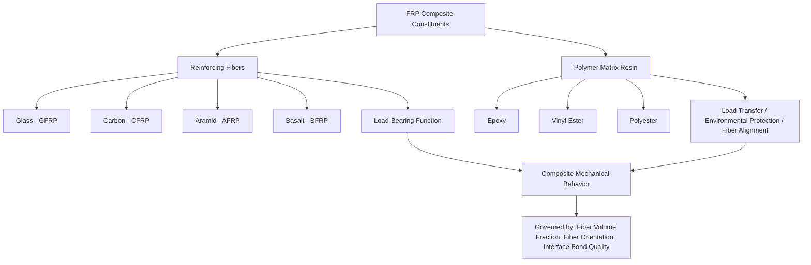

## Fiber-Reinforced Polymer Composites

### Definition and Constituent Roles

Fiber-Reinforced Polymer (FRP) composites consist of high-strength, high-stiffness fibers embedded within a polymer resin matrix. The fibers serve as the primary load-carrying constituent, while the matrix binds the fibers together, transfers and distributes stress between fibers, protects fibers from environmental and mechanical damage, and maintains fiber alignment and spacing. Neither constituent alone would achieve the performance of the combined system: fibers alone lack the ability to resist compressive/transverse loads or transfer load between broken fiber segments, while the resin alone has comparatively low strength and stiffness.

**Key Points**

- FRP composites are inherently **anisotropic** — mechanical properties vary substantially with direction relative to fiber orientation.
- The **fiber volume fraction ($V_f$)** — the proportion of total composite volume occupied by fibers — is a primary design variable, typically ranging from 30% to 70% in structural-grade FRP.
- FRP is valued in civil engineering primarily for its **high strength-to-weight ratio**, **corrosion resistance**, and **design flexibility** (fibers can be oriented to match load paths).

### Constituent Materials

**Fiber Types**

- **Glass fibers (GFRP)**: The most common and cost-effective reinforcement, primarily E-glass (electrical grade) for general structural use, with S-glass offering higher strength for demanding applications. Offers a good balance of strength, stiffness, and cost, though with lower stiffness than carbon.
- **Carbon fibers (CFRP)**: Produced from polyacrylonitrile (PAN) or pitch precursors via controlled oxidation and carbonization/graphitization. Offers the highest specific stiffness and strength among common structural fibers, excellent fatigue and creep resistance, and near-zero thermal expansion along the fiber axis, but at substantially higher cost and with electrical conductivity that can cause galvanic corrosion when in direct contact with steel reinforcement.
- **Aramid fibers (AFRP)**: Aromatic polyamide fibers (e.g., Kevlar-type) offering high tensile strength and excellent impact/toughness performance, but susceptible to UV degradation, moisture absorption, and creep; less common in primary structural FRP compared to glass and carbon.
- **Basalt fibers (BFRP)**: Produced from melted basalt rock; offer mechanical performance comparable to E-glass with improved thermal stability and chemical/alkaline resistance, positioning them as an emerging alternative reinforcement.

**Matrix Resins**

- **Epoxy resins**: Superior mechanical properties, adhesion, and durability; the standard choice for high-performance structural FRP (pultruded profiles, externally bonded strengthening systems).
- **Polyester and vinyl ester resins**: Lower cost than epoxy; vinyl ester offers notably better chemical and moisture resistance than standard polyester, making it common in large-volume structural profiles and corrosion-resistant applications (e.g., FRP rebar, chemical containment structures).
- Matrix resin selection governs the composite's **glass transition temperature ($T_g$)**, which limits the maximum service temperature (resin softening reduces load-transfer capability well before the fiber itself is affected), and governs resistance to moisture, chemicals, and UV exposure.

### Micromechanics: Predicting Composite Properties

**Rule of Mixtures**

For a continuous, unidirectional fiber composite loaded parallel to the fiber direction (longitudinal, or "0°" loading), the composite elastic modulus is estimated by the **rule of mixtures**:

$$E_{c,\parallel} = E_f V_f + E_m V_m$$

Where $E_f$ and $E_m$ are the fiber and matrix elastic moduli, and $V_f$ and $V_m$ are their respective volume fractions ($V_f + V_m = 1$, assuming negligible voids).

For loading perpendicular to the fiber direction (transverse, or "90°" loading), the matrix and fibers are effectively loaded in series, and the **inverse rule of mixtures** applies:

$$\frac{1}{E_{c,\perp}} = \frac{V_f}{E_f} + \frac{V_m}{E_m}$$

This produces a dramatically lower transverse modulus than longitudinal modulus — a direct mathematical expression of FRP's pronounced anisotropy. [Inference: the simple rule-of-mixtures models are idealized approximations; real transverse modulus predictions typically require more refined models such as the Halpin-Tsai equations to better match experimental behavior, since the basic inverse rule of mixtures tends to underpredict transverse stiffness.]

**Longitudinal Strength**

Assuming fibers and matrix strain compatibly and fibers fail before the matrix (a common scenario when $V_f$ exceeds a critical minimum volume fraction), longitudinal tensile strength follows a similar form:

$$\sigma_{c,\parallel}^* = \sigma_f^* V_f + \sigma_m' V_m$$

Where $\sigma_f^*$ is fiber tensile strength and $\sigma_m'$ is the matrix stress at the strain corresponding to fiber failure (generally less than the matrix's own ultimate strength).

### Critical Fiber Length and Load Transfer

For discontinuous (short) fiber composites, stress is transferred from matrix to fiber via interfacial shear along the fiber length, building up from zero at the fiber ends to a maximum at the fiber mid-length. The **critical fiber length** $l_c$ is the minimum length required for the fiber to reach its full tensile strength at its midpoint before matrix/interface shear failure or fiber pull-out occurs:

$$l_c = \frac{\sigma_f^* d}{2\tau_c}$$

Where $d$ is fiber diameter and $\tau_c$ is the fiber-matrix interfacial shear strength. Structural pultruded FRP and externally bonded strengthening systems generally use continuous fibers specifically to avoid the load-transfer inefficiencies inherent to short-fiber systems.

### Manufacturing Processes

**Pultrusion**

Continuous fibers (rovings, mats) are drawn through a resin bath and then pulled through a heated die that cures the resin and forms a constant cross-sectional profile (I-beams, rebar, structural angles, gratings). Pultrusion is the dominant manufacturing method for structural FRP shapes used in civil construction due to its high-volume, consistent-quality, continuous-fiber output.

**Wet Layup (Hand Layup)**

Dry fiber fabric or sheet is applied directly to a substrate (commonly an existing concrete or steel structural member being strengthened) and impregnated with resin on-site using rollers or brushes, curing at ambient temperature. This is the primary method for externally bonded FRP strengthening systems applied in the field.

**Precured Laminate Bonding**

Factory-manufactured, precured FRP strips or plates (via pultrusion) are bonded to a structural substrate using a structural adhesive, offering more consistent quality control (fiber alignment, resin content, cure) than field-applied wet layup, at the cost of reduced conformability to curved or irregular surfaces.

**Filament Winding**

Continuous fiber rovings, impregnated with resin, are wound around a rotating mandrel in a controlled pattern, used for cylindrical/tubular structural elements such as FRP tanks, pipes, and poles.

**Resin Transfer Molding (RTM) and Vacuum-Assisted RTM (VARTM)**

Dry fiber preform is placed in a closed mold, and resin is injected (RTM) or drawn via vacuum (VARTM) to impregnate the fibers, producing higher fiber volume fractions and lower void content than hand layup, used for more geometrically complex or higher-performance structural components.

### Structural Applications in Civil Engineering

**Internal Reinforcement**

FRP rebar and prestressing tendons (typically GFRP or BFRP, occasionally CFRP) are used in place of steel reinforcement in reinforced concrete structures exposed to corrosive environments — marine structures, bridge decks subject to deicing salts, and chemical processing facilities — since FRP does not corrode. FRP rebar exhibits linear-elastic behavior to failure (no yield plateau), requiring modified design approaches (per codes such as ACI 440.1R) compared to conventional ductile steel reinforcement design.

**External Strengthening and Retrofit**

**Example**

A reinforced concrete beam with inadequate flexural capacity (e.g., due to increased service loads or corrosion-related section loss) can be strengthened by bonding CFRP strips or fabric to its tension-face soffit, increasing flexural capacity by adding external tensile reinforcement bonded via epoxy adhesive. Similarly, wrapping CFRP or GFRP fabric circumferentially around a concrete column provides passive confinement, substantially increasing both axial compressive capacity and ductility — a widely used technique for seismic retrofit of older, under-confined columns. Shear strengthening is achieved through FRP wraps oriented to intercept diagonal shear cracks (typically U-wraps or full wraps around beam sections). These applications are governed in the U.S. by ACI 440.2R.

**FRP Bridge Decks and Structural Profiles**

Pultruded FRP bridge deck panels (sandwich or cellular configurations) offer significant weight reduction compared to conventional reinforced concrete decks, simplifying transport and accelerating construction, and are particularly advantageous for rehabilitation projects where existing substructure load capacity is limited. Pultruded FRP structural shapes (beams, columns, gratings, handrails) are used where corrosion resistance and non-conductivity are priorities, such as in wastewater treatment facilities, chemical plants, and electrical substations.

**FRP Tendons and Cables**

CFRP tendons are used in prestressed/post-tensioned concrete applications and as stay cables in specialized bridge structures, exploiting high strength-to-weight ratio and corrosion immunity, though requiring specialized anchorage systems since conventional wedge-based steel prestressing anchors are unsuitable for FRP's brittle, non-ductile failure behavior and lower transverse (bearing) strength.

### Durability and Long-Term Performance Considerations

**Key Points**

- **Moisture absorption**: Polymer matrices can absorb moisture over time, potentially degrading the fiber-matrix interface bond and reducing mechanical properties, particularly relevant for glass fiber composites in wet/marine environments (glass fibers themselves can be susceptible to alkaline/moisture-driven degradation, motivating protective sizing treatments).
- **UV degradation**: Unprotected polymer matrices (particularly at exposed surfaces) can degrade under prolonged UV exposure, typically addressed via UV-resistant coatings or gel coats on exterior FRP elements.
- **Creep and stress rupture**: Under sustained tensile stress, particularly in glass and aramid fibers, FRP can exhibit long-term reduction in strength capacity (stress rupture), which design codes address through sustained-stress limit factors, especially critical for prestressing/tendon applications.
- **Fire performance**: Polymer matrices are combustible and lose mechanical properties well before the resin's glass transition temperature is exceeded, a critical limitation for FRP in fire-rated structural applications, generally requiring fire-protective coatings, insulation, or restriction of FRP use to non-fire-rated or protected assemblies.
- **Alkalinity exposure**: Glass fibers in direct, unprotected contact with the highly alkaline pore solution of fresh concrete can be susceptible to long-term degradation; this is mitigated through resin encapsulation (which limits fiber-alkali contact) and by using alkali-resistant glass formulations or vinyl ester/epoxy resin systems with low permeability.

### Related Topics

- Rule of Mixtures and Halpin-Tsai Micromechanics Models
- Classical Lamination Theory for Multi-Ply FRP Laminates
- ACI 440 Design Guidelines for FRP Reinforcement and Strengthening
- Fiber-Matrix Interfacial Bond and Debonding Failure Modes
- Pultrusion Manufacturing Process Parameters and Quality Control
- FRP Confinement Design for Seismic Column Retrofit
- Durability Testing Protocols for FRP in Aggressive Environments