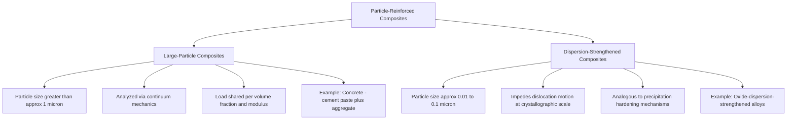

## Particle-Reinforced Composites

### Definition and General Mechanism

Particle-reinforced composites consist of particles of one material (the reinforcement) distributed throughout a continuous matrix of a second material. Unlike fiber reinforcement, particles are roughly equiaxed — their dimensions are approximately equal in all directions (rather than being long and slender) — which means particle-reinforced composites generally exhibit near-isotropic mechanical behavior (properties are similar in all loading directions), in contrast to the strongly directional (anisotropic) behavior of fiber-reinforced composites.

**Key Points**

- Particle reinforcement is typically used to improve stiffness, strength, wear resistance, or dimensional stability, and to reduce cost by substituting a cheaper filler for a portion of the (often more expensive) matrix material.
- The strengthening mechanism, magnitude of property improvement, and appropriate analytical model depend heavily on **particle size**, distinguishing two major subcategories: large-particle composites and dispersion-strengthened composites.
- Concrete — the most widely used construction material globally — is fundamentally a large-particle composite, making this classification directly central to civil engineering practice.

### Two Fundamental Categories by Particle Scale

**Large-Particle Composites**

In large-particle composites, the reinforcing particles are large enough (generally greater than approximately 1 micrometer) that particle-matrix interactions are governed by continuum mechanics rather than atomic-scale or dislocation-level phenomena. The matrix transmits and distributes applied load to the particles, which typically carry a proportion of the load according to their volume fraction and relative stiffness. Effective mechanical properties (elastic modulus in particular) are generally bounded between two limiting models:

$$E_c \leq E_{upper} = E_m V_m + E_p V_p \quad \text{(Voigt / rule of mixtures upper bound)}$$

$$E_c \geq E_{lower} = \frac{1}{\dfrac{V_m}{E_m} + \dfrac{V_p}{E_p}} \quad \text{(Reuss / inverse rule of mixtures lower bound)}$$

Where $E_m$, $E_p$ are the elastic moduli of matrix and particle phases and $V_m$, $V_p$ are their respective volume fractions. Real particle-reinforced composites, with randomly dispersed (rather than perfectly aligned) particles, typically exhibit an effective modulus between these two bounds, and this range is often referred to descriptively as **rule-of-mixtures bounding** for particulate composites.

**Dispersion-Strengthened Composites**

Dispersion-strengthened composites employ much finer particles, typically in the range of 0.01 to 0.1 micrometers, dispersed through a metallic matrix. At this fine scale, particles act by impeding the motion of dislocations through the crystal lattice of the matrix during plastic deformation, mechanically similar to precipitation hardening in age-hardenable alloys, although dispersion strengthening relies on thermally stable, essentially insoluble particles (rather than precipitates that form and dissolve via heat treatment), giving dispersion-strengthened composites superior strength retention at elevated temperatures compared to precipitation-hardened alloys. [Inference: this mechanism operates at the metallurgical/crystallographic scale and is generally not directly applicable to analyzing bulk civil construction materials such as concrete, which are governed by continuum-level large-particle behavior instead.]

### Concrete as a Large-Particle Composite

**Example**

Portland cement concrete is structurally a three-phase (or more) large-particle composite: a continuous **cement paste matrix** (hydrated Portland cement plus water) binds together dispersed **fine aggregate** (sand) and **coarse aggregate** (crushed stone or gravel) particles. The aggregate typically occupies 60-75% of the total concrete volume, meaning the mechanical behavior of concrete is strongly influenced by aggregate properties (stiffness, strength, particle shape, surface texture, gradation) in addition to the cement paste's own properties and the quality of the paste-aggregate **interfacial transition zone (ITZ)**.

**Key Points**

- **Interfacial Transition Zone (ITZ)**: A thin region (typically tens of micrometers) surrounding each aggregate particle where the cement paste microstructure differs from the bulk paste — generally more porous and containing larger calcium hydroxide crystals due to a local water-cement ratio increase (the "wall effect") during mixing. The ITZ is frequently the weakest link and preferred crack propagation path in concrete, exerting substantial influence on overall strength and durability despite its small physical extent.
- **Aggregate-to-paste modulus ratio**: Because aggregate is typically stiffer than the surrounding cement paste, concrete's overall elastic modulus lies between the paste and aggregate moduli, generally closer to the Voigt (upper-bound, iso-strain) estimate when aggregate volume fraction is high and particles are well-distributed, though actual behavior is also affected by ITZ quality and microcracking.
- **Particle packing and gradation**: Well-graded aggregate (a controlled distribution of particle sizes) minimizes void space between particles, reducing the volume of (weaker, more expensive) cement paste required to fill voids and improving workability, density, and durability — a central principle of concrete mix design.
- **Thermal compatibility**: The coefficient of thermal expansion of aggregate should be reasonably compatible with that of the cement paste; a significant mismatch can induce internal microcracking under thermal cycling, degrading long-term durability.

### Other Particle-Reinforced Composite Systems in Construction and Materials Practice

**Asphalt Concrete**

Analogous in structural classification to Portland cement concrete: mineral aggregate particles (large-particle reinforcement) are bound by a continuous **bituminous binder matrix**. Aggregate gradation, shape, and volume fraction govern load distribution, rutting resistance, and durability, while binder properties govern flexibility, temperature susceptibility, and fatigue cracking resistance.

**Particulate-Filled Polymers**

Polymer matrices filled with particulate reinforcement (e.g., calcium carbonate, silica, glass beads, or mineral fillers) to reduce cost, increase stiffness, improve dimensional stability, or modify thermal/electrical properties — relevant to polymer-based construction products such as filled sealants, polymer concrete, and some composite decking/cladding materials.

**Polymer Concrete**

A specialized construction material in which mineral aggregate particles are bound by a polymer resin matrix (commonly epoxy, polyester, or methyl methacrylate) instead of Portland cement paste, offering rapid curing, high early strength, and superior chemical resistance, used in applications such as bridge deck overlays, precast drainage products, and repair mortars where fast return-to-service or aggressive chemical exposure is a governing concern.

**Metal Matrix Particle Composites**

Ceramic particles (e.g., SiC, Al₂O₃) dispersed in a metallic matrix (commonly aluminum) at the large-particle scale to improve stiffness, wear resistance, and elevated-temperature strength compared to the unreinforced metal, used in specialized structural and mechanical components (e.g., brake rotors, some structural aerospace applications) rather than mainstream civil construction.

### Property Trends and Design Implications

**Key Points**

- Increasing particle volume fraction generally increases composite stiffness (following the rule-of-mixtures bounding behavior described above), but excessive particle content can reduce workability (in fresh concrete or polymer systems) and may reduce fracture toughness if particle-matrix bonding is weak or if particle clustering occurs.
- Particle shape and surface texture affect the mechanical interlock and bond quality between particle and matrix; angular, rough-textured aggregate generally develops stronger mechanical interlock with cement paste than smooth, rounded aggregate, influencing both strength and the required paste content for adequate workability.
- Because particle-reinforced composites are typically treated as quasi-isotropic at the macroscale (unlike aligned-fiber composites), structural design methods for concrete and asphalt largely rely on classical isotropic mechanics of materials approaches (with empirical modification factors) rather than the anisotropic laminate theory used for fiber-reinforced polymer systems.
- Durability of particle-reinforced composites is strongly influenced by the particle-matrix interface: in concrete, ITZ porosity and microcracking are primary pathways for moisture and chloride ion ingress, directly affecting reinforcement corrosion risk and freeze-thaw resistance.

### Related Topics

- Interfacial Transition Zone (ITZ) Microstructure and Its Effect on Concrete Strength
- Aggregate Gradation, Packing Density, and Concrete Mix Design
- Rule of Mixtures Bounding (Voigt and Reuss Models) for Composite Stiffness
- Asphalt Concrete Mix Design and Binder-Aggregate Interaction
- Polymer Concrete Applications in Repair and Overlay Systems
- Dispersion Strengthening vs. Precipitation Hardening in Metal Matrix Composites
- Fiber-Reinforced vs. Particle-Reinforced Composite Classification Comparison