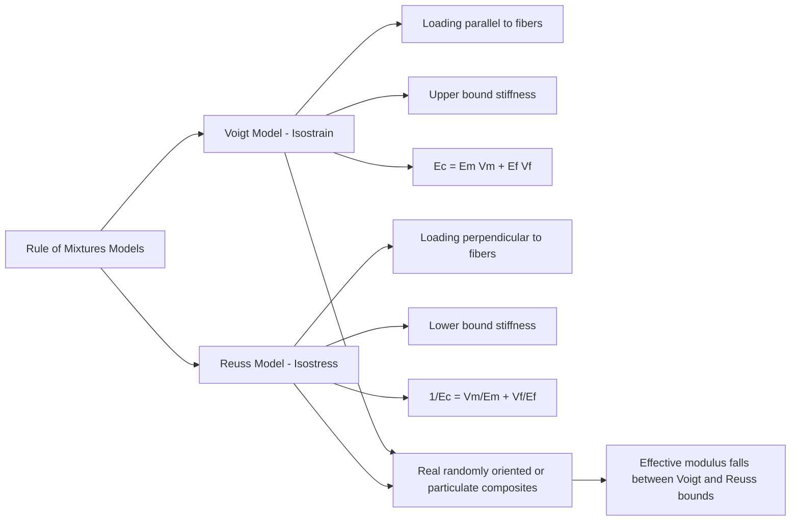

## Rule of Mixtures and Property Prediction

### Purpose and Conceptual Basis

The rule of mixtures is a set of analytical models used to predict the effective bulk properties of a composite material — most commonly elastic modulus, but also density, strength, thermal expansion, and other properties — as a function of the properties and volume (or sometimes mass) fractions of its individual constituent phases. These models provide a first-order engineering estimate without requiring full micromechanical or finite-element analysis, making them valuable for preliminary design, material selection, and conceptual understanding of composite behavior.

**Key Points**

- The rule of mixtures assumes **perfect bonding** between constituents (no interfacial slip or debonding) and, in its basic form, treats each phase as behaving according to its own bulk elastic properties.
- Predictions depend critically on the **loading direction relative to reinforcement orientation** for anisotropic (fiber-reinforced) composites, producing two distinct bounding equations.
- The rule of mixtures is exact only under idealized, simplifying assumptions; real composites generally show behavior that deviates from these idealized predictions due to factors such as imperfect bonding, particle/fiber clustering, voids, and residual stresses.

### Density Prediction

The simplest and most broadly applicable application of the rule of mixtures is density prediction, which holds regardless of reinforcement geometry (particle, fiber, or laminate) because mass and volume are strictly additive:

$$\rho_c = \rho_m V_m + \rho_f V_f$$

Where $\rho_c$, $\rho_m$, $\rho_f$ are the densities of the composite, matrix, and reinforcement (fiber or particle) respectively, and $V_m$, $V_f$ are their volume fractions ($V_m + V_f = 1$, assuming a void-free composite). This relationship is essentially always accurate (to within measurement precision and void content) since it follows directly from conservation of mass and volume, unlike the more approximate mechanical property models discussed below.

### Elastic Modulus Prediction: The Two Bounding Cases

**Longitudinal (Isostrain) Loading — Voigt Model / Upper Bound**

When a continuous, aligned-fiber composite is loaded parallel to the fiber direction, both the fiber and matrix experience approximately the same strain (an "isostrain" condition, since they are bonded together and elongate together under load). Under this assumption, the composite modulus is the **volume-weighted average** of the constituent moduli:

$$E_{c,\parallel} = E_m V_m + E_f V_f$$

This is known as the **Voigt model** and represents the theoretical **upper bound** on composite stiffness for a given set of constituent properties and volume fractions, since it implicitly assumes the stiffer phase carries a proportionally larger share of the load with no strain incompatibility penalty.

**Transverse (Isostress) Loading — Reuss Model / Lower Bound**

When the same composite is loaded perpendicular to the fiber direction, the fiber and matrix behave approximately as if loaded in series, and each phase experiences approximately the same stress (an "isostress" condition) while strains differ:

$$\frac{1}{E_{c,\perp}} = \frac{V_m}{E_m} + \frac{V_f}{E_f}$$

This is known as the **Reuss model** (or inverse rule of mixtures) and represents the theoretical **lower bound** on composite stiffness. The transverse modulus predicted by this model is typically dramatically lower than the longitudinal modulus — often by a factor of five or more for typical glass- or carbon-fiber/polymer systems — which is the mathematical origin of the strong anisotropy observed in unidirectional fiber composites.

**Application to Particulate Composites**

For particle-reinforced composites (such as concrete), where reinforcement is not aligned in a single direction, the Voigt and Reuss equations serve as theoretical upper and lower bounds respectively, with the actual composite modulus falling somewhere between them. Because the assumptions underlying both idealized models (perfect isostrain or perfect isostress throughout the entire composite) are geometrically unrealistic for randomly dispersed particles, the true modulus is typically closer to whichever bound is more representative of the actual load-sharing geometry, and more refined semi-empirical models (e.g., Halpin-Tsai equations) are often used in practice for improved accuracy at intermediate reinforcement geometries.

### Strength Prediction

Longitudinal tensile strength of a continuous, aligned-fiber composite (assuming fiber failure governs, typically valid above a critical minimum fiber volume fraction) is estimated using an analogous rule-of-mixtures form:

$$\sigma_{c,\parallel}^* = \sigma_f^* V_f + \sigma_m' V_m$$

Where $\sigma_f^*$ is the fiber's ultimate tensile strength, and $\sigma_m'$ is the stress present in the matrix at the strain level corresponding to fiber failure (which is generally lower than the matrix's own independent ultimate strength, since the fiber typically fails at a lower strain than the matrix could otherwise sustain, given fibers are usually stiffer and more brittle than the matrix).

**Key Points**

- Strength prediction via the rule of mixtures is inherently less reliable than modulus (stiffness) prediction, because strength is governed by localized flaws, statistical variability, and failure-mode-dependent mechanisms (fiber fracture, matrix cracking, interfacial debonding, fiber pull-out) rather than a simple additive elastic response. [Inference: strength predictions from the basic rule of mixtures should generally be treated as approximate engineering estimates rather than precise design values, and validated against experimental data or more detailed failure analysis for critical structural applications.]
- A **minimum fiber volume fraction** must be exceeded for fiber reinforcement to actually strengthen the composite beyond the unreinforced matrix strength; below this threshold, fibers may fracture before contributing meaningful load capacity, and the matrix alone may govern failure.

### Thermal Expansion Prediction

Composite coefficient of thermal expansion (CTE) prediction is more complex than modulus or density prediction because it involves competing constraint effects between phases with different stiffness and expansion characteristics. A commonly used approximate form (Turner's or Schapery-type models exist for more rigorous treatment) is:

$$\alpha_c \approx \frac{\alpha_m E_m V_m + \alpha_f E_f V_f}{E_m V_m + E_f V_f}$$

This is a modulus-weighted average rather than a simple volume-weighted average, reflecting the fact that the stiffer phase more strongly constrains the overall dimensional response to temperature change. [Inference: multiple thermal-expansion prediction models exist (Turner, Schapery, Kerner) with differing levels of rigor and applicability depending on reinforcement geometry; the equation above represents a simplified, commonly cited approximate form rather than a single universally exact solution.]

### Refinements Beyond the Basic Rule of Mixtures

**Halpin-Tsai Equations**

A semi-empirical model that provides improved accuracy over the basic Reuss (transverse) model by introducing a curve-fitting parameter that accounts for reinforcement geometry (fiber aspect ratio, packing arrangement):

$$\frac{E_c}{E_m} = \frac{1 + \xi \eta V_f}{1 - \eta V_f}, \quad \eta = \frac{(E_f/E_m) - 1}{(E_f/E_m) + \xi}$$

Where $\xi$ is a geometry-dependent fitting parameter (empirically calibrated; commonly cited approximate values include $\xi \approx 2$ for circular fibers in transverse loading and larger values for higher-aspect-ratio or more efficiently packed reinforcement geometries). The Halpin-Tsai approach is widely used in practice for transverse and shear modulus prediction where the basic Reuss model is known to be overly conservative (too low) compared to experimental measurements.

**Key Points**

- Real composite behavior deviates from idealized rule-of-mixtures predictions due to imperfect fiber/particle-matrix bonding, non-uniform reinforcement distribution or clustering, voids and manufacturing defects, residual stresses from processing (thermal mismatch during cure/cooling), and, in short-fiber systems, incomplete stress transfer due to fiber ends (governed by the critical fiber length concept).
- The rule of mixtures assumes linear-elastic behavior of both constituents; it does not capture nonlinear, viscoelastic, or time-dependent (creep) effects present in polymer matrices or the progressive damage/microcracking behavior seen in cementitious composites under load.

### Application to Civil Engineering Materials

**Example**

For a unidirectional CFRP strengthening laminate with a carbon fiber modulus $E_f = 230\ \text{GPa}$, an epoxy matrix modulus $E_m = 3\ \text{GPa}$, and a fiber volume fraction $V_f = 0.60$, the longitudinal (Voigt) modulus estimate is:

$$E_{c,\parallel} = (3)(0.40) + (230)(0.60) = 1.2 + 138 = 139.2\ \text{GPa}$$

This illustrates how, at practical structural fiber volume fractions, the longitudinal composite modulus is overwhelmingly dominated by the fiber phase, since $E_f \gg E_m$ — a key reason fiber type and volume fraction are the primary design levers for stiffness in structural FRP.

**Key Points**

- In concrete mix design, rule-of-mixtures-type reasoning informs qualitative expectations of how aggregate stiffness and volume fraction influence overall concrete modulus, though empirical code-based equations (e.g., ACI 318's modulus-of-elasticity formula based on concrete compressive strength and unit weight) are used in practice rather than direct rule-of-mixtures calculation, since concrete's modulus is also strongly influenced by paste porosity, ITZ quality, and moisture condition, which simple two-phase mixture models do not capture.
- For FRP-reinforced or FRP-strengthened members, rule-of-mixtures-derived laminate properties feed into subsequent structural analysis (e.g., Classical Lamination Theory for multi-ply laminates, or transformed-section analysis for FRP-reinforced concrete flexural members), rather than being used as the final design property in isolation.

### Related Topics

- Halpin-Tsai and Other Semi-Empirical Micromechanics Models
- Classical Lamination Theory for Multi-Ply Composite Laminates
- Critical Fiber Length and Short-Fiber Load Transfer Mechanics
- Voigt and Reuss Bounds Applied to Particulate Composite Stiffness (Concrete)
- ACI 318 Empirical Modulus of Elasticity Equations for Concrete
- Fiber Volume Fraction Optimization in Structural FRP Design
- Anisotropic Elastic Behavior of Unidirectional Composite Laminae