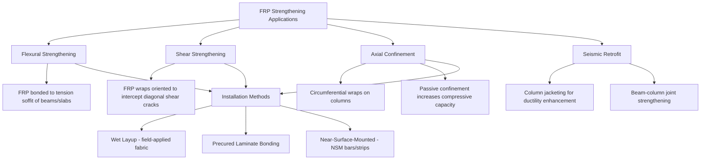

## FRP for Structural Strengthening and Retrofitting

### Purpose and Scope

Fiber-reinforced polymer (FRP) strengthening and retrofitting refers to the practice of bonding externally applied FRP materials (fabric sheets, precured laminate strips, or near-surface-mounted bars) to existing structural members — primarily reinforced concrete, but also timber, masonry, and steel — to increase load-carrying capacity, restore capacity lost to deterioration or damage, or upgrade a structure to meet revised code requirements or loading conditions, without the disruption, added dead weight, and cost typically associated with conventional strengthening methods such as section enlargement or steel plate bonding.

**Key Points**

- Primary drivers for FRP strengthening: increased service/live loads, deterioration (corrosion-induced section loss, chemical attack), design or construction deficiencies, seismic code upgrades, and damage repair.
- FRP strengthening is fundamentally a **retrofit of an existing, already-stressed member**, meaning the analysis must account for the strain already present in the substrate at the time of FRP installation, unlike design of a new member from zero initial strain.
- The governing U.S. design guideline is **ACI 440.2R** (Guide for the Design and Construction of Externally Bonded FRP Systems for Strengthening Concrete Structures); comparable international guidance includes fib Bulletin 14/90 and various national annexes to Eurocode-based approaches.

### Strengthening Mechanisms and Applications

**Flexural Strengthening**

FRP sheets or precured laminate strips are bonded to the tension face (soffit) of beams or slabs, acting as supplemental external tensile reinforcement analogous in function to internal steel reinforcement but bonded externally via epoxy adhesive rather than embedded in the concrete. Flexural strengthening increases the effective area of tension reinforcement, thereby increasing the nominal moment capacity of the section, following a strain-compatibility analysis similar to conventional reinforced concrete flexural design but incorporating the FRP's linear-elastic (non-yielding) stress-strain behavior.

**Shear Strengthening**

FRP fabric is bonded to the sides of a beam, oriented so that fibers intercept anticipated diagonal shear cracks (commonly at 45° to the member axis, or vertically as U-wraps or full wraps). This external reinforcement supplements internal shear reinforcement (stirrups) by providing additional tensile resistance across potential shear crack planes, analogous in mechanical function to internal stirrup reinforcement.

**Axial Confinement (Column Wrapping)**

Circumferential FRP wraps applied around a column provide **passive confinement**: as the column is loaded axially and begins to expand laterally (Poisson effect) or as internal microcracking develops, the surrounding FRP jacket resists this lateral expansion, inducing a triaxial (confined) stress state in the concrete core. Confined concrete exhibits substantially increased compressive strength and, critically, greatly increased ultimate compressive strain (ductility) compared to unconfined concrete, since the confining pressure delays and redistributes the internal microcracking that otherwise leads to brittle crushing failure.

**Seismic Retrofit**

FRP column jacketing is a widely used seismic retrofit technique for older reinforced concrete buildings and bridges with inadequately confined or under-detailed columns (a common deficiency in structures designed prior to modern seismic detailing provisions). The confinement mechanism described above directly increases column ductility capacity, allowing the column to sustain larger inelastic deformations during a seismic event without brittle shear or compression failure, and can also improve lap-splice performance in older columns with inadequate splice lengths by confining the splice region against longitudinal splitting cracks.

### Design Methodology per ACI 440.2R

**Strength Reduction for Environmental Durability**

Because FRP durability can be affected by long-term environmental exposure (moisture, alkalinity, UV, temperature), design guidance applies an **environmental reduction factor ($C_E$)** to the fiber's as-manufactured tensile properties before use in design calculations, with the reduction magnitude depending on fiber type and exposure condition (e.g., carbon fiber systems typically receive a less severe reduction than glass fiber systems for equivalent exposure, reflecting carbon's superior environmental durability):

$$f_{fu} = C_E f_{fu}^{*}$$

Where $f_{fu}^{*}$ is the manufacturer-reported ultimate tensile strength and $f_{fu}$ is the design ultimate tensile strength used in subsequent calculations.

**Additional Strength Reduction Factor**

A separate FRP-specific strength reduction factor ($\psi_f$) is applied to the nominal contribution of FRP reinforcement to overall member capacity, reflecting the relatively lower reliability/redundancy of an externally bonded system compared to internal reinforcement, and accounting for potential debonding-governed failure modes that may occur before the FRP reaches its full design tensile strength.

**Governing Failure Modes**

Flexural strengthening design must check several potential failure modes and identify which governs for a given design case:

- **Concrete crushing** in the compression zone before FRP reaches its design strain (a ductile-ish failure mode, generally preferred where achievable).
- **FRP rupture** (tensile fracture of the FRP reinforcement).
- **FRP debonding**, which can occur through several sub-mechanisms: intermediate crack-induced debonding (initiating at a flexural or shear crack and propagating toward the plate end), and plate-end (cover) debonding (initiating at the termination point of the FRP where a concentrated interfacial shear/peeling stress occurs). Debonding failure is generally **brittle and sudden**, typically governing over FRP rupture in most practical strengthening designs, and represents the primary limiting mechanism that design provisions must guard against.

**Key Points**

- Design codes impose a **maximum limiting strain** in the FRP (well below its rupture strain) specifically to prevent debonding failure, since debonding almost always occurs before the FRP reaches its full tensile rupture capacity.
- A **ductility check** is required: because externally bonded FRP does not yield, over-reinforcing a section with FRP can shift the failure mode from ductile concrete crushing/steel yielding toward brittle FRP-governed failure; codes therefore limit the proportion of total capacity that FRP is permitted to contribute, and require sufficient existing internal steel reinforcement to ensure a minimum level of ductile warning behavior prior to ultimate failure.
- An **existing strain check** accounts for the substrate's pre-existing strain state at the time of FRP installation (due to sustained dead load already present before strengthening), which effectively reduces the additional strain capacity available in the FRP before its design limit strain is reached.

### Substrate Preparation and Installation Considerations

**Key Points**

- **Surface preparation** is critical to bond performance: concrete surfaces typically require mechanical abrasion (grinding, sandblasting) to remove laitance and expose sound aggregate, achieving a specified surface profile and cleanliness before adhesive/resin application.
- **Corner rounding**: For column confinement wraps applied to rectangular or square columns, sharp corners must be rounded (typically to a minimum radius) prior to wrapping, since sharp corners create severe local stress concentrations in the FRP jacket that can trigger premature rupture and substantially reduce confinement effectiveness compared to circular columns.
- **Moisture and substrate condition**: Adequate substrate moisture content and temperature control during installation are necessary for proper epoxy adhesive cure and bond development; installation is typically restricted to specified ambient temperature and humidity ranges per manufacturer requirements.
- **Anchorage details**: At termination points (plate ends) or in regions of high interfacial shear demand, additional anchorage measures (FRP U-wraps, mechanical anchors, fiber anchors/spike anchors) are often used to mitigate debonding risk at these critical locations.

### Near-Surface-Mounted (NSM) FRP Systems

An alternative to externally bonded surface strengthening in which FRP bars or thin strips are embedded within grooves cut into the concrete cover and bonded with epoxy, rather than bonded to the exterior surface. NSM systems offer improved bond performance and reduced susceptibility to debonding (since the reinforcement is embedded within the concrete cover, providing additional confinement of the bond line) and are less vulnerable to mechanical damage, vandalism, or UV exposure, making them attractive for negative-moment (top-surface) strengthening applications and for members subject to surface abrasion or exposure.

### Fire and Long-Term Durability Considerations

**Key Points**

- The epoxy adhesives used in externally bonded FRP systems have relatively low glass transition temperatures compared to the temperatures reached in a structural fire, meaning bond strength and FRP strengthening effectiveness can degrade rapidly under fire exposure; fire-rated applications typically require supplemental fire protection (insulating coatings, fire-rated enclosures) or the FRP strengthening contribution is excluded entirely from fire-limit-state design.
- Long-term performance monitoring and periodic inspection (checking for debonding, delamination, or visible degradation) is recommended for FRP strengthening installations, since the system's structural contribution is entirely dependent on adhesive bond integrity, which cannot be as reliably assumed over a multi-decade service life as embedded, mechanically anchored internal reinforcement.
- Sustained-stress (creep-rupture) limits are applied to the FRP's allowable long-term stress level, particularly relevant for glass and aramid fiber systems, to prevent long-term strength loss under continuously applied service loads.

### Example Application

**Example**

A reinforced concrete bridge girder found to have inadequate shear capacity under updated design truck loading can be strengthened using CFRP U-wrap fabric bonded to the web sides and around the bottom soffit at intervals along the shear-critical region near the supports, with the FRP fiber direction oriented to intercept anticipated diagonal shear cracks. Because the girder's top flange is typically inaccessible (cast integrally with the deck), full-wrap confinement is not possible, and design must account for this partial-wrap (U-wrap) configuration's generally lower effective bond/anchorage length compared to a fully wrapped section, per the bond-reduction provisions in ACI 440.2R for partially wrapped shear-strengthening configurations.

### Related Topics

- ACI 440.2R Design Provisions for Externally Bonded FRP Systems
- FRP Confinement Models for Axial Capacity and Ductility Enhancement
- Debonding Failure Mechanisms in Externally Bonded FRP Systems
- Near-Surface-Mounted (NSM) FRP Strengthening Systems
- Seismic Retrofit Techniques for Reinforced Concrete Columns
- Environmental Durability Reduction Factors for FRP Design
- Bond Mechanics Between FRP and Concrete Substrates