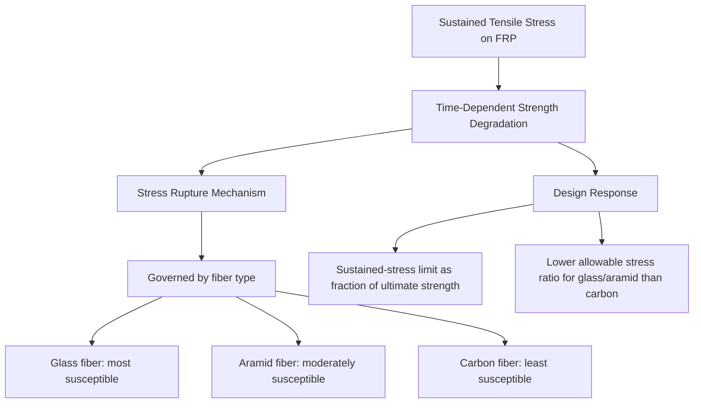

## Durability of Composites in Civil Applications

### Overview and Central Importance

Durability governs whether a composite material sustains its intended mechanical performance over the multi-decade service life expected of civil infrastructure. Unlike short-term laboratory strength testing, durability assessment addresses how environmental exposure — moisture, alkalinity, ultraviolet radiation, temperature cycling, sustained stress, and chemical attack — progressively degrades composite properties over time. Because composites (particularly polymer matrix composites) are relatively young materials in civil infrastructure compared to steel and concrete, with fewer decades of real-world exposure data, durability remains an area of active research and a primary consideration limiting broader structural adoption.

**Key Points**

- Durability degradation in composites is generally governed by three interacting factors: **matrix degradation**, **fiber degradation**, and **interfacial (fiber-matrix bond) degradation** — any one of which can govern overall composite property loss depending on exposure conditions and composite type.
- Civil composite durability is assessed both through **accelerated aging tests** (elevated temperature/humidity exposure intended to simulate long-term conditions in a compressed timeframe) and, increasingly, through **long-term field monitoring** of in-service structures.
- Environmental reduction factors in design codes (e.g., ACI 440 series) are a direct engineering response to durability uncertainty, applying conservative strength knockdowns based on fiber type and exposure category rather than assuming full as-manufactured properties persist indefinitely.

### Moisture-Related Degradation

**Matrix Plasticization and Hydrolysis**

Polymer matrices absorb moisture over time through diffusion, following approximately Fickian diffusion behavior in many systems. Absorbed moisture can plasticize the resin (softening it and reducing its glass transition temperature) and, in some resin chemistries (particularly polyester and vinyl ester under prolonged wet conditions), drive hydrolytic degradation of the polymer network itself, involving chemical bond scission.

**Fiber-Matrix Interfacial Debonding**

Moisture ingress at the fiber-matrix interface can degrade the chemical/mechanical bond between fibers and resin, reducing the composite's ability to transfer load from matrix to fiber. This is often the dominant moisture-related degradation mechanism, since interfacial bond loss can significantly reduce composite strength even when the bulk fiber and matrix properties themselves are relatively unaffected.

**Fiber-Specific Moisture Susceptibility**

- **Glass fibers**: Particularly susceptible to moisture-assisted degradation, especially under simultaneous exposure to high pH (alkaline) conditions, through a stress-corrosion-like mechanism in which water attacks Si-O-Si bonds in the glass network at crack tips, promoting slow crack growth even under sub-critical sustained stress.
- **Carbon fibers**: Generally exhibit excellent resistance to moisture-related degradation, since carbon fiber itself is chemically inert to water; carbon-fiber composite degradation under moisture exposure is therefore usually governed by matrix or interfacial effects rather than fiber degradation itself.
- **Aramid fibers**: Susceptible to moisture absorption directly into the fiber structure itself (aramid fibers are inherently somewhat hygroscopic), which can reduce fiber strength and stiffness in addition to any matrix/interface effects.

### Alkaline Environment Degradation

**Key Points**

- FRP reinforcement embedded within concrete is exposed to the highly alkaline pore solution (typically pH 12.5-13.5) present in hydrating and hydrated cement paste, which poses a particular durability concern for **glass fiber** reinforcement, since the alkaline solution can attack the glass fiber's silicate network directly.
- Mitigation strategies include using resin matrices with low permeability (limiting alkaline solution transport to the fiber surface), specifying alkali-resistant glass fiber formulations, applying protective fiber sizing/coating treatments, or substituting carbon, basalt, or vinyl ester/epoxy-encapsulated systems where alkaline exposure is a governing design concern.
- Carbon and basalt fibers generally exhibit substantially better inherent alkaline resistance than standard E-glass, making them preferred choices for internal FRP reinforcement applications with severe or long-duration alkaline exposure.

### Ultraviolet (UV) Radiation Degradation

Unprotected polymer matrix surfaces exposed to sunlight undergo UV-driven photo-oxidative degradation, involving chemical bond breaking (chain scission) in the polymer network at and near the exposed surface. This manifests as surface discoloration, chalking, and a measurable reduction in surface-layer mechanical properties, though UV degradation is generally a **surface-limited phenomenon** (penetrating only a shallow depth) rather than affecting the full cross-section of a structural FRP element, meaning its practical significance depends on element thickness and the proportion of cross-section affected.

**Key Points**

- **Aramid fibers** are particularly UV-sensitive and require protective coating or embedment away from direct sun exposure in most practical applications.
- Standard mitigation includes UV-stabilized resin formulations, UV-blocking gel coats or topcoats, and pigmented (opaque) surface finishes that block UV penetration into the underlying laminate.
- Externally bonded FRP strengthening systems exposed to direct sunlight (e.g., exterior bridge girder soffits, though often shaded) are typically specified with a protective UV-resistant coating as standard practice regardless of fiber type, both for UV protection and for protection against moisture, abrasion, and vandalism.

### Thermal Effects and Freeze-Thaw Exposure

**Key Points**

- **Glass transition temperature limitation**: The resin matrix's $T_g$ establishes the practical upper service temperature limit for a polymer composite; approaching or exceeding $T_g$ causes a dramatic drop in matrix stiffness and load-transfer capability well before the fibers themselves are thermally affected, since fibers (glass, carbon, basalt) retain useful mechanical properties to much higher temperatures than typical polymer matrices.
- **Thermal cycling and coefficient of thermal expansion (CTE) mismatch**: Repeated thermal cycling can induce cyclic stress at the fiber-matrix interface or, in FRP-strengthened concrete members, at the FRP-concrete bond interface, due to differing CTE values between constituent materials (e.g., carbon fiber's near-zero longitudinal CTE versus concrete's substantially higher CTE), potentially contributing to progressive bond degradation or microcracking over many freeze-thaw or seasonal cycles.
- **Freeze-thaw exposure**: For externally bonded FRP systems in cold climates, freeze-thaw cycling of the underlying concrete substrate (rather than the FRP itself) can be a governing durability concern, since substrate deterioration (scaling, cracking) can undermine the bond integrity supporting the FRP system regardless of the FRP material's own inherent freeze-thaw resistance.

### Sustained Stress: Creep and Stress Rupture

Under continuously sustained tensile load, certain fiber types exhibit **stress rupture** (sometimes termed static fatigue): a time-dependent reduction in the stress level a fiber can sustain without eventual failure, driven by slow, sub-critical crack growth within the fiber (particularly relevant to glass fibers, where moisture-assisted crack growth mechanisms compound the effect). Carbon fibers exhibit markedly superior stress-rupture resistance compared to glass and aramid fibers, which is a key reason carbon fiber systems are generally favored for permanently stressed applications such as prestressing tendons.

**Key Points**

- Design codes (e.g., ACI 440 series) specify maximum allowable sustained-plus-cyclic service stress levels as a fraction of ultimate tensile strength, with substantially lower allowable ratios specified for glass and aramid FRP compared to carbon FRP, directly reflecting this differential stress-rupture susceptibility.
- Stress rupture is a particularly critical consideration for FRP prestressing tendons and permanently loaded structural tension members, where sustained stress is inherent to the application, as opposed to intermittently loaded strengthening applications.

### Fatigue Behavior Under Cyclic Loading

**Key Points**

- Carbon fiber composites generally exhibit excellent fatigue resistance along the fiber direction, often superior to steel on a strength-normalized basis, making CFRP attractive for fatigue-critical applications (e.g., bridge tendons, dynamically loaded structural elements).
- Glass fiber composites generally exhibit comparatively lower fatigue resistance than carbon fiber composites, with more pronounced strength degradation under cyclic loading.
- Fatigue failure mechanisms in FRP typically differ from metallic fatigue (which is dominated by a single dominant crack): FRP fatigue damage is often characterized by progressive, distributed micro-damage accumulation — matrix microcracking, fiber-matrix debonding, and localized fiber breakage distributed throughout the stressed volume — before eventual overall loss of load-carrying capacity.

### Fire Performance

Polymer matrix composites are inherently combustible, and mechanical properties degrade rapidly as the resin approaches and exceeds its glass transition temperature — occurring at temperatures far below those reached in a design structural fire scenario. This represents one of the most significant durability/performance limitations of polymer matrix FRP in civil applications relative to steel or concrete.

**Key Points**

- Fire protection strategies include intumescent or insulating coatings, fire-rated enclosure/cladding systems, or, in externally bonded strengthening applications, simply excluding the FRP's structural contribution from fire-limit-state capacity calculations (treating pre-strengthening capacity as the fire-condition capacity).
- Fire performance requirements can be a governing constraint that excludes FRP strengthening from consideration entirely in applications with stringent fire-rating requirements, unless adequate supplemental fire protection is provided.

### Bond Durability at the FRP-Substrate Interface

For externally bonded FRP strengthening systems, the epoxy adhesive bond to the concrete or other substrate represents an additional durability-critical interface beyond the fiber-matrix interface within the FRP composite itself.

**Key Points**

- Bond durability can be compromised by substrate moisture ingress (particularly if the substrate was inadequately dried before bonding, or if moisture migrates through the substrate from behind), freeze-thaw deterioration of the substrate, and long-term creep of the epoxy adhesive layer under sustained shear stress.
- Field inspection protocols for FRP-strengthened structures commonly include acoustic tap testing, infrared thermography, or ultrasonic methods to detect subsurface debonding or delamination that may not be visible from the exposed FRP surface.

### Assessment and Mitigation Strategies

**Example**

A durability assessment for a proposed marine bridge substructure repair using externally bonded GFRP might specify: a vinyl ester (rather than standard polyester) resin matrix for superior moisture and chemical resistance, a UV-protective topcoat given direct sun exposure at the site, a reduced sustained-stress design limit reflecting glass fiber's stress-rupture susceptibility in a continuously loaded application, and a periodic (e.g., 5-year interval) inspection protocol using infrared thermography to monitor for progressive debonding — collectively addressing the combined moisture, UV, alkalinity (from adjacent concrete and marine spray), and sustained-load durability risks specific to that exposure environment.

**Key Points**

- Accelerated aging test protocols (e.g., ASTM D2247 for humidity exposure, ASTM G154 for UV/condensation cycling, various alkaline immersion protocols) are used to generate the environmental reduction factors incorporated into design codes, though extrapolating accelerated short-term test results to multi-decade real-world service life remains an area of ongoing research uncertainty.
- Selecting fiber and matrix combinations appropriate to the specific anticipated exposure environment (moisture, alkalinity, UV, temperature, sustained stress) is the primary practical durability mitigation strategy, since post-installation remediation of degraded bonded FRP systems is often difficult and costly compared to appropriate initial material selection.

### Related Topics

- Environmental Reduction Factors in ACI 440 Design Provisions
- Stress-Corrosion Cracking Mechanisms in Glass Fiber Composites
- Accelerated Aging Test Protocols for FRP Durability Assessment
- Fire Protection Strategies for Polymer Matrix Composite Structures
- Non-Destructive Evaluation Methods for Bonded FRP Systems (Infrared Thermography, Acoustic Tap Testing)
- Alkali-Resistant Glass Fiber Formulations for Concrete-Embedded FRP
- Long-Term Field Performance Studies of FRP-Strengthened Infrastructure