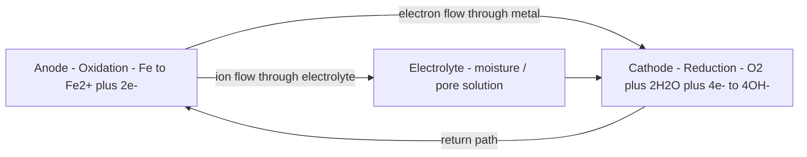

## Electrochemical Principles of Corrosion

### Definition and Scope

Corrosion is the deterioration of a material, usually a metal, resulting from chemical or electrochemical reaction with its environment. In civil engineering, electrochemical corrosion is the dominant degradation mechanism for structural steel, reinforcing bars in concrete, steel piles, pipelines, and metallic fasteners. Unlike purely chemical corrosion (direct oxidation without an electrolyte, e.g., high-temperature oxidation), electrochemical corrosion requires four essential components acting simultaneously.

### The Four Essential Components of a Corrosion Cell

An electrochemical corrosion cell cannot exist without all four of the following:

1. **Anode** — the electrode where oxidation occurs and metal is lost (dissolved into ions)
2. **Cathode** — the electrode where reduction occurs; no metal loss happens here
3. **Electrolyte** — an ionically conductive medium (moisture, soil pore water, concrete pore solution, seawater) that allows ion transport between anode and cathode
4. **Metallic Path** — an electrically conductive connection between anode and cathode allowing electron flow

Removing any one of these four components stops the corrosion process. This principle underlies most corrosion-control strategies (coatings remove electrolyte contact, cathodic protection manipulates the electrochemical driving force, etc.).



### Half-Cell Reactions

Corrosion of iron/steel in a neutral, aerated aqueous environment (the typical case for atmospheric and reinforced-concrete exposure) proceeds through two half-reactions occurring at physically separate sites on the same metal surface.

**Anodic reaction (oxidation, metal dissolution):**

$$\text{Fe} \rightarrow \text{Fe}^{2+} + 2e^-$$

**Cathodic reaction (oxygen reduction, in neutral/alkaline environments):**

$$\text{O}_2 + 2\text{H}_2\text{O} + 4e^- \rightarrow 4\text{OH}^-$$

**Cathodic reaction (hydrogen evolution, dominant in acidic environments):**

$$2\text{H}^+ + 2e^- \rightarrow \text{H}_2$$

**Overall reaction and secondary product formation:**

$$\text{Fe}^{2+} + 2\text{OH}^- \rightarrow \text{Fe(OH)}_2 \text{ (ferrous hydroxide)}$$


$$4\text{Fe(OH)}_2 + \text{O}_2 + 2\text{H}_2\text{O} \rightarrow 4\text{Fe(OH)}_3 \text{ (ferric hydroxide, precursor to rust)}$$

Rust (hydrated iron oxide, approximately $\text{Fe}_2\text{O}_3 \cdot n\text{H}_2\text{O}$) forms away from the actual anodic dissolution site, since $\text{Fe}^{2+}$ ions migrate through the electrolyte before precipitating upon meeting hydroxide ions and oxygen.

### Thermodynamics: Why Metals Corrode

**Gibbs Free Energy and Cell Potential**

The driving force for corrosion is a decrease in Gibbs free energy. The relationship between free energy change and cell potential is:

$$\Delta G = -nFE_{cell}$$

Where:

- $\Delta G$ = Gibbs free energy change (J/mol)
- $n$ = number of electrons transferred
- $F$ = Faraday's constant ($96{,}485$ C/mol)
- $E_{cell}$ = cell potential (V)

A negative $\Delta G$ (spontaneous reaction) corresponds to a positive $E_{cell}$. Since most structural metals (iron, aluminum, zinc) have negative standard reduction potentials relative to hydrogen and oxygen reduction reactions, their oxidation is thermodynamically favorable — metals in refined form are inherently unstable relative to their oxide/hydroxide states, which is why they corrode toward their naturally occurring ore-like states.

**The Galvanic Series and Standard Electrode Potentials**

The **electromotive force (EMF) series** ranks metals by standard reduction potential ($E^0$) under standardized conditions (1M ion concentration, 25°C). More practically, the **galvanic series** ranks metals and alloys by their actual corrosion potential in a specific electrolyte (commonly seawater), accounting for passive film effects.

| Position | Approximate Behavior |
| --- | --- |
| Noble/Cathodic end | Platinum, Gold, Graphite, Stainless steel (passive) |
| Mid-range | Copper, Brass, Nickel |
| Active/Anodic end | Steel, Cast iron, Aluminum, Zinc, Magnesium |

A metal positioned closer to the active (anodic) end will preferentially corrode when electrically coupled to a metal positioned closer to the noble (cathodic) end, forming a galvanic couple.

**Pourbaix Diagrams (Potential–pH Diagrams)**

Pourbaix diagrams map the thermodynamically stable phase (immunity, corrosion, or passivation) of a metal–water system as a function of electrode potential ($E$) and pH. Three regions are typically identified:

- **Immunity** — metal is thermodynamically stable (no driving force for corrosion)
- **Corrosion** — soluble ionic species are stable (active dissolution)
- **Passivation** — a stable, protective solid oxide/hydroxide film forms on the surface

For iron, the diagram explains why steel embedded in the highly alkaline pore solution of sound concrete (pH ≈ 12.5–13.5) sits in the passivation region, forming a protective $\gamma\text{-Fe}_2\text{O}_3$ passive film — the thermodynamic basis of reinforcement corrosion protection by concrete cover.

### Kinetics: Rate of Corrosion

Thermodynamics indicates whether corrosion *can* occur; kinetics governs *how fast*.

**Polarization**

When a metal is not at equilibrium, its potential shifts away from the equilibrium (open-circuit) value — this shift is called polarization. Two principal types:

- **Activation polarization** — controlled by the slowest step in the electrochemical reaction sequence at the electrode surface (charge-transfer controlled)
- **Concentration polarization** — controlled by the rate of diffusion of reactant/product species (e.g., dissolved oxygen) to/from the electrode surface (mass-transport controlled); this becomes dominant at higher current densities when oxygen supply is limiting

**Evans Diagrams**

An Evans diagram plots potential ($E$) versus the logarithm of current density ($\log i$) for both the anodic and cathodic reactions on the same axes. The intersection point defines the **corrosion potential** ($E_{corr}$) and **corrosion current density** ($i_{corr}$) of the freely corroding system.

```mermaid
flowchart TD
    subgraph EvansDiagram [Evans Diagram - schematic, log i vs E (svg_diagram)]
    direction LR
    X1[Anodic line - rising E with log i] --- P((Intersection point: Ecorr, icorr))
    X2[Cathodic line - falling E with log i] --- P
    end
```

**Corrosion Current and Faraday's Law**

The corrosion current density $i_{corr}$ is directly related to the mass loss rate via Faraday's Law:

$$w = \frac{i_{corr} \cdot t \cdot M}{n \cdot F}$$

Where:

- $w$ = mass loss (g)
- $i_{corr}$ = corrosion current density (A/cm²)
- $t$ = time (s)
- $M$ = atomic/molecular weight of the metal (g/mol)
- $n$ = valence (electrons lost per atom)
- $F$ = Faraday's constant

This relationship is the theoretical basis for techniques such as **linear polarization resistance (LPR)** used in the field to non-destructively estimate active rebar corrosion rates in concrete structures.

### Passivity

Certain metals and alloys (stainless steel, aluminum, titanium, chromium, and steel in high-pH concrete) develop a thin, adherent, self-healing oxide film only a few nanometers thick that dramatically reduces the corrosion rate despite thermodynamically favorable conditions for dissolution. This phenomenon, **passivity**, explains why:

- Stainless steel resists corrosion in many environments despite iron and chromium being thermodynamically active
- Steel reinforcement in uncontaminated, high-pH concrete corrodes negligibly for decades
- Breakdown of the passive film (by chloride ion attack or carbonation-induced pH reduction) is the trigger mechanism for reinforcement corrosion — this is the single most important electrochemical concept for reinforced concrete durability design

### Types of Electrochemical Corrosion Cells Relevant to Civil Engineering

**Composition (Galvanic) Cells**

Occur when two dissimilar metals are electrically connected in the same electrolyte (e.g., steel rebar in contact with an aluminum conduit, or steel fasteners against copper flashing). The more active metal becomes the anode and corrodes preferentially; the more noble metal is protected (cathode).

**Concentration Cells**

Occur on a single metal surface due to variations in electrolyte composition:

- **Oxygen concentration cell** — regions with lower dissolved oxygen (e.g., under a disbonded coating, in a crevice, or deep within a concrete crack) become anodic relative to well-aerated regions, which become cathodic. This is the classic mechanism behind crevice corrosion and corrosion beneath debonded coatings/deposits.
- **Ion concentration cell** — variation in metal-ion or salt concentration across the surface establishes a potential difference driving localized corrosion

**Stress Cells (Differential Strain Cells)**

Regions of a metal under higher residual or applied stress (cold-worked zones, weld heat-affected zones, bent rebar) tend to be more anodic than unstressed regions of the same metal, contributing to phenomena such as stress-corrosion cracking (SCC) and corrosion fatigue.

**Macrocell versus Microcell Corrosion**

- **Microcell corrosion** — anodic and cathodic sites are microscopically adjacent and continuously shift position across the surface, producing fairly uniform general corrosion
- **Macrocell corrosion** — anodic and cathodic sites are physically separated by a significant distance (e.g., chloride-contaminated rebar near a crack acting as anode, while distant passive rebar acts as cathode), producing concentrated, localized section loss — this is particularly damaging in reinforced concrete because pit-like anodic zones can lose significant cross-section while the visible surface shows minimal distress

### Corrosion in Reinforced Concrete (Applied Example)

**Example:**

A steel reinforcing bar embedded in chloride-contaminated concrete near a bridge deck joint demonstrates the complete electrochemical corrosion cell:

- **Anode**: Localized bar surface where chloride ions have depassivated the oxide film; $\text{Fe} \rightarrow \text{Fe}^{2+} + 2e^-$
- **Cathode**: Adjacent, still-passive bar surface with adequate oxygen and moisture access; $\text{O}_2 + 2\text{H}_2\text{O} + 4e^- \rightarrow 4\text{OH}^-$
- **Electrolyte**: The moist, ion-containing concrete pore solution
- **Metallic path**: The continuous steel reinforcing cage itself

The expansive corrosion products (rust) occupy up to 6–10 times the volume of the original steel consumed, generating tensile stresses in the surrounding concrete that produce characteristic cracking, delamination, and spalling — the visible symptoms engineers use to diagnose an underlying electrochemical process.

Two principal depassivation mechanisms are recognized:

1. **Chloride-induced corrosion** — chloride ions (from deicing salts or marine exposure) penetrate the cover and locally break down the passive film once a **chloride threshold concentration** is exceeded at the rebar surface, producing aggressive, highly localized (pitting-type) macrocell corrosion
2. **Carbonation-induced corrosion** — atmospheric $\text{CO}_2$ reacts with calcium hydroxide in the pore solution, $\text{Ca(OH)}_2 + \text{CO}_2 \rightarrow \text{CaCO}_3 + \text{H}_2\text{O}$, reducing pore solution pH from ~13 to below ~9, causing general depassivation and more uniform corrosion once the carbonation front reaches the rebar

[Inference] The relative aggressiveness of chloride-induced versus carbonation-induced corrosion in a given structure depends on site-specific exposure, cover depth, and concrete quality, so field condition assessment (e.g., half-cell potential mapping, chloride profiling, carbonation depth testing) is typically required rather than relying on generalized threshold values alone.

### Measurement and Diagnostic Techniques

| Technique | Principle | Typical Application |
| --- | --- | --- |
| Half-cell potential mapping (ASTM C876) | Measures electrochemical potential of rebar vs. a reference electrode (e.g., Cu/CuSO₄) | Identifies probability zones of active corrosion in concrete |
| Linear Polarization Resistance (LPR) | Applies small potential perturbation, measures resulting current to estimate $i_{corr}$ | Quantitative corrosion rate estimation |
| Electrochemical Impedance Spectroscopy (EIS) | Applies AC signal across a frequency range to characterize interfacial and film properties | Research-grade characterization of passive films, coatings |
| Galvanic current measurement | Direct measurement of current between dissimilar metal couple | Assessing macrocell activity, cathodic protection system performance |

[Unverified] Specific numerical thresholds (e.g., half-cell potential ranges correlating to "90% probability of corrosion") are drawn from ASTM guidance under standard reference-electrode and cover-depth assumptions and may require adjustment for unusual site conditions such as very low oxygen availability or non-standard concrete resistivity.

### Corrosion Control Strategies Derived Directly from Electrochemical Principles

Because all four cell components (anode, cathode, electrolyte, metallic path) are required, control strategies attack one or more of them:

- **Coatings/barriers** — interrupt electrolyte or oxygen access to the metal surface (epoxy-coated rebar, galvanizing, paint systems)
- **Cathodic protection** — deliberately shifts the entire structure's potential into the immunity or reduced-corrosion region
  - *Sacrificial anode (galvanic) systems*: a more active metal (zinc, magnesium, aluminum alloys) is connected to the structure, becoming the anode and corroding preferentially
  - *Impressed current cathodic protection (ICCP)*: an external DC power source drives current from inert anodes through the electrolyte to the structure, forcing it to behave as a cathode
- **Corrosion inhibitors** — chemical admixtures (e.g., calcium nitrite) that raise the chloride threshold or promote more stable passive film formation
- **Electrical isolation** — insulating dissimilar metals from each other to prevent galvanic coupling (e.g., dielectric unions in piping systems)
- **Environmental modification** — reducing moisture ingress, oxygen availability, or chloride/CO₂ exposure through design detailing, drainage, and low-permeability concrete

### Common Calculation Example

**Example:**

Given a corroding steel rebar with $i_{corr} = 1\ \mu\text{A/cm}^2$, estimate the section loss rate.

Using Faraday's Law with $M_{Fe} = 55.85$ g/mol, $n = 2$, $F = 96{,}485$ C/mol, and density $\rho_{Fe} = 7.87$ g/cm³:

$$\text{Corrosion rate (penetration)} = \frac{i_{corr} \cdot M}{n \cdot F \cdot \rho}$$

Substituting and converting units, $1\ \mu\text{A/cm}^2$ corresponds approximately to a penetration rate of **0.0116 mm/year** — a widely cited engineering approximation relating LPR-measured current density directly to section loss rate for carbon steel. [Inference] This conversion factor assumes uniform corrosion distributed evenly over the exposed area; actual pitting-type macrocell corrosion in chloride-contaminated concrete can produce local penetration rates significantly higher than this average value at discrete anodic sites.

### Common Misconceptions

- Corrosion is **not** simply "oxygen reacting with metal" in the way combustion is; it is charge-transfer controlled and requires a complete circuit through an electrolyte.
- Stainless steel is **not** immune to corrosion — it relies on a passive film that can break down locally (pitting, crevice corrosion) in chloride environments, particularly in lower-alloy grades.
- Rust forming on a steel surface does **not** mark the exact anodic dissolution site; $\text{Fe}^{2+}$ ions typically migrate before precipitating as oxide/hydroxide.
- Galvanized (zinc-coated) steel does not merely act as a physical barrier — it also provides sacrificial cathodic protection at coating defects because zinc is anodic to steel.

### Related Topics

- Pitting and Crevice Corrosion Mechanisms
- Chloride-Induced Reinforcement Corrosion and Threshold Concentrations
- Carbonation of Concrete and Depassivation
- Galvanic Corrosion in Dissimilar Metal Assemblies
- Cathodic Protection System Design (Sacrificial vs. Impressed Current)
- Stress-Corrosion Cracking and Hydrogen Embrittlement in Prestressing Steel
- Pourbaix Diagram Interpretation for Common Structural Metals
- Corrosion Inhibitors and Concrete Admixture Technologies
- Durability Design per ACI 318 / Eurocode 2 Exposure Classes
- Non-Destructive Corrosion Assessment Methods (Half-Cell Potential, GPR, Resistivity)