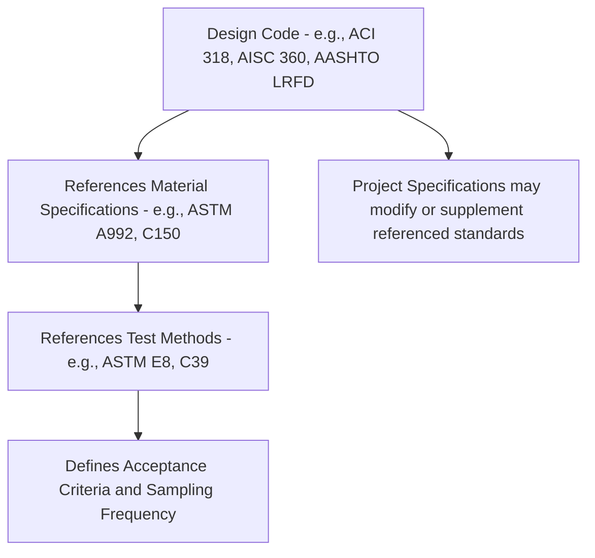

## Standard Test Methods and Specifications


### Overview and Purpose

Standard test methods and specifications provide the codified, consensus-based procedures that govern how materials are sampled, tested, evaluated, and accepted throughout the construction industry. Standardization ensures that test results are reproducible across different laboratories, comparable across time and projects, and legally defensible for contractual acceptance/rejection decisions. This entry surveys the major standards-development organizations, the structural distinction between test methods and specifications, and the primary standard families governing civil engineering materials.

```mermaid
flowchart TD
    A[Standards Framework (svg_diagram)] --> B[Standards Development Organizations]
    A --> C[Document Types: Test Method vs Specification vs Practice]
    A --> D[Material-Specific Standard Families]
    B --> B1[ASTM International]
    B --> B2[AASHTO]
    B --> B3[ACI]
    B --> B4[AWS]
    B --> B5[International: ISO, EN]
```

### Standards Development Organizations

**ASTM International**

Originally the American Society for Testing and Materials, ASTM International develops voluntary consensus standards across virtually every material and industry sector through committee-based processes involving producers, users, consumers, and general-interest representatives. ASTM standards are organized by committee (e.g., Committee C09 for concrete and aggregates, Committee A01 for steel, Committee D18 for soil and rock) and are widely referenced or incorporated by reference into building codes, project specifications, and other standards bodies.

**AASHTO (American Association of State Highway and Transportation Officials)**

Develops standards specifically for transportation infrastructure, including many test methods that parallel or reference ASTM methods but are tailored to highway/bridge applications. AASHTO also publishes design specifications (e.g., AASHTO LRFD Bridge Design Specifications) that incorporate material standards by reference.

**ACI (American Concrete Institute)**

Develops standards, codes, and guides specifically for concrete materials, design, and construction, most notably ACI 318 (Building Code Requirements for Structural Concrete), which governs design provisions and references relevant ASTM material and testing standards.

**AWS (American Welding Society)**

Develops welding-specific standards, most notably AWS D1.1 (Structural Welding Code—Steel), governing welding procedure qualification, welder qualification, and inspection/acceptance criteria for structural steel welding.

**International Standards Bodies**

- **ISO (International Organization for Standardization)** — develops internationally harmonized standards across numerous technical committees, relevant for international projects and increasingly referenced or harmonized with regional standards
- **EN (European Norm) standards** — developed through CEN (European Committee for Standardization), forming the basis of Eurocode design provisions and associated European material/testing standards
- [Inference] The degree of harmonization or divergence between ASTM-based and EN/ISO-based standards varies by specific test method and material; projects spanning multiple regulatory jurisdictions typically require explicit verification of which standard family governs contractually rather than assuming equivalence between similarly-named methods

### Document Type Distinctions

Standards organizations, particularly ASTM, formally distinguish between several document types, each serving a distinct function:

| Document Type | Purpose | Example |
| --- | --- | --- |
| **Test Method** | Defines a specific procedure for measuring or evaluating a property | ASTM C39 (compressive strength testing procedure) |
| **Specification** | Defines requirements a material or product must meet | ASTM A615 (deformed/plain steel bars for concrete reinforcement) |
| **Practice** | Defines a procedure that does not produce a test result (e.g., sampling, fabrication, application, or installation procedure) | ASTM C172 (practice for sampling freshly mixed concrete) |
| **Guide** | Provides organized information/options without establishing a specific course of action or a fixed requirement | Guides addressing general durability considerations |
| **Classification** | Establishes a systematic arrangement/grouping of materials based on similar properties | Aggregate or soil classification systems |
| **Terminology** | Provides definitions of terms used within a technical field | Standardized definitions supporting consistent terminology across related standards |

**Key Points**

- A specification often incorporates one or more test methods by reference (e.g., a rebar specification referencing tension and bend test methods to define acceptance criteria), meaning the specification defines *what* is required while the test method defines *how* to measure it
- Understanding this distinction matters practically: citing a test method number alone does not establish acceptance criteria, since acceptance limits are established in the governing specification, not the test procedure itself

### Structural Steel and Reinforcement Standards

**Key ASTM Specifications**

| Standard | Scope |
| --- | --- |
| ASTM A36 | Carbon structural steel |
| ASTM A992 | Structural steel shapes for buildings (wide-flange sections) |
| ASTM A572 | High-strength low-alloy columbium-vanadium structural steel |
| ASTM A709 | Structural steel for bridges (with supplementary toughness/temperature requirements for specific grades) |
| ASTM A615 | Deformed and plain carbon-steel bars for concrete reinforcement |
| ASTM A706 | Low-alloy steel deformed bars for concrete reinforcement (specified for enhanced weldability and ductility, commonly required in seismic design applications) |
| ASTM A588/A242 | High-strength low-alloy weathering steel |

**Associated Test Methods**

ASTM A370 provides standardized mechanical testing procedures (tension, bend) specifically for steel products, commonly referenced by the material specifications above rather than duplicating testing procedures within each material specification document.

### Concrete and Cement Standards

**Key Test Methods**

| Standard | Purpose |
| --- | --- |
| ASTM C39 | Compressive strength of cylindrical concrete specimens |
| ASTM C31 | Practice for making and curing concrete test specimens in the field |
| ASTM C192 | Practice for making and curing concrete test specimens in the laboratory |
| ASTM C143 | Slump test for fresh concrete workability |
| ASTM C231 | Air content of freshly mixed concrete (pressure method) |
| ASTM C78/C293 | Flexural strength (modulus of rupture) |
| ASTM C496 | Splitting tensile strength |
| ASTM C42 | Obtaining and testing drilled cores |
| ASTM C805 | Rebound number (Schmidt hammer) |
| ASTM C876 | Half-cell potential of reinforcing steel |
| ASTM C1202 | Rapid chloride permeability (electrical indication) |

**Key Specifications**

| Standard | Scope |
| --- | --- |
| ASTM C150 | Portland cement specification |
| ASTM C595 | Blended hydraulic cements |
| ASTM C1157 | Performance specification for hydraulic cement |
| ASTM C94 | Ready-mixed concrete specification |
| ASTM C33 | Concrete aggregates specification |

**Design Code Integration**

ACI 318 references these ASTM material and test standards extensively; for example, mix design acceptance criteria, curing requirements, and testing frequency provisions in ACI 318 and associated ACI 301 (Specifications for Structural Concrete) direct users to the specific ASTM test methods governing quality verification.

### Aggregates and Soils Standards

**Key Standards**

| Standard | Purpose |
| --- | --- |
| ASTM C33 | Concrete aggregate specification (grading, deleterious substance limits) |
| ASTM C127/C128 | Specific gravity and absorption of coarse/fine aggregate |
| ASTM C136 | Sieve analysis (gradation) |
| ASTM C295 | Petrographic examination of aggregates |
| ASTM C1260/C1293 | Alkali-silica reactivity testing (accelerated mortar bar and concrete prism methods) |
| ASTM D422/D6913 | Particle size analysis of soils |
| ASTM D2487 | Unified Soil Classification System (USCS) |
| ASTM D1557/D698 | Soil compaction (Proctor test, modified and standard) |
| AASHTO M145 / ASTM D3282 | AASHTO soil classification system |

**Key Points**

- Geotechnical standards are frequently governed by both ASTM (D-series, primarily developed through ASTM Committee D18) and AASHTO parallel standards, with project specifications typically designating which standard family governs for a given contract
- Aggregate reactivity testing standards (ASTM C1260/C1293) are specifically referenced within durability design frameworks addressing alkali-aggregate reaction risk

### Welding Standards

**AWS D1.1 Structural Welding Code—Steel**

Governs welding procedure specifications (WPS), procedure qualification records (PQR), welder qualification testing, and inspection/acceptance criteria (visual, and where specified, NDT methods such as UT and RT) for structural steel welding in buildings and bridges (bridge welding has a related but distinct code, AWS D1.5).

**Key Points**

- Welding standards integrate mechanical destructive testing (bend tests, tension tests of welded coupons) and non-destructive testing acceptance criteria (UT, RT, MT, PT discontinuity size/type limits) within a single unified qualification and inspection framework
- Welder qualification testing (distinct from procedure qualification) verifies individual welder skill/competency for specific welding positions, processes, and material types before that welder is permitted to perform production welding on qualified procedures

### Design Code Integration and the Specification Hierarchy

**Conceptual Hierarchy**



**Key Points**

- Design codes (ACI 318, AISC 360, AASHTO LRFD Bridge Design Specifications) generally do not redefine testing procedures themselves but instead reference the applicable ASTM/AASHTO/AWS standards by designation and edition/year, establishing a layered hierarchy from design code through material specification down to test method
- Project-specific specifications can modify, supplement, or make more stringent the requirements of referenced national/international standards (e.g., a project specification might require additional Charpy V-notch toughness testing beyond the baseline material specification's requirements for a fracture-critical application)
- Standard editions matter contractually: since standards are periodically revised, project specifications and contracts typically specify a particular edition/year of a referenced standard to avoid ambiguity about which version's requirements govern

### Sampling and Statistical Acceptance Considerations

**Key Points**

- Most standards specify not only the test procedure but also sampling frequency, sample size, and specimen preparation requirements, recognizing that test results from a limited sample must be statistically representative of a much larger production quantity (a concrete placement, a heat of steel, an aggregate stockpile)
- Acceptance criteria in specifications commonly incorporate statistical concepts (e.g., ACI 318's concrete strength acceptance criteria requiring both an average of consecutive test results and a minimum individual test result, rather than a single simple pass/fail threshold) to balance realistic material variability against reliable quality assurance
- Understanding the specified sampling protocol (random sampling location/timing requirements) is essential to result validity, since non-representative sampling can produce misleading conclusions even when the test procedure itself is correctly executed

### Common Misconceptions

- A test method number alone does **not** establish pass/fail acceptance criteria; acceptance limits are defined in the governing specification (or project specification), while the test method only defines the measurement procedure.
- Standards from different organizations (ASTM versus AASHTO versus EN) covering superficially similar properties are **not** automatically interchangeable or equivalent; specific procedural differences (specimen size, curing conditions, loading rates) can produce different numerical results for nominally the "same" property.
- Using an outdated or unspecified edition of a referenced standard is **not** a minor technicality; contractual and code compliance generally requires using the specific edition/year referenced by the governing project specification or design code, since standards are periodically revised with substantive procedural or acceptance criteria changes.
- Meeting a material specification's minimum requirements does **not** by itself guarantee suitability for every application; specifications establish baseline requirements, while specific project conditions (exposure category, seismic design category, fracture-critical service) may necessitate supplementary requirements beyond the baseline standard.

### Related Topics

- Destructive Testing Methods
- Non-Destructive Testing Techniques
- Concrete Mix Design and Quality Control
- Structural Steel Material Selection and Specification
- Welding Procedure and Welder Qualification (AWS D1.1)
- Aggregate Quality and Alkali-Silica Reactivity Testing
- Design Code Framework and Material Standard Referencing (ACI 318, AISC 360, AASHTO LRFD)
- Statistical Quality Control and Acceptance Sampling in Construction Materials